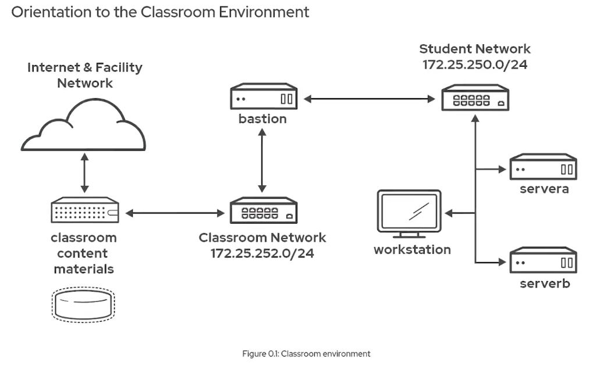
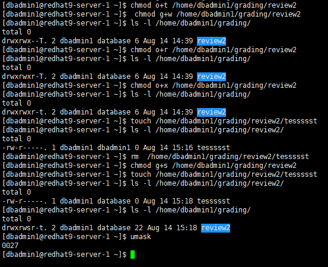
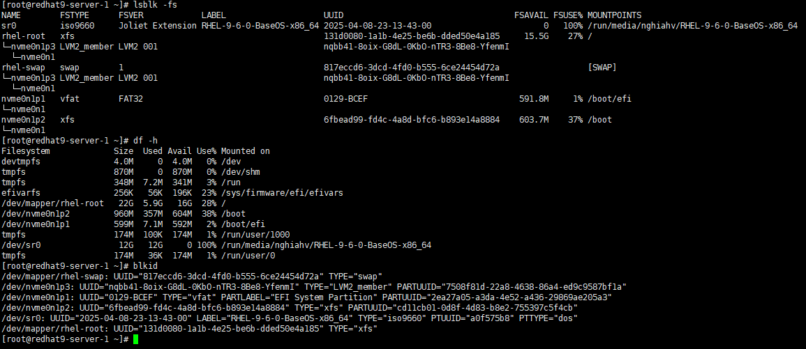
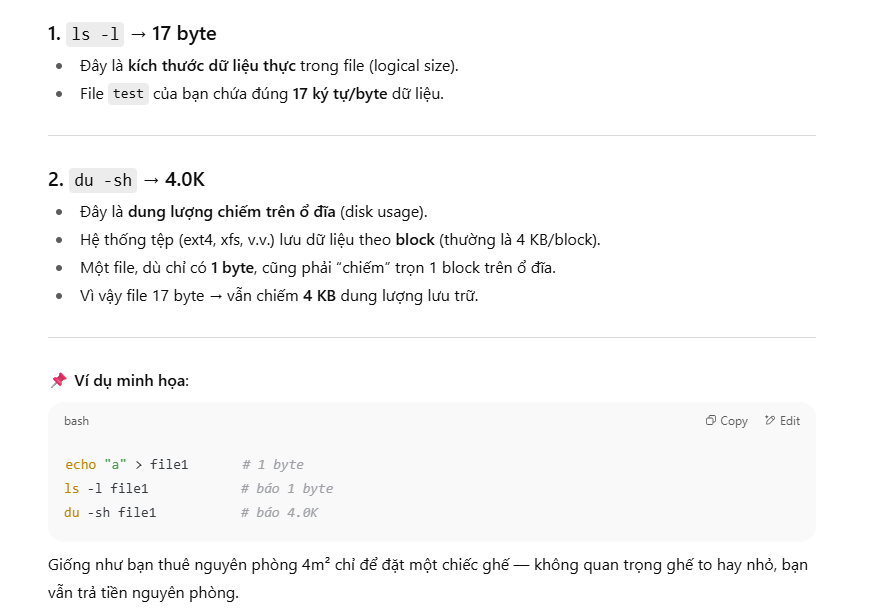

Lab Environment Redhat  



---
# CHAPTER 2: Access the Command Line
- Chạy thành công các chương trình đơn giản từ dòng lệnh Bash shell.
- Thực hiện các lệnh để xác định loại tệp và hiển thị các phần của tệp văn bản.
- Thực hành sử dụng phím tắt lịch sử lệnh Bash để lặp lại lệnh hoặc một phần lệnh hiệu quả hơn.

**1. Sử dụng lệnh để hiển thị thời gian và ngày hiện tại.**
```
[root@redhat9-server-1 ~]# date
Wed Aug 13 08:24:16 AM +07 2025
``` 

**2. Hiển thị thời gian hiện tại theo giờ 24 giờ (ví dụ: 13:57). Gợi ý: Chuỗi định dạng hiển thị đầu ra đó là %R.**
```
[root@redhat9-server-1 ~]# date +%R
08:24
```

**3. Tệp tin trong folder `/root/` này là loại tệp gì ? Con người có thể đọc được không?**

```
[root@redhat9-server-1 ~]# file script.sh 
script.sh: ASCII text
```
Tệp văn bản ASCII có thể đọc được bằng mắt thường

**4. Sử dụng `wc` và phím tắt Bash để hiển thị kích thước của file `zcat` . `wc` để hiển thị số dòng, từ và byte**
```
# trước đó
[root@redhat9-server-1 ~]# file script.sh 
script.sh: ASCII text
[root@redhat9-server-1 ~]# wc + Esc+.
[root@redhat9-server-1 ~]# wc script.sh
 6  3 13 script.sh
```
Trong đó:
- 6 → Số dòng trong file script.sh (line count).
- 3 → Số từ trong file script.sh (word count).
- 13 → Số byte trong file script.sh (byte count), tức là tổng số ký tự, bao gồm cả dấu xuống dòng và dấu cách.

**5. Hiển thị 10 dòng đầu tiên của file `zcat`.**
```
[root@redhat9-server-1 ~]# head Esc+.
[root@redhat9-server-1 ~]# head script.sh 
sad
asd
a
```
Note: default head & tail display 10 line  
**6. Hiển thị 10 dòng cuối cùng của file `zcat`.**
```
[root@redhat9-server-1 ~]# tail Esc+.
[root@redhat9-server-1 ~]# tail script.sh 
sad
asd
a
```
**7. Lặp lại chính xác lệnh trước đó với bốn lần nhấn phím hoặc ít hơn.**
- Một lựa chọn khác là nhấn phím Mũi tên Lên một lần để cuộn ngược lại một lệnh trong lịch sử lệnh, rồi nhấn Enter . Cách này sử dụng hai lần nhấn phím.
- Một phương pháp khác là nhập lệnh tắt !!rồi nhấn Enter để chạy lệnh gần đây nhất trong lịch sử lệnh
```
[root@redhat9-server-1 ~]# tail script.sh 
sad
asd
a

[root@redhat9-server-1 ~]# !!
tail script.sh 
sad
asd
a
```

**8. Sử dụng tùy chọn `tail -n 20` để hiển thị 20 dòng cuối cùng trong file. Sử dụng tính năng chỉnh sửa dòng lệnh để thực hiện tác vụ này với số lần nhấn phím tối thiểu.**

Sử dụng phím Mũi tên Lên để hiển thị lệnh trước đó. 
-> Tiếp theo, sử dụng tổ hợp phím Ctrl + A để di chuyển con trỏ đến đầu dòng. 
-> Sau đó, sử dụng tổ hợp phím Ctrl + Mũi tên Phải để nhảy đến từ tiếp theo. Thêm `-n 20` tùy chọn và nhấn Enter để thực thi lệnh.
```
[root@redhat9-server-1 ~]# tail -n 20 script.sh 
sad
asd
a
```

**9. Sử dụng lịch sử shell để chạy `date +%R` lại lệnh.**
```
[root@redhat9-server-1 ~]# history
  475  date +%R
  476  file zcat
  477  ls
  478  vi script.sh
[root@redhat9-server-1 ~]# !475
date +%R
08:49
```

---
# CHAPTER 3: Get Help from Local Documentation
PAGE 17/128  

Tìm kiếm thông tin từ tài liệu cục bộ để giúp bạn chạy lệnh và hoàn thành tác vụ.   
Kết quả 
- Tìm kiếm thông tin liên quan đến lệnh bằng cách tìm kiếm trong man page. 
- Khám phá các tùy chọn cho một số lệnh quản trị hệ thống phổ biến.


Trong hoạt động này, bạn tạo `my_task.txt` và sau đó thêm thông tin cụ thể vào tệp này cho từng bước.  
`touch my_task.txt`  
**1. Tìm kiếm và mở trang hướng dẫn sử dụng `hostname`. Tìm tùy chọn lệnh để hiển thị tất cả tên miền đủ điều kiện (FQDN) của máy. Sau đó, chạy `hostname` với tùy chọn in tất cả FQDN và gửi kết quả ra `my_task.txt`.**

*1.1 Tìm kiếm các trang hướng dẫn có chứa chuỗi "hostname"*
```
[root@redhat9-server-1 ~]# man -k hostname
freehostent (3)      - get network hostnames and addresses
gethostname (2)      - get/set hostname
gethostname (3p)     - get name of current host
getipnodebyaddr (3)  - get network hostnames and addresses
getipnodebyname (3)  - get network hostnames and addresses
hostname (1)         - show or set the system's host name
.....
```
*1.2 Mở trang hướng dẫn của `hostname` và tìm kiếm tùy chọn hiển thị tất cả FQDN của máy.*
```
[root@redhat9-server-1 ~]# man hostname

OPTIONS
       -a, --alias
              Display the alias name of the host (if used). This option is deprecated and should not be used anymore.

       -A, --all-fqdns
              Displays all FQDNs of the machine. This option enumerates all configured network addresses on all configured network  in‐
              terfaces,  and translates them to DNS domain names. Addresses that cannot be translated (i.e. because they do not have an
              appropriate reverse IP entry) are skipped. Note that different addresses may resolve to the same name, therefore the out‐
              put may contain duplicate entries. Do not make any assumptions about the order of the output.
```
"q" to quit the man page  
*1.3 Sử dụng lệnh chuyển hướng với tùy chọn hostname -A để thêm tên máy chủ của máy vào `my_task.txt`*
```
student@workstation:~$ hostname -A >> my_task.txt
```  
*1.4 Xác minh rằng tệp `my_task.txt` có chứa thông tin cần thiết.*
```
student@workstation:~$ cat my_task.txt
workstation.lab.example.com workstation
```

**2. Mở trang hướng dẫn của `date`. Tìm tùy chọn giúp bạn xác định số giây đã trôi qua giữa ngày 1 tháng 1 năm 1970 và ngày 1 tháng 1 năm 2025. Chạy lệnh và thêm kết quả đầu ra vào `my_task.txt`.**

*2.1 Duyệt trang hướng dẫn sử dụng date để tìm tùy chọn phù hợp.*
```
       -d, --date=STRING
              display time described by STRING, not 'now'
       %s     seconds since 1970-01-01 00:00:00 UTC
EXAMPLES
       Convert seconds since the epoch (1970-01-01 UTC) to a date

              $ date --date='@2147483647'
```
"q" to quit the man page  
*2.2 Sử dụng `date` với các tùy chọn `-d` và `%s` để lấy số giây giữa các ngày được yêu cầu. Thêm đầu ra của lệnh vào `my_task.txt`.*
```
[root@redhat9-server-1 ~]# date -d "Jan 1 2025" +%s >> my_task.txt 
```

*2.3 Xác minh rằng `my_task.txt` có chứa thông tin cần thiết.*
```
[root@redhat9-server-1 ~]# cat my_task.txt 
Enforcing
redhat9-server-1 
1735664400
```

*2.4 Bạn có thể xác minh kết quả bằng cách chuyển đổi số giây bạn lấy được thành ngày tháng.*
```
[root@redhat9-server-1 ~]# date --date='@1735689600'
Wed Jan  1 07:00:00 AM +07 2025
```

**3. Tìm trang hướng dẫn của lệnh xác định chế độ SELinux hiện tại của máy. Chạy lệnh và thêm kết quả vào `my_task.txt`.**

*3.1 Tìm lệnh hiển thị chế độ SELinux hiện tại*
```
[root@redhat9-server-1 ~]#  man -k selinux
getenforce (8)       - get the current mode of SELinux
```
*3.2 Sử dụng `getenforce` để lấy chế độ SELinux hiện tại và thêm vào `my_tasks.txt`.*
```
[root@redhat9-server-1 ~]# getenforce >> my_task.txt 

```
*3.3 Xác minh rằng my_task.txt có chứa thông tin cần thiết.*
```
[root@redhat9-server-1 ~]# cat my_task.txt 
Enforcing
redhat9-server-1 
1735664400
Enforcing
```
**4. Mở trang hướng dẫn của `man`. Tìm thông tin về cách in trang hướng dẫn bằng PostScript. Nối lệnh, chứ không phải phần đầu ra, vào `my_task.txt`.**   

*4.1 Sử dụng `man` `man` để xác định cách chuẩn bị trang hướng dẫn để in.*
```
[root@redhat9-server-1 ~]# man man
       man -t bash | lpr -Pps
           Format the manual page for bash into the default troff or groff format and pipe it to the printer  named  ps.   The  default
           output for groff is usually PostScript.  man --help should advise as to which processor is bound to the -t option.
```
*4.2 Sử dụng echo để thêm man có tùy chọn phù hợp vào `my_tasks.txt`.*
```
[root@redhat9-server-1 ~]# echo "man -t bash | lpr -Pps" >> my_task.txt
```
*4.3 Xác minh rằng `my_task.txt` có chứa thông tin cần thiết.*
```
[root@redhat9-server-1 ~]# cat my_task.txt 
Enforcing
redhat9-server-1 
1735664400
Enforcing
man -t bash | lpr -Pps
```

---
# CHAPTER 7: Manage Files from the Command Line   
7.7 page 36/128    
Sao chép, di chuyển, tạo, xóa và sắp xếp các tệp từ dòng lệnh.   
Target: Sử dụng ký tự đại diện để định vị và thao tác với tệp.

**2. Tạo một thư mục có tên là `project_plans` trong thu muc Documents . Thư muc Documents này được đặt trong thư mục gốc của người dùng `nghiahv`. Tạo hai tệp trống trong project_plans có tên là `season1_project_plan.odf` và `season2_project_plan.odf`.** 

Gợi ý: Nếu thư mục `~/Documents` không tồn tại, hãy sử dụng tùy chọn lệnh `mkdir -p` để tạo thư mục.
```
[nghiahv@redhat9-server-1 ~]$ mkdir -p Documents/project_plans
[nghiahv@redhat9-server-1 ~]$ touch \
> Documents/project_plans/{season1,season2}_project_plan.odf

[nghiahv@redhat9-server-1 ~]$ ls -lR Documents/
Documents/:
total 0
drwxr-xr-x. 2 nghiahv nghiahv 70 Aug 13 10:21 project_plans

Documents/project_plans:
total 0
-rw-r--r--. 1 nghiahv nghiahv 0 Aug 13 10:21 season1_project_plan.odf
-rw-r--r--. 1 nghiahv nghiahv 0 Aug 13 10:21 season2_project_plan.odf
```
**3. Tạo 12 tệp với tên `tv_seasonX_episodeY.ogg` trong thư mục `/home/student`. Thay thế ký tự X bằng số mùa và ký tự Y bằng tập của mùa đó, cho hai mùa, mỗi mùa sáu tập.**
```
[nghiahv@redhat9-server-1 ~]$ touch tv_season{1..2}_episode{1..6}.ogg
[nghiahv@redhat9-server-1 ~]$ ls tv*
tv_season1_episode1.ogg  tv_season1_episode4.ogg  tv_season2_episode1.ogg  tv_season2_episode4.ogg
tv_season1_episode2.ogg  tv_season1_episode5.ogg  tv_season2_episode2.ogg  tv_season2_episode5.ogg
tv_season1_episode3.ogg  tv_season1_episode6.ogg  tv_season2_episode3.ogg  tv_season2_episode6.ogg
```

**4. Là tác giả của một loạt tiểu thuyết trinh thám thành công, bạn đang biên tập các chương của cuốn sách bán chạy tiếp theo để xuất bản. Hãy tạo tám tệp với tên `mystery_chapterX.odf`. Thay thế ký tự X bằng các số từ 1 đến 8.**
```
[nghiahv@redhat9-server-1 ~]$ touch mystery_chapter{1..8}.odf
[nghiahv@redhat9-server-1 ~]$ ls mys*
mystery_chapter1.odf  mystery_chapter3.odf  mystery_chapter5.odf  mystery_chapter7.odf
mystery_chapter2.odf  mystery_chapter4.odf  mystery_chapter6.odf  mystery_chapter8.odf

```
**5. Sử dụng một lệnh duy nhất để tạo thư mục `~/Videos/season1` và `~/Videos/season2` để sắp xếp các tập phim truyền hình. Di chuyển các tập phim truyền hình phù hợp vào các thư mục con của mùa phim. Chỉ sử dụng hai lệnh và chỉ định đích đến bằng cú pháp tương ứng.**

Tạo hai thư mục con có tên là `season1` và `season2` trong thư mục `Videos` bằng cách sử dụng một lệnh duy nhất.
```
[nghiahv@redhat9-server-1 ~]$ mkdir -p Videos/season{1..2}
[nghiahv@redhat9-server-1 ~]$ ls Videos/
season1  season2
```
previous result
```
[nghiahv@redhat9-server-1 ~]$ ls tv*
tv_season1_episode1.ogg  tv_season1_episode4.ogg  tv_season2_episode1.ogg  tv_season2_episode4.ogg
tv_season1_episode2.ogg  tv_season1_episode5.ogg  tv_season2_episode2.ogg  tv_season2_episode5.ogg
tv_season1_episode3.ogg  tv_season1_episode6.ogg  tv_season2_episode3.ogg  tv_season2_episode6.ogg

```
Di chuyển các tập phim truyền hình phù hợp vào thư mục con theo mùa chỉ bằng 2 lệnh.
```
[nghiahv@redhat9-server-1 ~]$ mv tv_season1* Videos/season1/
[nghiahv@redhat9-server-1 ~]$ mv tv_season2* Videos/season2/
[nghiahv@redhat9-server-1 ~]$ ls -R Videos/
Videos/:
season1  season2

Videos/season1:
tv_season1_episode1.ogg  tv_season1_episode3.ogg  tv_season1_episode5.ogg
tv_season1_episode2.ogg  tv_season1_episode4.ogg  tv_season1_episode6.ogg

Videos/season2:
tv_season2_episode1.ogg  tv_season2_episode3.ogg  tv_season2_episode5.ogg
tv_season2_episode2.ogg  tv_season2_episode4.ogg  tv_season2_episode6.ogg
```
**6. Tạo một hệ thống phân cấp thư mục hai cấp chỉ bằng một lệnh để sắp xếp các chương sách bí ẩn. Tạo thư mục con `my_bestseller` trong thư mục `Documents`, và tạo thư mục con `chapters` trong thư mục `my_bestseller` mới. Tạo thêm ba thư mục con ngay trong thư mục `my_bestseller` chỉ bằng một lệnh. Đặt tên cho các thư mục con này là `editor, changes và vacation`. Bạn không cần sử dụng lệnh `mkdir -p `để tạo thư mục cha vì thư mục cha `my_bestseller` đã tồn tại.**

*6.1 Tạo thư mục `my_bestseller` trong thư mục `Documents`. Tạo thư mục `chapters` trong thư mục `my_bestseller`.*
```
[nghiahv@redhat9-server-1 ~]$ mkdir -p Documents/my_bestseller/chapters
[nghiahv@redhat9-server-1 ~]$ ls -R Documents/
Documents/:
my_bestseller  project_plans

Documents/my_bestseller:
chapters

Documents/my_bestseller/chapters:

Documents/project_plans:
season1_project_plan.odf  season2_project_plan.odf

```

*6.2 Tạo ba thư mục có tên là `editor`, `changes` và `vacation` trong thư mục `my_bestseller` bằng cách sử dụng một lệnh duy nhất.*
```
[nghiahv@redhat9-server-1 ~]$ mkdir Documents/my_bestseller/{editor,changes,vacation}
[nghiahv@redhat9-server-1 ~]$ ls -R Documents/
Documents/:
my_bestseller  project_plans

Documents/my_bestseller:
changes  chapters  editor  vacation

Documents/my_bestseller/changes:

Documents/my_bestseller/chapters:

Documents/my_bestseller/editor:

Documents/my_bestseller/vacation:

Documents/project_plans:
season1_project_plan.odf  season2_project_plan.odf

```
**7. Chuyển đến thư mục `chapters`. Sử dụng phím tắt thư mục home dấu ngã (~) để di chuyển tất cả các chương sách đến thư mục `chapters`, hiện là thư mục hiện tại của bạn. Sử dụng cú pháp đơn giản nhất để chỉ định thư mục đích.**

Bạn muốn gửi hai chương đầu tiên đến trình soạn thảo để xem xét. Chỉ di chuyển hai chương đó đến thư mục trình soạn thảo để tránh sửa đổi chúng trong quá trình xem xét. Bắt đầu từ thư mục con chương, sử dụng dấu ngoặc nhọn mở rộng với một phạm vi để chỉ định tên tệp chương cần di chuyển và đường dẫn tương đối đến thư mục đích.

Trong thời gian nghỉ, bạn dự định viết chương 7 và 8. Sử dụng một lệnh duy nhất để di chuyển các tệp từ thư mục chương sang thư mục nghỉ. Chỉ định tên tệp chương bằng cách sử dụng dấu ngoặc nhọn mở rộng với danh sách các chuỗi và không sử dụng ký tự đại diện.

*7.1 Chuyển đến thư mục `chapters` và sử dụng phím tắt thư mục gốc dấu ngã (~) để di chuyển tất cả các chương sách vào thư mục chương.*
```
[nghiahv@redhat9-server-1 ~]$ cd Documents/my_bestseller/chapters/
[nghiahv@redhat9-server-1 chapters]$ mv ~/mystery_chapter* .
[nghiahv@redhat9-server-1 chapters]$ ls
mystery_chapter1.odf  mystery_chapter3.odf  mystery_chapter5.odf  mystery_chapter7.odf
mystery_chapter2.odf  mystery_chapter4.odf  mystery_chapter6.odf  mystery_chapter8.odf

```

*7.2 Di chuyển hai chương đầu tiên đến thư mục `editor`. Sử dụng dấu ngoặc nhọn mở rộng với phạm vi để chỉ định tên tệp chương cần di chuyển và đường dẫn tương đối đến thư mục đích.*

```
[nghiahv@redhat9-server-1 chapters]$ mv mystery_chapter{1..2}.odf ../editor/
[nghiahv@redhat9-server-1 chapters]$ ls ../editor/
mystery_chapter1.odf  mystery_chapter2.odf
[nghiahv@redhat9-server-1 chapters]$ ls
mystery_chapter3.odf  mystery_chapter4.odf  mystery_chapter5.odf  mystery_chapter6.odf  mystery_chapter7.odf  mystery_chapter8.odf

```

```
[nghiahv@redhat9-server-1 chapters]$ pwd
/home/nghiahv/Documents/my_bestseller/chapters

[nghiahv@redhat9-server-1 chapters]$ tree -d -L 2 /home/nghiahv/Documents/
/home/nghiahv/Documents/
├── my_bestseller
│   ├── changes
│   ├── chapters
│   ├── editor
│   └── vacation
└── project_plans

6 directories
```
Command cd

Lệnh	|Mô tả
---|---
cd	|Về thư mục home hoặc đến thư mục chỉ định
cd -	|Quay lại thư mục trước đó
cd ..	|Lùi một cấp thư mục cha

*7.3 Sử dụng một lệnh duy nhất để di chuyển chương 7 và 8 từ thư mục `chapters` sang thư mục `vacation`. Chỉ định tên tệp chương bằng cách sử dụng dấu ngoặc nhọn mở rộng với danh sách chuỗi và không sử dụng ký tự đại diện.*
```
[nghiahv@redhat9-server-1 chapters]$ mv mystery_chapter{7..8}.odf ../vacation/
[nghiahv@redhat9-server-1 chapters]$ ls
mystery_chapter3.odf  mystery_chapter4.odf  mystery_chapter5.odf  mystery_chapter6.odf
[nghiahv@redhat9-server-1 chapters]$ ls ../vacation/
mystery_chapter7.odf  mystery_chapter8.odf
```

Giai thich ve `..`
```
# Gia su co thuc muc
/home/nghia/
├── chapters/
└── vacation/
    ├── photo1.jpg
    └── photo2.jpg

pwd 
/home/nghia/chapters

ls ../vacation
= cd .. + ls /vacation
```

**8. Chuyển thư mục làm việc của bạn thành `~/Videos/season2`, sau đó sao chép tập đầu tiên của mùa phim vào thư mục `vacation`. Sử dụng một lệnh cd duy nhất để chuyển từ thư mục làm việc sang thư mục `~/Documents/my_bestseller/vacation`. Liệt kê các tệp của thư mục đó. Sử dụng đối số thư mục làm việc trước đó để quay lại thư mục `season2`. Đối số này thành công nếu lần thay đổi thư mục cuối cùng bằng lệnh cd chỉ sử dụng một lệnh thay vì nhiều lệnh cd. Từ thư mục `season2`, sao chép tệp tập 2 vào thư mục `vacation`. Sử dụng phím tắt một lần nữa để quay lại thư mục `vacation`.**

*8.1 Thay đổi thư mục làm việc của bạn thành `~/Videos/season2`, sau đó sao chép tập đầu tiên của mùa giải vào thư mục `vacation`.*
```
[nghiahv@redhat9-server-1 chapters]$ cd ~/Videos/season2/
[nghiahv@redhat9-server-1 season2]$ ls
tv_season2_episode1.ogg  tv_season2_episode3.ogg  tv_season2_episode5.ogg
tv_season2_episode2.ogg  tv_season2_episode4.ogg  tv_season2_episode6.ogg
[nghiahv@redhat9-server-1 season2]$ cp *episode1.ogg ~/Documents/my_bestseller/vacation/
[nghiahv@redhat9-server-1 season2]$ ls ~/Documents/my_bestseller/vacation/
mystery_chapter7.odf  mystery_chapter8.odf  tv_season2_episode1.ogg

```
*8.2 Sử dụng một lệnh cd duy nhất để chuyển từ thư mục làm việc sang thư mục `~/Documents/my_bestseller/vacation`, liệt kê các tệp trong đó và sử dụng tham số - để trở về thư mục trước đó. Sao chép tệp tập 2 vào thư mục `vacation`. Sử dụng lệnh cd với tham số - để trở về thư mục `vacation`.*
```
[nghiahv@redhat9-server-1 season2]$ cd ~/Documents/my_bestseller/vacation/
[nghiahv@redhat9-server-1 vacation]$ ls
mystery_chapter7.odf  mystery_chapter8.odf  tv_season2_episode1.ogg
[nghiahv@redhat9-server-1 vacation]$ cd -
/home/nghiahv/Videos/season2
[nghiahv@redhat9-server-1 season2]$ cp *episode2.ogg ~/Documents/my_bestseller/vacation/
[nghiahv@redhat9-server-1 season2]$ cd -
/home/nghiahv/Documents/my_bestseller/vacation
[nghiahv@redhat9-server-1 vacation]$ ls
mystery_chapter7.odf  mystery_chapter8.odf  tv_season2_episode1.ogg  tv_season2_episode2.ogg
```

**9. Tác giả của chương 5 và 6 muốn thử nghiệm các thay đổi có thể. Hãy sao chép cả hai tệp từ thư mục `~/Documents/my_bestseller/chapters` sang thư mục `~/Documents/my_bestseller/changes` để ngăn những thay đổi này làm thay đổi các tệp gốc.**

Truy cập thư mục `~/Documents/my_bestseller`. Sử dụng mẫu so khớp trong ngoặc vuông để chỉ định số chương nào sẽ khớp trong đối số tên tệp của lệnh cp.
```
[nghiahv@redhat9-server-1 vacation]$ cd ~/Documents/my_bestseller/
[nghiahv@redhat9-server-1 my_bestseller]$ ls
changes  chapters  editor  vacation
[nghiahv@redhat9-server-1 my_bestseller]$ cp chapters/mystery_chapter[56].odf changes/
[nghiahv@redhat9-server-1 my_bestseller]$ ls chapters/
mystery_chapter3.odf  mystery_chapter4.odf  mystery_chapter5.odf  mystery_chapter6.odf
[nghiahv@redhat9-server-1 my_bestseller]$ ls changes/
mystery_chapter5.odf  mystery_chapter6.odf
```

**10. Chuyển thư mục hiện tại của bạn thành thư mục `changes` và sử dụng lệnh `date +%F` kết hợp với lệnh copy để sao chép tệp `mystery_chapter5.odf` sang một tệp mới chứa ngày tháng đầy đủ. Sử dụng định dạng tên `mystery_chapter5_YYYY-MM-DD.odf`.**

Bằng cách sử dụng lệnh thay thế với lệnh` date +%s`, hãy tạo một bản sao khác của tệp `mystery_chapter5.odf` và thêm dấu thời gian hiện tại (là số giây kể từ thời điểm epoch, 1970-01-01 00:00 UTC) để đảm bảo tên tệp duy nhất.
```
[nghiahv@redhat9-server-1 changes]$ cp mystery_chapter5.odf \
> mystery_chapter5_$(date +%F).odf
[nghiahv@redhat9-server-1 changes]$ cp mystery_chapter5.odf mystery_chapter5_$(date +%s).odf
[nghiahv@redhat9-server-1 changes]$ ls
mystery_chapter5_1755058581.odf  mystery_chapter5_2025-08-13.odf  mystery_chapter5.odf  mystery_chapter6.odf
```
Note: Phần $(...) là command substitution (thay thế bằng kết quả của lệnh bên trong).

**11. Sau khi xem xét kỹ hơn, bạn quyết định rằng mình không cần thay đổi cốt truyện. Hãy xóa thư mục `changes`.**

Nếu cần, hãy vào thư mục `changes` và xóa tất cả các tệp trong thư mục đó. Bạn không thể xóa một thư mục khi nó là thư mục làm việc hiện tại.

Chuyển đến thư mục cha của thư mục `changes`. Hãy thử xóa thư mục trống bằng lệnh rm mà không có tùy chọn -r đệ quy. Thử này sẽ thất bại. Cuối cùng, hãy sử dụng lệnh `rmdir` để xóa thư mục trống, và thành công.

Khi kỳ nghỉ kết thúc, bạn không cần thư mục `vacation` nữa. Hãy xóa nó bằng lệnh rm với tùy chọn đệ quy.

Khi hoàn tất, hãy quay lại thư mục home của người dùng nghiahv.
```
[nghiahv@redhat9-server-1 changes]$ ls
mystery_chapter5_1755058581.odf  mystery_chapter5_2025-08-13.odf  mystery_chapter5.odf  mystery_chapter6.odf
[nghiahv@redhat9-server-1 changes]$ rm mystery_chapter*
[nghiahv@redhat9-server-1 changes]$ ls
[nghiahv@redhat9-server-1 changes]$ cd ..
[nghiahv@redhat9-server-1 my_bestseller]$ ls
changes  chapters  editor  vacation
[nghiahv@redhat9-server-1 my_bestseller]$ rm changes/
rm: cannot remove 'changes/': Is a directory
[nghiahv@redhat9-server-1 my_bestseller]$ rmdir changes/
[nghiahv@redhat9-server-1 my_bestseller]$ ls
chapters  editor  vacation
[nghiahv@redhat9-server-1 my_bestseller]$ rm -r vacation/
[nghiahv@redhat9-server-1 my_bestseller]$ ls
chapters  editor
[nghiahv@redhat9-server-1 my_bestseller]$ cd
[nghiahv@redhat9-server-1 ~]$ 
```

**12. Tạo một liên kết cứng đến tệp `~/Documents/project_plans/season2_project_plan.odf` có tên là `~/Documents/backups/season2_project_plan.odf`.back. Liên kết cứng giúp bảo vệ tệp gốc khỏi việc vô tình xóa nhầm và giữ cho tệp sao lưu được cập nhật khi bạn thay đổi tệp gốc.**

Gợi ý: Nếu thư mục `~/Documents/backups` không tồn tại, hãy sử dụng lệnh mkdir để tạo thư mục đó.
```
[nghiahv@redhat9-server-1 ~]$ mkdir ~/Documents/backups
[nghiahv@redhat9-server-1 ~]$ ln Documents/project_plans/season2_project_plan.odf  \
> Documents/backups/season2_project_plan.odf.back
[nghiahv@redhat9-server-1 ~]$ ls -lR Documents/
Documents/:
total 0
drwxr-xr-x. 2 nghiahv nghiahv 43 Aug 13 13:43 backups
drwxr-xr-x. 4 nghiahv nghiahv 36 Aug 13 13:40 my_bestseller
drwxr-xr-x. 2 nghiahv nghiahv 70 Aug 13 10:21 project_plans

Documents/backups:
total 0
-rw-r--r--. 2 nghiahv nghiahv 0 Aug 13 10:21 season2_project_plan.odf.back

Documents/my_bestseller:
total 0
drwxr-xr-x. 2 nghiahv nghiahv 118 Aug 13 10:55 chapters
drwxr-xr-x. 2 nghiahv nghiahv  62 Aug 13 10:46 editor

Documents/my_bestseller/chapters:
total 0
-rw-r--r--. 1 nghiahv nghiahv 0 Aug 13 10:28 mystery_chapter3.odf
-rw-r--r--. 1 nghiahv nghiahv 0 Aug 13 10:28 mystery_chapter4.odf
-rw-r--r--. 1 nghiahv nghiahv 0 Aug 13 10:28 mystery_chapter5.odf
-rw-r--r--. 1 nghiahv nghiahv 0 Aug 13 10:28 mystery_chapter6.odf

Documents/my_bestseller/editor:
total 0
-rw-r--r--. 1 nghiahv nghiahv 0 Aug 13 10:28 mystery_chapter1.odf
-rw-r--r--. 1 nghiahv nghiahv 0 Aug 13 10:28 mystery_chapter2.odf

Documents/project_plans:
total 0
-rw-r--r--. 1 nghiahv nghiahv 0 Aug 13 10:21 season1_project_plan.odf
-rw-r--r--. 2 nghiahv nghiahv 0 Aug 13 10:21 season2_project_plan.odf
```

---
# CHAPTER 10: Manage Local Users and Groups
10.11 - PAGE 55/128  
Sử dụng quyền truy cập superuser để quản lý người dùng và nhóm cục bộ và để quản lý chính sách mật khẩu cục bộ.

Kết quả:
- Đặt chính sách thời hạn mật khẩu mặc định cho mật khẩu người dùng cục bộ.
- Tạo và sử dụng nhóm bổ sung cho người dùng mới.
- Tạo ba người dùng với nhóm bổ sung mới.
- Đặt mật khẩu ban đầu cho người dùng đã tạo.
- Cấu hình các thành viên nhóm bổ sung để sử dụng sudo để chạy bất kỳ lệnh nào với tư cách là bất kỳ người dùng nào.
- Đặt chính sách thời hạn mật khẩu dành riêng cho người dùng.

Chuyển sang người dùng `sudo -i `   
**2. đảm bảo rằng người dùng mới tạo phải thay đổi mật khẩu sau mỗi 30 ngày.  (KHÔNG áp dụng cho user hiện có.)**
```
vi /etc/login.defs
PASS_MAX_DAYS   30
```
**3. Tạo nhóm `consultants` có GID là 35000.**
```
[root@redhat9-server-1 ~]#  groupadd -g 35000 consultants
[root@redhat9-server-1 ~]# cat /etc/group | grep consultants
consultants:x:35000:
```
**4.  Cấu hình quyền quản trị để cho phép tất cả thành viên nhóm `consultants` thực thi bất kỳ lệnh nào với tư cách người dùng. Tránh sử dụng công cụ dòng lệnh visudo để chỉnh sửa tệp `/etc/sudoers`. Thay vào đó, hãy đặt tệp cấu hình vào thư mục `/etc/sudoers.d`.**
```
vi /etc/sudoers.d/consultants
%consultants  ALL=(ALL) ALL
```
Note:
- dấu % ở đầu nghĩa là nhóm (group) trong Linux.
- Không có dấu % → nghĩa là tài khoản người dùng cụ thể.
**5. Tạo người dùng `consultant1`, `consultant2` và `consultant3` với nhóm `consultants` là nhóm bổ sung của họ.**
```
[root@redhat9-server-1 ~]# useradd -G consultants consultant1
[root@redhat9-server-1 ~]# useradd -G consultants consultant2
[root@redhat9-server-1 ~]# useradd -G consultants consultant3
[root@redhat9-server-1 ~]# tail /etc/passwd
nghiahv:x:1000:1000:Nghiahv:/home/nghiahv:/bin/bash
sysadmin1:x:1001:1002::/home/sysadmin1:/bin/bash
consultant1:x:1002:35001::/home/consultant1:/bin/bash
consultant2:x:1003:1003::/home/consultant2:/bin/bash
consultant3:x:1004:1004::/home/consultant3:/bin/bash

[root@redhat9-server-1 ~]# id consultant2
uid=1003(consultant2) gid=1003(consultant2) groups=1003(consultant2),35000(consultants)
[root@redhat9-server-1 ~]# id consultant3
uid=1004(consultant3) gid=1004(consultant3) groups=1004(consultant3),35000(consultants)
[root@redhat9-server-1 ~]# id consultant1
uid=1002(consultant1) gid=35001(consultant1) groups=35001(consultant1),35000(consultants)
```
Note:
- tuy chon `-G` : chỉ thêm user vào nhóm phụ consultants, không đặt nhóm chính (primary group) là consultants
- Muốn thêm user vào nhóm bổ sung(supplementary groups):  
`usermod -aG groupname username`
- Đổi nhóm chính:  
`sudo usermod -g new_primary_group username`

**6. Đặt mật khẩu `consultant1`, `consultant2` và `consultant3` la redhat.**
```
[root@redhat9-server-1 ~]# passwd consultant1
Changing password for user consultant1.
New password: 
BAD PASSWORD: The password is shorter than 8 characters
Retype new password: 
passwd: all authentication tokens updated successfully.

[root@redhat9-server-1 ~]# passwd consultant2
Changing password for user consultant2.
New password: 
BAD PASSWORD: The password is shorter than 8 characters
Retype new password: 
passwd: all authentication tokens updated successfully.

[root@redhat9-server-1 ~]# passwd consultant3
Changing password for user consultant3.
New password: 
BAD PASSWORD: The password is shorter than 8 characters
Retype new password: 
passwd: all authentication tokens updated successfully.
```
**7. Đặt thời hạn hết hạn cho các tài khoản `consultant1`, `consultant2` và `consultant3` là 90 ngày kể từ ngày hiện tại.**

*7.1 Xác định ngày trong tương lai 90 ngày.*
```
[root@redhat9-server-1 ~]# date -d "+90 days" +%F
2025-11-11
```
*7.2 Đặt các user `consultant1`, `consultant2`, và `consultant3` hết hạn vào ngày được hiển thị ở bước trước*
```
[root@redhat9-server-1 ~]# chage -E 2025-11-11 consultant1 
[root@redhat9-server-1 ~]# chage -E 2025-11-11 consultant2
[root@redhat9-server-1 ~]# chage -E 2025-11-11 consultant3
```

**8. Thay đổi chính sách mật khẩu cho user `consultant2` để yêu cầu mật khẩu mới sau mỗi 15 ngày.**

```
[root@redhat9-server-1 ~]# chage -M 15 consultant2
```
**9. Ngoài ra, hãy buộc người dùng `consultant1`, `consultant2` và `consultant3` thay đổi mật khẩu khi đăng nhập lần đầu.**

Đặt ngày cuối cùng thay đổi mật khẩu thành 0 để người dùng phải thay đổi mật khẩu khi lần đầu đăng nhập vào hệ thống.


```
[root@redhat9-server-1 ~]# chage -d 0 consultant1
[root@redhat9-server-1 ~]# chage -d 0 consultant2
[root@redhat9-server-1 ~]# chage -d 0 consultant3
```

Ket qua
```
[root@redhat9-server-1 ~]# chage -l consultant1
Last password change					: password must be changed
Password expires					: password must be changed
Password inactive					: password must be changed
Account expires						: Nov 11, 2025
Minimum number of days between password change		: 0
Maximum number of days between password change		: 99999
Number of days of warning before password expires	: 7
[root@redhat9-server-1 ~]# chage -l consultant2
Last password change					: password must be changed
Password expires					: password must be changed
Password inactive					: password must be changed
Account expires						: Nov 11, 2025
Minimum number of days between password change		: 0
Maximum number of days between password change		: 15
Number of days of warning before password expires	: 7
[root@redhat9-server-1 ~]# chage -l consultant3
Last password change					: password must be changed
Password expires					: password must be changed
Password inactive					: password must be changed
Account expires						: Nov 11, 2025
Minimum number of days between password change		: 0
Maximum number of days between password change		: 99999
Number of days of warning before password expires	: 7
```

---
# CHAPTER 11: Control Access to Files
11.7 - page 63/128  
Đặt quyền tiêu chuẩn cho các tệp và giải thích tác động bảo mật của các cài đặt quyền khác nhau.

Kết quả:
- Tạo một thư mục nơi người dùng có thể cùng nhau làm việc trên các tập tin.
- Tạo cấu trúc tệp và thư mục cần thiết, chỉ định quyền truy cập theo yêu cầu.  

Chuyển sang người dùng `sudo -i `     
**2. Tạo thư mục cộng tác `techdocs` trong thư mục `/home`. Đặt quyền sở hữu nhóm của thư mục thành nhóm `techdocs`, cấp toàn quyền cho user và group, và cấu hình thư mục sao cho chỉ chủ sở hữu tệp mới có thể xóa tệp của họ.**

Ban dau
```
# Tạo group
groupadd techdocs

# Tạo user và gán group
useradd -g techdocs dev1
useradd -g techdocs dev2
useradd -g techdocs editor1

# Tạo user không thuộc nhóm techdocs
useradd dbadmin1

```
Giai thich

Lệnh	|Tùy chọn	
---|---
useradd -g	|Đặt nhóm chính khi tạo user	
useradd -G	|Gán nhóm phụ khi tạo user (van con nhom chinh)
---|---
usermod -g	|Đổi nhóm chính của user	
usermod -G	|Thay thế toàn bộ nhóm phụ	
usermod -aG	|Thêm nhóm phụ mới, giữ lại nhóm cũ

*2.1 Tạo thư mục `/home/techdocs`.*
```
mkdir /home/techdocs
[root@redhat9-server-1 ~]# ll /home/
drwxr-xr-x.  2 root        root           6 Aug 13 14:46 techdocs
```
*2.2 Thay đổi quyền sở hữu nhóm cho thư mục `/home/techdocs` thành nhóm `techdocs`.*
```
[root@redhat9-server-1 ~]# chown :techdocs /home/techdocs/
[root@redhat9-server-1 ~]# ll /home/
drwxr-xr-x.  2 root        techdocs       6 Aug 13 14:46 techdocs
```
*2.3 Đặt quyền đọc, ghi và thực thi cho người dùng và nhóm, không cấp quyền cho những người khác trong thư mục `/home/techdocs`.*
```
[root@redhat9-server-1 ~]# chmod 0770 /home/techdocs
[root@redhat9-server-1 ~]# ll /home/
drwxrwx---.  2 root        techdocs       6 Aug 13 14:46 techdocs

```
*2.4 Gán bit cố định vào thư mục `/home/techdocs`.*
```
[root@redhat9-server-1 ~]#  chmod o+t /home/techdocs
[root@redhat9-server-1 ~]# ll /home/
drwxrwx--T.  2 root        techdocs       6 Aug 13 14:46 techdocs
```

Note 
- Sticky bit (t / T)
Quy tắc (other):
- Có x → hiện t
- Không có x → hiện T


*2.5 Liệt kê các quyền của thư mục.*
```
[root@redhat9-server-1 ~]# ls -ld /home/techdocs
drwxrwx--T. 2 root techdocs 6 Aug 13 14:46 /home/techdocs
# Bộ quyền --T cho thấy thư mục được cấu hình với quyền sticky bit
```

**3. Xác minh rằng người dùng trong nhóm `techdocs` có thể tạo và cộng tác trên các tệp trong thư mục `/home/techdocs`. Với tư cách là người dùng dev1, hãy tạo tệp `techdoc1.txt` trong thư mục `/home/techdocs`. Với tư cách là người dùng dev2, hãy thêm nội dung sau vào tệp: "This is the first tech doc". Cấu hình quyền sở hữu và quyền hạn nhóm cần thiết để cho phép cộng tác này.**  
*3.1 Chuyển sang người dùng `dev1`. Chuyển đến thư mục `/home/techdocs`.*
```
[root@redhat9-server-1 ~]# su - dev1
[dev1@redhat9-server-1 ~]$ cd /home/techdocs/
```
*3.2 Tạo tệp `techdoc1.txt` trong thư mục `/home/techdocs`.*
```
[dev1@redhat9-server-1 techdocs]$ touch techdoc1.txt
[dev1@redhat9-server-1 techdocs]$ ls
techdoc1.txt
```
*3.3 Thay đổi quyền sở hữu nhóm cho tệp `techdoc1.txt` thành nhóm `techdocs`. Thêm quyền ghi cho nhóm trên tệp `techdoc1.txt`. Liệt kê các quyền của tệp.*

```
[dev1@redhat9-server-1 techdocs]$ ll
total 0
-rw-r--r--. 1 dev1 techdocs 0 Aug 13 15:11 techdoc1.txt
[dev1@redhat9-server-1 techdocs]$ chown :techdocs techdoc1.txt 
[dev1@redhat9-server-1 techdocs]$ ll
total 0
-rw-r--r--. 1 dev1 techdocs 0 Aug 13 15:11 techdoc1.txt
[dev1@redhat9-server-1 techdocs]$ chmod g+w techdoc1.txt 
[dev1@redhat9-server-1 techdocs]$ ll
total 0
-rw-rw-r--. 1 dev1 techdocs 0 Aug 13 15:11 techdoc1.txt
[dev1@redhat9-server-1 techdocs]$ 

```
*3.4 Exit from the dev1 user shell. Switch to the dev2 user.*
```
[dev1@redhat9-server-1 techdocs]$ exit
logout
[root@redhat9-server-1 ~]# su - dev2
[dev2@redhat9-server-1 ~]$ 

```
2 user dev1 & dev2
```
[dev2@redhat9-server-1 ~]$ id dev2
uid=1006(dev2) gid=35002(techdocs) groups=35002(techdocs)
[dev2@redhat9-server-1 ~]$ id dev1
uid=1005(dev1) gid=35002(techdocs) groups=35002(techdocs)
```

*3.5 Chuyển đến thư mục `/home/techdocs`. Xác minh rằng người dùng `dev2` có thể ghi vào tệp `techdoc1.txt`.*
```
[dev2@redhat9-server-1 ~]$ cd /home/techdocs/
[dev2@redhat9-server-1 techdocs]$ echo "This is the first tech doc." > techdoc1.txt 
[dev2@redhat9-server-1 techdocs]$ cat techdoc1.txt 
This is the first tech doc.

```
**4. Xác minh rằng chỉ chủ sở hữu của tệp `techdoc1.txt` mới có thể xóa tệp đó. Nếu không phải là người dùng sở hữu tệp, hãy thử xóa tệp. Sau đó, chuyển sang chủ sở hữu, sao lưu tệp và xóa tệp. Cuối cùng, khôi phục tệp gốc từ bản sao lưu bằng cách di chuyển tệp.**

*4.1 Với tư cách là người dùng `dev2`, hãy thử xóa tệp `techdoc1.txt`*
```
[dev2@redhat9-server-1 techdocs]$ rm techdoc1.txt 
rm: cannot remove 'techdoc1.txt': Operation not permitted
[dev2@redhat9-server-1 techdocs]$ ll
total 4
-rw-rw-r--. 1 dev1 techdocs 28 Aug 13 15:20 techdoc1.txt

```
*4.2 Thoát khỏi shell người dùng `dev2`. Chuyển sang người dùng dev1. Chuyển đến thư mục` /home/techdocs`.*  
```
[dev2@redhat9-server-1 techdocs]$ exit
logout
[root@redhat9-server-1 ~]# su - dev1
[dev1@redhat9-server-1 ~]$ cd /home/techdocs/

```
*4.3 Sao lưu tệp `techdoc1.txt`, sau đó xóa tệp này.*

```
[dev1@redhat9-server-1 techdocs]$ cp -pr techdoc1.txt techdoc1.txt.bkp
[dev1@redhat9-server-1 techdocs]$ ls
techdoc1.txt  techdoc1.txt.bkp
[dev1@redhat9-server-1 techdocs]$ rm techdoc1.txt
[dev1@redhat9-server-1 techdocs]$ ll
total 4
-rw-rw-r--. 1 dev1 techdocs 28 Aug 13 15:20 techdoc1.txt.bkp

```
Ý nghĩa từng option
- -p (preserve – giữ nguyên thông tin gốc của file):
  Khi copy, nó sẽ giữ lại:
  - Thời gian chỉnh sửa (mtime) và thời gian truy cập (atime)
  - Quyền (permission)
  - Chủ sở hữu (owner) và nhóm (group) nếu bạn có quyền
- Không có -p: file copy sẽ có thời gian tạo mới và có thể quyền khác.
- -r (recursive – đệ quy):
  - Copy thư mục và toàn bộ nội dung bên trong (bao gồm cả thư mục con, file con).
  - Nếu copy chỉ một file, -r gần như không có tác dụng.

*4.4 Khôi phục tệp `techdoc1.txt` từ bản sao lưu.*
```
[dev1@redhat9-server-1 techdocs]$  mv techdoc1.txt.bkp techdoc1.txt
[dev1@redhat9-server-1 techdocs]$ ll
total 4
-rw-rw-r--. 1 dev1 techdocs 28 Aug 13 15:20 techdoc1.txt

```

**5. Trong thư mục `/home/techdocs`, hãy tạo các thư mục con cho người dùng `dev1` và `dev2` dựa trên bảng sau.**

Chỉnh sửa quyền để chỉ chủ sở hữu mới có thể ghi vào các tệp và thư mục, nhóm `techdocs` có thể đọc chúng và những người khác không có quyền truy cập. Điều chỉnh quyền sở hữu và quyền cho phù hợp, đồng thời xác minh rằng các tệp mới tuân thủ các quy tắc truy cập này.

Owner	|Directory|	Group	|Files
---|---|---|---
dev1	|dev1	|techdocs	|dev1.txt <br> dev1.log <br> dev1.cfg
dev2	|dev2	|techdocs	|dev2.txt <br> dev2.log <br>dev2.cfg

*5.1 Với tư cách là người dùng `dev1`, hãy tạo thư mục `dev1`. Đổi quyền sở hữu nhóm cho thư mục `dev1` thành nhóm `techdocs`. Thiết lập quyền đọc, ghi và thực thi cho người dùng, quyền đọc và thực thi cho nhóm, và không cấp quyền cho những người khác trên thư mục `dev1`.*
```
[dev1@redhat9-server-1 techdocs]$ ls
techdoc1.txt
[dev1@redhat9-server-1 techdocs]$ mkdir dev1
[dev1@redhat9-server-1 techdocs]$ chown :techdocs dev1
[dev1@redhat9-server-1 techdocs]$ chmod 0750 dev1
[dev1@redhat9-server-1 techdocs]$ ll
total 4
drwxr-x---. 2 dev1 techdocs  6 Aug 13 15:42 dev1
-rw-rw-r--. 1 dev1 techdocs 28 Aug 13 15:20 techdoc1.txt

```

*5.2 Chuyển đến thư mục dev1. Liệt kê giá trị umask cho người dùng dev1. Đổi umask mặc định cho người dùng dev1 thành 0027.*

```
[dev1@redhat9-server-1 techdocs]$ cd dev1/
[dev1@redhat9-server-1 dev1]$ umask
0022
[dev1@redhat9-server-1 dev1]$ umask 0027

```
Note
- Bất kể đang ở thư mục nào (/home/dev1, /tmp, /etc, hay /home/techdocs/dev1), khi tạo file mới trong session này, quyền sẽ tuân theo 0027. Muốn một thư mục có “policy riêng” -> chmod. 
- Khi login lại (dù qua su - dev1 hay ssh dev1@host), shell mới sẽ đọc các file config mặc định (/etc/profile, ~/.bashrc, ~/.bash_profile …). umask sẽ trở về giá trị mặc định (thường là 0022, trừ khi anh sửa file config). Nghĩa là thiết lập 0027 vừa set trước đó không còn hiệu lực


*5.3 Tạo các tệp được liệt kê trong bảng trước cho người dùng dev1. Đổi quyền sở hữu nhóm của các tệp này thành nhóm `techdocs`. Xác minh rằng người dùng dev1 có thể ghi vào chúng.*
```
[dev1@redhat9-server-1 dev1]$ touch dev1.txt
[dev1@redhat9-server-1 dev1]$ touch dev1.log
[dev1@redhat9-server-1 dev1]$ touch dev1.cfg
[dev1@redhat9-server-1 dev1]$ chown :techdocs dev1.*
[dev1@redhat9-server-1 dev1]$ ll
total 0
-rw-r-----. 1 dev1 techdocs 0 Aug 13 15:50 dev1.cfg
-rw-r-----. 1 dev1 techdocs 0 Aug 13 15:50 dev1.log
-rw-r-----. 1 dev1 techdocs 0 Aug 13 15:50 dev1.txt
[dev1@redhat9-server-1 dev1]$ echo "hello" > dev1.txt 
[dev1@redhat9-server-1 dev1]$ cat dev1.txt 
hello

```

*5.4 Thoát khỏi shell người dùng `dev1`. Chuyển sang người dùng `dev2`. Chuyển đến thư mục `/home/techdocs`.*

```
[dev1@redhat9-server-1 dev1]$ exit
logout
[root@redhat9-server-1 ~]# su - dev2
[dev2@redhat9-server-1 ~]$ cd /home/techdocs/
```

*5.5 Với tư cách là người dùng dev2, hãy tạo thư mục `dev2`. Đổi quyền sở hữu nhóm cho thư mục dev2 thành nhóm `techdocs`. Thiết lập quyền đọc, quyền ghi và quyền thực thi cho người dùng, quyền đọc và quyền thực thi cho nhóm, và không cấp quyền cho những người khác trên thư mục dev2.*
```
[dev2@redhat9-server-1 techdocs]$ mkdir dev2
[dev2@redhat9-server-1 techdocs]$ chown :techdocs dev2
[dev2@redhat9-server-1 techdocs]$ chmod 0750 dev2
[dev2@redhat9-server-1 techdocs]$ ll
total 4
drwxr-x---. 2 dev1 techdocs 54 Aug 13 15:50 dev1
drwxr-x---. 2 dev2 techdocs  6 Aug 13 15:54 dev2
-rw-rw-r--. 1 dev1 techdocs 28 Aug 13 15:20 techdoc1.txt

```

*5.6 Chuyển đến thư mục `dev2`. Liệt kê giá trị umask cho người dùng `dev2`. Đổi umask mặc định cho người dùng `dev2` thành 0027.*
```
[dev2@redhat9-server-1 techdocs]$ cd dev2/
[dev2@redhat9-server-1 dev2]$ umask
0022
[dev2@redhat9-server-1 dev2]$ umask 0027

```

*5.7 Tạo các tệp được liệt kê trong bảng trước cho người dùng dev2. Đổi quyền sở hữu nhóm cho các tệp này thành nhóm techdocs. Xác minh rằng người dùng dev2 có thể ghi vào chúng.*

```
[dev2@redhat9-server-1 dev2]$ touch dev2.txt \
> dev2.log dev2.cfg
[dev2@redhat9-server-1 dev2]$ ll
total 0
-rw-r-----. 1 dev2 techdocs 0 Aug 13 15:58 dev2.cfg
-rw-r-----. 1 dev2 techdocs 0 Aug 13 15:56 dev2.log
-rw-r-----. 1 dev2 techdocs 0 Aug 13 15:56 dev2.txt
[dev2@redhat9-server-1 dev2]$ chown :techdocs dev2.*
[dev2@redhat9-server-1 dev2]$ ll
total 0
-rw-r-----. 1 dev2 techdocs 0 Aug 13 15:58 dev2.cfg
-rw-r-----. 1 dev2 techdocs 0 Aug 13 15:56 dev2.log
-rw-r-----. 1 dev2 techdocs 0 Aug 13 15:56 dev2.txt
[dev2@redhat9-server-1 dev2]$ echo "hello" > dev2.txt
[dev2@redhat9-server-1 dev2]$ cat dev2.txt 
hello
```

**6. Xác minh rằng người dùng trong nhóm `techdocs` không phải là chủ sở hữu tệp có thể đọc nội dung tệp trong thư mục cộng tác `/home/techdocs`. Với tư cách là người dùng `editor1`, hãy đọc các tệp thuộc sở hữu của những người dùng khác trong nhóm `techdocs`.**  
*6.1 Thoát khỏi shell người dùng `dev2`. Chuyển sang người dùng `editor1`. Chuyển đến thư mục` /home/techdocs`.*

```
[dev2@redhat9-server-1 dev2]$ exit
logout
[root@redhat9-server-1 ~]# su - editor1 
[editor1@redhat9-server-1 ~]$ cd /home/techdocs/

```
*6.2 Xác định các thư mục và tệp mà người dùng `editor1` không sở hữu. Xem cấu trúc tệp và chủ sở hữu trong thư mục cộng tác` /home/techdocs`.*
```
[editor1@redhat9-server-1 techdocs]$ tree -ug
.
├── [dev1     techdocs]  dev1
│   ├── [dev1     techdocs]  dev1.cfg
│   ├── [dev1     techdocs]  dev1.log
│   └── [dev1     techdocs]  dev1.txt
├── [dev2     techdocs]  dev2
│   ├── [dev2     techdocs]  dev2.cfg
│   ├── [dev2     techdocs]  dev2.log
│   └── [dev2     techdocs]  dev2.txt
└── [dev1     techdocs]  techdoc1.txt

2 directories, 7 files
```
*6.3 Với tư cách là người dùng `editor1`, hãy đọc nội dung trong các tệp `techdoc1.txt`, `dev1.txt` và `dev2.txt`.*
```
[editor1@redhat9-server-1 techdocs]$ ll
total 4
drwxr-x---. 2 dev1 techdocs 54 Aug 13 15:50 dev1
drwxr-x---. 2 dev2 techdocs 54 Aug 13 15:58 dev2
-rw-rw-r--. 1 dev1 techdocs 28 Aug 13 15:20 techdoc1.txt
[editor1@redhat9-server-1 techdocs]$ cat techdoc1.txt 
This is the first tech doc.
[editor1@redhat9-server-1 techdocs]$ cat dev1/dev1.txt 
hello
[editor1@redhat9-server-1 techdocs]$ cat dev2/dev2.txt 
hello

```
**7. Xác minh rằng chỉ những người dùng trong nhóm `techdocs` mới có thể truy cập thư mục cộng tác `/home/techdocs`. Với tư cách là người dùng `dbadmin1`, hãy thử truy cập thư mục` /home/techdocs`.**

*7.1 Thoát khỏi shell người dùng `editor1`. Chuyển sang người dùng `dbadmin1`. Chuyển đến thư mục `/home/techdocs`.*

```

[editor1@redhat9-server-1 techdocs]$ exit
logout
[root@redhat9-server-1 ~]# su - dbadmin1 
[dbadmin1@redhat9-server-1 ~]$ cd /home/techdocs/
-bash: cd: /home/techdocs/: Permission denied
[dbadmin1@redhat9-server-1 ~]$ 

```
*7.2 Thoát khỏi shell người dùng `dbadmin1`.*
```
[dbadmin1@redhat9-server-1 ~]$ exit
logout
[root@redhat9-server-1 ~]# 
 
```

---
# CHAPTER 12: Install and Update Software with RPM
12.7 PAGE 71/128  
Tải xuống, cài đặt, cập nhật và quản lý các gói phần mềm từ kho lưu trữ gói Red Hat và DNF.

Kết quả
- Quản lý kho phần mềm.
- Cài đặt và nâng cấp các gói từ kho lưu trữ.
- Cài đặt gói RPM.

1. Trên máy chủ, hãy cấu hình kho phần mềm tùy chỉnh để cài đặt các gói cụ thể. Đặt tên kho lưu trữ là `errata` và tạo tệp kho lưu trữ `errata.repo`. Cấu hình tệp `errata.repo` để sử dụng kho lưu trữ http://repo.example.com/rhel10.0/x86_64/rhcsa-practice/errata. Không xác minh chữ ký GPG.

- Tuy thuoc vao version redhat
- Chi lab duoc tren tren moi truong redhat vi la repo private

```

student@workstation:~$ ssh student@serverb
...output omitted...
[student@serverb ~]$ sudo -i
[sudo] password for student: student
[root@serverb ~]#
```
```
[root@serverb ~]# vi /etc/yum.repos.d/errata.repo
---
[errata]
name=Red Hat Updates
baseurl=http://content.example.com/rhel9.3/x86_64/rhcsa-practice/errata
enabled=1
gpgcheck=0
---
```
**2. Trên máy chủ, hãy cài đặt gói `rht-system`**  
*2.1 Liệt kê các gói có sẵn cho gói `rht-system`*
```
[root@serverb ~]# dnf list rht-system
```
*2.2 Cài đặt phiên bản mới nhất của gói `rht-system`.*
```
[root@serverb ~]# dnf install rht-system
```
**3. Vì lý do bảo mật, máy chủ ServerB không được phép kết nối với máy in giấy. Bạn có thể thực hiện việc này bằng cách gỡ bỏ gói `cups`. Khi hoàn tất, hãy thoát khỏi root shell.**

*3.1 Liệt kê các gói `cups` đã cài đặt.*
```
[root@serverb ~]# dnf list cups
...output omitted...
Installed Packages
cups.x86_64        1:2.4.10-11.el10         @rhel-10.0-for-x86_64-appstream-rpms
```
*3.2 Remove the `cups` package.*
```
[root@serverb ~]# dnf remove cups.x86_64
```

**4. Tập lệnh khởi động sẽ tải xuống gói `rhcsa-script-1.0.0-1.noarch.rpm` trong thư mục `/home/student` trên máy serverb.**

Hãy xác nhận rằng gói `rhcsa-script-1.0.0-1.noarch.rpm` có sẵn trên serverb và cài đặt nó bằng quyền `root`. Kiểm tra xem gói đã được cài đặt chưa. Thoát khỏi máy `serverb`.

*4.1 Xác minh rằng gói `rhcsa-script-1.0.0-1.noarch.rpm` có sẵn trên `serverb`.*

```
[root@serverb ~]# rpm -q -p -i ~/rhcsa-script-1.0.0-1.noarch.rpm
Name        : rhcsa-script
Version     : 1.0.0
Release     : 1
Architecture: noarch
Install Date: (not installed)
Group       : System
Size        : 593
License     : GPL
Signature   : (none)
Source RPM  : rhcsa-script-1.0.0-1.src.rpm
Build Date  : Wed Mar 23 12:24:21 2022
Build Host  : localhost
Packager    : Bernardo Gargallo
URL         : http://example.com
Summary     : RHCSA Practice Script
Description :
A RHCSA practice script.
The package changes the motd.
```

*4.2 Install the `rhcsa-script-1.0.0-1.noarch.rpm` package.*
```
[root@serverb ~]# dnf install ~/rhcsa-script-1.0.0-1.noarch.rpm
```

*4.3 Verify that the package is installed.*
```
[root@serverb ~]# rpm -q rhcsa-script
rhcsa-script-1.0.0-1.noarch
[root@serverb ~]#
```
*4.4 Trở lại hệ thống máy workstation với tư cách là người dùng là student.*
```
[student@serverb ~]$ exit
logout
Connection to serverb closed.
[student@workstation ~]$
```

---
# CHAPTER 14: Access Removable Media
14.7 PAGE 85/128  
Truy cập hệ thống tệp trên các thiết bị lưu trữ di động bằng cách gắn chúng vào một thư mục trong hệ thống phân cấp tệp.

Kết quả
- Gắn hệ thống tệp.
- Tạo báo cáo sử dụng đĩa.
- Tìm tệp trong hệ thống tệp cục bộ.

**1. Với tư cách là người dùng root trên máy serverb, hãy xác định UUID cho device `/dev/sdb1` và gắn kết nó bằng cách sử dụng UUID của nó trên thư mục `/mnt/system-report`.**

*1.1 Đăng nhập vào máy chủ `serverb` với tư cách là người dùng `student` và chuyển sang người dùng `root`. Sử dụng `student` làm mật khẩu.*
```
student@workstation:~$ ssh student@serverb
...output omitted...
[student@serverb ~]$ sudo -i
[sudo] password for student: student
[root@serverb ~]#
```

*1.2 Truy vấn UUID của thiết bị `/dev/sdb1`.*
```
[root@redhat9-server-1 ~]# lsblk -fp /dev/sdb
NAME        FSTYPE FSVER LABEL UUID          FSAVAIL FSUSE% MOUNTPOINTS
/dev/sdb
└─/dev/sdb1 xfs                48bd5...3337a
```
Note: UUID có thể thay đổi tùy theo môi trường của bạn.

*1.3 Kiểm tra xem thư mục `/mnt/system-report` có tồn tại không.*

```
[root@redhat9-server-1 ~]# ls /mnt/system-report
ls: cannot access '/mnt/system-report': No such file or directory
```
*1.4  Create the `/mnt/system-report` directory.*
```
mkdir /mnt/system-report
```
*1.5  Gắn thiết bị `/dev/sdb1` vào thư mục `/mnt/system-report` bằng cách sử dụng UUID. Thay thế UUID giữ chỗ trong lệnh sau bằng UUID từ môi trường của bạn.*

```
mount UUID="48bd5...3337a" /mnt/system-report
```

Tren may ca nhan uuid
```
[root@redhat9-server-1 ~]# df -h
Filesystem             Size  Used Avail Use% Mounted on
devtmpfs               4.0M     0  4.0M   0% /dev
tmpfs                  870M     0  870M   0% /dev/shm
tmpfs                  348M  7.3M  341M   3% /run
efivarfs               256K   56K  196K  23% /sys/firmware/efi/efivars
/dev/mapper/rhel-root   22G  5.9G   16G  28% /
/dev/nvme0n1p2         960M  357M  604M  38% /boot
/dev/nvme0n1p1         599M  7.1M  592M   2% /boot/efi
tmpfs                  174M   52K  174M   1% /run/user/42
tmpfs                  174M   36K  174M   1% /run/user/0
[root@redhat9-server-1 ~]# lsblk -fp /dev/mapper/rhel-root 
NAME                  FSTYPE FSVER LABEL UUID                                 FSAVAIL FSUSE% MOUNTPOINTS
/dev/mapper/rhel-root xfs                131d0080-1a1b-4e25-be6b-dded50e4a185   15.5G    27% /
```

*1.6 Xác minh rằng thiết bị `/dev/sdb1` được gắn vào thư mục `/mnt/system-report`.*

```
lsblk -fp /dev/sdb1
NAME      FSTYPE FSVER LABEL UUID           FSAVAIL FSUSE% MOUNTPOINTS
/dev/sdb1 xfs                48bd5...3337a     4.8G     3% /mnt/system-report
```

**2. Tạo báo cáo sử dụng đĩa cho thư mục `/usr/share`. Lưu kết quả vào tệp `/mnt/system-report/disk-usage.txt`.**
```
du /usr/share > /mnt/system-report/disk-usage.txt
```

**3. Sử dụng lệnh `locate` để tìm tất cả các tệp khớp với từ khóa `rsyslog.conf` và lưu trữ kết quả trong tệp `/mnt/system-report/search1.txt`. Hiển thị giải pháp**  
*3.1 Update the locate database.*
```
updatedb
```
*3.2 Sử dụng lệnh `locate` để tìm tất cả các tệp khớp với từ khóa `rsyslog.conf`. Lưu kết quả vào tệp `/mnt/system-report/search1.txt`.*
```
locate rsyslog.conf > /mnt/system-report/search1.txt
```
**4. Tìm kiếm tất cả các tệp trong thư mục `/usr/share` có kích thước lớn hơn 5 MB nhưng nhỏ hơn 10 MB. Lưu kết quả vào tệp `/mnt/system-report/search2.txt`**

```
[root@redhat9-server-1 ~]# find /usr/share -size +5M -size -10M > \
/mnt/system-report/search2.txt
```

**5. Sau khi hoàn thành nhiệm vụ của hoạt động này, hãy quay lại máy workstation với tư cách là người dùng là student.**
```
[root@serverb ~]# exit
logout
[student@serverb ~]$ exit
logout
Connection to serverb closed.
student@workstation:~$
```

---
# CHAPTER 15: Monitor and Manage Linux Processes
15.9 PAGE 95/128

Diễn giải và giám sát các số liệu hệ thống, đồng thời nghiên cứu ý nghĩa của các phép đo đó để cải thiện hiệu suất hệ thống của bạn.

Kết quả
- Quản lý quy trình với Top như một công cụ quản lý quy trình.

**1. Trên may `workstation` , hãy mở hai cửa sổ terminal cạnh nhau. Trong phần này, các terminal này được gọi là trái và phải. Trên mỗi cửa sổ terminal, hãy đăng nhập vào máy `serverb` với tư cách là user `student`.**

Tạo tập lệnh `task101.sh` trong thư mục `/home/student/bin`. Tập lệnh `task101.sh` tạo ra tải CPU nhân tạo bằng cách thực hiện các phép tính số học liên tục.

*1.2 Trong shell bên trái, tạo thư mục `/home/student/bin`.*
```
mkdir -p /home/student/bin
```
*1.3 Trong shell terminal bên trái, hãy tạo tệp `task101.sh` trong thư mục `~/bin`. Tệp phải chứa nội dung sau.*
```
#!/bin/bash
touch ~/bin/.$(basename $0)
while true; do
  var=1
  while [[ var -lt 50000 ]]; do
    var=$(($var+1))
  done
  sleep 1
done
```
*1.4 Làm cho tập lệnh `task101.sh` có thể thực thi được.*
```
chmod +x /home/student/bin/task101.sh
```

**2. Trong terminal bên phải, theo dõi tất cả các tiến trình đang chạy trong máy serverb.**

*2.1 Trong terminal bên phải, hãy chạy tiện ích trên cùng để theo dõi tất cả các tiến trình. Điều chỉnh cửa sổ sao cho cao nhất có thể để xem thêm thông tin. Tiếp tục chạy tiện ích trên cùng để kiểm tra mức sử dụng CPU và tải trung bình trong các bước sau.*
```
top
```

**3. Trong shell terminal bên trái, hãy kiểm tra số lượng CPU logic trên máy ảo. Chạy tập lệnh task101.sh ở chế độ nền.**

*3.1 Kiểm tra số lượng CPU logic.*
```
[student@serverb ~]$ grep "model name" /proc/cpuinfo | wc -l
2
```
*3.2 Chạy tập lệnh task101.sh ở chế độ nền. Tập lệnh `task101.sh` nằm trong thư mục con `~/bin`. Do vị trí này, biến môi trường PATH sẽ định vị tập lệnh mà không cần xác định đường dẫn đầy đủ của nó.*

```
[student@serverb ~]$ task101.sh &

[1] 2608
```
**4. Trong shell terminal bên phải, hãy quan sát các tiến trình đang chạy. Tìm ID tiến trình (PID) của tiến trình `task101.sh` và lượng CPU mà tiến trình này tiêu thụ.**

Kiểm tra mức tiêu thụ tải hệ thống, luồng và bộ nhớ. Đảm bảo tìm các tài nguyên hệ thống bị ảnh hưởng bởi tiến trình `task101.sh`.  
4.1 Kiểm tra kết quả đầu ra của tiện ích `top`.

Tiện ích top sắp xếp các tiến trình theo mức tiêu thụ CPU theo mặc định. Tiến trình `task101.sh` nằm ở đầu danh sách. PID của tiến trình là 2608. PID trong hệ thống của bạn có thể khác.

Lưu ý rằng tỷ lệ phần trăm CPU mà tiến trình `task101.sh` sử dụng dao động trong khoảng 10% đến 16%.
```
top - 20:44:19 up  1:25,  3 users,  load average: 0.14, 0.09, 0.02
Tasks: 136 total,   1 running, 135 sleeping,   0 stopped,   0 zombie
%Cpu(s):  5.1 us,  0.5 sy,  0.0 ni, 94.0 id,  0.0 wa,  0.2 hi,  0.2 si,  0.0 st
MiB Mem :   1705.2 total,   1285.2 free,    383.5 used,    183.4 buff/cache
MiB Swap:      0.0 total,      0.0 free,      0.0 used.   1321.7 avail Mem

  PID USER      PR  NI    VIRT    RES    SHR S  %CPU  %MEM     TIME+ COMMAND
 2608 student   20   0  228796   3056   2800 S  11.0   0.2   0:35.00 task101.sh
 2568 student   20   0  232152   5164   2988 R   0.3   0.3   0:00.33 top
    1 root      20   0   48740  40532  10316 S   0.0   2.3   0:02.23 systemd
    2 root      20   0       0      0      0 S   0.0   0.0   0:00.01 kthreadd
...output omitted...
```

*4.2 Sắp xếp các tiến trình theo mức sử dụng bộ nhớ bằng cách nhấn `Shift+M`. Tiến trình `task101.sh` không tiêu tốn nhiều tài nguyên bộ nhớ.*
```
top - 21:00:39 up  1:42,  3 users,  load average: 0.14, 0.13, 0.09
Tasks: 137 total,   1 running, 136 sleeping,   0 stopped,   0 zombie
%Cpu(s):  7.5 us,  1.0 sy,  0.0 ni, 91.2 id,  0.2 wa,  0.2 hi,  0.0 si,  0.0 st
MiB Mem :   1705.2 total,   1305.1 free,    363.6 used,    183.5 buff/cache
MiB Swap:      0.0 total,      0.0 free,      0.0 used.   1341.6 avail Mem

  PID USER    PR  NI    VIRT    RES    SHR S  %CPU  %MEM     TIME+ COMMAND
  916 root    20   0  350960  42620  16788 S   0.0   2.4   0:01.62 firewalld
    1 root    20   0   48740  40532  10316 S   0.0   2.3   0:02.28 systemd
...output omitted...
 2608 student 20   0  228796   3056   2800 S  16.7   0.2   2:55.59 task101.sh
...output omitted...
```

*4.3 Hiển thị thêm chi tiết bộ nhớ bằng cách nhấn `M`. Thanh sử dụng bộ nhớ không hiển thị mức sử dụng đáng kể trong máy chủ.*

```
top - 21:05:56 up  1:47,  3 users,  load average: 0.27, 0.17, 0.10
Tasks: 138 total,   4 running, 134 sleeping,   0 stopped,   0 zombie
%Cpu(s):  7.5 us,  1.0 sy,  0.0 ni, 91.2 id,  0.2 wa,  0.2 hi,  0.0 si,  0.0 st
MiB Mem : 21.6/1705.2   [||||||||||||||                                          ]
MiB Swap:  0.0/0.0      [                                                        ]

  PID USER    PR  NI    VIRT    RES    SHR S  %CPU  %MEM     TIME+ COMMAND
  916 root    20   0  350960  42620  16788 S   0.0   2.4   0:01.71 firewalld
    1 root    20   0   48740  40532  10316 S   0.0   2.3   0:02.30 systemd
...output omitted...
 2608 student 20   0  228796   3056   2800 S  16.3   0.2   3:41.10 task101.sh
...output omitted...
```
*4.4 Hiển thị thông tin luồng bằng cách nhấn `Shift+H`. Tổng số luồng trong hệ thống hiển thị là 157. Thoát khỏi tiện ích trên cùng bằng cách nhấn `Q`.*
```
top - 21:23:28 up  2:05,  3 users,  load average: 0.09, 0.12, 0.09
Threads: 157 total,   1 running, 156 sleeping,   0 stopped,   0 zombie
%Cpu(s):  7.7 us,  1.0 sy,  0.0 ni, 91.2 id,  0.0 wa,  0.2 hi,  0.0 si,  0.0 st
MiB Mem : 22.4/1705.2   [||||||||||||||||                                        ]
MiB Swap:  0.0/0.0      [                                                        ]

  PID USER      PR  NI    VIRT    RES    SHR S  %CPU  %MEM     TIME+ COMMAND
  916 root      20   0  350960  42620  16788 S   0.0   2.4   0:01.89 firewalld
  996 root      20   0  350960  42620  16788 S   0.0   2.4   0:00.00 gmain
...output omitted...
 2608 student   20   0  228796   3056   2800 S  11.0   0.2   4:25.37 task101.sh
...output omitted...
Q
```
*4.5 Xem tất cả các luồng đang chạy cho tiến trình `task101.sh`. Để làm như vậy, hãy chạy tiện ích top với các tùy chọn `-H` và `-p`. Thay thế ID tiến trình 2608 bằng PID thực tế trên hệ thống của bạn.*

Tiến trình `task101.sh` không chạy nhiều luồng.

Thoát khỏi tiện ích top bằng cách nhấn Q.
```
[student@serverb ~]$ top -H -p 2608
top - 21:28:42 up  2:10,  3 users,  load average: 0.19, 0.13, 0.10
Threads:   1 total,   1 running,   0 sleeping,   0 stopped,   0 zombie
%Cpu(s):  6.9 us,  1.1 sy,  0.0 ni, 91.8 id,  0.0 wa,  0.2 hi,  0.0 si,  0.0 st
MiB Mem :   1705.2 total,   1300.1 free,    368.4 used,    184.0 buff/cache
MiB Swap:      0.0 total,      0.0 free,      0.0 used.   1336.9 avail Mem

   PID USER      PR  NI    VIRT    RES    SHR S  %CPU  %MEM     TIME+ COMMAND
   2608 student   20   0  228796   3132   2876 S  15.7   0.2   6:56.92 task101.sh

Q
```

*4.6 Chạy `top` với các tùy chọn mặc định của nó.*
```
[student@serverb ~]$ top
top - 21:32:43 up  2:14,  3 users,  load average: 0.17, 0.15, 0.10
Tasks: 136 total,   1 running, 135 sleeping,   0 stopped,   0 zombie
%Cpu(s):  7.5 us,  1.0 sy,  0.0 ni, 91.5 id,  0.0 wa,  0.0 hi,  0.0 si,  0.0 st
MiB Mem :   1705.2 total,   1295.6 free,    372.8 used,    184.0 buff/cache
MiB Swap:      0.0 total,      0.0 free,      0.0 used.   1332.4 avail Mem

  PID USER    PR  NI    VIRT    RES    SHR S  %CPU  %MEM     TIME+ COMMAND
 2608 student 20   0  228796   3056   2800 S  16.3   0.2   7:31.29 task101.sh
    1 root    20   0   48740  40532  10316 S   0.0   2.3   0:02.44 systemd
    2 root    20   0       0      0      0 S   0.0   0.0   0:00.01 kthreadd
...output omitted...
```

**5. Sao chép tập lệnh `task101.sh` vào tệp moi `task102.sh`  và tăng tải CPU nhân tạo lên 100000 trong tập lệnh mới. Khởi động tiến trình `task102.sh` ở chế độ nền.**

*5.1 Trong shell bên trái, sao chép tệp `task101.sh` vào tệp `task102.sh` mới.*

```
[student@serverb ~]$  cp bin/task101.sh bin/task102.sh

```
*5.2 Chỉnh sửa tập lệnh `task102.sh` và tăng số phép tính cộng từ 50000 lên 100000. Tập lệnh `task102.sh` phải khớp với nội dung sau:*
```
#!/bin/bash
touch ~/bin/.$(basename $0)
while true; do
  var=1
  while [[ var -lt 100000 ]]; do
    var=$(($var+1))
  done
  sleep 1
done

```
5.3
```
[student@serverb ~]$ task102.sh &
```
Note:
- `&` -> chạy nền (background)  

5.4
```
[student@serverb ~]$ jobs
[1]-  Running                 task101.sh &
[2]+  Running                 task102.sh &
```
**6. Trong shell terminal bên phải, hãy kiểm tra xem tiến trình `task102.sh` có đang chạy và sử dụng nhiều tài nguyên CPU nhất không. Kiểm tra mức tải trung bình của máy chủ serverb.**

Trong shell terminal bên phải, hãy kiểm tra xem tiến trình có đang chạy không. Mức sử dụng CPU nên dao động trong khoảng từ 25% đến 35%.  

*6.1 Trong shell terminal bên phải, hãy kiểm tra xem quy trình có đang chạy không. Mức sử dụng CPU nên dao động trong khoảng 25% đến 35%.*

```
[root@redhat9-server-1 ~]# top

  PID USER      PR  NI    VIRT    RES    SHR S  %CPU  %MEM     TIME+ COMMAND
 6430 student   20   0  228796   3080   2824 R  30.7   0.2   0:19.73 task102.sh
 2608 student   20   0  228796   3056   2800 R  11.7   0.2   8:53.08 task101.sh
...output omitted...
```
*6.2 Kiểm tra tải trung bình của máy chủ. Tải trung bình của máy chủ luôn dưới 1, nghĩa là máy không bị quá tải.*

```
[root@redhat9-server-1 ~]# top
top - 21:44:53 up  2:26,  3 users,  load average: 0.51, 0.30, 0.16
...output omitted...

```

**7. Sao chép tập lệnh `task101.sh` sang một tập lệnh mới có tên `task103.sh`. Tăng số lần thêm vào lên 800000. Khởi động `task103.sh` ở chế độ nền. Theo dõi tải trung bình của máy chủ serverb. Tải trung bình có thể mất vài phút để tăng.** 

*7.1 Trong shell bên trái, sao chép tập lệnh `task101.sh` vào tập lệnh `task103.sh` mới.*

```
[student@serverb ~]$ cp bin/task101.sh bin/task103.sh

```
*7.2 Chỉnh sửa tập lệnh `task103.sh`. Tăng số lần cộng lên 800000.*
```
#!/bin/bash
touch ~/bin/.$(basename $0)
while true; do
  var=1
  while [[ var -lt 800000 ]]; do
    var=$(($var+1))
  done
  sleep 1
done
```
*7.3 Start the `task103.sh` process in the background.*
```
[student@serverb ~]$ task103.sh &

```
*7.4 Verify that the three jobs are running in the background.*

```
jobs
```
*7.5 Trong shell terminal bên phải, hãy kiểm tra mức sử dụng CPU của tiến trình `task103.sh` và mức tải trung bình của máy. Mức sử dụng CPU của tiến trình `task03.sh` dao động trong khoảng từ 60% đến 85%. Mức tải trung bình có thể mất vài phút để tăng lên.*

Lưu ý rằng tổng mức tiêu thụ CPU của ba tiến trình lớn hơn 100. Khi tiến trình `task103.sh` đang chạy, máy chủ `serverb` sử dụng 100% CPU, nhưng không đủ để đáp ứng nhu cầu tài nguyên của tất cả các tiến trình. Do tình huống này, mức tải trung bình tăng dần lên trên 1.
```
top - 21:51:54 up  2:33,  3 users,  load average: 1.13, 0.61, 0.33
...output omitted...
  PID USER      PR  NI    VIRT    RES    SHR S  %CPU  %MEM     TIME+ COMMAND
 7581 student   20   0  228796   3148   2892 R  63.1   0.2   1:59.98 task103.sh
 6430 student   20   0  228796   3120   2864 R  27.2   0.2   0:41.86 task102.sh
 2608 student   20   0  228796   3260   3004 S  17.3   0.2   0:36.07 task101.sh
...output omitted...
```
Note: 
+ (plus)
  - Là job mặc định (current job).
  - Nếu bạn gõ fg hoặc bg mà không chỉ định job ID, shell sẽ áp dụng cho job có dấu +.

- (minus)
  - Là job trước đó (previous job) — job sẽ trở thành mặc định nếu job + kết thúc.
- Các job khác (không có + hoặc -) thì không phải “current” hay “previous” job.
  
**8. Trong shell terminal bên trái, chuyển sang tài khoản root và sử dụng redhat làm mật khẩu. Tạm dừng tiến trình task101.sh. Liệt kê các tác vụ còn lại. Xác minh rằng tiến trình task101.sh hiện đang ở trạng thái T.** 

*8.1 Switch to the `root` user. Use `redhat` as the password.*
```
su - or sudo -i
```
*8.2 Tạm dừng tiến trình task101.sh.*
```
[root@serverb ~]# pkill -SIGSTOP `task101.sh`

```
*8.3 Trong shell bên phải, hãy xác nhận rằng tiến trình `task101.sh` không còn chạy nữa.*
```
[root@redhat9-server-1 ~]# top
  PID USER      PR  NI    VIRT    RES    SHR S  %CPU  %MEM     TIME+ COMMAND
 7581 student   20   0  228796   3132   2876 R  66.4   0.2   2:25.59 task103.sh
 6430 student   20   0  228796   3080   2824 S  22.3   0.2   3:15.12 task102.sh
```
*8.4 Trong shell  bên trái, hãy xem các công việc còn lại.*
```
[root@serverb ~]# ps jT
PPID  PID ... TPGID STAT  UID  TIME COMMAND
2395 2396 ...  8047 Ss   1000  0:00 -bash
2396 2608 ...  8047 T    1000 10:34 /bin/bash /home/student/bin/task101.sh
2396 6430 ...  8047 S    1000  3:25 /bin/bash /home/student/bin/task102.sh
2396 7581 ...  8047 R    1000  2:57 /bin/bash /home/student/bin/task103.sh
...output omitted...
```
Note: `task101.sh` có trạng thái là `T`. Trạng thái này có nghĩa là tiến trình hiện đang bị tạm dừng. 

**9. Tiếp tục tiến trình `task101.sh`.**    
*9.1 Trong shell bên trái, tiếp tục tiến trình `task101.sh`.*

```
[root@serverb ~]# pkill -SIGCONT task101.sh
```
*9.2 Trong shell  bên phải, hãy xác minh rằng quy trình đang chạy lại.*
```
[root@redhat9-server-1 ~]# top
  PID USER      PR  NI    VIRT    RES    SHR S  %CPU  %MEM     TIME+ COMMAND
 7581 student   20   0  228796   3132   2876 R  86.4   0.2   3:59.96 task103.sh
 6430 student   20   0  228796   3080   2824 S  24.6   0.2   3:47.45 task102.sh
 2608 student   20   0  228796   3056   2800 S  16.6   0.2  10:34.92 task101.sh
```
**10. Kết thúc các tiến trình `task101.sh, task102.sh và task103.sh` từ dòng lệnh. Sau khi kết thúc các tiến trình này, hãy kiểm tra mức sử dụng CPU và tải trung bình.**

*10.1 In the left terminal shell, terminate the `task101.sh`, `task102.sh`, and `task103.sh` processes.*

```
[root@serverb ~]# pkill task101.sh
[root@serverb ~]# pkill task102.sh
[root@serverb ~]# pkill task103.sh

```
*10.2 Trong shell terminal bên phải, hãy kiểm tra xem các tiến trình không còn xuất hiện trong đầu ra tiện ích hàng đầu nữa. Tải trung bình giảm dần.*

```
[root@redhat9-server-1 ~]# top
```

---
# CHAPTER 16: Control Services and Daemons
Kiểm soát và giám sát các dịch vụ hệ thống và daemon mà systemd khởi chạy.   
Kết quả   
- Bật, tắt, khởi động và dừng các dịch vụ.

**1. Vao `root` ; pass: `student`**
**2. Kiểm tra trạng thái hiện tại của dịch vụ `psacct`. Nếu dịch vụ `psacct` đã dừng, hãy khởi động lại.**

*2.1 Xác minh trạng thái của dịch vụ `psacct`.*
```
[root@redhat9-server-1 ~]# systemctl status psacct.service 
○ psacct.service - Kernel process accounting
     Loaded: loaded (/usr/lib/systemd/system/psacct.service; disabled; preset: disabled)
     Active: inactive (dead)

```
2.2
```
[root@serverb ~]# systemctl start psacct
```
2.3
```
[root@serverb ~]# systemctl is-active psacct
active
# or
[root@redhat9-server-1 ~]# systemctl status psacct.service 

```

**3. Cấu hình dịch vụ `psacct` để bắt đầu khi khởi động hệ thống.** 

*3.1 Cho phép dịch vụ `psacct` khởi động khi hệ thống khởi động.*

```
[root@serverb ~]# systemctl enable psacct
Created symlink '/etc/systemd/system/multi-user.target.wants/psacct.service' → '/usr/lib/systemd/system/psacct.service'.
```
*3.2 Xác minh rằng dịch vụ `psacct` được bật để khởi động khi hệ thống khởi động.*

```
[root@serverb ~]# systemctl is-enabled psacct
enabled
```

**4. Kiểm tra trạng thái của dịch vụ `rsyslog`. Nếu dịch vụ `rsyslog` đang chạy, hãy dừng dịch vụ và xác minh rằng nó không còn hoạt động nữa.**

*4.1 Kiểm tra trạng thái của dịch vụ `rsyslog`. Lưu ý rằng dịch vụ `rsyslog` đang chạy và được bật để khởi động khi khởi động.*

```
[root@redhat9-server-1 ~]# systemctl status rsyslog
● rsyslog.service - System Logging Service
     Loaded: loaded (/usr/lib/systemd/system/rsyslog.service; enabled; preset: enabled)
     Active: active (running) since Thu 2025-08-14 08:33:45 +07; 47min ago
       Docs: man:rsyslogd(8)
```
*4.2 Stop the `rsyslog` service.*
```
 systemctl stop rsyslog
```
*4.3 Verify that the `rsyslog` service is stopped.*
```
[root@serverb ~]# systemctl is-active rsyslog
inactive
```
**5. Cấu hình dịch vụ `rsyslog` để nó không khởi động khi hệ thống khởi động.**

*5.1 Vô hiệu hóa dịch vụ `rsyslog` để nó không khởi động khi hệ thống khởi động.*
```
[root@serverb ~]# systemctl disable rsyslog
Removed '/etc/systemd/system/multi-user.target.wants/rsyslog.service'.
```
*5.2 Xác minh rằng dịch vụ `rsyslog` không khởi động trong quá trình khởi động.*
```
[root@serverb ~]# systemctl is-enabled rsyslog
disabled
```
**6. Khởi động lại máy `serverb` để cấu hình khởi động cho các dịch vụ có hiệu lực. Đợi máy khởi động trước khi đánh giá hoạt động này. Máy có thể mất vài phút để khởi động.**
```
[root@serverb ~]# systemctl reboot
Connection to serverb closed by remote host.
Connection to serverb closed.
student@workstation:~$
```

---
# CHAPTER 18: Manage Network Configuration
Cấu hình giao diện mạng và cài đặt trên máy chủ Red Hat Enterprise Linux.   
Kết quả:
 - Cấu hình hai địa chỉ IPv4 tĩnh cho giao diện mạng chính.

Log in to the `serverb` machine as the `student` user and switch to the `root` user. Use `student` as the password.

```
student@workstation:~$ ssh student@serverb
...output omitted...
[student@serverb ~]$ sudo -i
[sudo] password for student: student
[root@serverb ~]#
```

**2. Tạo kết nối sử dụng cấu hình mạng tĩnh bằng cách sử dụng thông tin từ bảng sau.**

Parameter	|Setting
---|---
Connection name	|custom-profile
Interface name|	Use the interface with the 52:54:00:00:fa:0b |MAC address.
IP address	|172.25.250.11/24
Gateway address	|172.25.250.254
DNS address	|172.25.250.254

*2.1 Liệt kê các giao diện mạng và xác định giao diện nào được liên kết với địa chỉ MAC `52:54:00:00:fa:0b`.*

```
[root@redhat9-server-1 ~]# ip link
1: lo: <LOOPBACK,UP,LOWER_UP> mtu 65536 qdisc noqueue state UNKNOWN mode DEFAULT group default qlen 1000
    link/loopback 00:00:00:00:00:00 brd 00:00:00:00:00:00
2: ens160: <BROADCAST,MULTICAST,UP,LOWER_UP> mtu 1500 qdisc fq_codel state UP mode DEFAULT group default qlen 1000
    link/ether 00:0c:29:a9:58:17 brd ff:ff:ff:ff:ff:ff
    altname enp3s0

```
Note: The ens160 interface uses the `00:0c:29:a9:58:17` MAC address.  
*2.2 Tạo cấu hình kết nối tùy chỉnh dựa trên thông tin bảng trong hướng dẫn. Liên kết cấu hình với giao diện mạng sử dụng địa chỉ MAC `00:0c:29:a9:58:17`.*
```
[root@serverb ~]# nmcli con add con-name custom-profile \
ifname ens160 \
type ethernet \
ipv4.method manual \
ipv4.dns '192.168.38.2' \
ipv4.addresses '192.168.38.128/24' \
ipv4.gateway '192.168.38.2'
```
Giải thích từng tham số:
| Tham số | Ý nghĩa|
| --- | --- |
| **nmcli con add**                      | Tạo mới một **connection profile** trong NetworkManager.                  |
| **con-name custom-profile**            | Đặt tên profile là **custom-profile**.                                    |
| **ifname ens160**                      | Gắn profile này cho card mạng tên **ens160**.                             |
| **type ethernet**                      | Loại kết nối là Ethernet (có thể là wifi, vlan, bond...).                 |
| **ipv4.method manual**                 | Dùng cấu hình IP thủ công (static IP), không dùng DHCP.                   |
| **ipv4.dns '192.168.38.2'**            | Đặt DNS server cho kết nối là **192.168.38.2**.                           |
| **ipv4.addresses '192.168.38.129/24'** | IP tĩnh của máy là **192.168.38.129**, subnet mask `/24` = 255.255.255.0. |
| **ipv4.gateway '192.168.38.2'**        | Gateway mặc định là **192.168.38.2**.                                     |

Neu muon ap dung:
```
# Bạn cần disconnect profile cũ và up profile mới:

nmcli con down ens160
nmcli con up custom-profile

# or 
reboot
```


Trên Red Hat (hoặc các distro dùng NetworkManager), profile mà bạn tạo bằng nmcli con add sẽ được lưu và quản lý bởi NetworkManager.
```
[root@redhat9-server-1 ~]# nmcli connection show
NAME            UUID                                  TYPE      DEVICE 
ens160          b9c865bf-2aad-3958-9321-02ce73f48461  ethernet  ens160 
lo              509863ac-d85c-4dbb-946d-5fce9cce5ccc  loopback  lo     
custom-profile  9d8273fd-8882-42b2-8689-d98f45dbcf6b  ethernet  -- 
# rut gon 
nmcli con show

```

**3. Cấu hình kết nối `custom-profile` để tự động bắt đầu. Đối với tất cả các kết nối Ethernet khác, hãy tắt cài đặt tự động kết nối.**

*3.1 Cấu hình kết nối `custom-profile` để tự động bắt đầu.*
```
[root@serverb ~]# nmcli con mod "custom-profile" connection.autoconnect yes
```
*3.2 Tìm các kết nối Ethernet khác.*
```
[root@redhat9-server-1 ~]# nmcli connection show
```
*3.3 Xem lại kết nối `ens160` và tắt cài đặt kết nối tự động nếu cần.*

```
[root@serverb ~]# nmcli con show ens160
connection.id:                          ens160
...output omitted...
connection.autoconnect:                 yes
...output omitted...
[root@serverb ~]# nmcli con mod ens160 connection.autoconnect no
```
*3.4 Xem lại  `Wired connection`  và tắt cài đặt kết nối tự động nếu cần. (Theo lab cua redhat)*

```
[root@serverb ~]# nmcli con show "Wired connection 1"
connection.id:                          Wired connection 1
...output omitted...
connection.autoconnect:                 yes
...output omitted...
[root@serverb ~]# nmcli con mod "Wired connection 1" connection.autoconnect no
```
**4. Thêm địa chỉ IP `172.25.250.150/24` làm địa chỉ phụ cho kết nối  `custom-profile`. Kiểm tra xem cấu hình mới đã được áp dụng cho kết nối chưa.**

*4.1 Thêm địa chỉ IP `172.25.250.150/24` làm địa chỉ phụ cho kết nối  `custom-profile`.*
 
```
[root@serverb ~]# nmcli con mod "custom-profile" \
+ipv4.addresses '172.25.250.150/24'
[root@serverb ~]# nmcli con reload
```
*4.2 Review the `custom-profile` connection*
```
[root@serverb ~]# nmcli con show custom-profile
connection.id:                          custom-profile
...output omitted...
ipv4.addresses:                         172.25.250.11/24, 172.25.250.150/24
ipv4.gateway:                           172.25.250.254
...output omitted...
```

**5. Reboot the `serverb` machine.**
```
[root@serverb ~]# systemctl reboot
...output omitted...
student@workstation:~$
```
**6. Trên máy `workstation` , hãy kiểm tra xem máy serverb đã được khởi tạo và nhận được các gói ICMP chưa. Máy `serverb` sẽ khởi động sau khoảng một phút.**
```
student@workstation:~$ ping -c3 serverb
PING serverb.lab.example.com (172.25.250.11) 56(84) bytes of data.
64 bytes from serverb.lab.example.com (172.25.250.11): icmp_seq=1 ttl=64 time=0.666 ms
64 bytes from serverb.lab.example.com (172.25.250.11): icmp_seq=2 ttl=64 time=0.417 ms
64 bytes from serverb.lab.example.com (172.25.250.11): icmp_seq=3 ttl=64 time=0.513 ms

--- serverb.lab.example.com ping statistics ---
3 packets transmitted, 3 received, 0% packet loss, time 2052ms
rtt min/avg/max/mdev = 0.417/0.532/0.666/0.102 ms

``` 

**7. Trên máy `workstation`, với tư cách là user `root`, hãy thêm một mục vào tệp `/etc/hosts` để ánh xạ địa chỉ IP `172.25.250.150` thành tên `serverb-secondary`. Địa chỉ IP phụ của máy serverb phải được phân giải theo tên đó từ máy `workstation`.**

*7.1 Switch to the root user. Use student as the password.*
```
student@workstation:~$ sudo -i
[sudo] password for student: student
root@workstation:~#
```
*7.2 Chỉnh sửa tệp `/etc/hosts` và thêm dòng `172.25.250.150 serverb-secondary` vào cuối tệp. Ví dụ sau đây cho thấy nội dung dự kiến của tệp `/etc/hosts`:*

```
127.0.0.1   localhost localhost.localdomain localhost4 localhost4.localdomain4
::1         localhost localhost.localdomain localhost6 localhost6.localdomain6
172.25.254.254 classroom.example.com classroom
172.25.254.254 content.example.com content
172.25.254.254 materials.example.com materials
172.25.250.9 workstation.lab.example.com workstation
172.25.250.150 serverb-secondary
```
*7.3 Exit from the root user.*

```
root@workstation:~# exit
logout
```
*7.4 Xác minh rằng bạn có thể truy cập được địa chỉ IP phụ của serverb bằng tên `serverb-secondary`.*

```
student@workstation:~$ ping -c3 serverb-secondary
PING serverb-secondary (172.25.250.150) 56(84) bytes of data.
64 bytes from serverb-secondary (172.25.250.150): icmp_seq=1 ttl=64 time=0.385 ms
64 bytes from serverb-secondary (172.25.250.150): icmp_seq=2 ttl=64 time=0.381 ms
64 bytes from serverb-secondary (172.25.250.150): icmp_seq=3 ttl=64 time=0.345 ms

--- serverb-secondary ping statistics ---
3 packets transmitted, 3 received, 0% packet loss, time 2084ms
rtt min/avg/max/mdev = 0.345/0.370/0.385/0.018 ms
```


---
# CHAPTER 19: Configure and Secure SSH
19.5 PAGE 120/128  
Bảo vệ giao tiếp SSH bằng cách quản lý khóa máy chủ và triển khai xác thực dựa trên khóa cho người dùng.

Kết quả
- Xác thực bằng khóa SSH.
- Ngăn người dùng đăng nhập trực tiếp với tư cách người dùng root bằng SSH.
- Cấu hình xác thực dựa trên khóa để ngăn người dùng đăng nhập bằng mật khẩu.

**1. From the `workstation` machine, log in to the `servera` machine as the `student` user.**
```
student@workstation:~$ ssh student@servera
[student@servera ~]$
```
**2. Switch to the `production1` user on the `servera` machine. Enter `redhat` as the password.**
```
[student@servera ~]$ su - production1
Password: redhat
[production1@servera ~]$
```
**3. Generate SSH keys for the `production1` user on the `servera` machine. Do not set a passphrase.**
```
[production1@servera ~]$ ssh-keygen
```
**4. Gửi public key SSH của người dùng `production1` trên máy chủ `servera` đến người dùng `production1` trên máy chủ `serverb`. Sử dụng `redhat` làm mật khẩu.**
```
[production1@servera ~]$ ssh-copy-id production1@serverb
```
**5. Từ máy `servera`, hãy xác minh rằng người dùng `production1` có thể đăng nhập thành công vào máy `serverb` bằng cách sử dụng khóa SSH.**
```
[production1@servera ~]$ ssh production1@serverb
...output omitted...
[production1@serverb ~]$
```
**6. Cấu hình dịch vụ `sshd` trên máy `serverb` để ngăn người dùng đăng nhập với tư cách người dùng `root`. Sử dụng `redhat` làm mật khẩu `root`. Mở một terminal thứ hai để xác minh rằng người dùng `production1` không thể đăng nhập vào máy serverb với tư cách người dùng `root`.**

*6.1 Switch to the `root` user on the `serverb` machine.*
```
[production1@serverb ~]$ su -
Password: redhat
[root@serverb ~]#
```
*6.2 Set the `PermitRootLogin` parameter to `prohibit-password `in the `/etc/ssh/sshd_config` file and restart the sshd service. Edit the active uncommented parameter and not a commented example. * 
`vi  /etc/ssh/sshd_config`
```
...output omitted...
PermitRootLogin prohibit-password
...output omitted...
[root@serverb ~]# systemctl restart sshd.service
```
*6.3 Kiểm tra xem bạn có thể đăng nhập vào máy `serverb` với tư cách người dùng `root` hay không ?. Mở một terminal thứ hai và đăng nhập vào máy `serverb` với tư cách người dùng `production1`. Từ máy `serverb`, hãy thử đăng nhập vào máy `serverb` với tư cách người dùng `root`, với mật khẩu là `redhat`. Lệnh này sẽ không thành công sau ba lần đăng nhập.*

Theo mặc định, SSH trước tiên sẽ thử sử dụng khóa SSH để xác thực. Nếu khóa SSH cho người dùng chưa được cấu hình, SSH sẽ yêu cầu mật khẩu của người dùng để xác thực.
```
student@workstation:~$ ssh production1@servera
...output omitted...
[production1@servera ~]$ ssh root@serverb
root@serverb's password: redhat
Permission denied, please try again.
root@serverb's password: redhat
Permission denied, please try again.
root@serverb's password: redhat
root@serverb: Permission denied (publickey,gssapi-keyex,gssapi-with-mic,password).
[production1@servera ~]$
```
Note:  However, this configuration is highly insecure, and is not recommended for any production environment.

**7. Sử dụng terminal đầu tiên để cấu hình dịch vụ `sshd` trên máy `serverb` sao cho người dùng phải xác thực bằng khóa SSH và không thể xác thực bằng mật khẩu. Sử dụng terminal thứ hai để xác minh rằng người dùng phải sử dụng khóa SSH để đăng nhập vào máy `serverb`. Trước tiên, hãy thử đăng nhập vào máy `serverb` với tư cách là người dùng `production2`, nơi khóa SSH chưa được cấu hình. Sau đó, hãy thử đăng nhập với tư cách là người dùng `production1` bằng cách sử dụng khóa SSH.**

*7.1 Quay lại terminal đầu tiên với shell root đang hoạt động trên máy serverb. Đặt tham số `PasswordAuthentication` thành `no` trong tệp `/etc/ssh/sshd_config` và khởi động lại dịch vụ sshd. Chỉnh sửa tham số chưa chú thích đang hoạt động chứ không phải ví dụ đã chú thích.* 
`vi  /etc/ssh/sshd_config`
```
...output omitted...
PasswordAuthentication no
...output omitted...
[root@serverb ~]# systemctl restart sshd
```
*7.2 Hãy chuyển đến terminal thứ hai với shell `production1` đang hoạt động trên máy `servera` và thử đăng nhập vào máy `serverb` với tư cách người dùng `production2`. Lệnh này sẽ không thành công, vì khóa SSH chưa được cấu hình cho người dùng `production2` và dịch vụ sshd trên máy `serverb` không cho phép sử dụng mật khẩu để xác thực.*
```
[production1@servera ~]$ ssh production2@serverb
production2@serverb: Permission denied (publickey,gssapi-keyex,gssapi-with-mic).
```
*7.3 Quay lại terminal đầu tiên với shell `root` đang hoạt động trên máy `serverb`. Kiểm tra xem tham số `PubkeyAuthentication` đã được bật trong tệp `/etc/ssh/sshd_config` chưa.*

```
[root@serverb ~]# grep PubkeyAuthentication /etc/ssh/sshd_config
#PubkeyAuthentication yes
```
Dòng `PubkeyAuthentication` được chú thích. Các dòng được chú thích biểu thị các giá trị mặc định của tham số. Xác thực khóa công khai được kích hoạt theo mặc định, như được biểu thị trong dòng chú thích.

*7.4 Quay lại terminal thứ hai với shell `production1` đang hoạt động trên máy `servera` và thử đăng nhập vào máy `serverb` với tư cách người dùng `production1`. Lệnh này sẽ thành công, vì khóa SSH đã được cấu hình để người dùng `production1` có thể đăng nhập vào máy `serverb` từ máy `servera`.*
```
[production1@servera ~]$ ssh production1@serverb
...output omitted...
[production1@serverb ~]$
```
*7.5 Exit and close the second terminal.*
```
[production1@serverb ~]$ exit
logout
Connection to serverb closed.
[production1@servera ~]$ exit
logout
student@workstation:~$ exit
```
**8. Sau khi hoàn thành nhiệm vụ của hoạt động này, hãy quay lại máy `workstation` với tư cách là người dùng là `student`.**
```
[root@serverb ~]# exit
logout
[production1@serverb ~]$ exit
logout
Connection to serverb closed.
[production1@servera ~]$ exit
logout
[student@servera ~]$ exit
logout
Connection to servera closed.
student@workstation:~$
```

---
# CHAPTER 20:  Comprehensive Review

**Note:** The allocated time for this activity is 15 minutes. If you need additional time to complete the task, then you must revisit the course content, or practice more.

**20.2 Lab: Manage Files from the Command Line**

Quản lý tệp, chuyển hướng một tập hợp các dòng cụ thể từ tệp văn bản sang tệp khác và chỉnh sửa tệp văn bản.

Kết quả
- Quản lý tệp từ dòng lệnh.
- Ghi lại nội dung cụ thể từ tệp văn bản hoặc lệnh và chuyển hướng đầu ra sang tệp khác.
- Chỉnh sửa tệp văn bản.

Create the `/home/student/grading directory`.
```
[root@redhat9-server-1 ~]# mkdir -p /home/nghiahv/grading
```
Create three empty files named `grade1`, `grade2`, and `grade3`, in the `/home/student/grading directory`.
```
[root@redhat9-server-1 ~]# touch /home/nghiahv/grading/grade{1,2,3}
```
Capture the first five lines of the `/home/student/bin/manage` file in the `/home/student/grading/review.txt` file.


```
head -5 bin/manage > grading/review.txt
```
Without overwriting any existing text, append the last three lines of the `/home/student/bin/manage` file to the `/home/student/grading/review.txt` file.


```
 tail -3 bin/manage >> grading/review.txt 
```
Copy the `/home/student/grading/review.txt` file to the `/home/student/grading/review-copy.txt` file.


```
cp grading/review.txt grading/review-copy.txt
```
Duplicate the Test JJ line in the `/home/student/grading/review-copy.txt` file. Make sure that the duplicated line appears immediately after the original line.


```
vi /home/student/grading/review-copy.txt
```
-> Comand mode Vim
```
type "yy" line "Test JJ" -> type "p"
```
Remove the Test HH line from the `/home/student/grading/review-copy.txt` file.
```
vi /home/student/grading/review-copy.txt
```
-> Comand mode Vim
```
type "dd" line "Test HH" 
```
Add the `Level 1 Training` line between the `Test BB` line and the `Test CC` line in the `/home/student/grading/review-copy.txt` file.

```
vi /home/student/grading/review-copy.txt
```
-> Insert mode Vim
```
Test AA
Test BB
Level 1 Training
Test CC
Test DD
Test EE
Test II
Test JJ
Test JJ
```
Create a link named `data-backup` that points to the same data as the `/home/student/grading/grade1` file.
```
ln -s grading/grade1 data-backup
```
- Create a link named `filename-backup` that points to the `/home/student/grading/grade2` file name.


```
ln -s grading/grade2 filename-backup
```
- List the contents of the `/boot` directory and save the output to the `/home/student/grading/longlisting.txt` file. The output should be a long listing that includes the file permissions, owner and group owner, size, and modification date of each file. The output must omit hidden files.
```
ls -l /boot > grading/longlisting.txt
```
**20.3 Lab: Manage Users and Groups, Permissions, and Processes**

Quản lý tài khoản người dùng và nhóm, thiết lập quyền cho tệp và thư mục, và quản lý quy trình.  
Kết quả
- Quản lý tài khoản người dùng và nhóm.
- Thiết lập quyền cho tệp và thư mục.
- Xác định và quản lý các quy trình tiêu tốn nhiều CPU.

`sudo -i`

Identify and terminate the process that currently uses the most CPU time.
```
top → PID → kill
```

Create the database group with a group ID (GID) of 50000.
```
groupadd -g 50000 database
```
- Create the `dbadmin1` user and configure it with the following requirements:
  - Add the database group as a supplementary group.
  ```
  useradd -G database dbadmin1
  ```
  - Set the password to redhat and force a password change on first login.
  ```
   chage -d 0 dbadmin1
  ```
  - Allow the password to be changed 10 days after the last password change.
  ```
  chage -m 10 dbadmin1
  ```
  - Configure the password to expire 30 days after the last password change.
  ```
  chage -M 30 dbadmin1
  ```
  - Allow the user to use Sudo to run any command as the superuser by creating its own sudoers file.
  ```
  vi  /etc/sudoers.d/dbadmin1
  dbadmin1 ALL=(ALL) ALL
  ```
  - Configure the default umask as 027 for the dbadmin1 user.
  ```
  [root@redhat9-server-1 ~]# su - dbadmin1 
  [dbadmin1@redhat9-server-1 ~]$ umask
  0022
  [dbadmin1@redhat9-server-1 ~]$ echo "umask 027" >> .bashrc
  [dbadmin1@redhat9-server-1 ~]$ source ~/.bashrc
  ```
Note
```
-d 0 →  ép đổi mật khẩu ngay lần đăng nhập tới.

-m 10 → đặt minimum days = 10 ngày → người dùng chỉ được đổi mật khẩu sau khi mật khẩu hiện tại đã được dùng ít nhất 10 ngày.

-M 30 → đặt maximum days = 30 ngày → mật khẩu sẽ hết hạn sau 30 ngày, buộc phải đổi.

📌 Nghĩa là: Lần đăng nhập tới (dau tien), consultant1 phải đổi mật khẩu.   
Sau đó, Số ngày tối thiểu để đổi mật khẩu la 10 ngày, và mật khẩu sẽ hết hạn sau 30 ngày.
```
umask = 0027
```
Thư mục mới: 777 - 027 = 750
-> rwx cho owner, r-x cho group, --- cho other.

File mới: 666 - 027 = 640
-> rw- cho owner, r-- cho group, --- cho other.
```


Create the `/home/dbadmin1/grading/review2 `directory and set all its contents to be owned by the `dbadmin1` user and the `database` group.
```
mkdir -p /home/dbadmin1/grading/review2

---
[dbadmin1@redhat9-server-1 ~]$ ls -lR /home/dbadmin1/
/home/dbadmin1/:
total 0
drwxr-x---. 3 dbadmin1 dbadmin1 21 Aug 14 14:34 grading

/home/dbadmin1/grading:
total 0
drwxr-x---. 2 dbadmin1 dbadmin1 6 Aug 14 14:34 review2

/home/dbadmin1/grading/review2:
total 0
---

[dbadmin1@redhat9-server-1 ~]$ chown -R dbadmin1:database /home/dbadmin1/grading/review2/
[dbadmin1@redhat9-server-1 ~]$ ls -lR /home/dbadmin1/
/home/dbadmin1/:
total 0
drwxr-x---. 3 dbadmin1 dbadmin1 21 Aug 14 14:34 grading

/home/dbadmin1/grading:
total 0
drwxr-x---. 2 dbadmin1 database 6 Aug 14 14:34 review2

/home/dbadmin1/grading/review2:
total 0
```

Note:  
- Neu tao file sau khi ap dung `chown -R` thi se khong co tac dung ma muon ap dung vinh vien phai :
```
chown dbadmin1:database /home/dbadmin1/grading/review2
chmod g+s /home/dbadmin1/grading/review2 
```

Configure the `/home/dbadmin1/grading/review2 `directory so that users are allowed to delete only files that they own. Configure the permissions on the directory to allow members of the `database` group to access the directory and to create contents in it. All other users must have read and execute permissions on the directory.

- Sau khi thay doi `umask = 0027`
```
[dbadmin1@redhat9-server-1 ~]$ ls -lR /home/dbadmin1/
/home/dbadmin1/:
total 0
drwxr-x---. 3 dbadmin1 dbadmin1 21 Aug 14 14:34 grading

/home/dbadmin1/grading:
total 0
drwxr-x---. 2 dbadmin1 database 6 Aug 14 14:39 review2

/home/dbadmin1/grading/review2:
total 0
```

- người dùng chỉ được phép xóa các tệp thuộc sở hữu của họ
```
chmod o+t /home/dbadmin1/grading/review2
```
Note:
- Lúc này chỉ ... co the xoa :
  - Owner của file
  - Owner của thư mục (thu muc cha)
  - root
- Cấu hình quyền trên thư mục để cho phép các thành viên của nhóm `database` truy cập và tạo nội dung trong đó
```
 chmod g+w /home/dbadmin1/grading/review2
 chmod g+w /home/dbadmin1/grading/
```
- Tất cả người dùng khác phải có quyền đọc và thực thi trên thư mục.
```
chmod o+r /home/dbadmin1/grading/review2
```

Them 
```
chmod -R 710 /home/dbadmin1
```
bonus
```
user: dbadmin2 
[dbadmin2@redhat9-server-1 ~]$ touch /home/dbadmin1/grading/review2/21111
[dbadmin2@redhat9-server-1 ~]$ umask
0022
# nen khi tao se khac 
[dbadmin1@redhat9-server-1 ~]$ ll /home/dbadmin1/grading/review2/
total 0
-rw-r--r--. 1 dbadmin2 dbadmin2 0 Aug 14 16:22 21111
-rw-r-----. 1 dbadmin1 dbadmin1 0 Aug 14 16:26 555555
-rw-r--r--. 1 dbadmin2 database 0 Aug 14 15:46 hiiiii
-rw-r-----. 1 dbadmin1 database 0 Aug 14 15:18 tessssst
```



**20.4 Lab: Configure and Manage a Server**  
Cấu hình, bảo mật và sử dụng dịch vụ SSH để truy cập máy tính từ xa.  
Cấu hình dnf và quản lý các gói bằng tiện ích dnf.

Kết quả
- Tạo cặp khóa SSH.
- Vô hiệu hóa đăng nhập SSH với tư cách là người dùng root.
- Vô hiệu hóa đăng nhập SSH bằng mật khẩu.
- Cấu hình kho phần mềm trên máy chủ để nhận các bản cập nhật.
- Cài đặt các gói và mô-đun gói bằng lệnh dnf.

Generate an SSH key pair for the `student` user. Do not protect the private key with a passphrase. Save the private key as the `/home/student/.ssh/review3_key file`, and save the public key as the `/home/student/.ssh/review3_key.pub` file.
```
[dbadmin1@redhat9-server-1 ~]$ ssh-keygen -f /home/dbadmin1/.ssh/review3_key

[dbadmin1@redhat9-server-1 ~]$ ls -l .ssh/
total 8
-rw-------. 1 dbadmin1 dbadmin1 2610 Aug 14 16:35 review3_key
-rw-r-----. 1 dbadmin1 dbadmin1  579 Aug 14 16:35 review3_key.pub
```
Configure SSH to prevent the `root` user from logging in.
```
 vi /etc/ssh/sshd_config
 PermitRootLogin no
 systemctl restart sshd
```
Configure SSH so that users log in by using key-based authentication and not by password-based authentication.
```
 vi /etc/ssh/sshd_config
 PasswordAuthentication no
 systemctl restart sshd
```
Configure DNF to get packages from http://repo.example.com/rhel10.0/x86_64/rhcsa-practice/errata. Disable GPG checking for this repository.
```
sudo dnf config-manager --add-repo \
"http://repo.example.com/rhel10.0/x86_64/rhcsa-practice/errata" \
&& sudo dnf config-manager --save \
--setopt=repo.example.com_rhel10.0_x86_64_rhcsa-practice_errata.gpgcheck=0 \
&& sudo dnf install rht-system zsh -y

# or
vi /etc/yum.repos.d/custom.repo
[custom-repo]
name=Custom RHCSA Practice Repo
baseurl=http://repo.example.com/rhel10.0/x86_64/rhcsa-practice/errata
enabled=1
gpgcheck=0
```
Install the zsh and rht-system packages.
```
-> sudo dnf install zsh rht-system -y
```
The student user on the serverb machine must be able to log in to the servera machine by using the `review3_key.pub` SSH key.
```
ssh student#
```
 
**20.5 Lab: Manage Networks**   
Note : The allocated time for this activity is 10 minutes. If you need additional time to complete the task, then you must revisit the course content, or practice more. 

Cấu hình và kiểm tra kết nối mạng.

Kết quả
- Cấu hình cài đặt mạng.
- Kiểm tra kết nối mạng.
- Đặt tên máy chủ tĩnh.
- Sử dụng tên máy chủ chuẩn có thể phân giải cục bộ để kết nối với hệ thống.

Tìm thiết bị mạng chưa sử dụng và sử dụng thiết bị đó để tạo và kích hoạt cấu hình kết nối tĩnh. Cấu hình cấu hình tĩnh để thiết lập cài đặt mạng tĩnh và không sử dụng DHCP. Sử dụng thông tin từ bảng sau cho các cài đặt kết nối khác:
```
[dbadmin1@redhat9-server-1 ~]$ nmcli device status 
DEVICE  TYPE      STATE                   CONNECTION     
ens160  ethernet  connected               custom-profile 
lo      loopback  connected (externally)  lo  

---

nmcli connection add con-name static type ethernet \
ifname ens4 ipv4.addresses '172.25.250.111/24' ipv4.gateway '172.25.250.254' \
ipv4.dns '172.25.250.254' ipv4.method manual \
&& nmcli connection up static \
```
Parameter	|Setting
---|---
IPv4 address	|172.25.250.111
Netmask	|255.255.255.0
Gateway	|172.25.250.254
DNS Server	|172.25.250.

Đặt tên máy chủ thành `server-review4.lab4.example.com`.
```
hostnamectl hostname server-review4.lab4.example.com
```

Đặt `client-review4` làm tên máy chủ chính tắc cho địa chỉ IPv4 `172.25.250.10` của máy chủ.
```
vi /etc/hosts
172.25.250.10 client-review4 
```
Cấu hình `static` connection profile với địa chỉ IPv4 bổ sung là `172.25.250.211` với netmask là 255.255.255.0. Không xóa địa chỉ IPv4 hiện có. Đảm bảo máy chủ phản hồi tất cả các địa chỉ khi kết nối tĩnh đang hoạt động.
```
nmcli connection modify static \
+ipv4.addresses '172.25.250.211/24' \
&& nmcli connection up static
```

Note
```
[root@redhat9-server-1 ~]# nmcli connection modify custom-profile +ipv4.addresses '192.168.38.129/24' && nmcli connection up custom-profile
Connection successfully activated (D-Bus active path: /org/freedesktop/NetworkManager/ActiveConnection/3)

---
2: ens160: <BROADCAST,MULTICAST,UP,LOWER_UP> mtu 1500 qdisc fq_codel state UP group default qlen 1000
    link/ether 00:0c:29:a9:58:17 brd ff:ff:ff:ff:ff:ff
    altname enp3s0
    inet 192.168.38.128/24 brd 192.168.38.255 scope global noprefixroute ens160
       valid_lft forever preferred_lft forever
    inet 192.168.38.129/24 brd 192.168.38.255 scope global secondary noprefixroute ens160
---

# Nếu bạn chỉ muốn thay thế IP hiện tại → dùng ipv4.addresses (không có dấu +).
```

**20.6 Lab: Mount File Systems and Find Files**  
Note: The allocated time for this activity is 10 minutes. If you need additional time to complete the task, then you must revisit the course content, or practice more.    

Gắn hệ thống tệp và định vị tệp dựa trên các tiêu chí khác nhau.  
Kết quả 
- Gắn hệ thống tệp hiện có. 
- Tìm tệp dựa trên tên tệp, quyền và kích thước.

Xác định thiết bị block chưa được sử dụng, chưa được gắn kết có chứa hệ thống tệp XFS trên máy serverb. Gắn thiết bị block vào thư mục `/review5-disk`.
```
lsblk -f
mkdir /review5-disk 
mount /dev/sdb1 /review5-disk
```
Note:
- Cột FSTYPE sẽ cho biết loại filesystem (ví dụ xfs).
- Cột MOUNTPOINT sẽ trống nếu chưa được mount.



Tìm tệp `review5-path`. Tạo tệp `/review5-disk/review5-path.txt` chứa một dòng duy nhất với đường dẫn tuyệt đối đến tệp `review5-path`.
```
find / -iname review5-path 2>/dev/null > /review5-disk/review5-path.txt
```

Note:
- `/dev/null` → là “thùng rác” của Linux, mọi dữ liệu gửi vào đây sẽ bị bỏ đi.
- Chỉ kết quả tìm thấy mới được in ra màn hình.

Tìm tất cả các tệp có quyền 640 octal và thuộc sở hữu của người dùng `contractor1` và nhóm `contractor`. Lưu danh sách các tệp này trong tệp `/review5-disk/review5-perms.txt`.
```
find / -user contractor1 \
-group contractor -perm 640 2>/dev/null \
> /review5-disk/review5-perms.txt ; \
```
Tìm tất cả các tệp có kích thước 100 byte. Lưu đường dẫn tuyệt đối của các tệp này trong tệp /review5-disk/review5-size.txt.
```
find / -type f -size 100c 2>/dev/null \
> /review5-disk/review5-size.txt
```

Note:  
- -size 100c → đúng 100 byte (1c = 1bytes).
- -size -10k → nhỏ hơn 10 KB (k = kilobytes).
- Nếu muốn ≤ 10 KB thì phải viết -size -10241c (bytes).

Bonus  
- Cấu trúc của output `ls -l`
```
[Quyền] [Số liên kết cứng] [Owner] [Group] [Kích thước (bytes)] [Ngày sửa cuối] [Tên file]
```
- Xem kich thuoc tep, thu muc
```
[root@redhat9-server-1 ~]# du -sh /root/
68K	/root/
[root@redhat9-server-1 ~]# du -sh /root/test 
4.0K	/root/test

# du -sh: dung lượng chiếm trên ổ đĩa (sẽ làm tròn theo block size, thường là 4KB).
# 1 block la 4KB (4096 byte)
```
```
[root@redhat9-server-1 ~]# ll -l
-rw-r--r--.  1 dbadmin1 dbadmin1    17 Aug 14 11:22 test
[root@redhat9-server-1 ~]# du -sh /root/test 
4.0K	/root/test
```
So sanh dung luong kich thuong cua `ls -l` &` dh -sh`  


Note:   
Lệnh `find / -type f -size …` sẽ dựa trên kích thước dữ liệu thực (logical size) của file, không dựa trên dung lượng chiếm trên ổ đĩa.


Vi du khac:  
```
[root@redhat9-server-1 ~]# ll -a
-rw-------. 1 root root 10975 Aug 14 16:53 .bash_history 
[root@redhat9-server-1 ~]# du -sh .bash_history 12K .bash_history

# Giai thich tai sao la 12K
10 975 / 4 096 = 2,68…
Làm tròn lên → 3 block (1 Block la 4K)~ 3x4 = 12K 
```

---
# ---------------------------- END ----------------------------
---