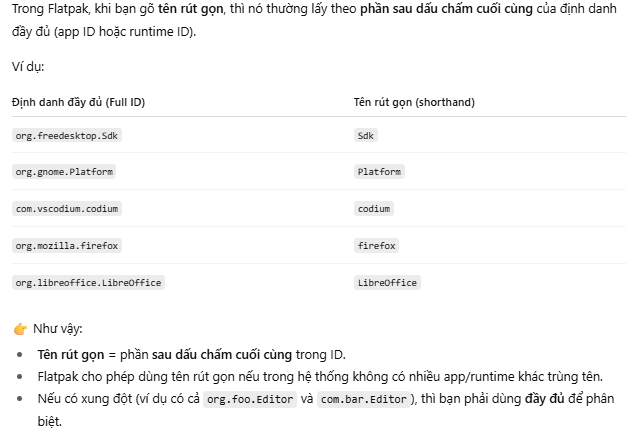
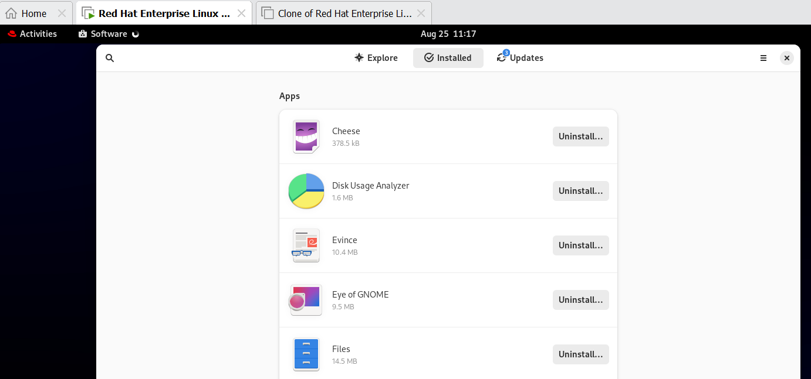

Lab Environment Redhat  


---
# CHAPTER 2: Access the Command Line
- Chạy thành công các chương trình đơn giản từ dòng lệnh Bash shell.
- Thực hiện các lệnh để xác định loại tệp và hiển thị các phần của tệp văn bản.
- Thực hành sử dụng phím tắt lịch sử lệnh Bash để lặp lại lệnh hoặc một phần lệnh hiệu quả hơn.

**1. Sử dụng lệnh để hiển thị thời gian và ngày hiện tại.**
```
[student@workstation ~]$ date
Mon Feb 28 01:57:25 PM PDT 2022
``` 

**2. Hiển thị thời gian hiện tại theo giờ 24 giờ (ví dụ: 13:57). Gợi ý: Chuỗi định dạng hiển thị đầu ra đó là %R.**
```
[student@workstation ~]$ date +%R
13:58
```

**3. Tệp tin trong folder `/root/` này là loại tệp gì ? Con người có thể đọc được không?**

```
[student@workstation ~]$ file zcat
zcat: a /usr/bin/sh script, ASCII text executable
```
Tệp văn bản ASCII có thể đọc được bằng mắt thường

**4. Sử dụng `wc` và phím tắt Bash để hiển thị kích thước của file `zcat` . `wc` để hiển thị số dòng, từ và byte**
```
# trước đó
[root@redhat9-server-1 ~]# file script.sh 
script.sh: ASCII text
[root@redhat9-server-1 ~]# wc + Esc+.
[root@redhat9-server-1 ~]# wc script.sh
 6  3 13 script.sh
```
Trong đó:
- 6 → Số dòng trong file script.sh (line count).
- 3 → Số từ trong file script.sh (word count).
- 13 → Số byte trong file script.sh (byte count), tức là tổng số ký tự, bao gồm cả dấu xuống dòng và dấu cách.

**5. Hiển thị 10 dòng đầu tiên của file `zcat`.**
```
[root@redhat9-server-1 ~]# head Esc+.
[root@redhat9-server-1 ~]# head script.sh 
sad
asd
a
```
Note: default head & tail display 10 line  
**6. Hiển thị 10 dòng cuối cùng của file `zcat`.**
```
[root@redhat9-server-1 ~]# tail Esc+.
[root@redhat9-server-1 ~]# tail script.sh 
sad
asd
a
```
**7. Lặp lại chính xác lệnh trước đó với bốn lần nhấn phím hoặc ít hơn.**
- Một lựa chọn khác là nhấn phím Mũi tên Lên một lần để cuộn ngược lại một lệnh trong lịch sử lệnh, rồi nhấn Enter . Cách này sử dụng hai lần nhấn phím.
- Một phương pháp khác là nhập lệnh tắt !!rồi nhấn Enter để chạy lệnh gần đây nhất trong lịch sử lệnh
```
[root@redhat9-server-1 ~]# tail script.sh 
sad
asd
a

[root@redhat9-server-1 ~]# !!
tail script.sh 
sad
asd
a
```

**8. Sử dụng tùy chọn `tail -n 20` để hiển thị 20 dòng cuối cùng trong file. Sử dụng tính năng chỉnh sửa dòng lệnh để thực hiện tác vụ này với số lần nhấn phím tối thiểu.**

Sử dụng phím Mũi tên Lên để hiển thị lệnh trước đó. 
-> Tiếp theo, sử dụng tổ hợp phím Ctrl + A để di chuyển con trỏ đến đầu dòng. 
-> Sau đó, sử dụng tổ hợp phím Ctrl + Mũi tên Phải để nhảy đến từ tiếp theo. Thêm `-n 20` tùy chọn và nhấn Enter để thực thi lệnh.
```
[root@redhat9-server-1 ~]# tail -n 20 script.sh 
sad
asd
a
```

**9. Sử dụng lịch sử shell để chạy `date +%R` lại lệnh.**
```
[root@redhat9-server-1 ~]# history
  475  date +%R
  476  file zcat
  477  ls
  478  vi script.sh
[root@redhat9-server-1 ~]# !475
date +%R
08:49
```

---
# CHAPTER 3: Manage Files from the Command Line   
7.7 page 36/128    
Sao chép, di chuyển, tạo, xóa và sắp xếp các tệp từ dòng lệnh.   
Target: Sử dụng ký tự đại diện để định vị và thao tác với tệp.

**2. Tạo một thư mục có tên là `project_plans` trong thu muc Documents . Thư muc Documents này được đặt trong thư mục gốc của người dùng `nghiahv`. Tạo hai tệp trống trong project_plans có tên là `season1_project_plan.odf` và `season2_project_plan.odf`.** 

Gợi ý: Nếu thư mục `~/Documents` không tồn tại, hãy sử dụng tùy chọn lệnh `mkdir -p` để tạo thư mục.
```
[nghiahv@redhat9-server-1 ~]$ mkdir -p Documents/project_plans
[nghiahv@redhat9-server-1 ~]$ touch \
> Documents/project_plans/{season1,season2}_project_plan.odf

[nghiahv@redhat9-server-1 ~]$ ls -lR Documents/
Documents/:
total 0
drwxr-xr-x. 2 nghiahv nghiahv 70 Aug 13 10:21 project_plans

Documents/project_plans:
total 0
-rw-r--r--. 1 nghiahv nghiahv 0 Aug 13 10:21 season1_project_plan.odf
-rw-r--r--. 1 nghiahv nghiahv 0 Aug 13 10:21 season2_project_plan.odf
```
**3. Tạo 12 tệp với tên `tv_seasonX_episodeY.ogg` trong thư mục `/home/student`. Thay thế ký tự X bằng số mùa và ký tự Y bằng tập của mùa đó, cho hai mùa, mỗi mùa sáu tập.**
```
[nghiahv@redhat9-server-1 ~]$ touch tv_season{1..2}_episode{1..6}.ogg
[nghiahv@redhat9-server-1 ~]$ ls tv*
tv_season1_episode1.ogg  tv_season1_episode4.ogg  tv_season2_episode1.ogg  tv_season2_episode4.ogg
tv_season1_episode2.ogg  tv_season1_episode5.ogg  tv_season2_episode2.ogg  tv_season2_episode5.ogg
tv_season1_episode3.ogg  tv_season1_episode6.ogg  tv_season2_episode3.ogg  tv_season2_episode6.ogg
```

**4. Là tác giả của một loạt tiểu thuyết trinh thám thành công, bạn đang biên tập các chương của cuốn sách bán chạy tiếp theo để xuất bản. Hãy tạo tám tệp với tên `mystery_chapterX.odf`. Thay thế ký tự X bằng các số từ 1 đến 8.**
```
[nghiahv@redhat9-server-1 ~]$ touch mystery_chapter{1..8}.odf
[nghiahv@redhat9-server-1 ~]$ ls mys*
mystery_chapter1.odf  mystery_chapter3.odf  mystery_chapter5.odf  mystery_chapter7.odf
mystery_chapter2.odf  mystery_chapter4.odf  mystery_chapter6.odf  mystery_chapter8.odf

```
**5. Sử dụng một lệnh duy nhất để tạo thư mục `~/Videos/season1` và `~/Videos/season2` để sắp xếp các tập phim truyền hình. Di chuyển các tập phim truyền hình phù hợp vào các thư mục con của mùa phim. Chỉ sử dụng hai lệnh và chỉ định đích đến bằng cú pháp tương ứng.**

Tạo hai thư mục con có tên là `season1` và `season2` trong thư mục `Videos` bằng cách sử dụng một lệnh duy nhất.
```
[nghiahv@redhat9-server-1 ~]$ mkdir -p Videos/season{1..2}
[nghiahv@redhat9-server-1 ~]$ ls Videos/
season1  season2
```
previous result
```
[nghiahv@redhat9-server-1 ~]$ ls tv*
tv_season1_episode1.ogg  tv_season1_episode4.ogg  tv_season2_episode1.ogg  tv_season2_episode4.ogg
tv_season1_episode2.ogg  tv_season1_episode5.ogg  tv_season2_episode2.ogg  tv_season2_episode5.ogg
tv_season1_episode3.ogg  tv_season1_episode6.ogg  tv_season2_episode3.ogg  tv_season2_episode6.ogg

```
Di chuyển các tập phim truyền hình phù hợp vào thư mục con theo mùa chỉ bằng 2 lệnh.
```
[nghiahv@redhat9-server-1 ~]$ mv tv_season1* Videos/season1/
[nghiahv@redhat9-server-1 ~]$ mv tv_season2* Videos/season2/
[nghiahv@redhat9-server-1 ~]$ ls -R Videos/
Videos/:
season1  season2

Videos/season1:
tv_season1_episode1.ogg  tv_season1_episode3.ogg  tv_season1_episode5.ogg
tv_season1_episode2.ogg  tv_season1_episode4.ogg  tv_season1_episode6.ogg

Videos/season2:
tv_season2_episode1.ogg  tv_season2_episode3.ogg  tv_season2_episode5.ogg
tv_season2_episode2.ogg  tv_season2_episode4.ogg  tv_season2_episode6.ogg
```
**6. Tạo một hệ thống phân cấp thư mục hai cấp chỉ bằng một lệnh để sắp xếp các chương sách bí ẩn. Tạo thư mục con `my_bestseller` trong thư mục `Documents`, và tạo thư mục con `chapters` trong thư mục `my_bestseller` mới. Tạo thêm ba thư mục con ngay trong thư mục `my_bestseller` chỉ bằng một lệnh. Đặt tên cho các thư mục con này là `editor, changes và vacation`. Bạn không cần sử dụng lệnh `mkdir -p `để tạo thư mục cha vì thư mục cha `my_bestseller` đã tồn tại.**

*6.1 Tạo thư mục `my_bestseller` trong thư mục `Documents`. Tạo thư mục `chapters` trong thư mục `my_bestseller`.*
```
[nghiahv@redhat9-server-1 ~]$ mkdir -p Documents/my_bestseller/chapters
[nghiahv@redhat9-server-1 ~]$ ls -R Documents/
Documents/:
my_bestseller  project_plans

Documents/my_bestseller:
chapters

Documents/my_bestseller/chapters:

Documents/project_plans:
season1_project_plan.odf  season2_project_plan.odf

```

*6.2 Tạo ba thư mục có tên là `editor`, `changes` và `vacation` trong thư mục `my_bestseller` bằng cách sử dụng một lệnh duy nhất.*
```
[nghiahv@redhat9-server-1 ~]$ mkdir Documents/my_bestseller/{editor,changes,vacation}
[nghiahv@redhat9-server-1 ~]$ ls -R Documents/
Documents/:
my_bestseller  project_plans

Documents/my_bestseller:
changes  chapters  editor  vacation

Documents/my_bestseller/changes:

Documents/my_bestseller/chapters:

Documents/my_bestseller/editor:

Documents/my_bestseller/vacation:

Documents/project_plans:
season1_project_plan.odf  season2_project_plan.odf

```
**7. Chuyển đến thư mục `chapters`. Sử dụng phím tắt thư mục home dấu ngã (~) để di chuyển tất cả các chương sách đến thư mục `chapters`, hiện là thư mục hiện tại của bạn. Sử dụng cú pháp đơn giản nhất để chỉ định thư mục đích.**

Bạn muốn gửi hai chương đầu tiên đến trình soạn thảo để xem xét. Chỉ di chuyển hai chương đó đến thư mục trình soạn thảo để tránh sửa đổi chúng trong quá trình xem xét. Bắt đầu từ thư mục con chương, sử dụng dấu ngoặc nhọn mở rộng với một phạm vi để chỉ định tên tệp chương cần di chuyển và đường dẫn tương đối đến thư mục đích.

Trong thời gian nghỉ, bạn dự định viết chương 7 và 8. Sử dụng một lệnh duy nhất để di chuyển các tệp từ thư mục chương sang thư mục nghỉ. Chỉ định tên tệp chương bằng cách sử dụng dấu ngoặc nhọn mở rộng với danh sách các chuỗi và không sử dụng ký tự đại diện.

*7.1 Chuyển đến thư mục `chapters` và sử dụng phím tắt thư mục gốc dấu ngã (~) để di chuyển tất cả các chương sách vào thư mục chương.*
```
[nghiahv@redhat9-server-1 ~]$ cd Documents/my_bestseller/chapters/
[nghiahv@redhat9-server-1 chapters]$ mv ~/mystery_chapter* .
[nghiahv@redhat9-server-1 chapters]$ ls
mystery_chapter1.odf  mystery_chapter3.odf  mystery_chapter5.odf  mystery_chapter7.odf
mystery_chapter2.odf  mystery_chapter4.odf  mystery_chapter6.odf  mystery_chapter8.odf

```

*7.2 Di chuyển hai chương đầu tiên đến thư mục `editor`. Sử dụng dấu ngoặc nhọn mở rộng với phạm vi để chỉ định tên tệp chương cần di chuyển và đường dẫn tương đối đến thư mục đích.*

```
[nghiahv@redhat9-server-1 chapters]$ mv mystery_chapter{1..2}.odf ../editor/
[nghiahv@redhat9-server-1 chapters]$ ls ../editor/
mystery_chapter1.odf  mystery_chapter2.odf
[nghiahv@redhat9-server-1 chapters]$ ls
mystery_chapter3.odf  mystery_chapter4.odf  mystery_chapter5.odf  mystery_chapter6.odf  mystery_chapter7.odf  mystery_chapter8.odf

```

```
[nghiahv@redhat9-server-1 chapters]$ pwd
/home/nghiahv/Documents/my_bestseller/chapters

[nghiahv@redhat9-server-1 chapters]$ tree -d -L 2 /home/nghiahv/Documents/
/home/nghiahv/Documents/
├── my_bestseller
│   ├── changes
│   ├── chapters
│   ├── editor
│   └── vacation
└── project_plans

6 directories
```
Command cd

Lệnh	|Mô tả
---|---
cd	|Về thư mục home hoặc đến thư mục chỉ định
cd -	|Quay lại thư mục trước đó
cd ..	|Lùi một cấp thư mục cha

*7.3 Sử dụng một lệnh duy nhất để di chuyển chương 7 và 8 từ thư mục `chapters` sang thư mục `vacation`. Chỉ định tên tệp chương bằng cách sử dụng dấu ngoặc nhọn mở rộng với danh sách chuỗi và không sử dụng ký tự đại diện.*
```
[nghiahv@redhat9-server-1 chapters]$ mv mystery_chapter{7..8}.odf ../vacation/
[nghiahv@redhat9-server-1 chapters]$ ls
mystery_chapter3.odf  mystery_chapter4.odf  mystery_chapter5.odf  mystery_chapter6.odf
[nghiahv@redhat9-server-1 chapters]$ ls ../vacation/
mystery_chapter7.odf  mystery_chapter8.odf
```

Giai thich ve `..`
```
# Gia su co thuc muc
/home/nghia/
├── chapters/
└── vacation/
    ├── photo1.jpg
    └── photo2.jpg

pwd 
/home/nghia/chapters

ls ../vacation
= cd .. + ls /vacation
```

**8. Chuyển thư mục làm việc của bạn thành `~/Videos/season2`, sau đó sao chép tập đầu tiên của mùa phim vào thư mục `vacation`. Sử dụng một lệnh cd duy nhất để chuyển từ thư mục làm việc sang thư mục `~/Documents/my_bestseller/vacation`. Liệt kê các tệp của thư mục đó. Sử dụng đối số thư mục làm việc trước đó để quay lại thư mục `season2`. Đối số này thành công nếu lần thay đổi thư mục cuối cùng bằng lệnh cd chỉ sử dụng một lệnh thay vì nhiều lệnh cd. Từ thư mục `season2`, sao chép tệp tập 2 vào thư mục `vacation`. Sử dụng phím tắt một lần nữa để quay lại thư mục `vacation`.**

*8.1 Thay đổi thư mục làm việc của bạn thành `~/Videos/season2`, sau đó sao chép tập đầu tiên của mùa giải vào thư mục `vacation`.*
```
[nghiahv@redhat9-server-1 chapters]$ cd ~/Videos/season2/
[nghiahv@redhat9-server-1 season2]$ ls
tv_season2_episode1.ogg  tv_season2_episode3.ogg  tv_season2_episode5.ogg
tv_season2_episode2.ogg  tv_season2_episode4.ogg  tv_season2_episode6.ogg
[nghiahv@redhat9-server-1 season2]$ cp *episode1.ogg ~/Documents/my_bestseller/vacation/
[nghiahv@redhat9-server-1 season2]$ ls ~/Documents/my_bestseller/vacation/
mystery_chapter7.odf  mystery_chapter8.odf  tv_season2_episode1.ogg

```
*8.2 Sử dụng một lệnh cd duy nhất để chuyển từ thư mục làm việc sang thư mục `~/Documents/my_bestseller/vacation`, liệt kê các tệp trong đó và sử dụng tham số - để trở về thư mục trước đó. Sao chép tệp tập 2 vào thư mục `vacation`. Sử dụng lệnh cd với tham số - để trở về thư mục `vacation`.*
```
[nghiahv@redhat9-server-1 season2]$ cd ~/Documents/my_bestseller/vacation/
[nghiahv@redhat9-server-1 vacation]$ ls
mystery_chapter7.odf  mystery_chapter8.odf  tv_season2_episode1.ogg
[nghiahv@redhat9-server-1 vacation]$ cd -
/home/nghiahv/Videos/season2
[nghiahv@redhat9-server-1 season2]$ cp *episode2.ogg ~/Documents/my_bestseller/vacation/
[nghiahv@redhat9-server-1 season2]$ cd -
/home/nghiahv/Documents/my_bestseller/vacation
[nghiahv@redhat9-server-1 vacation]$ ls
mystery_chapter7.odf  mystery_chapter8.odf  tv_season2_episode1.ogg  tv_season2_episode2.ogg
```

**9. Tác giả của chương 5 và 6 muốn thử nghiệm các thay đổi có thể. Hãy sao chép cả hai tệp từ thư mục `~/Documents/my_bestseller/chapters` sang thư mục `~/Documents/my_bestseller/changes` để ngăn những thay đổi này làm thay đổi các tệp gốc.**

Truy cập thư mục `~/Documents/my_bestseller`. Sử dụng mẫu so khớp trong ngoặc vuông để chỉ định số chương nào sẽ khớp trong đối số tên tệp của lệnh cp.
```
[nghiahv@redhat9-server-1 vacation]$ cd ~/Documents/my_bestseller/
[nghiahv@redhat9-server-1 my_bestseller]$ ls
changes  chapters  editor  vacation
[nghiahv@redhat9-server-1 my_bestseller]$ cp chapters/mystery_chapter[56].odf changes/
[nghiahv@redhat9-server-1 my_bestseller]$ ls chapters/
mystery_chapter3.odf  mystery_chapter4.odf  mystery_chapter5.odf  mystery_chapter6.odf
[nghiahv@redhat9-server-1 my_bestseller]$ ls changes/
mystery_chapter5.odf  mystery_chapter6.odf
```

**10. Chuyển thư mục hiện tại của bạn thành thư mục `changes` và sử dụng lệnh `date +%F` kết hợp với lệnh copy để sao chép tệp `mystery_chapter5.odf` sang một tệp mới chứa ngày tháng đầy đủ. Sử dụng định dạng tên `mystery_chapter5_YYYY-MM-DD.odf`.**

Bằng cách sử dụng lệnh thay thế với lệnh` date +%s`, hãy tạo một bản sao khác của tệp `mystery_chapter5.odf` và thêm dấu thời gian hiện tại (là số giây kể từ thời điểm epoch, 1970-01-01 00:00 UTC) để đảm bảo tên tệp duy nhất.
```
[nghiahv@redhat9-server-1 changes]$ cp mystery_chapter5.odf \
> mystery_chapter5_$(date +%F).odf
[nghiahv@redhat9-server-1 changes]$ cp mystery_chapter5.odf mystery_chapter5_$(date +%s).odf
[nghiahv@redhat9-server-1 changes]$ ls
mystery_chapter5_1755058581.odf  mystery_chapter5_2025-08-13.odf  mystery_chapter5.odf  mystery_chapter6.odf
```
Note: Phần $(...) là command substitution (thay thế bằng kết quả của lệnh bên trong).

**11. Sau khi xem xét kỹ hơn, bạn quyết định rằng mình không cần thay đổi cốt truyện. Hãy xóa thư mục `changes`.**

Nếu cần, hãy vào thư mục `changes` và xóa tất cả các tệp trong thư mục đó. Bạn không thể xóa một thư mục khi nó là thư mục làm việc hiện tại.

Chuyển đến thư mục cha của thư mục `changes`. Hãy thử xóa thư mục trống bằng lệnh rm mà không có tùy chọn -r đệ quy. Thử này sẽ thất bại. Cuối cùng, hãy sử dụng lệnh `rmdir` để xóa thư mục trống, và thành công.

Khi kỳ nghỉ kết thúc, bạn không cần thư mục `vacation` nữa. Hãy xóa nó bằng lệnh rm với tùy chọn đệ quy.

Khi hoàn tất, hãy quay lại thư mục home của người dùng nghiahv.
```
[nghiahv@redhat9-server-1 changes]$ ls
mystery_chapter5_1755058581.odf  mystery_chapter5_2025-08-13.odf  mystery_chapter5.odf  mystery_chapter6.odf
[nghiahv@redhat9-server-1 changes]$ rm mystery_chapter*
[nghiahv@redhat9-server-1 changes]$ ls
[nghiahv@redhat9-server-1 changes]$ cd ..
[nghiahv@redhat9-server-1 my_bestseller]$ ls
changes  chapters  editor  vacation
[nghiahv@redhat9-server-1 my_bestseller]$ rm changes/
rm: cannot remove 'changes/': Is a directory
[nghiahv@redhat9-server-1 my_bestseller]$ rmdir changes/
[nghiahv@redhat9-server-1 my_bestseller]$ ls
chapters  editor  vacation
[nghiahv@redhat9-server-1 my_bestseller]$ rm -r vacation/
[nghiahv@redhat9-server-1 my_bestseller]$ ls
chapters  editor
[nghiahv@redhat9-server-1 my_bestseller]$ cd
[nghiahv@redhat9-server-1 ~]$ 
```

**12. Tạo một liên kết cứng đến tệp `~/Documents/project_plans/season2_project_plan.odf` có tên là `~/Documents/backups/season2_project_plan.odf`.back. Liên kết cứng giúp bảo vệ tệp gốc khỏi việc vô tình xóa nhầm và giữ cho tệp sao lưu được cập nhật khi bạn thay đổi tệp gốc.**

Gợi ý: Nếu thư mục `~/Documents/backups` không tồn tại, hãy sử dụng lệnh mkdir để tạo thư mục đó.
```
[nghiahv@redhat9-server-1 ~]$ mkdir ~/Documents/backups
[nghiahv@redhat9-server-1 ~]$ ln Documents/project_plans/season2_project_plan.odf  \
> Documents/backups/season2_project_plan.odf.back
[nghiahv@redhat9-server-1 ~]$ ls -lR Documents/
Documents/:
total 0
drwxr-xr-x. 2 nghiahv nghiahv 43 Aug 13 13:43 backups
drwxr-xr-x. 4 nghiahv nghiahv 36 Aug 13 13:40 my_bestseller
drwxr-xr-x. 2 nghiahv nghiahv 70 Aug 13 10:21 project_plans

Documents/backups:
total 0
-rw-r--r--. 2 nghiahv nghiahv 0 Aug 13 10:21 season2_project_plan.odf.back

Documents/my_bestseller:
total 0
drwxr-xr-x. 2 nghiahv nghiahv 118 Aug 13 10:55 chapters
drwxr-xr-x. 2 nghiahv nghiahv  62 Aug 13 10:46 editor

Documents/my_bestseller/chapters:
total 0
-rw-r--r--. 1 nghiahv nghiahv 0 Aug 13 10:28 mystery_chapter3.odf
-rw-r--r--. 1 nghiahv nghiahv 0 Aug 13 10:28 mystery_chapter4.odf
-rw-r--r--. 1 nghiahv nghiahv 0 Aug 13 10:28 mystery_chapter5.odf
-rw-r--r--. 1 nghiahv nghiahv 0 Aug 13 10:28 mystery_chapter6.odf

Documents/my_bestseller/editor:
total 0
-rw-r--r--. 1 nghiahv nghiahv 0 Aug 13 10:28 mystery_chapter1.odf
-rw-r--r--. 1 nghiahv nghiahv 0 Aug 13 10:28 mystery_chapter2.odf

Documents/project_plans:
total 0
-rw-r--r--. 1 nghiahv nghiahv 0 Aug 13 10:21 season1_project_plan.odf
-rw-r--r--. 2 nghiahv nghiahv 0 Aug 13 10:21 season2_project_plan.odf
```

---
# CHAPTER 4: Get Help in Red Hat Enterprise Linux
PAGE 29/125  

Tìm kiếm thông tin từ tài liệu cục bộ để giúp bạn chạy lệnh và hoàn thành tác vụ.   
Kết quả   
- Tìm kiếm thông tin liên quan đến lệnh bằng cách tìm kiếm trong trang hướng dẫn. 
- Tìm hiểu các tùy chọn mới cho các lệnh tài liệu phổ biến nhất. 
- Sử dụng các công cụ phù hợp để xem và in tài liệu và các tệp không được định dạng văn bản khác.

1. Trên máy `workstation`, hãy xác định cách chuẩn bị trang hướng dẫn để in. Cụ thể, hãy tìm định dạng hoặc ngôn ngữ hiển thị mặc định để in.  

Use the `man man` command to determine how to prepare a man page for printing.
```
[student@worksation ~]$ man man
...output omitted...
  man -t bash | lpr -Pps
      Format the manual page for bash into the default troff or groff format
      and pipe it to the printer named ps. The default output for groff
      is usually PostScript. man --help should advise as to which processor
      is bound to the -t option.
...output omitted...
```
Press `q` to quit the man page.
2. Tạo một tệp đầu ra định dạng `PostScript` cho trang hướng dẫn `passwd`. Gọi tệp `passwd.ps` và đặt nó vào thư mục home của người dùng `student`. Xác định định dạng tệp. Kiểm tra nội dung của tệp `passwd.ps` bằng lệnh `less`.

LƯU Ý Vì bạn cần lưu kết quả đầu ra của lệnh man vào một tệp, bạn có thể sử dụng ký hiệu > để chuyển hướng kết quả đầu ra chuẩn sang một tệp. Ví dụ, lệnh sau liệt kê tên tệp thông thường của thư mục gốc vào một tệp.
```
[student@workstation ~]$ ls > /tmp/my-file-names
```

3. Bằng cách sử dụng các trang hướng dẫn, hãy tìm các lệnh bạn có thể sử dụng để xem và in các tệp PostScript. 

Tìm kiếm thông tin về các tệp PostScript trong các trang hướng dẫn. Sử dụng tùy chọn -k cho mục đích này.
```
[student@workstation ~]# man -k postscript viewer
enscript (1)         - convert text files to PostScript, HTML, RTF, ANSI, and overstrikes
eps2eps (1)          - Ghostscript PostScript "distiller"
evince (1)           - GNOME document viewer
evince-previewer (1) - show a printing preview of PostScript and PDF documents
evince-thumbnailer (1) - create png thumbnails from PostScript and PDF documents
gcm-viewer (1)       - GNOME Color Manager Profile Viewer Tool
...output omitted...
```

**4. Tìm hiểu cách sử dụng trình xem `evince`(1) ở chế độ xem trước. Ngoài ra, hãy xác định cách mở tài liệu để bắt đầu ở một trang cụ thể. Mở tệp PostScript của bạn bằng `evince` ba lần: đầu tiên bằng chế độ mặc định, sau đó bằng tùy chọn chế độ xem trước, và cuối cùng là bắt đầu ở trang 3. Đóng tệp tài liệu của bạn khi hoàn tất.**

4.1 Use the man evince command to learn how to use the viewer in preview mode.
```
[student@workstation ~]$ man evince
...output omitted...
       -i, --page-index=NUMBER
              Open the document on the page with the specified page index (this is the  exact page number, not a page label).
...output omitted...
       -w, --preview
              Run evince as a previewer.
...output omitted...
```
Press `q` to quit the man page.  
Note: Tùy chọn -w (hoặc --preview) sẽ mở evince ở chế độ xem trước. Tùy chọn -i sẽ mở evince ở trang bắt đầu được chỉ định.

4.2 Use the evince command to open the /home/student/passwd.ps file.
```
[student@workstation ~]$ evince /home/student/passwd.ps
```
4.3 Sử dụng lệnh evince -w /home/student/passwd.ps để mở tệp ở chế độ xem trước.
```
[student@workstation ~]$ evince -w /home/student/passwd.ps
```
4.4 Use the evince -i 3 /home/student/passwd.ps command to open the file at page 3.
```
[student@workstation ~]$ evince -i 3 /home/student/passwd.ps
```
Note: Trong khi chế độ evince thông thường hỗ trợ chế độ xem toàn màn hình và chế độ trình bày, chế độ xem trước evince hữu ích cho việc duyệt nhanh và in ấn. Lưu ý biểu tượng in ở trên cùng.

5, By using the man pages, research lp(1) to determine how to print any document to start on a specific page. Without entering any commands (in the absence of printers), learn the syntax, in one command, to print only pages 2 and 3 of your PostScript file.

Use the man lp command to determine how to print specific pages of a document.
```
[student@workstation ~]$ man lp
...output omitted...
       -P page-list
            Specifies which pages to print in the document.  The list can contain a list of numbers and ranges (-) separated by commas, e.g., "1,3-5, 16". The page numbers refer to the output pages and not the document's original pages - options like "number-up" can affect the numbering of the pages.
...output omitted...
```
Press q to quit the man page.

Note: From lp(1), you learn that the -P option specifies the page list to print in the document. The lp command spools to the default printer, and sends only the page range to start on 2 and to end on 3. Therefore, one valid answer is lp passwd.ps -P 2-3.

6. Use the Firefox browser to open the system's man page directory (/usr/share/doc) and browse to the `man-db` package subdirectory. View the provided manuals. After you finish reviewing the man-db manuals, locate and browse to the kexec-tools package subdirectory. View the `kexec-kdump-howto.txt` file, which describes important system configurations that are stored in the `/etc/sysconfig directory`.

6.1 Use firefox `/usr/share/doc` to view system documentation. Browse the `man-db` subdirectory. Click the manuals to view them.

[student@workstation ~]$ firefox /usr/share/doc
The firefox command might return output that is unrelated to the Satellite console.

Note
You can create bookmarks for any frequently used directory. After browsing the man-db directory, click to open and view the text version of the manual, and then close it. Click to open the PostScript version. As observed earlier, evince is the system's default viewer for PostScript and PDF documents. When finished, close the evince viewer.


6.2 In the Firefox browser, locate the kexec-tools package subdirectory and view the kexec-kdump-howto.txt file. This file describes important system configurations that are stored in the /etc/sysconfig directory.

Close the document and Firefox when finished.

---
# CHAPTER 5: Create, View, and Edit Text Files
Chỉnh sửa tệp văn bản bằng trình soạn thảo vim.  
Kết quả 
- Sử dụng Vim để chỉnh sửa tệp. 
- Sử dụng chế độ trực quan của Vim để đơn giản hóa việc chỉnh sửa các tệp lớn.

**1. Trên máy `workstation`, hãy tạo biến shell `lab_file` và gán giá trị `editing_final_lab.txt`. Liệt kê nội dung của thư mục home của `student`, bao gồm các thư mục và tệp ẩn, cũng như quyền, kích thước tệp và thời gian sửa đổi, sau đó chuyển hướng đầu ra đến tệp `editing_final_lab.txt` bằng cách sử dụng biến shell.**

Trên máy trạm, hãy tạo biến shell lab_file và gán giá trị editing_final_lab.txt. Sử dụng lệnh ls -al trong thư mục home của sinh viên và chuyển hướng đầu ra đến tệp editing_final_lab.txt.
```
[student@workstation ~]$ lab_file=editing_final_lab.txt
[student@workstation ~]$ ls -al > $lab_file
```
**2. Use Vim to edit the `editing_final_lab.txt file`. Use the `lab_file` shell variable.**
```
[student@workstation ~]$ vim $lab_file
```
**3. Enter the line-based visual mode of Vim. Your screen output might differ from these examples. Remove the first three lines of the editing_final_lab.txt file.**


Sử dụng các phím mũi tên để đặt con trỏ tại ký tự đầu tiên của dòng đầu tiên. Vào chế độ xem theo dòng bằng phím Shift+V. Di chuyển xuống bằng cách sử dụng phím mũi tên xuống hai lần để chọn ba dòng đầu tiên. Xóa các dòng bằng cách nhập x.

Vào chế độ visual mode  của Vim. Xóa bảy ký tự cuối cùng khỏi cột đầu tiên trên dòng đầu tiên. Chỉ giữ lại bốn ký tự đầu tiên của cột đầu tiên.

Sử dụng các phím mũi tên để định vị con trỏ tại ký tự cuối cùng của cột đầu tiên trên dòng đầu tiên. Xóa lựa chọn bằng cách nhập x.


Sử dụng các phím mũi tên để đặt con trỏ tại ký tự thứ năm của cột đầu tiên trên dòng đầu tiên. Vào chế độ trực quan bằng cách gõ v. Ẩn Giải pháp

**5. Vào chế độ visual block của Vim. Lặp lại thao tác của bước trước, nhưng lần này chọn từ dòng thứ hai đến dòng cuối cùng. Chỉ giữ lại bốn ký tự đầu tiên của cột đầu tiên.**


Sử dụng các phím mũi tên để đặt con trỏ ở ký tự thứ năm của dòng thứ hai. Vào chế độ trực quan bằng cách sử dụng tổ hợp phím Ctrl+V. Sử dụng các phím mũi tên để đặt con trỏ ở ký tự cuối cùng của cột đầu tiên trên dòng cuối cùng. Xóa lựa chọn bằng cách nhập x

**6. Vào chế độ visual block của Vim và xóa cột thứ tư của tệp.**


Sử dụng các phím mũi tên để đặt con trỏ tại ký tự đầu tiên của cột thứ tư. Vào chế độ khối hình ảnh bằng cách nhấn Ctrl+V. Sử dụng các phím mũi tên để đặt con trỏ tại ký tự và hàng cuối cùng của cột thứ tư. Xóa vùng chọn bằng cách nhập x.

**7. Vào chế độ visual block của Vim để xóa cột thời gian, giữ lại cột tháng và ngày trên tất cả các dòng.**


Sử dụng các phím mũi tên để đặt con trỏ tại ký tự đầu tiên của cột thứ bảy hiện tại. Vào chế độ khối hình ảnh bằng cách nhấn Ctrl+V. Sử dụng các phím mũi tên để đặt con trỏ tại ký tự cuối cùng của cột thứ bảy trên hàng cuối cùng. Xóa lựa chọn bằng cách nhấn x.

**8. Vào chế độ visual line của Vim và xóa các hàng chứa chuỗi `Desktop` và `Public`.**


Sử dụng các phím mũi tên để đặt con trỏ tại bất kỳ ký tự nào trên hàng Desktop. Vào chế độ trực quan bằng chữ V in hoa. Toàn bộ dòng được chọn. Xóa lựa chọn bằng cách nhập x. Lặp lại thao tác cho hàng có chuỗi Public.

**9. Save your changes and exit the file.**


**10. Back up the editing_final_lab.txt file and append the date (in seconds) at the end of the file name preceded with an underscore (_) character. Use the lab_file shell variable.**

Use the cp command to back up the editing_final_lab.txt file. Use the `$(date +%s)` command at the end of the backup name preceded with an underscore character to make the name unique.
```
[student@workstation ~]$ cp $lab_file \
editing_final_lab_$(date +%s).txt
```

**11. Append a dashed line to the editing_final_lab.txt file. The dashed line should contain 12 dash (-) characters for this lab to be graded correctly. Use the lab_file shell variable.**

Use the echo command with 12 dashes and append the output to the editing_final_lab.txt file.
```
[student@workstation ~]$ echo "------------" >> $lab_file
```

**12. List the content of the Documents directory, and append the output to the editing_final_lab.txt file, and display the output in the terminal. Use the tee command and the lab_file shell variable.**

Use the ls command to list the Documents directory and pipe the output to the tee -a command to append the output to the editing_final_lab.txt file.
```
[student@workstation ~]$ ls Documents/ | tee -a $lab_file
lab_review.txt
```
Confirm that the directory listing is at the bottom of the lab file. Use the `lab_file` shell variable.
```
[student@workstation ~]$ cat $lab_file
drwx  3 student    17 Mar  4  .ansible
-rw-  1 student    18 Nov  5  .bash_logout
-rw-  1 student   141 Nov  5  .bash_profile
-rw-  1 student   492 Nov  5  .bashrc
drwx  9 student  4096 Mar  8  .cache
drwx  8 student  4096 Mar  8  .config
drwx  2 student     6 Mar  8  Documents
drwx  2 student     6 Mar  8  Downloads
-rw-  1 student     0 Mar  8  editing_final_lab.txt
drwx  2 student    25 Mar  4  .grading
drwx  4 student    32 Mar  8  .local
drwx  2 student     6 Mar  8  Music
drwx  2 student     6 Mar  8  Pictures
drwx  2 student    77 Mar  4  .ssh
drwx  2 student     6 Mar  8  Templates
drwx  3 student    18 Mar  4  .venv
drwx  2 student     6 Mar  8  Videos
------------
lab_review.txt
```

---
# CHAPTER 6: Manage Local Users and Groups
10.11 - PAGE 55/128  
Sử dụng quyền truy cập superuser để quản lý người dùng và nhóm cục bộ và để quản lý chính sách mật khẩu cục bộ.

Kết quả:
- Đặt chính sách thời hạn mật khẩu mặc định cho mật khẩu người dùng cục bộ.
- Tạo và sử dụng nhóm bổ sung cho người dùng mới.
- Tạo ba người dùng với nhóm bổ sung mới.
- Đặt mật khẩu ban đầu cho người dùng đã tạo.
- Cấu hình các thành viên nhóm bổ sung để sử dụng sudo để chạy bất kỳ lệnh nào với tư cách là bất kỳ người dùng nào.
- Đặt chính sách thời hạn mật khẩu dành riêng cho người dùng.

Chuyển sang người dùng `sudo -i `   
**2. đảm bảo rằng người dùng mới tạo phải thay đổi mật khẩu sau mỗi 30 ngày.  (KHÔNG áp dụng cho user hiện có.)**
```
vi /etc/login.defs
PASS_MAX_DAYS   30
```
**3. Tạo nhóm `consultants` có GID là 35000.**
```
[root@redhat9-server-1 ~]#  groupadd -g 35000 consultants
[root@redhat9-server-1 ~]# cat /etc/group | grep consultants
consultants:x:35000:
```
**4.  Cấu hình quyền quản trị để cho phép tất cả thành viên nhóm `consultants` thực thi bất kỳ lệnh nào với tư cách người dùng. Tránh sử dụng công cụ dòng lệnh visudo để chỉnh sửa tệp `/etc/sudoers`. Thay vào đó, hãy đặt tệp cấu hình vào thư mục `/etc/sudoers.d`.**
```
vi /etc/sudoers.d/consultants
%consultants  ALL=(ALL) ALL
```
Note:
- dấu % ở đầu nghĩa là nhóm (group) trong Linux.
- Không có dấu % → nghĩa là tài khoản người dùng cụ thể.
**5. Tạo người dùng `consultant1`, `consultant2` và `consultant3` với nhóm `consultants` là nhóm bổ sung của họ.**
```
[root@redhat9-server-1 ~]# useradd -G consultants consultant1
[root@redhat9-server-1 ~]# useradd -G consultants consultant2
[root@redhat9-server-1 ~]# useradd -G consultants consultant3
[root@redhat9-server-1 ~]# tail /etc/passwd
nghiahv:x:1000:1000:Nghiahv:/home/nghiahv:/bin/bash
sysadmin1:x:1001:1002::/home/sysadmin1:/bin/bash
consultant1:x:1002:35001::/home/consultant1:/bin/bash
consultant2:x:1003:1003::/home/consultant2:/bin/bash
consultant3:x:1004:1004::/home/consultant3:/bin/bash

[root@redhat9-server-1 ~]# id consultant2
uid=1003(consultant2) gid=1003(consultant2) groups=1003(consultant2),35000(consultants)
[root@redhat9-server-1 ~]# id consultant3
uid=1004(consultant3) gid=1004(consultant3) groups=1004(consultant3),35000(consultants)
[root@redhat9-server-1 ~]# id consultant1
uid=1002(consultant1) gid=35001(consultant1) groups=35001(consultant1),35000(consultants)
```
Note:
- tuy chon `-G` : chỉ thêm user vào nhóm phụ consultants, không đặt nhóm chính (primary group) là consultants
- Muốn thêm user vào nhóm bổ sung(supplementary groups):  
`usermod -aG groupname username`
- Đổi nhóm chính:  
`sudo usermod -g new_primary_group username`

**6. Đặt mật khẩu `consultant1`, `consultant2` và `consultant3` la `redhat`.**
```
[root@redhat9-server-1 ~]# passwd consultant1
Changing password for user consultant1.
New password: 
BAD PASSWORD: The password is shorter than 8 characters
Retype new password: 
passwd: all authentication tokens updated successfully.

[root@redhat9-server-1 ~]# passwd consultant2
Changing password for user consultant2.
New password: 
BAD PASSWORD: The password is shorter than 8 characters
Retype new password: 
passwd: all authentication tokens updated successfully.

[root@redhat9-server-1 ~]# passwd consultant3
Changing password for user consultant3.
New password: 
BAD PASSWORD: The password is shorter than 8 characters
Retype new password: 
passwd: all authentication tokens updated successfully.
```
**7. Đặt thời hạn hết hạn cho các tài khoản `consultant1`, `consultant2` và `consultant3` là 90 ngày kể từ ngày hiện tại.**

*7.1 Xác định ngày trong tương lai 90 ngày.*
```
[root@redhat9-server-1 ~]# date -d "+90 days" +%F
2025-11-11
```
*7.2 Đặt các user `consultant1`, `consultant2`, và `consultant3` hết hạn vào ngày được hiển thị ở bước trước*
```
[root@redhat9-server-1 ~]# chage -E 2025-11-11 consultant1 
[root@redhat9-server-1 ~]# chage -E 2025-11-11 consultant2
[root@redhat9-server-1 ~]# chage -E 2025-11-11 consultant3
```

**8. Thay đổi chính sách mật khẩu cho user `consultant2` để yêu cầu mật khẩu mới sau mỗi 15 ngày.**

```
[root@redhat9-server-1 ~]# chage -M 15 consultant2
```
**9. Ngoài ra, hãy buộc người dùng `consultant1`, `consultant2` và `consultant3` thay đổi mật khẩu khi đăng nhập lần đầu.**

Đặt ngày cuối cùng thay đổi mật khẩu thành 0 để người dùng phải thay đổi mật khẩu khi lần đầu đăng nhập vào hệ thống.


```
[root@redhat9-server-1 ~]# chage -d 0 consultant1
[root@redhat9-server-1 ~]# chage -d 0 consultant2
[root@redhat9-server-1 ~]# chage -d 0 consultant3
```

Ket qua
```
[root@redhat9-server-1 ~]# chage -l consultant1
Last password change					: password must be changed
Password expires					: password must be changed
Password inactive					: password must be changed
Account expires						: Nov 11, 2025
Minimum number of days between password change		: 0
Maximum number of days between password change		: 99999
Number of days of warning before password expires	: 7
[root@redhat9-server-1 ~]# chage -l consultant2
Last password change					: password must be changed
Password expires					: password must be changed
Password inactive					: password must be changed
Account expires						: Nov 11, 2025
Minimum number of days between password change		: 0
Maximum number of days between password change		: 15
Number of days of warning before password expires	: 7
[root@redhat9-server-1 ~]# chage -l consultant3
Last password change					: password must be changed
Password expires					: password must be changed
Password inactive					: password must be changed
Account expires						: Nov 11, 2025
Minimum number of days between password change		: 0
Maximum number of days between password change		: 99999
Number of days of warning before password expires	: 7
```

---
# CHAPTER 7: Control Access to Files  
PAGE 57/125      
Cấu hình quyền trên tệp và thiết lập thư mục mà người dùng trong một nhóm cụ thể có thể sử dụng để chia sẻ tệp trên hệ thống tệp cục bộ.

Kết quả
- Tạo một thư mục nơi người dùng có thể cộng tác làm việc trên tệp.
- Tạo các tệp được tự động gán quyền sở hữu nhóm.
- Tạo các tệp không thể truy cập bên ngoài nhóm.

**1. Log in to serverb as the student user. Run the `sudo -i` command at the shell prompt to become the root user. Use student as the `student` user password.**
```
[student@workstation ~]$ ssh student@serverb
...output omitted...
[student@serverb ~]$ sudo -i
[sudo] password for student: student
[root@serverb ~]#
Create a /home/techdocs directory.
```
*2.1 Use the `mkdir` command to create a `/home/techdocs` directory.*
```
[root@serverb ~]# mkdir /home/techdocs
```
**3. Change the group ownership of the `/home/techdocs` directory to the `techdocs` group.**

Use the `chown` command to change the group ownership for the /home/techdocs directory to the techdocs group.
```
[root@serverb ~]# chown :techdocs /home/techdocs
```
**4. Verify that users in the techdocs group cannot create files in the `/home/techdocs` directory.**

*4.1 Use the `su` command to switch to the `tech1` user.*
```
[root@serverb ~]# su - tech1
[tech1@serverb ~]$
```

*4.2 Create a `techdoc1.txt` file in the `/home/techdocs` directory. This step should fail.*

Although the /home/techdocs directory is owned by the techdocs group and tech1 is part of the techdocs group, you cannot create a file in that directory. The reason is because the techdocs group does not have write permission.
```
[tech1@serverb ~]$ touch /home/techdocs/techdoc1.txt
touch: cannot touch '/home/techdocs/techdoc1.txt': Permission denied
```

*4.3 List the directory's permissions.*
```
[tech1@serverb ~]$ ls -ld /home/techdocs/
  drwxr-xr-x. 2 root techdocs 6 Feb  5 16:05 /home/techdocs/
```

**5. Set permissions on the `/home/techdocs `directory. On the `/home/techdocs `directory, configure setgid (2); read, write, and execute permissions (7) for the owner/user and group; and no permissions (0) for other users.**

*5.1 Exit from the `tech1` user shell.*
```
[tech1@serverb ~]$ exit
logout
[root@serverb ~]#
```

*5.2 Set the group permission for the `/home/techdocs` directory. Configure setgid; read, write, and execute permissions for the owner and group; and no permissions for others.*
```
[root@serverb ~]# chmod 2770 /home/techdocs
```

**6. Verify that the permissions are set correctly.**

The `techdocs` group now has write permission.
```
[root@serverb ~]# ls -ld /home/techdocs
drwxrws---. 2 root techdocs 6 Feb 4 18:12 /home/techdocs/
```

**7. Confirm that users in the `techdocs` group can now create and edit files in the `/home/techdocs` directory. Users that are not in the `techdocs` group cannot edit or create files in the /home/techdocs directory. The tech1 and tech2 users are in the techdocs group. The database1 user is not in that group.**

*7.1 Switch to the tech1 user. Create a `techdoc1.txt` file in the `/home/techdocs directory`. Add some text to the `/home/techdocs/techdoc1.txt` file. Exit from the tech1 user shell.*
```
[root@serverb ~]# su - tech1
[tech1@serverb ~]$ touch /home/techdocs/techdoc1.txt
[tech1@serverb ~]$ ls -l /home/techdocs/techdoc1.txt
-rw-r--r--. 1 tech1 techdocs 0 Feb  5 16:42 /home/techdocs/techdoc1.txt
[tech1@serverb ~]$ echo "This is the first tech doc." > /home/techdocs/techdoc1.txt
[tech1@serverb ~]$ exit
logout
[root@serverb ~]#
```

*7.2 Switch to the tech2 user. Display the content of the /home/techdocs/techdoc1.txt file. Create a techdoc2.txt file in the /home/techdocs directory. Exit from the tech2 user shell.*
```
[root@serverb ~]# su - tech2
[tech2@serverb ~]$ cd /home/techdocs
[tech2@serverb techdocs]$ cat techdoc1.txt
This is the first tech doc.
[tech2@serverb techdocs]$ touch /home/techdocs/techdoc2.txt
[tech2@serverb techdocs]$ ls -l
total 4
-rw-r--r--. 1 tech1 techdocs 28 Feb  5 17:43 techdoc1.txt
-rw-r--r--. 1 tech2 techdocs  0 Feb  5 17:45 techdoc2.txt
[tech2@serverb techdocs]$ exit
logout
[root@serverb ~]#
```

*7.3 Switch to the database1 user. Display the content of the /home/techdocs/techdoc1.txt file. You get a Permission Denied message. Verify that the database1 user does not have access to the file. Exit from the database1 user shell.*

Enter the following long echo command on a single line:
```
[root@serverb ~]# su - database1
[database1@serverb ~]$ cat /home/techdocs/techdoc1.txt
cat: /home/techdocs/techdoc1.txt: Permission denied
[database1@serverb ~]$ ls -l /home/techdocs/techdoc1.txt
ls: cannot access '/home/techdocs/techdoc1.txt': Permission denied
[database1@serverb ~]$ exit
logout
[root@serverb ~]#
```

**8. Modify the /etc/login.defs file to adjust the default umask for login shells. Normal users should have a umask setting that allows the user and group to create, write, and execute files and directories, and preventing other users from viewing, modifying, or executing new files and directories.**

*8.1 Determine the umask of the student user. Switch to the student login shell. When done, exit from the shell.*
```
[root@serverb ~]# su - student
[student@serverb ~]$ umask
0022
[student@serverb ~]$ exit
logout
[root@serverb ~]#
```

*8.2 Edit the /etc/login.defs file and set a umask of 007. The /etc/login.defs file already contains a umask definition. Search the file and update with the appropriate value.*
```
[root@serverb ~]# cat /etc/login.defs
...output omitted...
UMASK           007
...output omitted...
```

*8.3 As the student user, verify that the global umask changes to 007.*
```
[root@serverb ~]# exit
logout
[student@serverb ~]$ exit
logout
Connection to serverb closed.
[student@workstation ~]$ ssh student@serverb
...output omitted...
[student@serverb ~]$ umask
0007
```

*8.4 Return to the workstation system as the student user.*
```
[student@serverb ~]$ exit
logout
Connection to serverb closed.
[student@workstation ~]$
```

Lệnh	|Tùy chọn	
---|---
useradd -g	|Đặt nhóm chính khi tạo user	
useradd -G	|Gán nhóm phụ khi tạo user (van con nhom chinh)
---|---
usermod -g	|Đổi nhóm chính của user	
usermod -G	|Thay thế toàn bộ nhóm phụ	
usermod -aG	|Thêm nhóm phụ mới, giữ lại nhóm cũ


Note 
- Sticky bit (t / T)
Quy tắc (other):
- Có x → hiện t
- Không có x → hiện T


Ý nghĩa từng option
- -p (preserve – giữ nguyên thông tin gốc của file):
  Khi copy, nó sẽ giữ lại:
  - Thời gian chỉnh sửa (mtime) và thời gian truy cập (atime)
  - Quyền (permission)
  - Chủ sở hữu (owner) và nhóm (group) nếu bạn có quyền
- Không có -p: file copy sẽ có thời gian tạo mới và có thể quyền khác.
- -r (recursive – đệ quy):
  - Copy thư mục và toàn bộ nội dung bên trong (bao gồm cả thư mục con, file con).
  - Nếu copy chỉ một file, -r gần như không có tác dụng.


Note
- Bất kể đang ở thư mục nào (/home/dev1, /tmp, /etc, hay /home/techdocs/dev1), khi tạo file mới trong session này, quyền sẽ tuân theo 0027. Muốn một thư mục có “policy riêng” -> chmod. 
- Khi login lại (dù qua su - dev1 hay ssh dev1@host), shell mới sẽ đọc các file config mặc định (/etc/profile, ~/.bashrc, ~/.bash_profile …). umask sẽ trở về giá trị mặc định (thường là 0022, trừ khi anh sửa file config). Nghĩa là thiết lập 0027 vừa set trước đó không còn hiệu lực


---
# CHAPTER 12: Install and Update Software 
12.7 PAGE 71/128  
Tải xuống, cài đặt, cập nhật và quản lý các gói phần mềm từ kho lưu trữ gói Red Hat và DNF.

Kết quả
- Quản lý kho phần mềm.
- Cài đặt và nâng cấp các gói từ kho lưu trữ.
- Cài đặt gói RPM.

1. Trên máy chủ, hãy cấu hình kho phần mềm tùy chỉnh để cài đặt các gói cụ thể. Đặt tên kho lưu trữ là `errata` và tạo tệp kho lưu trữ `errata.repo`. Cấu hình tệp `errata.repo` để sử dụng kho lưu trữ http://repo.example.com/rhel10.0/x86_64/rhcsa-practice/errata. Không xác minh chữ ký GPG.

- Tuy thuoc vao version redhat
- Chi lab duoc tren tren moi truong redhat vi la repo private

```

student@workstation:~$ ssh student@serverb
...output omitted...
[student@serverb ~]$ sudo -i
[sudo] password for student: student
[root@serverb ~]#
```
```
[root@serverb ~]# vi /etc/yum.repos.d/errata.repo
---
[errata]
name=Red Hat Updates
baseurl=http://content.example.com/rhel9.3/x86_64/rhcsa-practice/errata
enabled=1
gpgcheck=0
---
```
**2. Trên máy chủ, hãy cài đặt gói `rht-system`**  
*2.1 Liệt kê các gói có sẵn cho gói `rht-system`*
```
[root@serverb ~]# dnf list rht-system
```
*2.2 Cài đặt phiên bản mới nhất của gói `rht-system`.*
```
[root@serverb ~]# dnf install rht-system
```
**3. Vì lý do bảo mật, máy chủ ServerB không được phép kết nối với máy in giấy. Bạn có thể thực hiện việc này bằng cách gỡ bỏ gói `cups`. Khi hoàn tất, hãy thoát khỏi root shell.**

*3.1 Liệt kê các gói `cups` đã cài đặt.*
```
[root@serverb ~]# dnf list cups
...output omitted...
Installed Packages
cups.x86_64        1:2.4.10-11.el10         @rhel-10.0-for-x86_64-appstream-rpms
```
*3.2 Remove the `cups` package.*
```
[root@serverb ~]# dnf remove cups.x86_64
```

**4. Tập lệnh khởi động sẽ tải xuống gói `rhcsa-script-1.0.0-1.noarch.rpm` trong thư mục `/home/student` trên máy serverb.**

Hãy xác nhận rằng gói `rhcsa-script-1.0.0-1.noarch.rpm` có sẵn trên serverb và cài đặt nó bằng quyền `root`. Kiểm tra xem gói đã được cài đặt chưa. Thoát khỏi máy `serverb`.

*4.1 Xác minh rằng gói `rhcsa-script-1.0.0-1.noarch.rpm` có sẵn trên `serverb`.*

```
[root@serverb ~]# rpm -q -p -i ~/rhcsa-script-1.0.0-1.noarch.rpm
Name        : rhcsa-script
Version     : 1.0.0
Release     : 1
Architecture: noarch
Install Date: (not installed)
Group       : System
Size        : 593
License     : GPL
Signature   : (none)
Source RPM  : rhcsa-script-1.0.0-1.src.rpm
Build Date  : Wed Mar 23 12:24:21 2022
Build Host  : localhost
Packager    : Bernardo Gargallo
URL         : http://example.com
Summary     : RHCSA Practice Script
Description :
A RHCSA practice script.
The package changes the motd.
```

*4.2 Install the `rhcsa-script-1.0.0-1.noarch.rpm` package.*
```
[root@serverb ~]# dnf install ~/rhcsa-script-1.0.0-1.noarch.rpm
```

*4.3 Verify that the package is installed.*
```
[root@serverb ~]# rpm -q rhcsa-script
rhcsa-script-1.0.0-1.noarch
[root@serverb ~]#
```
*4.4 Trở lại hệ thống máy workstation với tư cách là người dùng là student.*
```
[student@serverb ~]$ exit
logout
Connection to serverb closed.
[student@workstation ~]$
```
---
# CHAPTER 13: Guided Exercise: Manage Applications from Flatpak
Liệt kê, tìm kiếm, cài đặt, gỡ bỏ và lấy thông tin siêu dữ liệu của các ứng dụng bằng cách sử dụng Flatpak.

Kết quả
- Sử dụng các lệnh Flatpak để quản lý ứng dụng và runtime.
- Cài đặt ứng dụng và xem lại thông tin của chúng.
- Gỡ cài đặt các ứng dụng Flatpak và các phần phụ thuộc của chúng.

**1. Với tư cách là người dùng là `student` trên máy `workstation` , hãy xác minh rằng kho lưu trữ từ xa `rhel` và `myrepo` Flatpak đã được cấu hình.**
```
student@workstation:~$ flatpak remotes
Name     Options
rhel     system,oci,no-gpg-verify
myrepo   user,no-gpg-verify
```
**2. Xác minh rằng không có ứng dụng Flatpak nào có trong hệ thống.**
```
student@workstation:~$ flatpak list --app
```
**3. Xác định và cài đặt `codium` và `Obsidian` Flatpak ở chế độ cài đặt người dùng từ kho lưu trữ từ xa `myrepo`.**

*3.1 Liệt kê các đối tượng Flatpak có sẵn từ kho lưu trữ từ xa `myrepo`. Lưu ý các mã định danh ứng dụng và nhánh.*
```
student@workstation:~$ flatpak remote-ls myrepo
Name                              Application ID        Version   Branch
codium                            com.vscodium.codium             stable
Obsidian                          md.obsidian.Obsidian            stable
freedesktop platform              org.freedesktop.Platform        24.08
freedesktop development platform  org.freedesktop.Sdk             24.08
```
*3.2 Cài đặt phiên bản mới nhất của các gói `codium` và `Obsidian` bằng cách sử dụng bộ ba mã định danh mà nhánh `stable` sử dụng.*
```
student@workstation:~$ flatpak install com.vscodium.codium//stable \
md.obsidian.Obsidian//stable
```

**4. Xác minh rằng các ứng dụng đã được cài đặt thành công. Lưu ý rằng phần phụ thuộc runtime cũng đã được cài đặt.**
```
student@workstation:~$ flatpak list
Name            Application ID         Version                  Branch Inst...
VSCodium        com.vscodium.codium    1.100.23258              stable user
Obsidian        md.obsidian.Obsidian   1.8.10                   stable user
Freedesktop Pl… ….freedesktop.Platform freedesktop-sdk-24.08.19 24.08  user
Freedesktop SDK org.freedesktop.Sdk    freedesktop-sdk-24.08.19 24.08  user
```

**5. Truy xuất thông tin bổ sung về các ứng dụng đã cài đặt.**

*5.1 Truy xuất thông tin cho ứng dụng `VSCodium`.*
```
student@workstation:~$ flatpak info md.obsidian.Obsidian

Obsidian - Markdown-based knowledge base

          ID: md.obsidian.Obsidian
         Ref: app/md.obsidian.Obsidian/x86_64/stable
        Arch: x86_64
      Branch: stable
     Version: 1.8.10
     License: LicenseRef-proprietary=https://obsidian.md/eula
      Origin: myrepo
  Collection: org.flathub.Stable
Installation: user
   Installed: 634.3 MB
     Runtime: org.freedesktop.Platform/x86_64/24.08
         Sdk: org.freedesktop.Sdk/x86_64/24.08

      Commit: 9f43...e633
      Parent: 79b5...9a9c
     Subject: Update gh module (91b101008d04)
        Date: 2025-05-30 04:52:34 +0000
```

**6. Từ màn hình nền đồ họa GNOME, hãy khởi chạy các ứng dụng `VSCodium` và `Obsidian` để kiểm tra xem chúng đã được cài đặt đúng cách chưa.**

*6.1 Nhấp vào logo `Red Hat` ở góc trên bên trái màn hình để mở  `Activities Overview`.*

6.2 Trong hộp tìm kiếm, nhập `vscodium` và nhấp vào biểu tượng `VSCodium` để mở ứng dụng.

6.3 Kiểm tra xem ứng dụng đã khởi động đúng cách chưa. Khám phá giao diện của ứng dụng và đóng ứng dụng khi hoàn tất.

6.4 Trong hộp tìm kiếm, nhập `obsidian` và nhấp vào biểu tượng `Obsidian` để mở ứng dụng.

6.5 Nhấp vào `Quick Start` để khám phá ứng dụng và đóng ứng dụng khi hoàn tất.

**7. Gỡ cài đặt gói `VSCodium` Flatpak cùng tất cả các gói phụ thuộc.**

*7.1 Hãy thử xóa `org.freedesktop.Sdk` runtime trước khi gỡ cài đặt ứng dụng phụ thuộc vào nó. Bạn sẽ nhận được thông báo lỗi.*
```bash
student@workstation:~$ flatpak uninstall org.freedesktop.Sdk
Info: applications using the runtime org.freedesktop.Sdk branch 24.08:
   com.vscodium.codium
Really remove? [y/n]: y


        ID                         Branch       Op
 1.     org.freedesktop.Sdk        24.08        r

Proceed with these changes to the user installation? [Y/n]: y

       ID                         Branch       Op
 1. [✗] org.freedesktop.Sdk        24.08        r

Error: Can't remove org.freedesktop.Sdk/x86_64/24.08, it is needed for: com.vscodium.codium
error: Failed to uninstall org.freedesktop.Sdk: Can't remove org.freedesktop.Sdk/x86_64/24.08, it is needed for: com.vscodium.codium
```
Note: bạn không thể gỡ runtime (`org.freedesktop.Sdk`) khi nó đang được một ứng dụng (com.vscodium.codium) sử dụng.
Ở đây, `VSCodium` (Codium) phụ thuộc vào runtime `org.freedesktop.Sdk`, nên Flatpak từ chối.

*7.2 Chạy lại lệnh `flatpak uninstall` và chỉ định gói `Codium` và runtime `SDK`. Bạn có thể sử dụng các định danh dạng rút gọn vì không có phiên bản nào khác được cài đặt cho các đối tượng đó.*

Flatpak tự động đặt thứ tự ưu tiên gỡ cài đặt, bất kể thứ tự của các định danh trong lệnh.  
Gỡ cả ứng dụng (Codium) và runtime (Sdk) cùng lúc.  
```
student@workstation:~$ flatpak uninstall Sdk codium
Found installed ref 'runtime/org.freedesktop.Sdk/x86_64/24.08' (user). Is this correct? [Y/n]: y
Found installed ref 'app/com.vscodium.codium/x86_64/stable' (user). Is this correct? [Y/n]: y


        ID                         Branch       Op
 1.     com.vscodium.codium        stable       r
 2.     org.freedesktop.Sdk        24.08        r

Proceed with these changes to the user installation? [Y/n]: y

        ID                         Branch       Op
 1. [-] com.vscodium.codium        stable       r
 2. [-] org.freedesktop.Sdk        24.08        r

Uninstalling 1/2…
Uninstalling 2/2…
```


*7.3 Verify that the Flatpak objects are no longer installed.*
```
student@workstation:~$ flatpak list
Name                 Application ID           Version               Branch Inst...
Obsidian             md.obsidian.Obsidian     1.8.9                 stable user
Freedesktop Platform org.freedesktop.Platform freedesktop-sdk-24.08 24.08  user
```

**8. Từ GNOME desktop, hãy gỡ cài đặt `Obsidian` Flatpak cùng tất cả các thành phần phụ thuộc bằng GNOME Software graphical tool..**

*8.1 Từ môi trường màn hình nền đồ họa GNOME, nhấp vào logo `Red Hat` ở góc trên bên trái, sau đó chọn `Software` từ bảng điều khiển, hoặc sử dụng nút `Show Application` để mở ứng dụng.*

*8.2 Nhấp vào tab `Insatalled`  . Trong phần `Apps`, tìm `Obsidian` và nhấp vào `Uninstall`. Nhấp vào `Uninstall` để xác nhận.*

*8.3 Trong phần `Add-ons`, tìm `Freedesktop Platform`. Nhấp vào `Uninstall` và nhấp vào `Uninstall` một lần nữa khi được yêu cầu xác nhận.*

*8.4 Đóng GNOME Software tool.*



**9. Kiểm tra xem tất cả các đối tượng Flatpak đã được xóa khỏi máy trạm chưa.**

*9.1 Kiểm tra xem không có đối tượng Flatpak nào trên ổ đĩa.*
```
student@workstation:~$ flatpak list
```

---
# CHAPTER 13: Access Linux File Systems
14.7 PAGE 85/128  
Truy cập hệ thống tệp trên các thiết bị lưu trữ di động bằng cách gắn chúng vào một thư mục trong hệ thống phân cấp tệp.

Kết quả
- Gắn hệ thống tệp.
- Tạo báo cáo sử dụng đĩa.
- Tìm tệp trong hệ thống tệp cục bộ.

**1. Với tư cách là người dùng root trên máy serverb, hãy xác định UUID cho device `/dev/sdb1` và gắn kết nó bằng cách sử dụng UUID của nó trên thư mục `/mnt/system-report`.**

*1.1 Đăng nhập vào máy chủ `serverb` với tư cách là người dùng `student` và chuyển sang người dùng `root`. Sử dụng `student` làm mật khẩu.*
```
student@workstation:~$ ssh student@serverb
...output omitted...
[student@serverb ~]$ sudo -i
[sudo] password for student: student
[root@serverb ~]#
```

*1.2 Truy vấn UUID của thiết bị `/dev/sdb1`.*
```
[root@redhat9-server-1 ~]# lsblk -fp /dev/sdb
NAME        FSTYPE FSVER LABEL UUID          FSAVAIL FSUSE% MOUNTPOINTS
/dev/sdb
└─/dev/sdb1 xfs                48bd5...3337a
```
Note: UUID có thể thay đổi tùy theo môi trường của bạn.

*1.3 Kiểm tra xem thư mục `/mnt/system-report` có tồn tại không.*

```
[root@redhat9-server-1 ~]# ls /mnt/system-report
ls: cannot access '/mnt/system-report': No such file or directory
```
*1.4  Create the `/mnt/system-report` directory.*
```
mkdir /mnt/system-report
```
*1.5  Gắn thiết bị `/dev/sdb1` vào thư mục `/mnt/system-report` bằng cách sử dụng UUID. Thay thế UUID giữ chỗ trong lệnh sau bằng UUID từ môi trường của bạn.*

```
mount UUID="48bd5...3337a" /mnt/system-report
```

Tren may ca nhan uuid
```
[root@redhat9-server-1 ~]# df -h
Filesystem             Size  Used Avail Use% Mounted on
devtmpfs               4.0M     0  4.0M   0% /dev
tmpfs                  870M     0  870M   0% /dev/shm
tmpfs                  348M  7.3M  341M   3% /run
efivarfs               256K   56K  196K  23% /sys/firmware/efi/efivars
/dev/mapper/rhel-root   22G  5.9G   16G  28% /
/dev/nvme0n1p2         960M  357M  604M  38% /boot
/dev/nvme0n1p1         599M  7.1M  592M   2% /boot/efi
tmpfs                  174M   52K  174M   1% /run/user/42
tmpfs                  174M   36K  174M   1% /run/user/0
[root@redhat9-server-1 ~]# lsblk -fp /dev/mapper/rhel-root 
NAME                  FSTYPE FSVER LABEL UUID                                 FSAVAIL FSUSE% MOUNTPOINTS
/dev/mapper/rhel-root xfs                131d0080-1a1b-4e25-be6b-dded50e4a185   15.5G    27% /
```

*1.6 Xác minh rằng thiết bị `/dev/sdb1` được gắn vào thư mục `/mnt/system-report`.*

```
lsblk -fp /dev/sdb1
NAME      FSTYPE FSVER LABEL UUID           FSAVAIL FSUSE% MOUNTPOINTS
/dev/sdb1 xfs                48bd5...3337a     4.8G     3% /mnt/system-report
```

**2. Tạo báo cáo sử dụng đĩa cho thư mục `/usr/share`. Lưu kết quả vào tệp `/mnt/system-report/disk-usage.txt`.**
```
du /usr/share > /mnt/system-report/disk-usage.txt
```

**3. Sử dụng lệnh `locate` để tìm tất cả các tệp khớp với từ khóa `rsyslog.conf` và lưu trữ kết quả trong tệp `/mnt/system-report/search1.txt`. Hiển thị giải pháp**  
*3.1 Update the locate database.*
```
updatedb
```
*3.2 Sử dụng lệnh `locate` để tìm tất cả các tệp khớp với từ khóa `rsyslog.conf`. Lưu kết quả vào tệp `/mnt/system-report/search1.txt`.*
```
locate rsyslog.conf > /mnt/system-report/search1.txt
```
**4. Tìm kiếm tất cả các tệp trong thư mục `/usr/share` có kích thước lớn hơn 5 MB nhưng nhỏ hơn 10 MB. Lưu kết quả vào tệp `/mnt/system-report/search2.txt`**

```
[root@redhat9-server-1 ~]# find /usr/share -size +5M -size -10M > \
/mnt/system-report/search2.txt
```

**5. Sau khi hoàn thành nhiệm vụ của hoạt động này, hãy quay lại máy workstation với tư cách là người dùng là student.**
```
[root@serverb ~]# exit
logout
[student@serverb ~]$ exit
logout
Connection to serverb closed.
student@workstation:~$
```

---
# CHAPTER 8: Monitor and Manage Linux Processes
PAGE 67/125

Diễn giải và giám sát các số liệu hệ thống, đồng thời nghiên cứu ý nghĩa của các phép đo đó để cải thiện hiệu suất hệ thống của bạn.

Kết quả
- Quản lý quy trình với `top` như một công cụ quản lý quy trình.

**1. On `workstation`, open two terminal windows side by side. In this section, these terminals are referred to as left and right. On each terminal window, log in to serverb as the student user.**

Create the process101 script in the `/home/student/bin directory`. The process101 script generates artificial CPU load.
```
#!/bin/bash
while true; do
  var=1
  while [[ var -lt 50000 ]]; do
    var=$(($var+1))
  done
  sleep 1
done
```
**2. In the right terminal shell, run the top utility.**

*2.1 Size the window to be as tall as possible.*
```
[student@serverb ~]$ top
top - 17:02:43 up 42 min,  2 users,  load average: 0.00, 0.00, 0.00
Tasks: 120 total,   1 running, 119 sleeping,   0 stopped,   0 zombie
%Cpu(s):  0.0 us,  0.0 sy,  0.0 ni,100.0 id,  0.0 wa,  0.0 hi,  0.0 si,  0.0 st
MiB Mem :   1774.8 total,   1420.7 free,    206.3 used,    147.8 buff/cache
MiB Swap:      0.0 total,      0.0 free,      0.0 used.   1417.3 avail Mem

 PID USER      PR  NI    VIRT    RES    SHR S  %CPU  %MEM     TIME+ COMMAND
   1 root      20   0  105972  17592  10292 S   0.0   1.0   0:01.30 systemd
   2 root      20   0       0      0      0 S   0.0   0.0   0:00.00 kthreadd
   3 root       0 -20       0      0      0 I   0.0   0.0   0:00.00 rcu_gp
   4 root       0 -20       0      0      0 I   0.0   0.0   0:00.00 rcu_par_gp
   6 root       0 -20       0      0      0 I   0.0   0.0   0:00.00 kworker/0:0H-event+
...output omitted...
```

**3. In the left terminal shell, verify the number of logical CPUs on the virtual machine. Run the process101 script in the background.**

*3.3 Verify the number of logical CPUs.*
```
[student@serverb ~]$ grep "model name" /proc/cpuinfo | wc -l
2
```
*3.2 Change to the `/home/student/bin` directory. Run the process101 script in the background.*
```
[student@serverb ~]$ cd /home/student/bin
[student@serverb bin]$ process101 &
[1] 1161
```
**4. In the right terminal shell, observe the top display. Note the process ID (PID), and view the CPU percentage that the process101 process uses. The CPU percentage that the process uses should hover around 10% to 15%. Toggle the top utility display between load, threads, and memory. Return to the CPU usage display of the top utility.**

*4.1 Press `Shift+m`.*
```
top - 17:11:24 up 51 min,  2 users,  load average: 0.16, 0.07, 0.02
Tasks: 118 total,   1 running, 117 sleeping,   0 stopped,   0 zombie
%Cpu(s):  7.8 us,  0.7 sy,  0.0 ni, 91.2 id,  0.0 wa,  0.2 hi,  0.2 si,  0.0 st
MiB Mem :   1774.8 total,   1419.5 free,    207.4 used,    147.9 buff/cache
MiB Swap:      0.0 total,      0.0 free,      0.0 used.   1416.2 avail Mem

 PID USER      PR  NI    VIRT    RES    SHR S  %CPU  %MEM     TIME+ COMMAND
 761 root      20   0  340412  41416  17888 S   0.0   2.3   0:00.44 firewalld
 780 root      20   0  474344  30704  13508 S   0.0   1.7   0:00.62 tuned
 736 polkitd   20   0 2577132  24592  18320 S   0.0   1.4   0:00.07 polkitd
 767 root      20   0  471864  18992  16416 S   0.0   1.0   0:00.15 NetworkManager
   1 root      20   0  105972  17592  10292 S   0.0   1.0   0:01.30 systemd
...output omitted...
1161 student   20   0  222652   3888   3432 S  12.3   0.2   0:54.81 process101
...output omitted...
```
Note: When the top utility switches into memory mode, the process101 process is no longer the first process. You can press Shift+p to return to CPU usage.

*4.2 Press m to display more memory details.*
```
top - 17:16:14 up 56 min,  2 users,  load average: 0.20, 0.12, 0.04
Tasks: 118 total,   1 running, 117 sleeping,   0 stopped,   0 zombie
%Cpu(s):  7.5 us,  0.8 sy,  0.0 ni, 91.5 id,  0.0 wa,  0.2 hi,  0.0 si,  0.0 st
MiB Mem : 19.9/1774.8   [||||||||||                                           ]
MiB Swap:  0.0/0.0      [                                                     ]

 PID USER      PR  NI    VIRT    RES    SHR S  %CPU  %MEM     TIME+ COMMAND
 761 root      20   0  340412  41416  17888 S   0.0   2.3   0:00.44 firewalld
 780 root      20   0  474344  30704  13508 S   0.0   1.7   0:00.66 tuned
 736 polkitd   20   0 2577132  24592  18320 S   0.0   1.4   0:00.07 polkitd
 767 root      20   0  471864  18992  16416 S   0.0   1.0   0:00.15 NetworkManager
   1 root      20   0  105972  17592  10292 S   0.0   1.0   0:01.30 systemd
1068 student   20   0   21652  13144  10128 S   0.0   0.7   0:00.08 systemd
1114 root      20   0   19332  11928   9648 S   0.0   0.7   0:00.02 sshd
...output omitted...
1161 student   20   0  222652   3888   3432 S  11.0   0.2   1:35.17 process101
...output omitted...
```
*4.3 Press t.*
```
top - 17:21:43 up  1:01,  2 users,  load average: 0.23, 0.18, 0.09
Tasks: 121 total,   1 running, 120 sleeping,   0 stopped,   0 zombie
%Cpu(s):   7.5/1.0     8[|||||                                                ]
MiB Mem : 20.1/1774.8   [||||||||||||                                         ]
MiB Swap:  0.0/0.0      [                                                     ]

 PID USER      PR  NI    VIRT    RES    SHR S  %CPU  %MEM     TIME+ COMMAND
 761 root      20   0  340412  41416  17888 S   0.0   2.3   0:00.44 firewalld
 780 root      20   0  474344  30704  13508 S   0.0   1.7   0:00.70 tuned
 736 polkitd   20   0 2577132  24592  18320 S   0.0   1.4   0:00.07 polkitd
 767 root      20   0  471864  18992  16416 S   0.0   1.0   0:00.17 NetworkManager
   1 root      20   0  105972  17592  10292 S   0.0   1.0   0:01.31 systemd
1068 student   20   0   21652  13144  10128 S   0.0   0.7   0:00.08 systemd
1114 root      20   0   19332  11928   9648 S   0.0   0.7   0:00.02 sshd
 668 root      20   0   33656  11892   8728 S   0.0   0.7   0:00.10 systemd-udevd
1064 root      20   0   19328  11780   9504 S   0.0   0.6   0:00.03 sshd
...output omitted...
1155 student   20   0  225976   4400   3656 R   0.0   0.2   0:01.31 top
...output omitted...
```
*4.4 Press `Shift+p` to switch to CPU usage.*
```
top - 17:23:33 up  1:03,  2 users,  load average: 0.17, 0.17, 0.09
Tasks: 121 total,   1 running, 120 sleeping,   0 stopped,   0 zombie
%Cpu(s):   7.3/0.8     8[||||||                                               ]
MiB Mem : 20.2/1774.8   [|||||||||||||                                        ]
MiB Swap:  0.0/0.0      [                                                     ]

 PID USER      PR  NI    VIRT    RES    SHR S  %CPU  %MEM     TIME+ COMMAND
1161 student   20   0  222652   3888   3432 S  15.6   0.2   2:09.61 process101
   1 root      20   0  105972  17592  10292 S   0.0   1.0   0:01.31 systemd
...output omitted...
```

**5. Turn off the use of bold in the display. Save this configuration for reuse when top is restarted. Confirm that the changes are saved.**

*5.1 Press `Shift+b` to switch off the use of bold.*
```
top - 17:29:12 up  1:09,  2 users,  load average: 0.17, 0.15, 0.10
Tasks: 117 total,   2 running, 115 sleeping,   0 stopped,   0 zombie
%Cpu(s):   5.6/0.7     6[||||                                                 ]
MiB Mem : 20.4/1774.8   [||||||||||||||                                       ]
MiB Swap:  0.0/0.0      [                                                     ]

 PID USER      PR  NI    VIRT    RES    SHR S  %CPU  %MEM     TIME+ COMMAND
1161 student   20   0  222652   3888   3432 R  12.0   0.2   2:57.18 process101
   1 root      20   0  105972  17592  10292 S   0.0   1.0   0:01.31 systemd
...output omitted...
```
*5.2 Press `Shift+w` to save this configuration. The default configuration is stored in the toprc file in the `/home/student/.config/procps` directory. In the left terminal shell, confirm that the toprc file exists.*
```
[student@serverb bin]$ ls -l /home/student/.config/procps/toprc
-rw-rw-r--. 1 student student 966 Feb 18 19:45 /home/student/.config/procps/toprc
```
5.3 In the right terminal shell, exit top, and then restart it. Confirm that the new display uses the saved configuration.
```
top - 17:51:48 up  1:31,  2 users,  load average: 0.09, 0.12, 0.09
Tasks: 119 total,   1 running, 118 sleeping,   0 stopped,   0 zombie
%Cpu(s):   5.0/0.5     5[|||                                                  ]
MiB Mem : 20.0/1774.8   [|||||||||||||                                        ]
MiB Swap:  0.0/0.0      [                                                     ]

    PID USER      PR  NI    VIRT    RES    SHR S  %CPU  %MEM     TIME+ COMMAND
   1161 student   20   0  222652   3888   3432 S  10.6   0.2   6:08.76 process101
      1 root      20   0  105972  17592  10292 S   0.0   1.0   0:01.33 systemd
...output omitted...
```

**6. Copy the process101 script to a new process102 file, and increase the artificial CPU load to one hundred thousand in the new script. Start the process102 process in the background.**
6.1 In the left terminal shell, copy process101 to process102.
```
[student@serverb bin]$ cp process101 process102
```
6.2 Edit the process102 script and increase the addition calculations from fifty thousand to one hundred thousand. Enter interactive mode by using i.   
Type :wq to save the file and quit.
```
[student@serverb bin]$ vim process102
#!/bin/bash
while true; do
  var=1
    while [[ var -lt 100000 ]]; do
      var=$(($var+1))
  done
  sleep 1
done
```
*6.3 Start the process102 process in the background.*
```
[student@serverb bin]$ process102 &
[2] 4023
```
*6.4 Verify that both processes are running in the background.*
```
[student@serverb bin]$ jobs
[1]-  Running                 process101 &
[2]+  Running                 process102 &
```
**7. In the right terminal shell, verify that the process is running and uses the most CPU resources. The load should hover between 25% to 35%.**

*7.1 In the right terminal shell, verify that the process is running. The load should hover between 25% to 35%.*
```
top - 18:04:54 up  1:44,  2 users,  load average: 0.37, 0.24, 0.13
Tasks: 120 total,   1 running, 119 sleeping,   0 stopped,   0 zombie
%Cpu(s): 18.1 us,  2.0 sy,  0.0 ni, 79.7 id,  0.0 wa,  0.2 hi,  0.0 si,  0.0 st
MiB Mem :   1774.8 total,   1374.3 free,    210.1 used,    190.4 buff/cache
MiB Swap:      0.0 total,      0.0 free,      0.0 used.   1410.7 avail Mem

 PID USER      PR  NI    VIRT    RES    SHR S  %CPU  %MEM     TIME+ COMMAND
4023 student   20   0  222652   3980   3524 S  22.3   0.2   0:32.94 process102
1161 student   20   0  222652   3888   3432 S  17.7   0.2   7:59.52 process101
   1 root      20   0  105972  17592  10292 S   0.0   1.0   0:01.33 systemd
...output omitted...
```

Note : If you do not see the process101 and process102 processes at the top of the process list, then press Shift+p to ensure that the top utility sorts the output by CPU usage.

**8. Notice that the load average is below 1. Copy the process101 script to a new script called process103. Increase the addition count to eight hundred thousand. Start process103 in the background. Confirm that the load average is above 1. It might take a few minutes for the load average to change.**

*8.1 In the right terminal shell, verify that the load average is below 1.*
```
top - 18:12:49 up  1:52,  2 users,  load average: 0.45, 0.38, 0.24
...output omitted...
```
8.2 In the left terminal shell, copy process101 to a new process103 script.
```
[student@serverb bin]$ cp process101 process103
```
8.3 In the left terminal shell, edit the process103 script. Increase the addition count to eight hundred thousand. Enter interactive mode with the i key. Type :wq to save the file and quit.
```
[student@serverb bin]$ vim process103
#!/bin/bash
while true; do
  var=1
    while [[ var -lt 800000 ]]; do
      var=$(($var+1))
    done
    sleep 1
done
```
8.4 Start the process103 process in the background. The CPU usage hovers between 60% to 85%.
```
[student@serverb bin]$ process103 &
[3] 5172
```
8.5 Verify that all three jobs are running in the background.
```
[student@serverb bin]$ jobs
[1]   Running                 process101 &
[2]-  Running                 process102 &
[3]+  Running                 process103 &
```
8.6 In the right terminal shell, verify that the load average is above 1. It might take a few minutes for the load to increase.
```
top - 18:16:07 up  1:56,  2 users,  load average: 1.11, 0.77, 0.45
...output omitted...
```
**9. In the left terminal shell, switch to the root user. Suspend the process101 process. List the remaining jobs. Observe that the process state for process101 is now in the T state.**

9.1 Switch to the root user.
```
[student@serverb bin]$ su -
Password: redhat
```
9.2 Suspend the process101 process.
```
[root@serverb ~]# pkill -SIGSTOP process101
```
9.3 In the right terminal shell, confirm that the process101 process is no longer running.
```
top - 18:19:17 up  1:59,  2 users,  load average: 0.92, 0.83, 0.50
Tasks: 123 total,   3 running, 118 sleeping,   1 stopped,   1 zombie
%Cpu(s): 42.9 us,  4.0 sy,  0.0 ni, 52.8 id,  0.0 wa,  0.3 hi,  0.0 si,  0.0 st
MiB Mem :   1774.8 total,   1368.4 free,    215.5 used,    190.8 buff/cache
MiB Swap:      0.0 total,      0.0 free,      0.0 used.   1405.2 avail Mem

 PID USER      PR  NI    VIRT    RES    SHR S  %CPU  %MEM     TIME+ COMMAND
5172 student   20   0  222652   3900   3448 R  66.4   0.2   3:25.81 process103
4023 student   20   0  222652   3980   3524 R  26.9   0.2   4:07.89 process102
   1 root      20   0  105972  17592  10292 S   0.0   1.0   0:01.34 systemd
   2 root      20   0       0      0      0 S   0.0   0.0   0:00.00 kthreadd
...output omitted...
```
*9.4 In the left terminal shell, view the remaining jobs.*
```
[root@serverb ~]# ps jT
...output omitted...
PPID PID  PGID  SID  TTY    TPGID STAT UID   TIME COMMAND
1117 1118 1118  1118 pts/1  5778  Ss   1000   0:00 -bash
1118 1161 1161  1118 pts/1  5778  T    1000  10:00 /bin/bash /home/student/bin/process101
1118 4023 4023  1118 pts/1  5778  S    1000   4:19 /bin/bash /home/student/bin/process102
1118 5172 5172  1118 pts/1  5778  S    1000   3:59 /bin/bash /home/student/bin/process103
...output omitted...
```
Note that process101 has a status of T. It means that the process is currently suspended.

10. Resume the process101 process.

10.1 In the left terminal shell, resume the process101 process.
```
[root@serverb ~]# pkill -SIGCONT process101
```
10.2 In the right terminal shell, verify that the process is running again.
```
top - 18:24:18 up  2:04,  2 users,  load average: 1.06, 0.96, 0.65
Tasks: 125 total,   2 running, 123 sleeping,   0 stopped,   0 zombie
%Cpu(s): 48.3 us,  4.3 sy,  0.0 ni, 47.2 id,  0.0 wa,  0.2 hi,  0.0 si,  0.0 st
MiB Mem :   1774.8 total,   1368.6 free,    215.2 used,    191.0 buff/cache
MiB Swap:      0.0 total,      0.0 free,      0.0 used.   1405.5 avail Mem

    PID USER      PR  NI    VIRT    RES    SHR S  %CPU  %MEM     TIME+ COMMAND
   5172 student   20   0  222652   3900   3448 R  72.0   0.2   7:02.30 process103
   4023 student   20   0  222652   3980   3524 S  22.0   0.2   5:23.52 process102
   1161 student   20   0  222652   3888   3432 S  11.0   0.2  10:00.92 process101
...output omitted...
```
11. Terminate process101, process102, and process103 from the command line. Verify that the processes are no longer displayed in top.

11.1 In the left terminal shell, terminate process101, process102, and process103.
```
[root@serverb ~]# pkill process101
[root@serverb ~]# pkill process102
[root@serverb ~]# pkill process103
```

11.2 In the right terminal shell, verify that the processes no longer appear in top.
```
top - 18:25:12 up  2:05,  2 users,  load average: 0.93, 0.95, 0.67
Tasks: 117 total,   1 running, 116 sleeping,   0 stopped,   0 zombie
%Cpu(s):  0.2 us,  0.0 sy,  0.0 ni, 99.8 id,  0.0 wa,  0.0 hi,  0.0 si,  0.0 st
MiB Mem :   1774.8 total,   1369.8 free,    214.0 used,    191.0 buff/cache
MiB Swap:      0.0 total,      0.0 free,      0.0 used.   1406.7 avail Mem

    PID USER      PR  NI    VIRT    RES    SHR S  %CPU  %MEM     TIME+ COMMAND
    767 root      20   0  471864  18992  16416 S   0.3   1.0   0:00.26 NetworkManager
      1 root      20   0  105972  17592  10292 S   0.0   1.0   0:01.34 systemd
      2 root      20   0       0      0      0 S   0.0   0.0   0:00.00 kthreadd
      3 root       0 -20       0      0      0 I   0.0   0.0   0:00.00 rcu_gp
...output omitted...

```
12. Stop the processes and return to the workstation machine.

12.1 Log out from the root user and close the terminal.
```
[root@serverb ~]# exit
logout
[1]   Terminated              process101
[2]   Terminated              process102
[3]-  Terminated              process103
```
12.2 In the right terminal shell, press q to quit top. Return to the workstation system as the student user.
```
[student@serverb ~]$ exit
logout
Connection to serverb closed.
[student@workstation ~]$
```


---
# CHAPTER 9: Control Services and Daemons
Kiểm soát và giám sát các dịch vụ hệ thống và daemon mà systemd khởi chạy.   
Kết quả   
- Bật, tắt, khởi động và dừng các dịch vụ.

**1. Vao `root` ; pass: `student`**
**2. Kiểm tra trạng thái hiện tại của dịch vụ `psacct`. Nếu dịch vụ `psacct` đã dừng, hãy khởi động lại.**

*2.1 Xác minh trạng thái của dịch vụ `psacct`.*
```
[root@redhat9-server-1 ~]# systemctl status psacct.service 
○ psacct.service - Kernel process accounting
     Loaded: loaded (/usr/lib/systemd/system/psacct.service; disabled; preset: disabled)
     Active: inactive (dead)

```
2.2
```
[root@serverb ~]# systemctl start psacct
```
2.3
```
[root@serverb ~]# systemctl is-active psacct
active
# or
[root@redhat9-server-1 ~]# systemctl status psacct.service 

```

**3. Cấu hình dịch vụ `psacct` để bắt đầu khi khởi động hệ thống.** 

*3.1 Cho phép dịch vụ `psacct` khởi động khi hệ thống khởi động.*

```
[root@serverb ~]# systemctl enable psacct
Created symlink '/etc/systemd/system/multi-user.target.wants/psacct.service' → '/usr/lib/systemd/system/psacct.service'.
```
*3.2 Xác minh rằng dịch vụ `psacct` được bật để khởi động khi hệ thống khởi động.*

```
[root@serverb ~]# systemctl is-enabled psacct
enabled
```

**4. Kiểm tra trạng thái của dịch vụ `rsyslog`. Nếu dịch vụ `rsyslog` đang chạy, hãy dừng dịch vụ và xác minh rằng nó không còn hoạt động nữa.**

*4.1 Kiểm tra trạng thái của dịch vụ `rsyslog`. Lưu ý rằng dịch vụ `rsyslog` đang chạy và được bật để khởi động khi khởi động.*

```
[root@redhat9-server-1 ~]# systemctl status rsyslog
● rsyslog.service - System Logging Service
     Loaded: loaded (/usr/lib/systemd/system/rsyslog.service; enabled; preset: enabled)
     Active: active (running) since Thu 2025-08-14 08:33:45 +07; 47min ago
       Docs: man:rsyslogd(8)
```
*4.2 Stop the `rsyslog` service.*
```
 systemctl stop rsyslog
```
*4.3 Verify that the `rsyslog` service is stopped.*
```
[root@serverb ~]# systemctl is-active rsyslog
inactive
```
**5. Cấu hình dịch vụ `rsyslog` để nó không khởi động khi hệ thống khởi động.**

*5.1 Vô hiệu hóa dịch vụ `rsyslog` để nó không khởi động khi hệ thống khởi động.*
```
[root@serverb ~]# systemctl disable rsyslog
Removed '/etc/systemd/system/multi-user.target.wants/rsyslog.service'.
```
*5.2 Xác minh rằng dịch vụ `rsyslog` không khởi động trong quá trình khởi động.*
```
[root@serverb ~]# systemctl is-enabled rsyslog
disabled
```
**6. Khởi động lại máy `serverb` để cấu hình khởi động cho các dịch vụ có hiệu lực. Đợi máy khởi động trước khi đánh giá hoạt động này. Máy có thể mất vài phút để khởi động.**
```
[root@serverb ~]# systemctl reboot
Connection to serverb closed by remote host.
Connection to serverb closed.
student@workstation:~$
```


---
# CHAPTER 10: Configure and Secure SSH
19.5 PAGE 120/128  
Bảo vệ giao tiếp SSH bằng cách quản lý khóa máy chủ và triển khai xác thực dựa trên khóa cho người dùng.

Kết quả
- Xác thực bằng khóa SSH.
- Ngăn người dùng đăng nhập trực tiếp với tư cách người dùng root bằng SSH.
- Cấu hình xác thực dựa trên khóa để ngăn người dùng đăng nhập bằng mật khẩu.

**1. From the `workstation` machine, log in to the `servera` machine as the `student` user.**
```
student@workstation:~$ ssh student@servera
[student@servera ~]$
```
**2. Switch to the `production1` user on the `servera` machine. Enter `redhat` as the password.**
```
[student@servera ~]$ su - production1
Password: redhat
[production1@servera ~]$
```
**3. Generate SSH keys for the `production1` user on the `servera` machine. Do not set a passphrase.**
```
[production1@servera ~]$ ssh-keygen
```
**4. Gửi public key SSH của người dùng `production1` trên máy chủ `servera` đến người dùng `production1` trên máy chủ `serverb`. Sử dụng `redhat` làm mật khẩu.**
```
[production1@servera ~]$ ssh-copy-id production1@serverb
```
**5. Từ máy `servera`, hãy xác minh rằng người dùng `production1` có thể đăng nhập thành công vào máy `serverb` bằng cách sử dụng khóa SSH.**
```
[production1@servera ~]$ ssh production1@serverb
...output omitted...
[production1@serverb ~]$
```
**6. Cấu hình dịch vụ `sshd` trên máy `serverb` để ngăn người dùng đăng nhập với tư cách người dùng `root`. Sử dụng `redhat` làm mật khẩu `root`. Mở một terminal thứ hai để xác minh rằng người dùng `production1` không thể đăng nhập vào máy serverb với tư cách người dùng `root`.**

*6.1 Switch to the `root` user on the `serverb` machine.*
```
[production1@serverb ~]$ su -
Password: redhat
[root@serverb ~]#
```
*6.2 Set the `PermitRootLogin` parameter to `prohibit-password `in the `/etc/ssh/sshd_config` file and restart the sshd service. Edit the active uncommented parameter and not a commented example. * 
`vi  /etc/ssh/sshd_config`
```
...output omitted...
PermitRootLogin prohibit-password
...output omitted...
[root@serverb ~]# systemctl restart sshd.service
```
*6.3 Kiểm tra xem bạn có thể đăng nhập vào máy `serverb` với tư cách người dùng `root` hay không ?. Mở một terminal thứ hai và đăng nhập vào máy `serverb` với tư cách người dùng `production1`. Từ máy `serverb`, hãy thử đăng nhập vào máy `serverb` với tư cách người dùng `root`, với mật khẩu là `redhat`. Lệnh này sẽ không thành công sau ba lần đăng nhập.*

Theo mặc định, SSH trước tiên sẽ thử sử dụng khóa SSH để xác thực. Nếu khóa SSH cho người dùng chưa được cấu hình, SSH sẽ yêu cầu mật khẩu của người dùng để xác thực.
```
student@workstation:~$ ssh production1@servera
...output omitted...
[production1@servera ~]$ ssh root@serverb
root@serverb's password: redhat
Permission denied, please try again.
root@serverb's password: redhat
Permission denied, please try again.
root@serverb's password: redhat
root@serverb: Permission denied (publickey,gssapi-keyex,gssapi-with-mic,password).
[production1@servera ~]$
```
Note:  However, this configuration is highly insecure, and is not recommended for any production environment.

**7. Sử dụng terminal đầu tiên để cấu hình dịch vụ `sshd` trên máy `serverb` sao cho người dùng phải xác thực bằng khóa SSH và không thể xác thực bằng mật khẩu. Sử dụng terminal thứ hai để xác minh rằng người dùng phải sử dụng khóa SSH để đăng nhập vào máy `serverb`. Trước tiên, hãy thử đăng nhập vào máy `serverb` với tư cách là người dùng `production2`, nơi khóa SSH chưa được cấu hình. Sau đó, hãy thử đăng nhập với tư cách là người dùng `production1` bằng cách sử dụng khóa SSH.**

*7.1 Quay lại terminal đầu tiên với shell root đang hoạt động trên máy serverb. Đặt tham số `PasswordAuthentication` thành `no` trong tệp `/etc/ssh/sshd_config` và khởi động lại dịch vụ sshd. Chỉnh sửa tham số chưa chú thích đang hoạt động chứ không phải ví dụ đã chú thích.* 
`vi  /etc/ssh/sshd_config`
```
...output omitted...
PasswordAuthentication no
...output omitted...
[root@serverb ~]# systemctl restart sshd
```
*7.2 Hãy chuyển đến terminal thứ hai với shell `production1` đang hoạt động trên máy `servera` và thử đăng nhập vào máy `serverb` với tư cách người dùng `production2`. Lệnh này sẽ không thành công, vì khóa SSH chưa được cấu hình cho người dùng `production2` và dịch vụ sshd trên máy `serverb` không cho phép sử dụng mật khẩu để xác thực.*
```
[production1@servera ~]$ ssh production2@serverb
production2@serverb: Permission denied (publickey,gssapi-keyex,gssapi-with-mic).
```
*7.3 Quay lại terminal đầu tiên với shell `root` đang hoạt động trên máy `serverb`. Kiểm tra xem tham số `PubkeyAuthentication` đã được bật trong tệp `/etc/ssh/sshd_config` chưa.*

```
[root@serverb ~]# grep PubkeyAuthentication /etc/ssh/sshd_config
#PubkeyAuthentication yes
```
Dòng `PubkeyAuthentication` được chú thích. Các dòng được chú thích biểu thị các giá trị mặc định của tham số. Xác thực khóa công khai được kích hoạt theo mặc định, như được biểu thị trong dòng chú thích.

*7.4 Quay lại terminal thứ hai với shell `production1` đang hoạt động trên máy `servera` và thử đăng nhập vào máy `serverb` với tư cách người dùng `production1`. Lệnh này sẽ thành công, vì khóa SSH đã được cấu hình để người dùng `production1` có thể đăng nhập vào máy `serverb` từ máy `servera`.*
```
[production1@servera ~]$ ssh production1@serverb
...output omitted...
[production1@serverb ~]$
```
*7.5 Exit and close the second terminal.*
```
[production1@serverb ~]$ exit
logout
Connection to serverb closed.
[production1@servera ~]$ exit
logout
student@workstation:~$ exit
```
**8. Sau khi hoàn thành nhiệm vụ của hoạt động này, hãy quay lại máy `workstation` với tư cách là người dùng là `student`.**
```
[root@serverb ~]# exit
logout
[production1@serverb ~]$ exit
logout
Connection to serverb closed.
[production1@servera ~]$ exit
logout
[student@servera ~]$ exit
logout
Connection to servera closed.
student@workstation:~$
```
---
# CHAPTER 11: Manage Networking
Cấu hình giao diện mạng và cài đặt trên máy chủ Red Hat Enterprise Linux.   
Kết quả:
 - Cấu hình hai địa chỉ IPv4 tĩnh cho giao diện mạng chính.

Log in to the `serverb` machine as the `student` user and switch to the `root` user. Use `student` as the password.

```
student@workstation:~$ ssh student@serverb
...output omitted...
[student@serverb ~]$ sudo -i
[sudo] password for student: student
[root@serverb ~]#
```

**2. Tạo kết nối sử dụng cấu hình mạng tĩnh bằng cách sử dụng thông tin từ bảng sau.**

Parameter	|Setting
---|---
Connection name	|custom-profile
Interface name|	Use the interface with the 52:54:00:00:fa:0b |MAC address.
IP address	|172.25.250.11/24
Gateway address	|172.25.250.254
DNS address	|172.25.250.254

*2.1 Liệt kê các giao diện mạng và xác định giao diện nào được liên kết với địa chỉ MAC `52:54:00:00:fa:0b`.*

```
[root@redhat9-server-1 ~]# ip link
1: lo: <LOOPBACK,UP,LOWER_UP> mtu 65536 qdisc noqueue state UNKNOWN mode DEFAULT group default qlen 1000
    link/loopback 00:00:00:00:00:00 brd 00:00:00:00:00:00
2: ens160: <BROADCAST,MULTICAST,UP,LOWER_UP> mtu 1500 qdisc fq_codel state UP mode DEFAULT group default qlen 1000
    link/ether 00:0c:29:a9:58:17 brd ff:ff:ff:ff:ff:ff
    altname enp3s0

```
Note: The ens160 interface uses the `00:0c:29:a9:58:17` MAC address.  
*2.2 Tạo cấu hình kết nối tùy chỉnh dựa trên thông tin bảng trong hướng dẫn. Liên kết cấu hình với giao diện mạng sử dụng địa chỉ MAC `00:0c:29:a9:58:17`.*
```
[root@serverb ~]# nmcli con add con-name custom-profile \
ifname ens160 \
type ethernet \
ipv4.method manual \
ipv4.dns '192.168.38.2' \
ipv4.addresses '192.168.38.128/24' \
ipv4.gateway '192.168.38.2'
```
Giải thích từng tham số:
| Tham số | Ý nghĩa|
| --- | --- |
| **nmcli con add**                      | Tạo mới một **connection profile** trong NetworkManager.                  |
| **con-name custom-profile**            | Đặt tên profile là **custom-profile**.                                    |
| **ifname ens160**                      | Gắn profile này cho card mạng tên **ens160**.                             |
| **type ethernet**                      | Loại kết nối là Ethernet (có thể là wifi, vlan, bond...).                 |
| **ipv4.method manual**                 | Dùng cấu hình IP thủ công (static IP), không dùng DHCP.                   |
| **ipv4.dns '192.168.38.2'**            | Đặt DNS server cho kết nối là **192.168.38.2**.                           |
| **ipv4.addresses '192.168.38.129/24'** | IP tĩnh của máy là **192.168.38.129**, subnet mask `/24` = 255.255.255.0. |
| **ipv4.gateway '192.168.38.2'**        | Gateway mặc định là **192.168.38.2**.                                     |

Neu muon ap dung:
```
# Bạn cần disconnect profile cũ và up profile mới:

nmcli con down ens160
nmcli con up custom-profile

# or 
reboot
```

Nếu cấu hình IPv6 thay cho IPv4
```bash
nmcli con add con-name custom-ipv6 \
ifname ens160 \
type ethernet \
ipv6.method manual \
ipv6.dns '2001:4860:4860::8888' \
ipv6.addresses '2001:db8::128/64' \
ipv6.gateway '2001:db8::1'
```

Trên Red Hat (hoặc các distro dùng NetworkManager), profile mà bạn tạo bằng nmcli con add sẽ được lưu và quản lý bởi NetworkManager.
```
[root@redhat9-server-1 ~]# nmcli connection show
NAME            UUID                                  TYPE      DEVICE 
ens160          b9c865bf-2aad-3958-9321-02ce73f48461  ethernet  ens160 
lo              509863ac-d85c-4dbb-946d-5fce9cce5ccc  loopback  lo     
custom-profile  9d8273fd-8882-42b2-8689-d98f45dbcf6b  ethernet  -- 
# rut gon 
nmcli con show
```

**3. Cấu hình kết nối `custom-profile` để tự động bắt đầu. Đối với tất cả các kết nối Ethernet khác, hãy tắt cài đặt tự động kết nối.**

*3.1 Cấu hình kết nối `custom-profile` để tự động bắt đầu.*
```
[root@serverb ~]# nmcli con mod "custom-profile" connection.autoconnect yes
```
*3.2 Tìm các kết nối Ethernet khác.*
```
[root@redhat9-server-1 ~]# nmcli connection show
```
*3.3 Xem lại kết nối `ens160` và tắt cài đặt kết nối tự động nếu cần.*

```
[root@serverb ~]# nmcli con show ens160
connection.id:                          ens160
...output omitted...
connection.autoconnect:                 yes
...output omitted...
[root@serverb ~]# nmcli con mod ens160 connection.autoconnect no
```
*3.4 Xem lại  `Wired connection`  và tắt cài đặt kết nối tự động nếu cần. (Theo lab cua redhat)*

```
[root@serverb ~]# nmcli con show "Wired connection 1"
connection.id:                          Wired connection 1
...output omitted...
connection.autoconnect:                 yes
...output omitted...
[root@serverb ~]# nmcli con mod "Wired connection 1" connection.autoconnect no
```
**4. Thêm địa chỉ IP `172.25.250.150/24` làm địa chỉ phụ cho kết nối  `custom-profile`. Kiểm tra xem cấu hình mới đã được áp dụng cho kết nối chưa.**

*4.1 Thêm địa chỉ IP `172.25.250.150/24` làm địa chỉ phụ cho kết nối  `custom-profile`.*
 
```
[root@serverb ~]# nmcli con mod "custom-profile" \
+ipv4.addresses '172.25.250.150/24'
[root@serverb ~]# nmcli con reload
```
*4.2 Review the `custom-profile` connection*
```
[root@serverb ~]# nmcli con show custom-profile
connection.id:                          custom-profile
...output omitted...
ipv4.addresses:                         172.25.250.11/24, 172.25.250.150/24
ipv4.gateway:                           172.25.250.254
...output omitted...
```

**5. Reboot the `serverb` machine.**
```
[root@serverb ~]# systemctl reboot
...output omitted...
student@workstation:~$
```
**6. Trên máy `workstation` , hãy kiểm tra xem máy serverb đã được khởi tạo và nhận được các gói ICMP chưa. Máy `serverb` sẽ khởi động sau khoảng một phút.**
```
student@workstation:~$ ping -c3 serverb
PING serverb.lab.example.com (172.25.250.11) 56(84) bytes of data.
64 bytes from serverb.lab.example.com (172.25.250.11): icmp_seq=1 ttl=64 time=0.666 ms
64 bytes from serverb.lab.example.com (172.25.250.11): icmp_seq=2 ttl=64 time=0.417 ms
64 bytes from serverb.lab.example.com (172.25.250.11): icmp_seq=3 ttl=64 time=0.513 ms

--- serverb.lab.example.com ping statistics ---
3 packets transmitted, 3 received, 0% packet loss, time 2052ms
rtt min/avg/max/mdev = 0.417/0.532/0.666/0.102 ms

``` 

**7. Trên máy `workstation`, với tư cách là user `root`, hãy thêm một mục vào tệp `/etc/hosts` để ánh xạ địa chỉ IP `172.25.250.150` thành tên `serverb-secondary`. Địa chỉ IP phụ của máy serverb phải được phân giải theo tên đó từ máy `workstation`.**

*7.1 Switch to the root user. Use student as the password.*
```
student@workstation:~$ sudo -i
[sudo] password for student: student
root@workstation:~#
```
*7.2 Chỉnh sửa tệp `/etc/hosts` và thêm dòng `172.25.250.150 serverb-secondary` vào cuối tệp. Ví dụ sau đây cho thấy nội dung dự kiến của tệp `/etc/hosts`:*

```
127.0.0.1   localhost localhost.localdomain localhost4 localhost4.localdomain4
::1         localhost localhost.localdomain localhost6 localhost6.localdomain6
172.25.254.254 classroom.example.com classroom
172.25.254.254 content.example.com content
172.25.254.254 materials.example.com materials
172.25.250.9 workstation.lab.example.com workstation
172.25.250.150 serverb-secondary
```
*7.3 Exit from the root user.*

```
root@workstation:~# exit
logout
```
*7.4 Xác minh rằng bạn có thể truy cập được địa chỉ IP phụ của serverb bằng tên `serverb-secondary`.*

```
student@workstation:~$ ping -c3 serverb-secondary
PING serverb-secondary (172.25.250.150) 56(84) bytes of data.
64 bytes from serverb-secondary (172.25.250.150): icmp_seq=1 ttl=64 time=0.385 ms
64 bytes from serverb-secondary (172.25.250.150): icmp_seq=2 ttl=64 time=0.381 ms
64 bytes from serverb-secondary (172.25.250.150): icmp_seq=3 ttl=64 time=0.345 ms

--- serverb-secondary ping statistics ---
3 packets transmitted, 3 received, 0% packet loss, time 2084ms
rtt min/avg/max/mdev = 0.345/0.370/0.385/0.018 ms
```

---
# CHAPTER 15:  Comprehensive Review

**Note:** The allocated time for this activity is 15 minutes. If you need additional time to complete the task, then you must revisit the course content, or practice more.

**20.2 Lab: Manage Files from the Command Line**

Quản lý tệp, chuyển hướng một tập hợp các dòng cụ thể từ tệp văn bản sang tệp khác và chỉnh sửa tệp văn bản.

Kết quả
- Quản lý tệp từ dòng lệnh.
- Ghi lại nội dung cụ thể từ tệp văn bản hoặc lệnh và chuyển hướng đầu ra sang tệp khác.
- Chỉnh sửa tệp văn bản.

Create the `/home/student/grading directory`.
```
[root@redhat9-server-1 ~]# mkdir -p /home/nghiahv/grading
```
Create three empty files named `grade1`, `grade2`, and `grade3`, in the `/home/student/grading directory`.
```
[root@redhat9-server-1 ~]# touch /home/nghiahv/grading/grade{1,2,3}
```
Capture the first five lines of the `/home/student/bin/manage` file in the `/home/student/grading/review.txt` file.


```
head -5 bin/manage > grading/review.txt
```
Without overwriting any existing text, append the last three lines of the `/home/student/bin/manage` file to the `/home/student/grading/review.txt` file.


```
 tail -3 bin/manage >> grading/review.txt 
```
Copy the `/home/student/grading/review.txt` file to the `/home/student/grading/review-copy.txt` file.


```
cp grading/review.txt grading/review-copy.txt
```
Duplicate the Test JJ line in the `/home/student/grading/review-copy.txt` file. Make sure that the duplicated line appears immediately after the original line.


```
vi /home/student/grading/review-copy.txt
```
-> Comand mode Vim
```
type "yy" line "Test JJ" -> type "p"
```
Remove the Test HH line from the `/home/student/grading/review-copy.txt` file.
```
vi /home/student/grading/review-copy.txt
```
-> Comand mode Vim
```
type "dd" line "Test HH" 
```
Add the `Level 1 Training` line between the `Test BB` line and the `Test CC` line in the `/home/student/grading/review-copy.txt` file.

```
vi /home/student/grading/review-copy.txt
```
-> Insert mode Vim
```
Test AA
Test BB
Level 1 Training
Test CC
Test DD
Test EE
Test II
Test JJ
Test JJ
```
Create a link named `data-backup` that points to the same data as the `/home/student/grading/grade1` file.
```
ln -s grading/grade1 data-backup
```
- Create a link named `filename-backup` that points to the `/home/student/grading/grade2` file name.


```
ln -s grading/grade2 filename-backup
```
- List the contents of the `/boot` directory and save the output to the `/home/student/grading/longlisting.txt` file. The output should be a long listing that includes the file permissions, owner and group owner, size, and modification date of each file. The output must omit hidden files.
```
ls -l /boot > grading/longlisting.txt
```
**20.3 Lab: Manage Users and Groups, Permissions, and Processes**

Quản lý tài khoản người dùng và nhóm, thiết lập quyền cho tệp và thư mục, và quản lý quy trình.  
Kết quả
- Quản lý tài khoản người dùng và nhóm.
- Thiết lập quyền cho tệp và thư mục.
- Xác định và quản lý các quy trình tiêu tốn nhiều CPU.

`sudo -i`

Identify and terminate the process that currently uses the most CPU time.
```
top → PID → kill
```

Create the database group with a group ID (GID) of 50000.
```
groupadd -g 50000 database
```
- Create the `dbadmin1` user and configure it with the following requirements:
  - Add the database group as a supplementary group.
  ```
  useradd -G database dbadmin1
  ```
  - Set the password to redhat and force a password change on first login.
  ```
   chage -d 0 dbadmin1
  ```
  - Allow the password to be changed 10 days after the last password change.
  ```
  chage -m 10 dbadmin1
  ```
  - Configure the password to expire 30 days after the last password change.
  ```
  chage -M 30 dbadmin1
  ```
  - Allow the user to use Sudo to run any command as the superuser by creating its own sudoers file.
  ```
  vi  /etc/sudoers.d/dbadmin1
  dbadmin1 ALL=(ALL) ALL
  ```
  - Configure the default umask as 027 for the dbadmin1 user.
  ```
  [root@redhat9-server-1 ~]# su - dbadmin1 
  [dbadmin1@redhat9-server-1 ~]$ umask
  0022
  [dbadmin1@redhat9-server-1 ~]$ echo "umask 027" >> .bashrc
  [dbadmin1@redhat9-server-1 ~]$ source ~/.bashrc
  ```
Note
```
-d 0 →  ép đổi mật khẩu ngay lần đăng nhập tới.

-m 10 → đặt minimum days = 10 ngày → người dùng chỉ được đổi mật khẩu sau khi mật khẩu hiện tại đã được dùng ít nhất 10 ngày.

-M 30 → đặt maximum days = 30 ngày → mật khẩu sẽ hết hạn sau 30 ngày, buộc phải đổi.

📌 Nghĩa là: Lần đăng nhập tới (dau tien), consultant1 phải đổi mật khẩu.   
Sau đó, Số ngày tối thiểu để đổi mật khẩu la 10 ngày, và mật khẩu sẽ hết hạn sau 30 ngày.
```
umask = 0027
```
Thư mục mới: 777 - 027 = 750
-> rwx cho owner, r-x cho group, --- cho other.

File mới: 666 - 027 = 640
-> rw- cho owner, r-- cho group, --- cho other.
```


Create the `/home/dbadmin1/grading/review2 `directory and set all its contents to be owned by the `dbadmin1` user and the `database` group.
```
mkdir -p /home/dbadmin1/grading/review2

---
[dbadmin1@redhat9-server-1 ~]$ ls -lR /home/dbadmin1/
/home/dbadmin1/:
total 0
drwxr-x---. 3 dbadmin1 dbadmin1 21 Aug 14 14:34 grading

/home/dbadmin1/grading:
total 0
drwxr-x---. 2 dbadmin1 dbadmin1 6 Aug 14 14:34 review2

/home/dbadmin1/grading/review2:
total 0
---

[dbadmin1@redhat9-server-1 ~]$ chown -R dbadmin1:database /home/dbadmin1/grading/review2/
[dbadmin1@redhat9-server-1 ~]$ ls -lR /home/dbadmin1/
/home/dbadmin1/:
total 0
drwxr-x---. 3 dbadmin1 dbadmin1 21 Aug 14 14:34 grading

/home/dbadmin1/grading:
total 0
drwxr-x---. 2 dbadmin1 database 6 Aug 14 14:34 review2

/home/dbadmin1/grading/review2:
total 0
```

Note:  
- Neu tao file sau khi ap dung `chown -R` thi se khong co tac dung ma muon ap dung vinh vien phai :
```
chown dbadmin1:database /home/dbadmin1/grading/review2
chmod g+s /home/dbadmin1/grading/review2 
```

Configure the `/home/dbadmin1/grading/review2 `directory so that users are allowed to delete only files that they own. Configure the permissions on the directory to allow members of the `database` group to access the directory and to create contents in it. All other users must have read and execute permissions on the directory.

- Sau khi thay doi `umask = 0027`
```
[dbadmin1@redhat9-server-1 ~]$ ls -lR /home/dbadmin1/
/home/dbadmin1/:
total 0
drwxr-x---. 3 dbadmin1 dbadmin1 21 Aug 14 14:34 grading

/home/dbadmin1/grading:
total 0
drwxr-x---. 2 dbadmin1 database 6 Aug 14 14:39 review2

/home/dbadmin1/grading/review2:
total 0
```

- người dùng chỉ được phép xóa các tệp thuộc sở hữu của họ
```
chmod o+t /home/dbadmin1/grading/review2
```
Note:
- Lúc này chỉ ... co the xoa :
  - Owner của file
  - Owner của thư mục (thu muc cha)
  - root
- Cấu hình quyền trên thư mục để cho phép các thành viên của nhóm `database` truy cập và tạo nội dung trong đó
```
 chmod g+w /home/dbadmin1/grading/review2
 chmod g+w /home/dbadmin1/grading/
```
- Tất cả người dùng khác phải có quyền đọc và thực thi trên thư mục.
```
chmod o+r /home/dbadmin1/grading/review2
```

Them 
```
chmod -R 710 /home/dbadmin1
```
bonus
```
user: dbadmin2 
[dbadmin2@redhat9-server-1 ~]$ touch /home/dbadmin1/grading/review2/21111
[dbadmin2@redhat9-server-1 ~]$ umask
0022
# nen khi tao se khac 
[dbadmin1@redhat9-server-1 ~]$ ll /home/dbadmin1/grading/review2/
total 0
-rw-r--r--. 1 dbadmin2 dbadmin2 0 Aug 14 16:22 21111
-rw-r-----. 1 dbadmin1 dbadmin1 0 Aug 14 16:26 555555
-rw-r--r--. 1 dbadmin2 database 0 Aug 14 15:46 hiiiii
-rw-r-----. 1 dbadmin1 database 0 Aug 14 15:18 tessssst
```


**20.4 Lab: Configure and Manage a Server**  
Cấu hình, bảo mật và sử dụng dịch vụ SSH để truy cập máy tính từ xa.  
Cấu hình dnf và quản lý các gói bằng tiện ích dnf.

Kết quả
- Tạo cặp khóa SSH.
- Vô hiệu hóa đăng nhập SSH với tư cách là người dùng root.
- Vô hiệu hóa đăng nhập SSH bằng mật khẩu.
- Cấu hình kho phần mềm trên máy chủ để nhận các bản cập nhật.
- Cài đặt các gói và mô-đun gói bằng lệnh dnf.

Generate an SSH key pair for the `student` user. Do not protect the private key with a passphrase. Save the private key as the `/home/student/.ssh/review3_key file`, and save the public key as the `/home/student/.ssh/review3_key.pub` file.
```
[dbadmin1@redhat9-server-1 ~]$ ssh-keygen -f /home/dbadmin1/.ssh/review3_key

[dbadmin1@redhat9-server-1 ~]$ ls -l .ssh/
total 8
-rw-------. 1 dbadmin1 dbadmin1 2610 Aug 14 16:35 review3_key
-rw-r-----. 1 dbadmin1 dbadmin1  579 Aug 14 16:35 review3_key.pub
```
Configure SSH to prevent the `root` user from logging in.
```
 vi /etc/ssh/sshd_config
 PermitRootLogin no
 systemctl restart sshd
```
Configure SSH so that users log in by using key-based authentication and not by password-based authentication.
```
 vi /etc/ssh/sshd_config
 PasswordAuthentication no
 systemctl restart sshd
```
Configure DNF to get packages from http://repo.example.com/rhel10.0/x86_64/rhcsa-practice/errata. Disable GPG checking for this repository.
```
sudo dnf config-manager --add-repo \
"http://repo.example.com/rhel10.0/x86_64/rhcsa-practice/errata" \
&& sudo dnf config-manager --save \
--setopt=repo.example.com_rhel10.0_x86_64_rhcsa-practice_errata.gpgcheck=0 \
&& sudo dnf install rht-system zsh -y

# or
vi /etc/yum.repos.d/custom.repo
[custom-repo]
name=Custom RHCSA Practice Repo
baseurl=http://repo.example.com/rhel10.0/x86_64/rhcsa-practice/errata
enabled=1
gpgcheck=0
```
Install the zsh and rht-system packages.
```
-> sudo dnf install zsh rht-system -y
```
The student user on the serverb machine must be able to log in to the servera machine by using the `review3_key.pub` SSH key.
```
ssh student#
```
 
**20.5 Lab: Manage Networks**   
Note : The allocated time for this activity is 10 minutes. If you need additional time to complete the task, then you must revisit the course content, or practice more. 

Cấu hình và kiểm tra kết nối mạng.

Kết quả
- Cấu hình cài đặt mạng.
- Kiểm tra kết nối mạng.
- Đặt tên máy chủ tĩnh.
- Sử dụng tên máy chủ chuẩn có thể phân giải cục bộ để kết nối với hệ thống.

Tìm thiết bị mạng chưa sử dụng và sử dụng thiết bị đó để tạo và kích hoạt cấu hình kết nối tĩnh. Cấu hình cấu hình tĩnh để thiết lập cài đặt mạng tĩnh và không sử dụng DHCP. Sử dụng thông tin từ bảng sau cho các cài đặt kết nối khác:
```
[dbadmin1@redhat9-server-1 ~]$ nmcli device status 
DEVICE  TYPE      STATE                   CONNECTION     
ens160  ethernet  connected               custom-profile 
lo      loopback  connected (externally)  lo  

---

nmcli connection add con-name static type ethernet \
ifname ens4 ipv4.addresses '172.25.250.111/24' ipv4.gateway '172.25.250.254' \
ipv4.dns '172.25.250.254' ipv4.method manual \
&& nmcli connection up static \
```
Parameter	|Setting
---|---
IPv4 address	|172.25.250.111
Netmask	|255.255.255.0
Gateway	|172.25.250.254
DNS Server	|172.25.250.

Đặt tên máy chủ thành `server-review4.lab4.example.com`.
```
hostnamectl hostname server-review4.lab4.example.com
```

Đặt `client-review4` làm tên máy chủ chính tắc cho địa chỉ IPv4 `172.25.250.10` của máy chủ.
```
vi /etc/hosts
172.25.250.10 client-review4 
```
Cấu hình `static` connection profile với địa chỉ IPv4 bổ sung là `172.25.250.211` với netmask là 255.255.255.0. Không xóa địa chỉ IPv4 hiện có. Đảm bảo máy chủ phản hồi tất cả các địa chỉ khi kết nối tĩnh đang hoạt động.
```
nmcli connection modify static \
+ipv4.addresses '172.25.250.211/24' \
&& nmcli connection up static
```

Note
```
[root@redhat9-server-1 ~]# nmcli connection modify custom-profile +ipv4.addresses '192.168.38.129/24' && nmcli connection up custom-profile
Connection successfully activated (D-Bus active path: /org/freedesktop/NetworkManager/ActiveConnection/3)

---
2: ens160: <BROADCAST,MULTICAST,UP,LOWER_UP> mtu 1500 qdisc fq_codel state UP group default qlen 1000
    link/ether 00:0c:29:a9:58:17 brd ff:ff:ff:ff:ff:ff
    altname enp3s0
    inet 192.168.38.128/24 brd 192.168.38.255 scope global noprefixroute ens160
       valid_lft forever preferred_lft forever
    inet 192.168.38.129/24 brd 192.168.38.255 scope global secondary noprefixroute ens160
---

# Nếu bạn chỉ muốn thay thế IP hiện tại → dùng ipv4.addresses (không có dấu +).
```

**20.6 Lab: Mount File Systems and Find Files**  
Note: The allocated time for this activity is 10 minutes. If you need additional time to complete the task, then you must revisit the course content, or practice more.    

Gắn hệ thống tệp và định vị tệp dựa trên các tiêu chí khác nhau.  
Kết quả 
- Gắn hệ thống tệp hiện có. 
- Tìm tệp dựa trên tên tệp, quyền và kích thước.

Xác định thiết bị block chưa được sử dụng, chưa được gắn kết có chứa hệ thống tệp XFS trên máy serverb. Gắn thiết bị block vào thư mục `/review5-disk`.
```
lsblk -f
mkdir /review5-disk 
mount /dev/sdb1 /review5-disk
```
Note:
- Cột FSTYPE sẽ cho biết loại filesystem (ví dụ xfs).
- Cột MOUNTPOINT sẽ trống nếu chưa được mount.


Tìm tệp `review5-path`. Tạo tệp `/review5-disk/review5-path.txt` chứa một dòng duy nhất với đường dẫn tuyệt đối đến tệp `review5-path`.
```
find / -iname review5-path 2>/dev/null > /review5-disk/review5-path.txt
```

Note:
- `/dev/null` → là “thùng rác” của Linux, mọi dữ liệu gửi vào đây sẽ bị bỏ đi.
- Chỉ kết quả tìm thấy mới được in ra màn hình.

Tìm tất cả các tệp có quyền 640 octal và thuộc sở hữu của người dùng `contractor1` và nhóm `contractor`. Lưu danh sách các tệp này trong tệp `/review5-disk/review5-perms.txt`.
```
find / -user contractor1 \
-group contractor -perm 640 2>/dev/null \
> /review5-disk/review5-perms.txt ; \
```
Tìm tất cả các tệp có kích thước 100 byte. Lưu đường dẫn tuyệt đối của các tệp này trong tệp /review5-disk/review5-size.txt.
```
find / -type f -size 100c 2>/dev/null \
> /review5-disk/review5-size.txt
```

Note:  
- -size 100c → đúng 100 byte (1c = 1bytes).
- -size -10k → nhỏ hơn 10 KB (k = kilobytes).
- Nếu muốn ≤ 10 KB thì phải viết -size -10241c (bytes).

Bonus  
- Cấu trúc của output `ls -l`
```
[Quyền] [Số liên kết cứng] [Owner] [Group] [Kích thước (bytes)] [Ngày sửa cuối] [Tên file]
```
- Xem kich thuoc tep, thu muc
```
[root@redhat9-server-1 ~]# du -sh /root/
68K	/root/
[root@redhat9-server-1 ~]# du -sh /root/test 
4.0K	/root/test

# du -sh: dung lượng chiếm trên ổ đĩa (sẽ làm tròn theo block size, thường là 4KB).
# 1 block la 4KB (4096 byte)
```
```
[root@redhat9-server-1 ~]# ll -l
-rw-r--r--.  1 dbadmin1 dbadmin1    17 Aug 14 11:22 test
[root@redhat9-server-1 ~]# du -sh /root/test 
4.0K	/root/test
```
So sanh dung luong kich thuong cua `ls -l` &` dh -sh`  


Note:   
Lệnh `find / -type f -size …` sẽ dựa trên kích thước dữ liệu thực (logical size) của file, không dựa trên dung lượng chiếm trên ổ đĩa.


Vi du khac:  
```
[root@redhat9-server-1 ~]# ll -a
-rw-------. 1 root root 10975 Aug 14 16:53 .bash_history 
[root@redhat9-server-1 ~]# du -sh .bash_history 12K .bash_history

# Giai thich tai sao la 12K
10 975 / 4 096 = 2,68…
Làm tròn lên → 3 block (1 Block la 4K)~ 3x4 = 12K 
```

---
# ---------------------------- END ----------------------------
---