# Chapter 2: Accessing the command line
Executing Commands with the Bash Shell (page 11/128)  
`file` : type cua 1 tep va thu muc , file  
```
user@host:~$ file /etc/passwd      
/etc/passwd: ASCII text 
user@host:~$ file /bin/passwd
/bin/passwd: setuid ELF 64-bit LSB pie executable, x86-64, version 1 (SYSV), dynamically linked, interpreter /lib64/ld-linux-x86-64.so.2, BuildID[sha1]=631f3ed767f58db446ce1551a762a859721edf1d, for GNU/Linux 3.2.0, stripped
user@host:~$ file /home
/home: directory 
```
Lệnh `wc` (viết tắt của word count) dùng để đếm
```
[root@redhat9-server-1 ~]# wc .ssh/authorized_keys 
  1   3 747 .ssh/authorized_keys
```
Giai thich
-	1 : 1 dong
-	3: so tu ( tu la cach nhau boi khoang trang, tab ,…)
-	747 : so byte (ky tu)
Tuy chon 
-	-l : chi dem so dong
-	-c : chi dem so byte 
-	-w : chi dem so tu  

Cách viết lệnh nhiều dòng: 👉 Gõ dấu \ ở cuối dòng, rồi nhấn Enter. Vi du
```
[root@redhat9-server-1 ~]# cat file1.txt \
> file2.txt 
sd
1e12e
3r
4r15
4

23423
2342
34
```

Hien thi history   
Su dung lenh `history`  
Note: !  se mo rong den lenh gan nhat   
`!his = history or !26`


Chinh sua dong lenh bang phim tat
|Phim tat	| Miêu tả |
|------|-----|
Ctrl + A	|Nhảy đến đầu dòng lệnh.
|Ctrl + E	|Nhảy đến cuối dòng lệnh.
|Ctrl + U	|Xóa từ con trỏ đến đầu dòng lệnh.
|Ctrl + K	| Xóa từ con trỏ đến cuối dòng lệnh.
|Ctrl + Mũi tên trái |	Nhảy đến đầu từ trước đó trên dòng lệnh.
|Ctrl + Mũi tên phải	|Nhảy đến cuối từ tiếp theo trên dòng lệnh.
|Ctrl + R	| Tìm kiếm danh sách lịch sử lệnh để tìm mẫu.  

Nhấn Esc rồi nhấn . (phím chấm)(`Esc + .`), Bash sẽ tự động dán đối số cuối cùng của lệnh trước đó vào vị trí con trỏ.  


Nhấn phím Mũi tên Lên một lần để cuộn ngược lại một lệnh trong lịch sử lệnh, rồi nhấn Enter. Một lựa chọn khác là !! để chạy lệnh gần đây nhất trong lịch sử lệnh (page 12/128)

--- 
# Chapter 3. Getting help from Local Documentation

Lenh `man`  
Heading	|Description
----|----
NAME	|Tên chủ đề, thường là tên lệnh hoặc tên tệp, kèm theo định nghĩa ngắn gọn
SYNOPSIS	|Tóm tắt cú pháp lệnh
DESCRIPTION	|Mô tả để cung cấp hiểu biết cơ bản về chủ đề

Điều hướng Man Pages (giống vi)  
Tìm kiếm Man Pages theo từ khóa: lệnh sau sẽ tìm kiếm các trang hướng dẫn có chứa từ passwd trong tiêu đề hoặc mô tả:  `man -k passwd`  
Section trong man
Section	|Nội dung
---|---
1 (default)	|Xem trang hướng dẫn của lệnh
5	|Xem định dạng của file cấu hình

Vi du
command | giai thich
---|---
man 1 passwd	|Hướng dẫn dùng lệnh passwd
man 5 passwd	|Mô tả định dạng file /etc/passwd

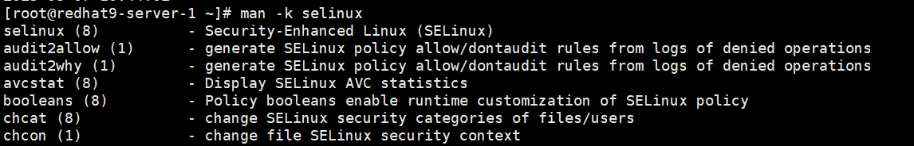 
 
các mục (1), (3), (8) trong man la cac section  
`whatis` hiển thị mô tả ngắn gọn về các trang `man` (manual) liên quan đến    
`whereis passwd `  
Chức năng: Lệnh whereis dùng để tìm đường dẫn của:  
- File thực thi (/usr/bin/passwd)
- File cấu hình liên quan
- Trang man liên quan    

Lưu đầu ra của lệnh vào một tệp. vi du: 
```
[root@redhat9-server-1 ~]# ls /home/ >> manual
[root@redhat9-server-1 ~]# cat manual 
sdasd
21321
3
anaconda-ks.cfg
file1.txt
file2.txt
manual
nghiahv
```

Một số định dạng date hữu ích    
Định dạng	|Ý nghĩa	|Ví dụ
---|---|---
%R	|Giờ:phút (HH:MM - 24h)	|15:42
%T	|Giờ:phút:giây (HH:MM:SS)	|15:42:30
%F	|Ngày theo định dạng YYYY-MM-DD	|2025-08-07
%D	|MM/DD/YY	|08/07/25
%s	|Unix timestamp (số giây từ 1970)	|1723038163
%A	|Thứ	|Thursday


Vi du: 
```date "+%F %T" > my_task.txt
[root@redhat9-server-1 ~]# cat my_task.txt 
2025-08-07 10:44:02
```
```
[root@redhat9-server-1 ~]# getenforce > my_task.txt 
[root@redhat9-server-1 ~]# cat my_task.txt 
Enforcing
```
Getenforce - Đây là một lệnh trong Linux dùng để hiển thị trạng thái hiện tại của SELinux (Security-Enhanced Linux).  
Kết quả trả về có thể là:
- Enforcing – SELinux đang bật và thực thi chính sách bảo mật
- Permissive – SELinux báo cáo lỗi nhưng không chặn
- Disabled – SELinux tắt hoàn toàn  

---
# Chapter 4. Registering Systems for Red Hat Support  
Trên Red Hat Enterprise Linux (RHEL), hai lệnh:  
`rhc connect`  
`sudo subscription-manager register `  
Dều dùng để kết nối hệ thống của bạn với Red Hat, nhưng chúng có mục tiêu và cách hoạt động khác nhau.  
`sudo subscription-manager register`  
📌 Mục đích:  
Đây là lệnh truyền thống để:  
- Đăng ký hệ thống RHEL với Red Hat Subscription Management (RHSM).
- Giúp bạn kích hoạt các kho phần mềm (repos) và nhận bản cập nhật, hỗ trợ,...  

`rhc connect`  
📌 Mục đích:  
rhc connect là lệnh mới hơn (có trong RHEL 9 trở lên), thuộc về Red Hat Connector.  
Nó không chỉ đăng ký subscription, mà còn:    
- Kết nối máy chủ của bạn tới Red Hat Hybrid Cloud Console
- Cho phép quản lý hệ thống từ web, theo dõi cập nhật, tình trạng bảo mật, v.v.
- Tự động cài đặt các công cụ như insights-client, subscription-manager, v.v.

---
# Chapter 6. Navigating the File-system Hierarchy
 

Command `cd`
Lệnh	|Mô tả
---|---
cd	|Về thư mục home hoặc đến thư mục chỉ định
cd -	|Quay lại thư mục trước đó
cd ..	|Lùi một cấp thư mục cha  

Sử dụng `rmdir` lệnh để xóa các thư mục trống hoac dung `rm -r`   
Lệnh copy `cp`  
```
cp file1 file2 file3 ... destination_directory/
cp -r dir1 dir2 /home/nghia/backup/ 
```

wildcards (ký tự đại diện)    

Ký tự	|Ý nghĩa
---|---
*|Khớp với 0 hoặc nhiều ký tự bất kỳ
?	|Khớp với một ký tự duy nhất
[ac]*	|Khớp với tên bắt đầu bằng a hoặc c

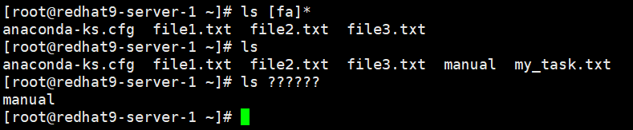 
 
 
 
Tùy chọn	|Ý nghĩa
---|---
-d	|Hiển thị chính xác tên thư mục chứ không liệt kê nội dung bên trong
-F	|Thêm ký hiệu / sau thư mục, * cho file thực thi, v.v.  

---
# Chapter 7. Managing Files from the Command Line

Mở rộng danh sách (brace expansion) (page 34/128)  
`.` và `..` trong Linux  
Ký hiệu	|Nghĩa	|Ghi chú
---|---|---
.	|Thư mục hiện tại	|Viết tắt cho "current directory"
..	|Thư mục cha (parent directory)	|Lùi một cấp thư mục

Vi du: Giả sử bạn đang ở: `/root/test/`    
Câu lệnh	|Ý nghĩa 
---|---|
ls	|Xem nội dung của /root/test/
ls .	|Cũng là xem /root/test/
ls ..	|Xem nội dung của thư mục cha → /root/
cd ..	|Di chuyển lên thư mục cha → từ /root/test/ về /root/
mkdir ../newdir	|Tạo thư mục newdir trong /root/

Vi du  
```
mkdir -p /tmp/test
cd /tmp/test/
[root@redhat9-server-1 test]# mkdir ../RHEL{8,9,10}
[root@redhat9-server-1 test]# ls /root
anaconda-ks.cfg  file1.txt  file2.txt  file3.txt  manual  my_task.txt  test
[root@redhat9-server-1 test]# ls /tmp/
dbus-L21BVYHL3N
file2.txt
RHEL10
RHEL8
RHEL9
test
```

Mở rộng dấu ngã (~) Trong shell Bash, ký tự dấu ngã ( ~) là phím tắt cho thư mục home của người dùng hiện tại. Bạn cũng có thể sử dụng dấu ngã ( ~) theo sau là tên người dùng để xác định thư mục home của người dùng được cung cấp.  

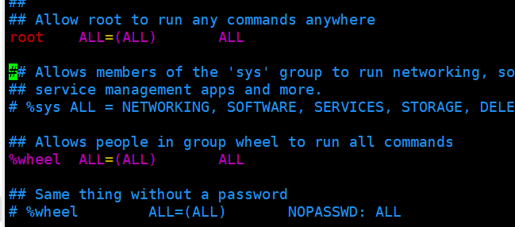   
Mở rộng biến đổi   
 
 
Thay thế lệnh. Lệnh thay thế cho phép đầu ra của một lệnh thay thế chính lệnh đó trên dòng lệnh. $(xxxx)
 
Dấu ngoặc đơn ‘ và dấu ngoặc kép “
 
Bài tập LAB: MANAGE FILES from the Command line (page 36/128)
 
 
---
# Chapter 8. Editing Text Files
Editing Text Files from the Command Line (page 38/128) 
Vim Operating Modes  
Tổ hợp phím	|Tên chế độ	|Chức năng	 
---|---|--- 
v	|Visual mode	|Chọn theo ký tự	|- Nhấn y để yank (copy) - Nhấn d để delete (cut). Nhấn p để paste
V (Shift+v)|	Visual Line mode	|Chọn nguyên dòng	x giong d
Ctrl + V	|Visual Block mode	|Chọn khối theo cột (column block)	  

De quay lai (undo) nhan phim “u”  
Muốn thêm ký hiệu # vào đầu mỗi dòng (Ctrl + V)
1.	Nhấn Ctrl + V
2.	Nhấn I (shft i) rồi gõ #, sau đó nhấn Esc  

Cau hinh vim Vim Configuration Files  
`/etc/vimrc` Cấu hình áp dụng cho tất cả người dùng  
```
set number           " Hiện số dòng
set autoindent       " Tự động thụt đầu dòng
set tabstop=4        " Số khoảng trắng cho 1 tab
set shiftwidth=4     " Số khoảng trắng khi thụt dòng
set expandtab        " Dùng dấu cách thay vì tab
syntax on            " Bật tô màu cú pháp
set cursorline       " Tô sáng dòng đang chọn
```  
Xem huong dan cua Vim la `vimtutor`  

---
# Chapter 9. Redirecting Shell Input and Output

**Standard Input, Standard Output, and Standard Error**
- Standard input (channel 0) reads input from the keyboard.
- Standard output (channel 1) sends regular system output to the terminal.
- Standard error (channel 2) sends error messages to the terminal.

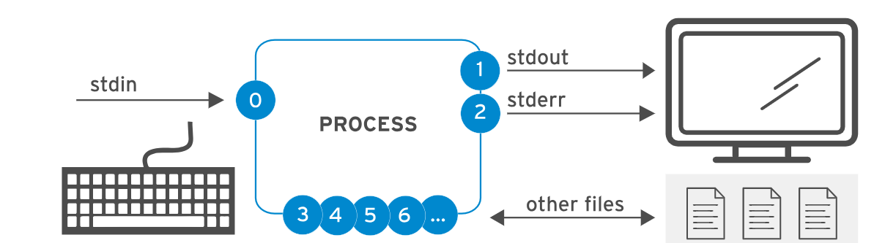

Channels (File Descriptors)  
Number	|Channel name	|Description	|Default connection	|Usage
---|---|---|---|---
0	|stdin	|Standard |input	|Keyboard	|Read only
1	|stdout	|Standard |output	|Terminal	|Write only
2	|stderr	|Standard |error	|Terminal	|Write only
3+	|filename|Other files	|None	|Read, write, or both

**Redirecting Output to a File**  

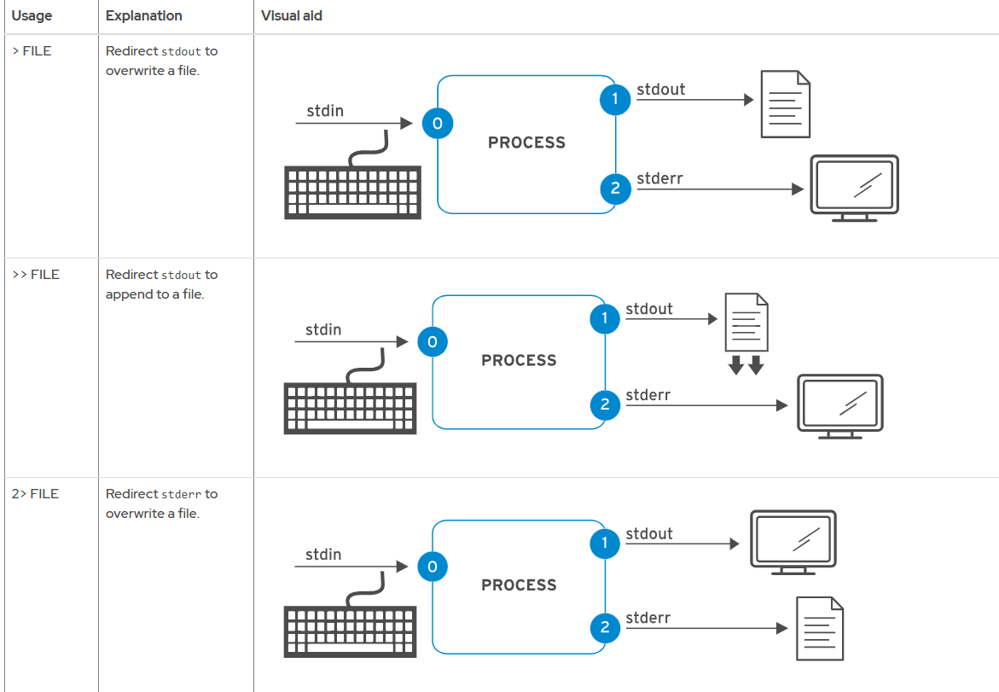
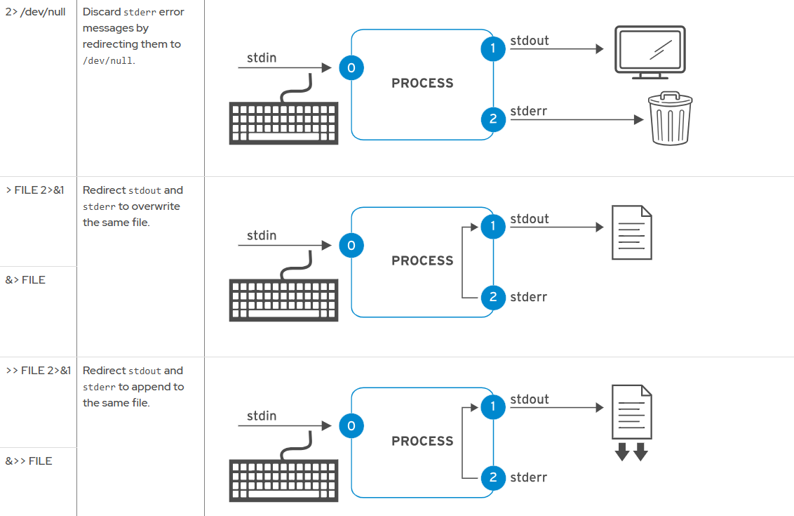

Example
```bash
# Chỉ lưu stdout:
ls /etc > out.txt
# Chỉ lưu stderr:
ls /khong_ton_tai 2> err.txt
#Ghi cả stdout và stderr chung một file:
ls /etc /khong_ton_tai > all.txt 2>&1
```

**Constructing Pipelines**  
Pipelines là một chuỗi gồm một hoặc nhiều lệnh được phân tách bằng ký tự đường ống (|). Pipelines kết nối đầu ra chuẩn của lệnh đầu tiên với đầu vào chuẩn của lệnh tiếp theo.  

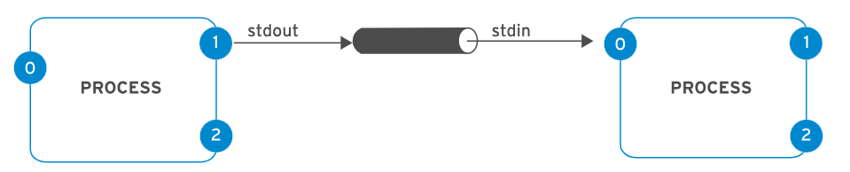

Pipeline Examples  
```
ls -l /usr/bin | less
ls -t | head -n 10 > /tmp/first-ten-changed-files
``` 
**Pipelines, Redirection, and Appending to a File**

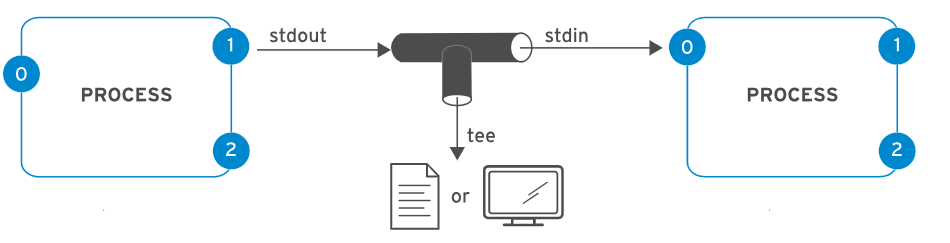

Ví dụ sau đây chuyển hướng đầu ra của lệnh ls đến tệp `/tmp/saved-output` và chuyển nó đến lệnh less để lệnh này hiển thị trên thiết bị đầu cuối từng màn hình một.
```
ls -l | tee /tmp/saved-output | less
ls -t | head -n 10 | tee /tmp/ten-last-changed-files
ls -l | tee -a /tmp/append-files
```   
Lệnh `tee` trong Linux được dùng để ghi đầu ra của một lệnh vào file đồng thời hiển thị nó ra màn hình.
 
Một số tùy chọn hữu ích của tee:
Tùy chọn	|Ý nghĩa
---|---
-a	|Append – thêm vào cuối file thay vì ghi đè
-i	| Ignore interrupt signals (bỏ qua Ctrl+C)

---
# Chapter 10. Managing Local Users and Groups
Cú pháp chung:
```
cat /etc/passwd
username:password:UID:GID:comment:home_directory:shell
```

Trường	|Giá trị cụ thể	|Ý nghĩa
---|---|---
username	|nghiahv	|Tên đăng nhập của người dùng
password	|x	|Nghĩa là mật khẩu được lưu trong file /etc/shadow (an toàn hơn)
UID	|1000	|User ID – định danh số của user. UID = 0 là root, UID ≥ 1000 là user thường
GID	|1000	|Group ID – nhóm chính của user (xem trong /etc/group)
comment	|Nghiahv	|Ghi chú hoặc tên đầy đủ người dùng (còn gọi là GECOS field)
home_directory	|/home/nghiahv	|Thư mục home khi user đăng nhập
shell	|/bin/bash	|Shell mặc định khi user đăng nhập (ở đây là Bash shell)

Trong Linux, mỗi người dùng có thể là thành viên của một nhóm chính (primary group) và nhiều nhóm bổ sung (supplementary groups)
Xem bằng command `id`  
(Primary group) gid=...  
(Supplementary groups) groups=...  

Vi du:
```
cat /etc/group | grep nghiahv
sudo:x:27:nghiahv
docker:x:998:nghiahv
```

Muốn thêm user vào nhóm bổ sung(supplementary groups): `usermod -aG groupname username`  
Đổi nhóm chính: `sudo usermod -g new_primary_group username`  
**usermod Command Options to Modify Users**  
usermod option	|Usage
---|---|
-a, --append	|Sử dụng -G để thêm các nhóm bổ sung vào nhóm thành viên hiện tại của người dùng thay vì thay thế nhóm bổ sung bằng một nhóm mới.
-c, --comment COMMENT	|Thêm COMMENTvăn bản vào bình luận.
-d, --home HOME-DIR	|Chỉ định thư mục gốc cho tài khoản người dùng.
-g, --gid GROUP	|Chỉ định nhóm chính cho tài khoản người dùng.
-G, --groups GROUPS	|Chỉ định danh sách các nhóm bổ sung được phân tách bằng dấu phẩy cho tài khoản người dùng.
-L, --lock	|Khóa tk user
-m, --move-home	|Di chuyển thư mục gốc của người dùng đến một vị trí mới
-s, --shell SHELL	|Chỉ định shell đăng nhập cụ thể cho tài khoản người dùng
-U, --unlock	|Mở khóa tài khoản người dùng.


xem một user có đang bị lock (bị khóa) hay không 
```
passwd -S nghiahv
[root@redhat9-server-1 ~]# passwd -S nghiahv
nghiahv PS 2025-08-05 0 99999 7 -1 (Password set, SHA512 crypt.)
```

Giải thích:
- L = Locked ❌ (tài khoản bị khóa)
- PS = Password set (mở khóa, bình thường) ✅
- NP = No password (chưa có mật khẩu)

Lệnh	|Tác dụng	|Cách hoạt động	|Ghi chú
---|---|---|---
usermod -L username	|🔒 Khóa user	|Thêm ! vào đầu hash mật khẩu trong /etc/shadow	|Chỉ khóa đăng nhập bằng mật khẩu
usermod -U username	|🔓 Mở khóa user	|Gỡ bỏ ! khỏi dòng hash trong /etc/shadow	|Không đặt lại mật khẩu
passwd -l username	|🔒 Khóa user	|Tương tự: thêm ! vào password hash trong /etc/shadow	|Có thể thêm !! nếu user chưa có mật khẩu
passwd -u username	|🔓 Mở khóa user	|Gỡ bỏ ! khỏi hash	|Nếu có !!, có thể không mở được

File	|Mục đích	|Ai có thể đọc	|Nội dung
---|---|---|---
/etc/shadow	|Lưu mật khẩu mã hóa và trạng thái user	|❌ Chỉ root	|Dữ liệu nhạy cảm về mật khẩu
/var/log/secure	|Ghi log các hoạt động bảo mật, xác thực	|❌ Chỉ root	|Log sudo, SSH, đăng nhập,...

Để một user thường có quyền sudo
`vi /etc/sudoers`  
 

Cách 1: Thêm user vào nhóm wheel (Cách đơn giản và an toàn nhất)  
`sudo usermod -aG wheel tên_user`  
Cách 2: Thêm trực tiếp vào `/etc/sudoers`  
`ten_user ALL=(ALL) ALL`  
Cách 3: Tạo file riêng trong `/etc/sudoers.d/`
```
echo "nghia ALL=(ALL) ALL" | sudo tee /etc/sudoers.d/nghia
sudo chmod 440 /etc/sudoers.d/nghia
```  
❗ Lưu ý quan trọng:
- Luôn dùng visudo để chỉnh sửa /etc/sudoers → tránh lỗi cú pháp khiến bạn bị khóa quyền root.
- Các file trong /etc/sudoers.d/ phải có quyền 440.
- Nếu bạn muốn không cần nhập mật khẩu khi dùng sudo, dùng cú pháp:
`nghia ALL=(ALL) NOPASSWD: ALL`    

Ví dụ trường hợp để user nghiahv có thể xem được thư mục `/root`
 
Them user nghiahv vao nhom `wheel` de user nghiahv co quyen sudo  
`usermod -aG wheel nghiahv`  
su qua user nghiahv: `su – nghiahv` (Khởi tạo môi trường đầy đủ, chuyển về `/home/nghiahv`)  
 
Vi thu muc `/root` da co quyen truy cap other --- nen user nghiahv khong the ls duoc. De ls thi dung them sudo + command
 
Trường hợp khác có thể rò rỉ thông tin
 
Người dùng root có thể sử dụng `find / -nouser -o -nogroup`. Lệnh để tìm tất cả các tệp và thư mục chưa sở hữu.  

**Managing Local Group Accounts**   

Cấu trúc của file `/etc/group`  
`group_name:x:GID:user1,user2,user3`  
- group_name: Tên nhóm
- x: Placeholder cho mật khẩu nhóm (ít khi dùng)
- GID: Group ID (mã số định danh nhóm)
- user1,user2,...: Danh sách user thuộc nhóm (thành viên phụ)
 
Tao nhom moi: `groupadd <group_name>`  
Tạo nhóm consultants có GID là 35000. : `groupadd -g 35000 consultants`

Chỉnh sửa nhóm với groupmod
Doi ten nhom: `sudo groupmod -n <new_name> <old_name>`  
Doi Gid nhom: `sudo groupmod -g <new_gid> <group_name>`  

Xoá nhóm với groupdel `sudo groupdel <group_name>`    
Xoá user khỏi nhóm phụ: 
1.	Mở file /etc/group `sudo vi /etc/group`
2.	Tìm dòng: wheel:x:10:nghiahv,admin
3.	Xoá tên user khỏi danh sách sau dấu : cuối cùng: wheel:x:10:admin  

Kiểm tra:  
Liệt kê nhóm của một user: `groups <username>`  
Kiểm tra user thuộc nhóm nào: `id <username>`  
 
Chi root moi co the dat passwd cho user
```
[sysadmin1@redhat9-server-1 ~]$ passwd sysadmin1 
passwd: Only root can specify a user name.
```  
Gan quyen (grant)  
```
[root@redhat9-server-1 ~]# useradd sysadmin1
[root@redhat9-server-1 ~]# ls /home/
nghiahv  sysadmin1
[root@redhat9-server-1 ~]# usermod -aG admin sysadmin1 
[root@redhat9-server-1 ~]# id sysadmin1 
uid=1001(sysadmin1) gid=1002(sysadmin1) groups=1002(sysadmin1),1001(admin)
[root@redhat9-server-1 ~]# tail /etc/group
admin:x:1001:sysadmin1
sysadmin1:x:
```

Qua user sysadmin1  
```
[root@redhat9-server-1 ~]# echo "%admin ALL=(ALL) ALL" > /etc/sudoers.d/admin
[root@redhat9-server-1 ~]# su - sysadmin1 
[sysadmin1@redhat9-server-1 ~]$ tail /var/log/messages 
tail: cannot open '/var/log/messages' for reading: Permission denied
[sysadmin1@servera ~]$ sudo tail /var/log/messages
[sudo] password for sysadmin1: redhat
...output omitted...
May 18 04:59:40 servera su[8080]: (to root) sysadmin1 on pts/2
May 18 04:59:40 servera systemd[1]: Starting systemd-hostnamed.service - Hostname Service...
May 18 04:59:40 servera systemd[1]: Started systemd-hostnamed.service - Hostname Service.
```

Neu user sysadmin1 khong duoc gan quyen thi se khong the thuc hien quyen sudo
 
Quản lý mật khẩu người dùng
 
Default
 
đặt thời hạn hết hạn tài khoản là 30 ngày kể từ hôm nay
```
root@host:~# date +%F  
2025-05-14
root@host:~# date -d "+30 days" +%F  
2025-06-13
root@host:~# chage -E $(date -d "+30 days" +%F) cloudadmin10  
root@host:~# chage -l cloudadmin10 | grep "Account expires"  
Account expires						: Jun 13, 2025
```  
- Sử dụng date lệnh để lấy ngày hiện tại.
- Sử dụng date lệnh để lấy ngày sau 30 ngày kể từ bây giờ.
- Sử dụng tùy chọn chage -E để thay đổi ngày hết hạn cho cloudadmin10người dùng.
- Sử dụng tùy chọn chage -l để hiển thị chính sách thời hạn mật khẩu cho người dùng cloudadmin10.
 
Cach khac de ngan nguoi dung dang nhap he thong ( khi tk do khong yeu cau)  
```
[root@redhat9-server-1 ~]# usermod -s /sbin/nologin sysadmin1
[root@redhat9-server-1 ~]# su - sysadmin1 
This account is currently not available.
```

Thiet lap user buoc phai doi mat khau sau 90 ngay
 
Khác biệt giữa Password expires và Account expires
Trường	|Ý nghĩa	|Điều gì xảy ra
---|---|---
Password expires	|Mật khẩu hết hạn sau số ngày được chỉ định bằng -M	|Người dùng bắt buộc đổi mật khẩu khi hết hạn, nhưng vẫn đăng nhập được nếu đổi
Account expires	|Tài khoản hết hạn hoàn toàn tại ngày chỉ định bằng -E	|Tài khoản bị khóa, không thể đăng nhập 

Đặt ngày hết hạn của tài khoản: `sudo chage -E YYYY-MM-DD username`  
Vi du: `chage -E 2025-11-10 operator1`  
mở khóa / kích hoạt lại tài khoản  
Cách 1: Gỡ hạn dùng (mở lại hoàn toàn): `sudo chage -E -1 username`  
Cách 2: Đặt lại ngày hết hạn trong tương lai:    `sudo chage -E 2025-12-31 sysadmin1`  
Buộc thay đổi mật khẩu khi đăng nhập lần đầu vào tài khoản operator1  
`[root@server ~]#chage -d 0 operator1`   
Dảm bảo rằng người dùng mới tạo phải thay đổi mật khẩu sau mỗi 30 ngày (KHÔNG áp dụng cho user hiện có.)  
```
vim /etc/login.defs
PASS_MAX_DAYS   30
```

---
# Chapter 11.  Controlling Access to Files
11.1 Interpreting Linux File Permissions  
Quyền đối với Tệp và Thư mục   
Permission	|Tác động đến các tập tin	|Tác động đến các thư mục
---|---|---
r(đọc)	|Có thể đọc được nội dung tập tin.	|Nội dung của thư mục (tên tệp) có thể được liệt kê.
w(viết)	|Nội dung tập tin có thể thay đổi được.	|Có thể tạo hoặc xóa bất kỳ tập tin nào trong thư mục.
x(thực hiện)	|Các tập tin có thể được thực thi dưới dạng lệnh.	|Thư mục này có thể trở thành thư mục làm việc hiện tại.  có thể chạy cd lệnh để chuyển đến thư mục này, nhưng cũng cần có quyền đọc để liệt kê các tệp ở đó.  

Ký tự đầu tiên của danh sách dài là loại tệp:  
- `-` là một tập tin thông thường.
- d là một thư mục.
- l là một liên kết tượng trưng.
- c là một tập tin thiết bị ký tự.
- b là một tập tin thiết bị khối.
- p là một tệp đường ống có tên.
- s là một tệp socket cục bộ.

11.2 Managing File Permissions from the Command Line  
Lớp người dùng  
Who	|User class	|Description
---|---|---|
u	|user	|The file owner.
g	|group	|Member of the file's group.
o	|other	|Users who are not the file owner nor members of the file's group.
a	|all	|All three previous groups.

toán tử sửa đổi các quyền
Which|	Hoạt động	|Miêu tả
---|---|---
`+`	|thêm vào	|Thêm quyền vào tệp.
`-`	|xoa	|Xóa quyền đối với tệp.
=	|đặt chính xác	|Đặt chính xác các quyền được cung cấp cho t
Vi du:
```
user@host:~$ chmod go-rw document.pdf
user@host:~$ chmod a+x myscript.sh
user@host:~$ chmod -R g+rwx /home/user/myfolder

```
Phương pháp Octal


```
user@host:~$ chmod 644 sample.txt
user@host:~$ chmod 750 sampledir

```
Thay đổi quyền sở hữu của người dùng hoặc nhóm tệp và thư mục
```
# đổi quyền sở hữu cho user student
root@host:~# chown student app.conf
# toàn bộ cây thư mục
root@host:~# chown -R student Pictures
#đổi quyền sở hữu nhóm cho admin
root@host:~# chown :admins Pictures
# đổi chủ sở hữu và nhóm
root@host:~# chown visitor:guests Pictures

``` 
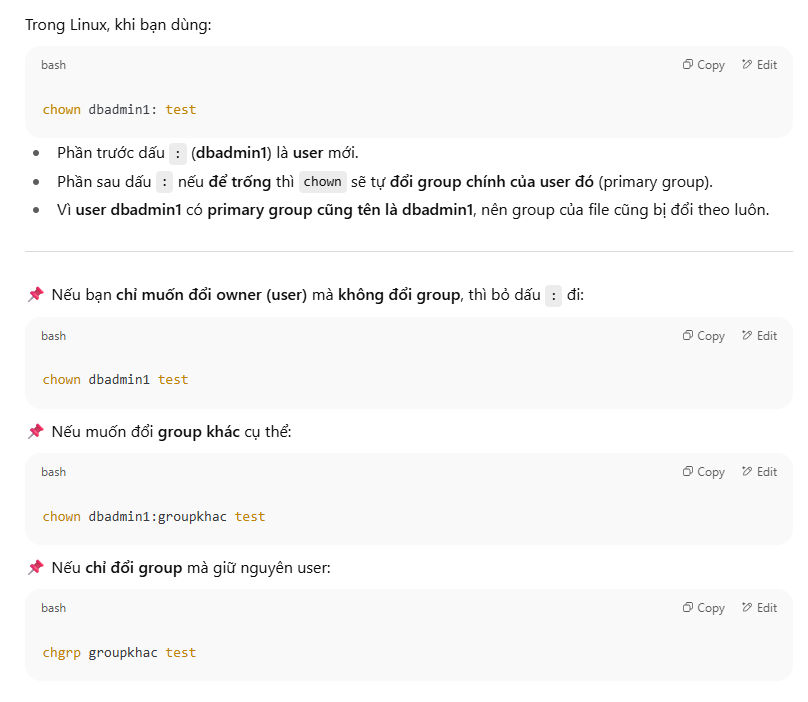

11.5 Managing Default Permissions and Special Permissions  

Bit đặc biệt	|Ký hiệu	|Giá trị số	|Áp dụng cho	|Tác dụng	|Ví dụ dùng
---|---|---|---|---|---
Sticky bit	|t	|1	|Thư mục|	Chỉ owner file, owner thư mục, hoặc root mới được xóa/đổi tên file. Ngăn user xóa file của nhau trong thư mục chung.	|/tmp → chmod +t /tmp
Setgid	|g+s	|2|	Thư mục	|File/thư mục mới tạo bên trong sẽ tự động thừa hưởng group của thư mục cha. Giữ file trong cùng một group để cộng tác.	|Thư mục dự án chung: chmod 2770 /project, chmod g+s hoặc chmod 2xxx

Khác nhau giữa +t và o+t
- +t → thêm sticky bit cho mọi người (owner, group, others)
- o+t → về lý thuyết là chỉ thêm sticky bit cho others

Nhưng thực tế sticky bit không phân biệt user/group/others → nó áp dụng cho cả thư mục luôn.
📌 Tóm tắt dễ nhớ:
- Sticky = "Bảo vệ file của tôi trong thư mục chung" 🛡️
- Setgid = "Tất cả file ở đây phải chung một group" 🤝


Default Permissions
Type	|Initial Octal Method	|Initial Symbolic Method
---|---|---
File	|0666	|-rw-rw-
Directory	|0777	|rwxrwxrwx

Examples of umask Settings
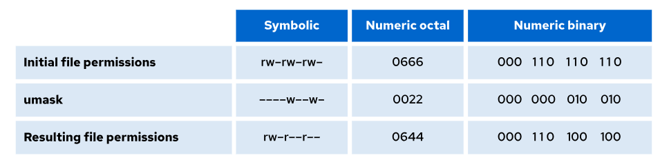
```
user@host:~$ umask
0022
user@host:~$ touch default.txt
user@host:~$ ls -l default.txt
-rw-r--r--. 1 user user 0 May 29 22:11 default.txt
# đổi umask
umask 0027
```

Cấu trúc permission (khi ls -l)

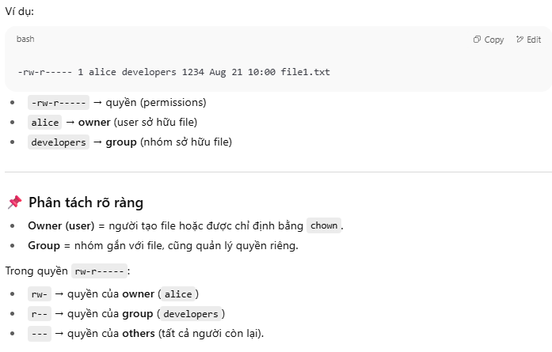

Quyền user (owner) và group là hai phạm vi khác nhau, và hệ thống sẽ ưu tiên theo thứ tự khi xác định quyền:
- (1) Nếu user là owner của file → áp dụng quyền của user.
- (2) Nếu user không phải owner nhưng thuộc group của file → áp dụng quyền của group.
- (3) Nếu không rơi vào 2 trường hợp trên → áp dụng quyền của others.

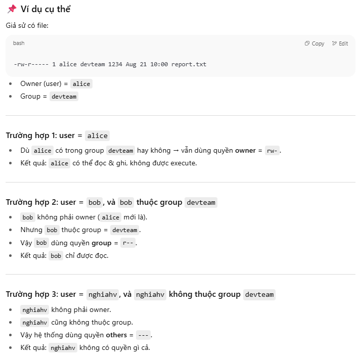

---
# Chapter 12.  Installing and Updating Software with RPM
12.1 Investigating RPM Software Packages  
Thành phần:   
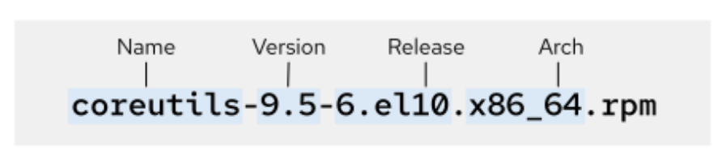  
Thao tac  
```
# Cài đặt package bằng rpm
rpm -ivh podman-5.4.0-1.el10.x86_64.rpm

# Gỡ package
rpm -e podman-5.4.0-1.el10.x86_64.rpm

```
12.3 Installing and Updating Packages with DNF

- BaseOS: chứa các gói thành phần cốt lõi của hệ thống (bash, systemd, dnf, v.v) và được quản lý chặt chẽ bởi Red Hat
- Application Stream Repo: chứa các gói ứng dụng, ngôn ngữ lập trình, runtime, v.v  
Summary of DNF   

Command:	|Task:
---|---
dnf list [NAME-PATTERN]	|Liệt kê các gói đã cài đặt và có sẵn theo tên.
dnf group list	|Liệt kê các nhóm đã cài đặt và có sẵn.
dnf search KEYWORD	|Hiển thị thông tin chi tiết của một gói hàng.
dnf info PACKAGENAME	|Show details of a package.
dnf install PACKAGENAME	|Cài đặt gói.
dnf group install GROUPNAME	|Cài đặt nhóm gói.
dnf update	|Cập nhật tất cả các gói.
dnf remove PACKAGENAME	|Xóa một gói hàng.
dnf history	| Hiển thị lịch sử giao dịch.

Vi du
```
dnf install httpd
dnf info httpd
dnf repolist all
```

---
# Chapter 13.  Installing and Updating Applications by Using Flatpak

Flatpak là một công nghệ đóng gói và phân phối ứng dụng cô lập (sandbox), dùng chung runtime.

Flatpak là gì?
- Flatpak là hệ thống đóng gói ứng dụng đa nền tảng cho Linux.
- Giúp ứng dụng chạy ổn định trên nhiều bản phân phối mà không lo xung đột thư viện.
- Ứng dụng Flatpak chạy trong môi trường sandbox (cô lập), chỉ truy cập tài nguyên được cấp phép.

🧱 Flatpak Runtime
- Runtime là tập hợp thư viện hệ thống dùng chung cho nhiều ứng dụng.
- Giúp tiết kiệm dung lượng và dễ cập nhật bảo mật.
- Ứng dụng có thể dùng runtime + thư viện riêng nếu cần.

🌐 Kho ứng dụng Flatpak (Remote Repositories)
Kho	|Mô 
---|---
Red Hat Ecosystem Catalog	|Kho mặc định cho RHEL 10
Flathub	|Kho bên thứ ba lớn nhất: https://flathub.org
Fedora Flatpak Repo	|Kho riêng của Fedora
⚠️ Red Hat không hỗ trợ ứng dụng từ kho bên thứ ba.

🛠️ Cài đặt và thiết lập ban đầu
🔧 Cài Flatpak (nếu chưa có)

`sudo dnf install flatpak`
🔍 Kiểm tra phiên bản  
`flatpak --version`
Ví dụ: Flatpak 1.16.0

🔐 Đăng nhập kho Red Hat
Để truy cập kho Flatpak của Red Hat, cần đăng nhập bằng tài khoản Customer Portal:
`podman login registry.redhat.io`
Nhập username và password → Login Succeeded!


lệnh Flatpak cơ bản  
Lệnh	|Chức năng
---|---
flatpak install <remote> <app>	|Cài ứng dụng từ kho
flatpak list	|Liệt kê ứng dụng đã cài
flatpak update	|Cập nhật ứng dụng
flatpak remote-add	|Thêm kho ứng dụng mới
flatpak uninstall <app>	|Gỡ ứng dụng

---
# Chapter 14.  Accessing Removable Media
14.1 Identifying File Systems and Block Devices  
Khái niệm phân vùng đĩa  
Phân vùng: Chia ổ đĩa thành nhiều phần để lưu dữ liệu khác nhau (ví dụ: /home, dữ liệu hệ thống, nhật ký).

Mỗi phân vùng là một thiết bị khối riêng, có tên như:

SATA/SCSI: /dev/sda1, /dev/sda2, /dev/sdc3

Thiết bị ảo: /dev/vda1, /dev/vdb2

NVMe: /dev/nvme0n1p1, /dev/nvme1n1p3

MMC/SD: /dev/mmcblk0p1

Loại file của phân vùng là `b` (block device).

Quản lý bằng LVM (Logical Volume Manager)
Gom nhiều thiết bị khối vào volume group → chia ra logical volume (giống phân vùng).

Tên thiết bị: /dev/<volume_group>/<logical_volume> (ví dụ: /dev/myvg/mylv)

Có thể có link tượng trưng trong /dev/mapper.

Kiểm tra dung lượng & hệ thống tệp  
df: Hiển thị tổng dung lượng, đã dùng, còn trống, % sử dụng.

- df (mặc định theo KiB)

- df -h (đơn vị 2^10: KiB, MiB, GiB)

- df -H (đơn vị SI: KB, MB, GB)

du: Xem dung lượng thư mục/tệp.

- du /path (theo byte)

- du -h /path (đơn vị dễ đọc)

- Đệ quy hiển thị toàn bộ thư mục con.

---
# Chapter 15.  Monitoring and Managing Linux 
MỘT process là một phiên bản đang chạy của một chương trình (program) thực thi đã được khởi chạy. Từ thời điểm một tiến trình được tạo, nó bao gồm các mục sau:


Linux Process States
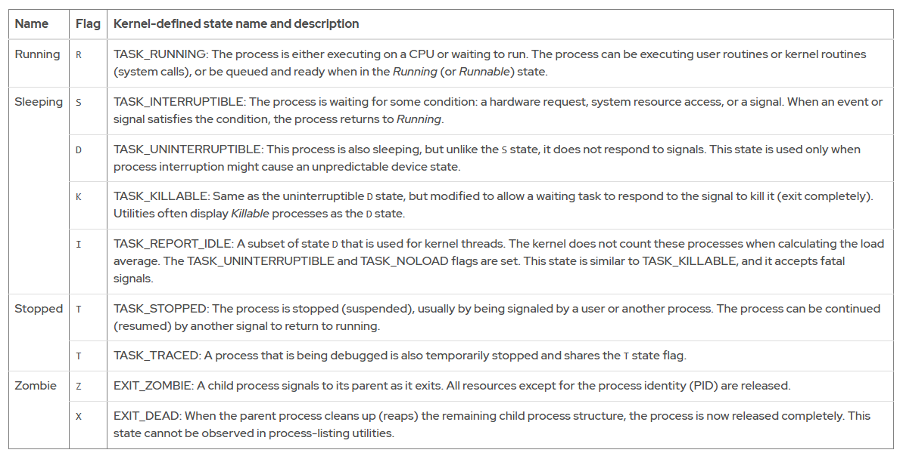

Lệnh thường dùng ps `aux` hiển thị tất cả các tiến trình, bao gồm cả các tiến trình không có terminal điều khiển.

Sử dụng lệnh `ps` để liệt kê các tiến trình  
- Foreground - tiến trình đang chạy trên 

- Background - tiến trình chạy 
- Monitoring
  - Load average (tải trung bình)
    - Đo tải hệ thống trong khoảng thời gian nhất định (thu thập mỗi 5s).
    - Là trung bình số lượng tiến trình đang chờ được hoàn thành trước khi thực hiện thao tác tiếp theo (có thể chờ CPU, I/O disk, v.v).
    - Lệnh kiểm tra:  
      ```bash
      uptime
      ```
      Ví dụ:
      ```
      15:29:03 up 14 min,  2 users,  load average: 2.92, 4.48, 5.20
      ```
      - 3 giá trị tải: trung bình trong **1 phút**, **5 phút**, **15 phút** trước.
  - Xác định nguyên nhân CPU bottleneck
    - Nếu nghi do CPU → tính tải trung bình trên mỗi CPU.
    - Xem số lượng CPU:  
      ```bash
      lscpu
      ```
      Ví dụ:
      ```
      CPU(s): 4
      Thread(s) per core: 2
      Core(s) per socket: 2
      ```
      → 4 CPU logic.
    - Công thức:
      ```
      per-CPU load = load average / số CPU logic
      ```
      Ví dụ:
      ```
      load average: 2.92, 4.48, 5.20
      chia cho 4 → 0.73, 1.12, 1.30
      ```
      - 1 phút: CPU sử dụng ~73%.
      - 5 phút: quá tải ~12%.
      - 15 phút: quá tải ~30%.
  - Monitor real-time
    - Lệnh:
      ```bash
      top
      ```

---
# Chapter 16.  Controlling Services and Daemons
⚙️ systemd – Trình quản lý khởi động
systemd là tiến trình đầu tiên chạy khi hệ thống khởi động (PID 1).

Quản lý việc khởi động, dừng, và giám sát các dịch vụ hệ thống.

🔄 Các tính năng chính của systemd:
Khởi động song song nhiều dịch vụ → tăng tốc độ boot.

Kích hoạt theo yêu cầu: dịch vụ chỉ khởi động khi cần.

Quản lý phụ thuộc dịch vụ: ví dụ, dịch vụ mạng chỉ khởi động khi mạng đã sẵn sàng.

Theo dõi tiến trình theo nhóm bằng control groups (cgroups).

🧩 Đơn vị (Unit) trong systemd
Mỗi unit là một đối tượng mà systemd có thể quản lý.

Được định nghĩa bằng file cấu hình có phần mở rộng tương ứng.

📦 Các loại unit phổ biến:
Loại Unit	|Phần mở rộng	|Mô 
---|---|---
Service unit	|.service|	Đại diện cho dịch vụ hệ thống (ví dụ: httpd.service)
Socket unit	|.socket	|Theo dõi socket IPC, khởi động dịch vụ khi có kết nối
Path unit	|.path	|Kích hoạt dịch vụ khi có thay đổi trong hệ thống tập tin

📋 Liệt kê các dịch vụ đang hoạt   
Dùng lệnh systemctl để kiểm tra trạng thái dịch vụ:
`systemctl list-units --type=service`  
🧾 Giải thích các cột trong kết quả:
Cột	|Ý nghĩa
---|---
UNIT	|Tên đơn vị dịch vụ
LOAD	|Đã được systemd nạp vào bộ nhớ chưa
ACTIVE	|Trạng thái kích hoạt cấp cao
SUB	|Trạng thái chi tiết cấp thấp
DESCRIPTION	|Mô tả ngắn gọn về dịch vụ

- Dùng `systemctl list-units --all` để liệt kê tất cả dịch vụ, kể cả chưa kích hoạt.
- Dùng `--state=` để lọc theo trạng thái như active, inactive, failed, v.v.

Masking dịch vụ – Ngăn khởi động ngoài ý muốn  
✅ Mục đích  
Ngăn admin hoặc hệ thống vô tình khởi động một dịch vụ có thể gây xung đột (ví dụ: sendmail vs postfix).

Masking là cách vô hiệu hóa hoàn toàn dịch vụ, kể cả khi dùng lệnh start.

🔧 Cách thực hiện

`systemctl mask sendmail.service`
Lệnh này tạo một liên kết tượng trưng (symlink) từ file cấu hình dịch vụ đến /dev/null.

Sau khi mask, nếu bạn cố gắng khởi động dịch vụ:

`systemctl start sendmail.service`
→ sẽ nhận lỗi: Unit is masked.

🔓 Unmasking – Khôi phục khả năng khởi động
`systemctl unmask sendmail.service`
Xóa liên kết /dev/null, cho phép dịch vụ có thể được khởi động lại.

🚀 Enable / Disable dịch vụ khi khởi động hệ thống
Enable: cho phép dịch vụ tự động chạy khi hệ thống khởi động.

Disable: ngăn dịch vụ tự động chạy khi boot.
```
systemctl enable sshd.service
systemctl disable sshd.service
```
⚠️ Các lệnh này chỉ ảnh hưởng lần khởi động tiếp theo, không thay đổi trạng thái hiện tại.

⏱️ Thực hiện ngay lập tức với --now
Nếu bạn muốn enable/disable và đồng thời start/stop dịch vụ ngay:
```
systemctl enable --now sshd.service
systemctl disable --now sshd.service
```

---
# Chapter 17.  Introduction to Networking

Mô hình mạng TCP/IP  
TCP/IP gồm 4 tầng giúp truyền dữ liệu giữa các máy tính qua mạng:  
Tầng TCP/IP	|Chức năng chính	|Ví dụ giao thức
---|---|---|
Application	|Giao tiếp giữa ứng dụng	|SSH, HTTPS, FTP, SMTP
Transport	|Truyền dữ liệu giữa máy	|TCP (đảm bảo), UDP (nhanh, không đảm bảo)
Internet	|Định tuyến qua mạng	|IPv4, IPv6
Link	|Kết nối vật lý	|Ethernet (802.3), Wi-Fi (802.11)
Khái niệm quan trọng  
- Socket = IP + Port → xác định điểm gửi/nhận dữ liệu.

- TCP: kết nối ổn định, đảm bảo thứ tự và độ tin cậy.

- UDP: không kết nối, nhanh nhưng dễ mất gói.

- MAC Address: địa chỉ phần cứng của thiết bị mạng.

- Prefix mạng: ví dụ 192.168.3.19/24 → xác định mạng con.

- Router: chuyển tiếp dữ liệu giữa các mạng khác nhau.
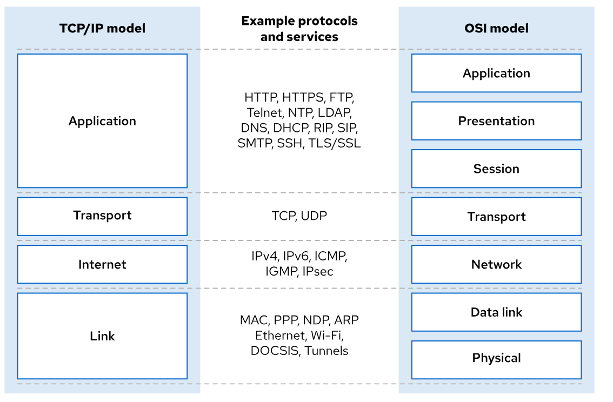
IPv4 Subnets  
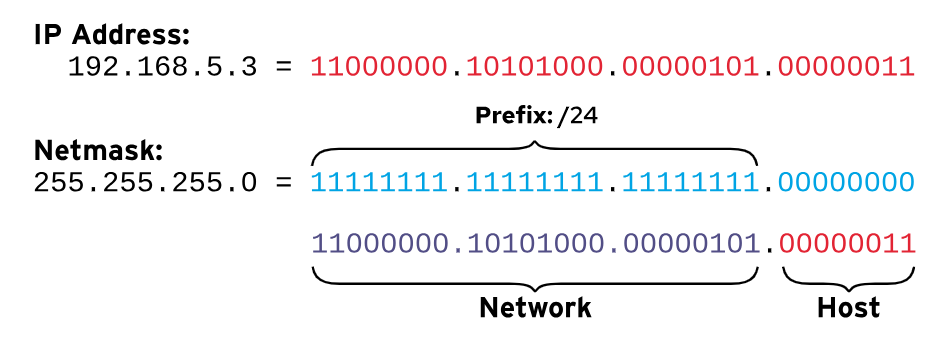

Các network address đối với một mạng con là địa chỉ thấp nhất có thể trên một mạng con, trong đó mã định danh máy chủ là toàn bộ số không nhị phân.

Các broadcast address đối với một mạng con là địa chỉ cao nhất có thể trên một mạng con, trong đó mã định danh máy chủ đều là số nhị phân và là địa chỉ đặc biệt để phát các gói tin đến tất cả các máy chủ mạng con.

Các gateway addresses Đối với một mạng con, có thể là bất kỳ mã định danh máy chủ duy nhất nào trong mạng con đó, nhưng thường được đặt thành địa chỉ máy chủ khả dụng đầu tiên. Quy ước đánh số cổng này không bắt buộc, và các mạng con không cần giao tiếp bên ngoài sẽ không thiết lập cổng mạng.  
Example Network Calculations  
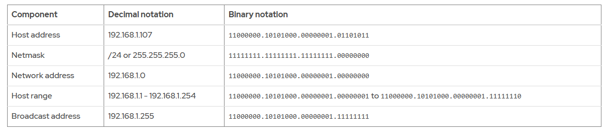
Khái niệm định tuyến IPv4  
Routing là quá trình xác định đường đi của gói tin từ host đến đích qua mạng.

Mỗi host có một bảng định tuyến (routing table) để quyết định gửi gói tin qua giao diện mạng nào.  
Cấu trúc bảng định tuyến  
Mỗi dòng trong bảng định tuyến gồm:
Thành phần	|Mô tả
---|---
Destination	|Mạng đích (ví dụ: 192.168.1.0/24)
Gateway	|IP của router trung gian
Interface	|Giao diện mạng để gửi gói tin
Metric	|Độ ưu tiên (prefix dài hơn → ưu tiên hơn)

Nguyên tắc định tuyến  
- Nếu có nhiều tuyến phù hợp, host chọn tuyến có prefix dài nhất (cụ thể nhất).  
- Nếu không có tuyến cụ thể, host dùng default route (0.0.0.0/0) → gửi đến default gateway.
- Default gateway phải nằm trong cùng subnet với host.

🔁 Router hoạt động như thế nào?
- Router có ít nhất 2 giao diện mạng.
- Khi nhận gói tin không phải gửi cho chính nó, router:
  - Tra bảng định tuyến.
  - Gửi gói tin đến host đích nếu nằm trong subnet trực tiếp.
  - Hoặc chuyển tiếp đến router tiếp theo.

➡️ Quá trình này lặp lại cho đến khi gói tin đến đúng đích.
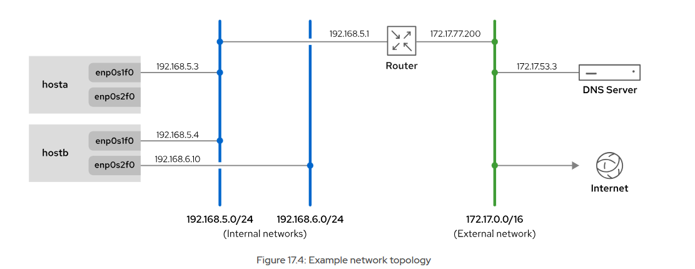
```
# có thể sd ipcalc để tính các địa chỉ cần thiết
user@host:~$ ipcalc 10.1.1.18/8
Address:	10.1.1.18
Network:	10.0.0.0/8
Netmask:	255.0.0.0 = 8
Broadcast:	10.255.255.255
``` 
Address space:	Private Use
HostMin:	10.0.0.1
HostMax:	10.255.255.254
Hosts/Net:	16777214

IPv6 Networking
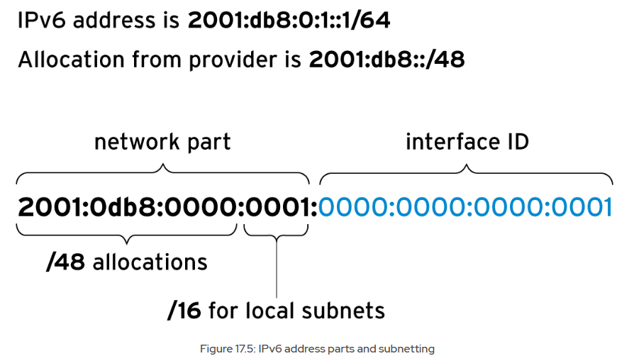
Tại sao cần IPv6  
- IPv6 ra đời để giải quyết vấn đề cạn kiệt địa chỉ IPv4.
- Được sử dụng rộng rãi bởi nhà cung cấp dịch vụ Internet (ISP), mạng doanh nghiệp, và thiết bị di động.
- Hỗ trợ chế độ dual-stack: thiết bị có thể dùng cả địa chỉ IPv4 và IPv6 cùng lúc.

🔢 Định dạng địa chỉ IPv6  
Địa chỉ IPv6 có 128 bit, được viết thành 8 nhóm, mỗi nhóm gồm 4 chữ số hệ 16, phân cách bằng dấu hai chấm :.

Ví dụ:

`2001:0db8:0000:0010:0000:0000:0000:0001`  
✂️ Quy tắc rút gọn địa chỉ
Quy tắc	|Ví dụ
---|---
Bỏ số 0 ở đầu mỗi nhóm	|0010 → 10
Dùng :: để thay thế nhiều nhóm 0000 liên tiếp	|2001:db8:0:10::1
Chỉ dùng :: một lần trong địa chỉ	|Tránh gây nhầm lẫn
Dùng chữ thường cho ký tự hệ 16	|A → a
Khi thêm cổng TCP/UDP, dùng dấu ngoặc vuông	|[2001:db8:0:10::1]:80  

⚠️ Không nên dùng :: cho một nhóm 0000 duy nhất — hãy dùng :0: thay thế.

🧩 Chia subnet trong IPv6
Địa chỉ IPv6 gồm hai phần:

Network Prefix (tiền tố mạng, thường là /64)

Interface ID (ID giao diện, phần còn lại)

📐 Các độ dài tiền tố phổ biến
Loại cấp phát	|Tiền tố	Ý nghĩa
---|---
ISP cấp cho tổ chức|	/48	Cho phép tạo 65.536 subnet
Subnet tiêu chuẩn	|/64	Hỗ trợ tới 2⁶⁴ thiết bị  
Ví dụ: Với tiền tố /48, bạn có 16 bit để chia subnet → 2¹⁶ = 65.536 subnet.

Cấu hình 
```
# xác định các interface trong hệ thống
ip link show

# kiểm tra hiệu suất của interface
user@host:~$ ip -s link show ens3
2: ens3: <BROADCAST,MULTICAST,UP,LOWER_UP> mtu 1500 qdisc fq_codel state UP ...
    link/ether 52:54:00:00:fa:0a brd ff:ff:ff:ff:ff:ff
    RX:  bytes packets errors dropped  missed   mcast
      10398126   75186      0       3       0       0
    TX:  bytes packets errors dropped carrier collsns
      22214542   68283      0       0       0       0
    altname enp0s3
    altname enx52540000fa0a

# ktra kết nối giữa 2 host
ping -c 3 192.0.2.254

# có thể chỉ định truyền bằng interface nào, truyền bn gói
ping6 -c 1 fe80::f482:dbff:fe25:6a9f%ens4
```
Để trace đường đi của một remote host đến hệ thống hiện tại, sd lệnh traceroute hoặc tracepath (2 lệnh này đều gửi gói tin UDP để tracing)

Có thể đổi sang dùng ICMP (-I) hoặc TCP (-T) bằng cách thêm option khi sd traceroute
```
user@host:~$ tracepath access.redhat.com
...output omitted...
 4:  71-32-28-145.rcmt.qwest.net                          48.853ms asymm  5
 5:  dcp-brdr-04.inet.qwest.net                          100.732ms asymm  7
 6:  206.111.0.153.ptr.us.xo.net                          96.245ms asymm  7
 7:  207.88.14.162.ptr.us.xo.net                          85.270ms asymm  8
 8:  ae1d0.cir1.atlanta6-ga.us.xo.net                     64.160ms asymm  7
 9:  216.156.108.98.ptr.us.xo.net                        108.652ms
10:  bu-ether13.atlngamq46w-bcr00.tbone.rr.com           107.286ms asymm 12
...output omitted...

# với Ipv6, dùng tracepath6
tracepath6 2001:db8:0:2::451

# một lệnh khác là mtr cũng giúp trace đường đi đến 1 host
user@host:~$ mtr -r -c 5 access.redhat.com
Start: 2025-05-29T22:41:52+0000
HOST: servera                     Loss%   Snt   Last   Avg  Best  Wrst StDev
  1.|-- classroom.lab.example.com  0.0%     5    0.4   0.4   0.3   0.5   0.1
  2.|-- 72.32.49.3                 0.0%     5    1.0   1.3   0.9   2.3   0.6
  3.|-- 72.32.28.27                0.0%     5    1.3   1.5   1.3   1.7   0.2
  4.|-- aggr172b-54-cored.dfw3.ra  0.0%     5    1.0   1.0   0.8   1.0   0.1
  5.|-- dcpe3-cored.dfw3.rackspac  0.0%     5    1.9   2.1   1.9   2.5   0.2
  6.|-- 10.25.1.101                0.0%     5    2.0   2.0   2.0   2.1   0.1
  7.|-- equinix-dfw2.netarch.akam  0.0%     5   15.8  15.9   6.3  27.9   9.0
...output omitted...
```

---
# Chapter 18.  Managing Network Configuration

Quản lý mạng bằng dòng lệnh với `nmcli`
🛠️ NetworkManager
- Dịch vụ quản lý mạng trên RHEL (Red Hat Enterprise Linux).

- Quản lý thiết bị mạng (device) và kết nối mạng (connection).

- Cấu hình lưu tại: `/etc/NetworkManager/system-connections/`

- Từ RHEL 10 trở đi: không còn dùng thư mục /etc/sysconfig/network-scripts/ hay file ifcfg-*.

📋 Thiết bị vs Kết nối
Khái niệm|	Mô tả
---|---
Device	|Giao diện mạng vật lý hoặc ảo (ví dụ: ens3, enp8s0)
Connection	|Hồ sơ cấu hình cho thiết bị mạng (có thể nhiều hồ sơ cho 1 thiết bị, nhưng chỉ 1 kết nối hoạt động tại một thời điểm)

🔍 Xem thông tin  mạng  
`nmcli dev status`  
➡️ Hiển thị trạng thái thiết bị mạng.
```
nmcli con show
nmcli con show --
nmcli con show --active
```

➡️ Hiển thị danh sách kết nối (tất cả hoặc chỉ kết nối đang hoạt động).

➕ Thêm kết nối mạng  
`nmcli con add type ethernet ifname enp8s0`
➡️ Tạo kết nối mới cho thiết bị enp8s0. File cấu hình sẽ được lưu với đuôi .nmconnection.  

Đổi hostname
```
# tạm thời
root@host:~# hostname
host.example.com
root@host:~# hostname web1.example.com
root@host:~# hostname
web1.example.com

#vĩnh viễn
root@host:~# hostnamectl hostname
host.example.com
root@host:~# hostnamectl hostname db1.example.com
root@host:~# hostnamectl hostname
db1.example.com
```
Or use `nmtui` -> edit hostname

Phân giải tên các host  
Cấu hình nằm ở file `/etc/hosts` hoặc `/etc/resolv.conf`
```
# sd lệnh host/ dig để phân giải hostname
dig servera.lab.example.com

host servera.lab.example.com
```
---
# Chapter 19.  Configuring and Securing SSH
🔐 SSH Host Keys   
Khi client kết nối SSH đến server, server gửi public key để xác thực danh tính.

Client kiểm tra key này với bản lưu trong `~/.ssh/known_hosts` hoặc `/etc/ssh/ssh_known_hosts`.

Nếu key không khớp, SSH sẽ cảnh báo nguy cơ man-in-the-middle attack và từ chối kết nối.

SSH bằng Private Key – Bảo mật & Tiện lợi  
Tạo cặp khóa trên máy khách  
`ssh-keygen -t ed25519 -C "ghi chú nếu cần"`
Tạo ra 2 file:

~/.ssh/id_ed25519 → private key  
~/.ssh/id_ed25519.pub → public key

Cài đặt trên máy chủ
Copy public key sang máy chủ:

`ssh-copy-id -i ~/.ssh/id_ed25519.pub user@server`
Hoặc thủ công:

`cat` ~/.ssh/id_ed25519.pub >> ~/.ssh/authorized_keys`  
Đảm bảo file ~/.ssh/authorized_keys trên máy chủ có quyền:

chmod 600 ~/.ssh/authorized_keys
Bảo vệ private key
Trên máy khách, đảm bảo private key có quyền:

chmod 600 ~/.ssh/id_ed25519

⚙️ Quản lý cấu hình SSH  
Trên máy chủ:  
File cấu hình: `/etc/ssh/sshd_config`

Ví dụ cấu hình:
```
PermitRootLogin no
PasswordAuthentication no
PubkeyAuthentication yes
```
Sau khi chỉnh sửa:
`sudo systemctl reload ssh`  
Trên máy khách:
File: `~/.ssh/config`

Ví dụ:
```
Host myserver
    HostName 192.168.1.100
    User nghia
    IdentityFile ~/.ssh/id_ed25519
```
