# CHAPTER 1 : Lab: Improve Command-line Productivity
PAGE 10/112

Tạo một tập lệnh Bash có thể lọc và lấy thông tin liên quan từ các máy chủ khác nhau.

Kết quả
- Tạo một tập lệnh Bash và chuyển hướng đầu ra của nó vào một tệp.
- Sử dụng vòng lặp để đơn giản hóa mã của bạn.
- Lọc nội dung liên quan bằng cách sử dụng grep và biểu thức chính quy.

1. Tạo tệp lệnh thực thi `/home/student/bin/bash-lab` trên máy `workstation` . Nội dung ban đầu trong lệnh phải sử dụng chỉ thị thông dịch shebang.

Kiểm tra Bash shell nằm ở đâu bằng lệnh `which` hoặc `type`
```
[root@redhat9-server-1 ~]# which bash
/usr/bin/bash
[root@redhat9-server-1 ~]# type -a bash
bash is /usr/bin/bash

```
On the workstation machine, create the `/home/student/bin/` directory if needed.
```
[student@workstation ~]$ mkdir -p /home/student/bin
```
Use the vim command to create and edit the /home/student/bin/bash-lab script file.
```
[student@workstation ~]$ vim ~/bin/bash-lab
```
Insert the following text and save the file.
```
#!/usr/bin/bash
```
Make your script file executable.
```
[student@workstation ~]$ chmod a+x ~/bin/bash-lab
```
So sánh `chmod a+x` & `chmod +x`
| Lệnh | Ai được quyền thự thi?  |
| --- | --- |
| `chmod +x file`  | Thường là owner, có thể nhóm/others tùy umask |
| `chmod a+x file` | Owner, nhóm và mọi người khác **chắc chắn**   |


2. Chỉnh sửa tệp script mới tạo của bạn để lưu trữ *thông tin sau* từ máy `servera` và `serverb` trên `workstation`. Hệ thống sử dụng khóa SSH để xác thực, do đó bạn không cần mật khẩu. Lưu trữ kết quả đầu ra của các lệnh được liệt kê từ bảng sau vào các tệp `/home/student/output-`servera`` và `/home/student/output-`serverb`` tương ứng trên `workstation`. Sử dụng dấu thăng (#) để phân biệt kết quả đầu ra của các lệnh liên tiếp trong tệp đầu ra.

Command or file	| Content requested | Muc tieu
---|---|---
hostname -f | Lưu trữ toàn bộ đầu ra| tên đầy đủ của host (hostname)
echo "#####"| Thêm dấu thăng để phân biệt lệnh sau
lscpu| Chỉ lấy các dòng bắt đầu bằng chuỗi CPU| Lấy thông tin CPU  
echo "#####" | Thêm dấu thăng để phân biệt lệnh sau.
/etc/selinux/config | Bỏ qua các dòng trống. Ngoài ra, bỏ qua các dòng bắt đầu bằng ký tự #. | Kiểm tra cấu hình SELinux
echo "#####" | Thêm dấu thăng để phân biệt lệnh sau.  
/var/log/secure | Lấy tất cả các mục "Mật khẩu không hợp lệ". | Kiểm tra log thất bại đăng nhập
echo "#####" |Thêm dấu thăng để phân biệt lệnh sau.

Lưu thông tin cần thiết vào các tệp `output-`servera`` và `output-`serverb`` trong thư mục `/home/student` trên máy workstation.

Note: Bạn có thể sử dụng lệnh sudo mà không cần mật khẩu trên máy chủ `servera` và `serverb`. Hãy nhớ sử dụng vòng lặp để đơn giản hóa tập lệnh của bạn. Bạn cũng có thể sử dụng nhiều lệnh grep được nối với nhau bằng cách sử dụng ký tự ống (|).

2.1 Use the vim command to open and edit the /home/student/bin/bash-lab script file.

```
[student@workstation ~]$ vim ~/bin/bash-lab
```
2.2 Thêm các dòng sau vào tệp script /home/student/bin/bash-lab. Số lượng dấu thăng là tùy ý.

```
#!/usr/bin/bash
USR='student'
OUT='/home/student/output'
#
for SRV in `servera` `serverb`; do
  ssh ${USR}@${SRV} "hostname -f" > ${OUT}-${SRV}
  echo "#####" >> ${OUT}-${SRV}
  ssh ${USR}@${SRV} "lscpu | grep '^CPU'" >> ${OUT}-${SRV}
  echo "#####" >> ${OUT}-${SRV}
  ssh ${USR}@${SRV} "grep -v '^$' /etc/selinux/config|grep -v '^#'" >> ${OUT}-${SRV}
  echo "#####" >> ${OUT}-${SRV}
  ssh ${USR}@${SRV} "sudo grep 'Failed password' /var/log/secure" >> ${OUT}-${SRV}
  echo "#####" >> ${OUT}-${SRV}
done
```
Giai thich:  

- Lệnh lscpu in thông tin CPU, `grep '^CPU' `lọc những dòng bắt đầu bằng "CPU".  

`ssh ${USR}@${SRV} "lscpu | grep '^CPU'" >> ${OUT}-${SRV}`    
- Lọc file /etc/selinux/config:  

`ssh ${USR}@${SRV} "grep -v '^$' /etc/selinux/config | grep -v '^#'" >> ${OUT}-${SRV}`

- grep -v '^$' → bỏ dòng trống
- grep -v '^#' → bỏ dòng comment

3. Execute the /home/student/bin/bash-lab script, and review the output content on workstation.

3.1 On workstation, execute the /home/student/bin/bash-lab script.

```
[student@workstation ~]$ bash-lab

```
3.2 Xem lại nội dung của các tệp /home/student/output-`servera` và /home/student/output-`serverb`.
```
[student@workstation ~]$ cat /home/student/output-`servera`
`servera`.lab.example.com
#####
CPU op-mode(s):                  32-bit, 64-bit
CPU(s):                          2
CPU family:                      6
#####
SELINUX=enforcing
SELINUXTYPE=targeted
#####
Apr  1 05:42:07 `servera` sshd[1275]: Failed password for invalid user operator1 from 172.25.250.9 port 42460 ssh2
Apr  1 05:42:09 `servera` sshd[1277]: Failed password for invalid user sysadmin1 from 172.25.250.9 port 42462 ssh2
Apr  1 05:42:11 `servera` sshd[1279]: Failed password for invalid user manager1 from 172.25.250.9 port 42464 ssh2
#####
[student@workstation ~]$ cat /home/student/output-`serverb`
`serverb`.lab.example.com
#####
CPU op-mode(s):                  32-bit, 64-bit
CPU(s):                          2
CPU family:                      6
#####
SELINUX=enforcing
SELINUXTYPE=targeted
#####
Apr  1 05:42:14 `serverb` sshd[1252]: Failed password for invalid user operator1 from 172.25.250.9 port 53494 ssh2
Apr  1 05:42:17 `serverb` sshd[1257]: Failed password for invalid user sysadmin1 from 172.25.250.9 port 53496 ssh2
Apr  1 05:42:19 `serverb` sshd[1259]: Failed password for invalid user manager1 from 172.25.250.9 port 53498 ssh2
#####
```


Note: Cau hinh user NOPASSWD  


Tuy chon -i khi ssh  


Co che timestamp khi nhap pass   
   

Neu script khong co quyen +x bi loi  
```
[root@redhat9-server-1 ~]# /root/bash-lab
-bash: /root/bash-lab: Permission denied
[root@redhat9-server-1 ~]# ll
total 8
-rw-------. 1 root root 836 Aug  5 09:55 anaconda-ks.cfg
-rw-r--r--. 1 root root 492 Aug 15 11:28 bash-lab
```
Trong script user student/ nghiahv phai co quyen sudo & no password
```
[root@redhat9-server-1 ~]# ll
total 8
-rw-------. 1 root root 836 Aug  5 09:55 anaconda-ks.cfg
-rwxr-xr-x. 1 root root 492 Aug 15 11:28 bash-lab
[root@redhat9-server-1 ~]# /root/bash-lab
sudo: a terminal is required to read the password; either use the -S option to read from standard input or configure an askpass helper
sudo: a password is required

```
Có 3 hướng xử lý khi chay file script
- Chạy trực tiếp bằng đường dẫn tuyệt đối  
`/root/bash-lab`
- Chạy bằng đường dẫn tương đối (nếu đang đứng ở /root)   
`./bash-lab`
- Di chuyển file về thư mục trong $PATH 
```
[root@redhat9-server-1 ~]# echo $PATH
/root/.local/bin:/root/bin:/usr/local/sbin:/sbin:/bin:/usr/sbin:/usr/bin
```
Khi bạn gõ một lệnh (ví dụ `bash-lab)`), shell sẽ tìm file thực thi theo thứ tự các thư mục liệt kê trong biến môi trường `$PATH`.
```
# neu ko co thu muc trong $PATH tren thi tao
mkdir -p /root/bin
mv /root/bash-lab /root/bin/
chmod +x /root/bin/bash-lab
bash-lab
```

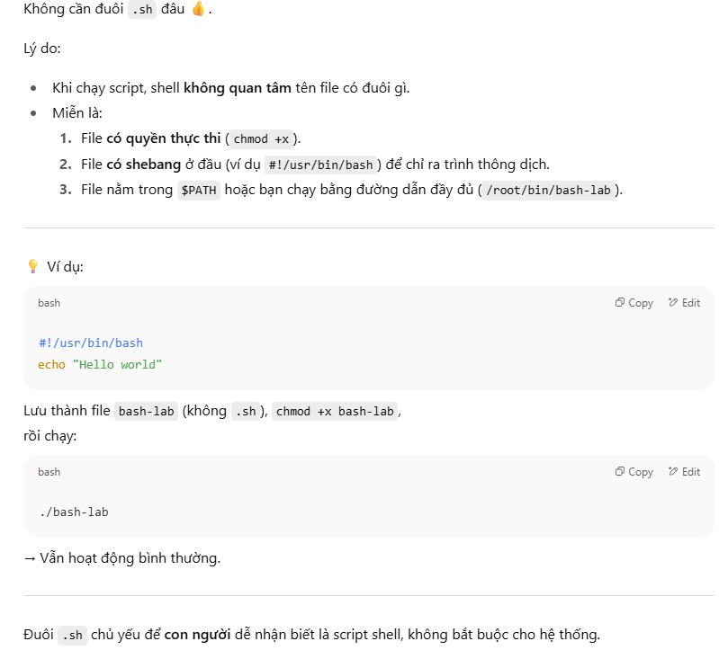

Note:
1. `sh filename.sh`
- Bạn chỉ định rõ chạy script bằng sh (thường là /bin/sh).
- Nội dung file sẽ được sh đọc và thực thi, không cần quyền thực thi (+x).
- Không quan tâm shebang ở đầu file, vì bạn đã chỉ định trình thông dịch là sh.
- Nếu script viết cho bash mà dùng sh (nhất là trên Debian/Ubuntu, sh = dash), một số câu lệnh nâng cao của bash có thể lỗi.

2. `filename.sh` (hoặc bash-lab, không cần .sh)
- Hệ thống sẽ dựa vào shebang ở dòng đầu tiên (#!...) để biết dùng trình thông dịch nào (/usr/bin/bash, /usr/bin/python, …).
- File bắt buộc phải có quyền thực thi (chmod +x filename.sh).
- Nếu không có shebang, shell mặc định (thường là bash khi bạn đăng nhập) sẽ xử lý file.
- Nam trong $PATH (neu muon go ten file ma khong can duong dan)


# CHAPTER 3: Lab: Analyze and Store Logs
Thay đổi múi giờ trên máy chủ hiện có và cấu hình tệp nhật ký mới cho tất cả các sự kiện xác thực không thành công.

Kết quả
- Cập nhật múi giờ trên máy chủ hiện có.
- Cấu hình tệp nhật ký mới để lưu trữ tất cả thông báo xác thực không thành công.

1. Log in to the `serverb` machine as the student user.
```
[student@workstation ~]$ ssh student@`serverb`
...output omitted...
[student@`serverb` ~]$
```
2. Giả sử máy chủ được chuyển đến Jamaica và bạn phải cập nhật múi giờ thành `America/Jamaica`. Hãy kiểm tra xem bạn đã đặt đúng múi giờ chưa.  

2.1 Chọn múi giờ phù hợp cho Jamaica.
```
[student@`serverb` ~]$ tzselect
-> 2 (Americas)
-> 30 (Jamaica)
-> 1 (Yes)
```
Note:   
- `tzselect` → chỉ để chọn và hiển thị tên múi giờ.
- `timedatectl set-timezone ...` → mới là lệnh áp dụng thật.

2.2 Nâng cao quyền của người dùng `student` để cập nhật múi giờ của máy chủ `serverb` thành America/Jamaica.
```
[student@`serverb` ~]$ sudo timedatectl set-timezone America/Jamaica
[sudo] password for student: student
```
2.3 Verify that you successfully set the time zone to America/Jamaica.
```
[student@`serverb` ~]$ timedatectl
               Local time: Wed 2022-03-16 07:18:40 EST
           Universal time: Wed 2022-03-16 12:18:40 UTC
                 RTC time: Wed 2022-03-16 12:18:40
                Time zone: America/Jamaica (EST, -0500)
System clock synchronized: yes
              NTP service: active
          RTC in local TZ: no
```

3. Xem các log events được ghi lại trong 30 phút trước trên máy chủ `serverb`.
```
[student@`serverb` ~]$ journalctl --since "-30min"
...output omitted...
Aug 17 21:24:10 redhat9-server-1 dnf[2097]: Error: Failed to download metadata for repo 'errata': Cannot download repomd.xml: Curl error (7): Couldn't connect to server for http://content.example.com/rhel9.3/x86_64/rhcsa-practice/errata/repodata/repomd.xml [Failed to connect to content.example.com port 80: Connection refused]
Aug 17 21:24:10 redhat9-server-1 systemd[1]: dnf-makecache.service: Main process exited, code=exited, status=1/FAILURE
Aug 17 21:24:10 redhat9-server-1 systemd[1]: dnf-makecache.service: Failed with result 'exit-code'.
Aug 17 21:24:10 redhat9-server-1 systemd[1]: Failed to start dnf makecache.
Aug 17 21:24:10 redhat9-server-1 systemd[1]: dnf-makecache.service: Consumed 2.106s CPU time.
Aug 17 21:27:07 redhat9-server-1 systemd[1]: Starting Time & Date Service...
Aug 17 21:27:07 redhat9-server-1 systemd[1]: Started Time & Date Service.
Aug 17 21:27:14 redhat9-server-1 systemd-timedated[2133]: Changed time zone to 'America/Jamaica' (EST).
Aug 17 21:27:52 redhat9-server-1 systemd[1]: systemd-timedated.service: Deactivated successfully.
(END)

[student@`serverb` ~]$
```

4. Tạo tệp `/etc/rsyslog.d/auth-errors.conf`. Cấu hình dịch vụ `rsyslog` để ghi thông báo "Logging test authpriv.alert " vào tệp `/var/log/auth-errors.conf`. Sử dụng chức năng `authpriv` và mức độ ưu tiên `alert` .  
- Bạn phải tạo file cấu hình riêng /etc/rsyslog.d/auth-errors.conf để chỉ định quy tắc log.
- Quy tắc là: mọi log thuộc facility authpriv và priority alert thì ghi vào `/var/log/auth-errors`.
- Sau đó phải test bằng cách gửi một log test, ví dụ dùng logger.

4.1 Tạo tệp `/etc/rsyslog.d/auth-errors.conf` và chỉ định tệp `/var/log/auth-errors.conf`  làm đích đến cho các thông báo xác thực và bảo mật.

```
sudo vi /etc/rsyslog.d/auth-errors.conf
# them dong ben duoi
authpriv.alert    /var/log/auth-errors

```
📌 Giải thích:
- authpriv → facility liên quan đến xác thực (login, sudo, ssh...).
- alert → mức ưu tiên (priority) cao (mức độ từ alert trở lên (alert, crit, emerg)).
- /var/log/auth-errors → file bạn muốn ghi log vào.

4.2 Restart the `rsyslog` service to apply the configuration file changes.

```
[student@`serverb` ~]$ sudo systemctl restart rsyslog

```

4.3 Sử dụng lệnh `logger -p` để ghi thông báo "Logging test authpriv.alert" vào tệp /var/log/auth-errors. Sử dụng chức năng authpriv và mức độ ưu tiên cảnh báo.

```
[student@`serverb` ~]$ logger -p authpriv.alert "Logging test authpriv.alert"

```

4.4 Xác minh rằng tệp `/var/log/auth-errors` có chứa mục nhật ký với thông báo Logging test authpriv.alert hay không.

```
[student@`serverb` ~]$ sudo tail /var/log/auth-errors
Mar 16 07:25:12 `serverb` student[1339]: Logging test authpriv.alert
```

4.5  Return to the workstation system as the student user.


```
[student@`serverb` ~]$ exit
logout
Connection to `serverb` closed.
[student@workstation ~]$
```

Facility  
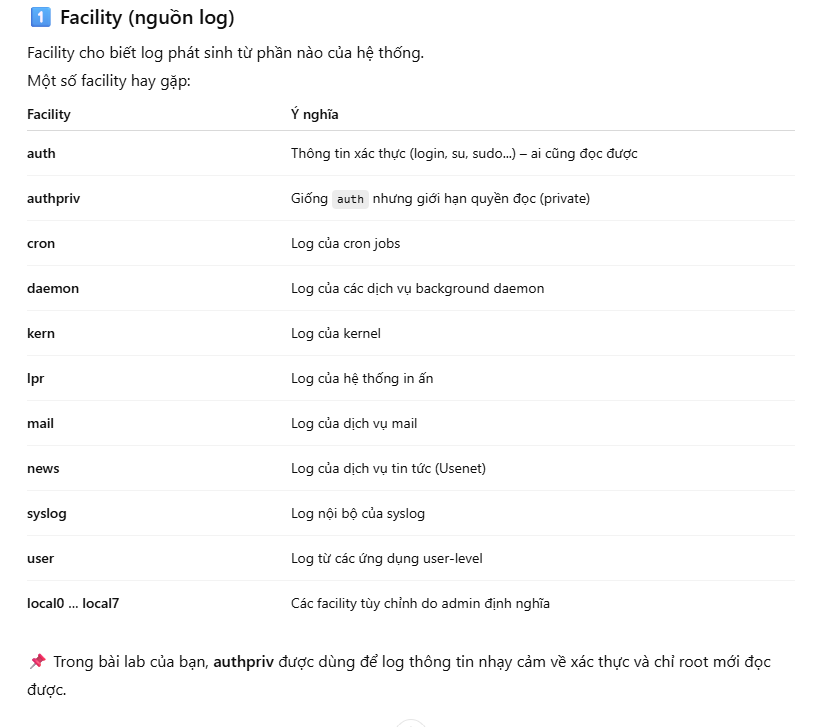

Priority
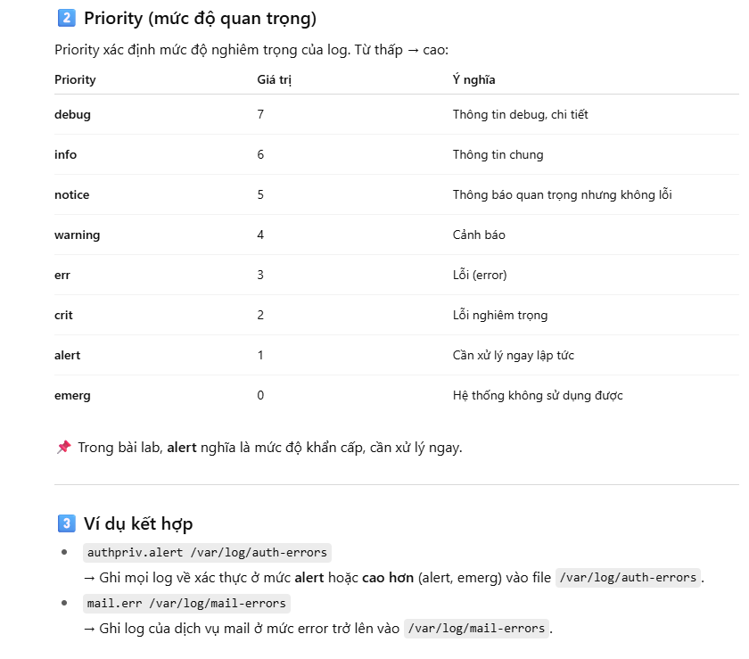

Khi cấu hình logging với rsyslog (hoặc syslog truyền thống), cú pháp chuẩn sẽ là:
```
facility.priority    destination
```

---
# CHAPTER 4: Lab: Archive and Transfer Files  
Sử dụng các lệnh `tar`, `rsync` và `sftp` để lưu trữ và sao lưu nội dung của các thư mục.

Kết quả  
- Đồng bộ hóa thư mục từ xa với thư mục cục bộ.
- Tạo một kho lưu trữ nội dung của thư mục đã đồng bộ.
- Sao chép an toàn một kho lưu trữ sang máy chủ từ xa.
- Giải nén một kho lưu trữ.

Note:  It also installs SSH keys on your systems so that you can transfer files without entering passwords.

1. Trên `serverb`, đồng bộ hóa cây thư mục `/etc` từ `servera` sang thư mục `/configsync`.  

1.1
```
[student@workstation ~]$ ssh student@`serverb`
...output omitted...
[student@`serverb` ~]$ sudo -i
[sudo] password for student: student
[root@`serverb` ~]#
```
1.2 Tạo thư mục `/configsync` để lưu trữ các tệp được đồng bộ hóa từ `servera`.
```
[root@`serverb` ~]# mkdir /configsync

```
1.3 Đồng bộ hóa cây thư mục `/etc` từ `servera` đến thư mục `/configsync` trên `serverb`.

```
[root@`serverb` ~]# rsync -av root@`servera`:/etc /configsync
receiving incremental file list
etc/
etc/.pwd.lock
etc/.rht_authorized_keys
...output omitted...
sent 11,519 bytes  received 20,203,285 bytes  40,429,608.00 bytes/sec
total size is 20,150,298  speedup is 1.00
```

Ket qua:
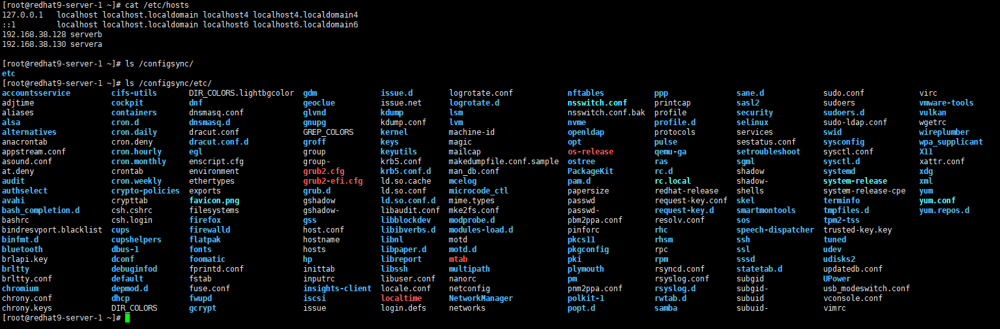
Truoc do tren `serverb` da copy ssh sang `servera`
`ssh-copy-id root@192.168.38.130`  
Chu thich:
Trong rsync, tùy chọn -av là viết tắt của:
- -a (archive mode)
  - Giữ nguyên toàn bộ quyền file, symlink, timestamp, owner, group…
  - Tự động bật -r (recursive) để copy thư mục và file bên trong.
  - Mục tiêu: sao lưu/dồng bộ giống hệt bản gốc.
- -v (verbose)
  - Hiển thị chi tiết quá trình copy: tên file, tiến trình, v.v.

`rsync` chi update nhung noi dung moi   
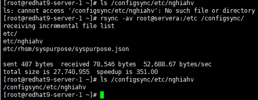

SS `scp` & `rsync`  
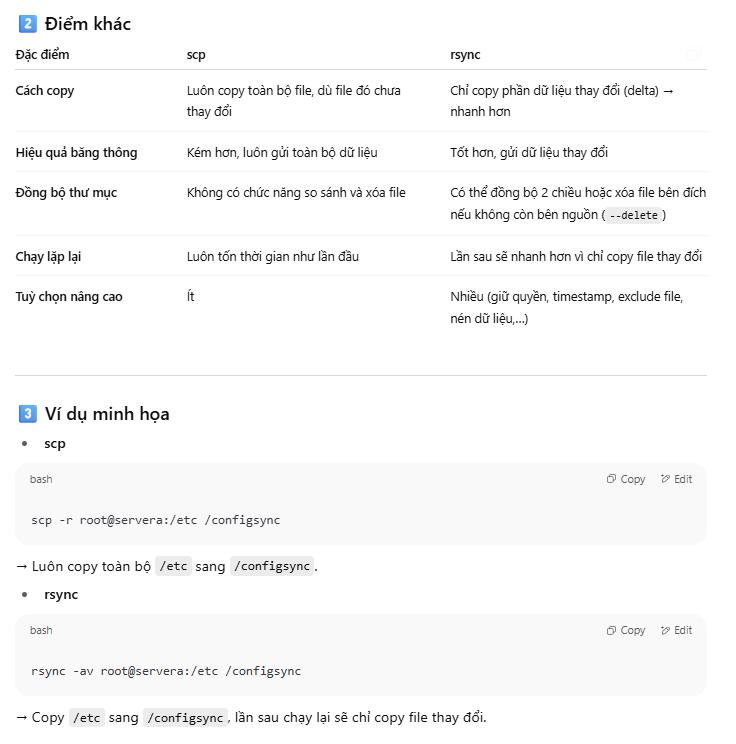


2. Tạo tệp lưu trữ `configfile-backup-`servera`.tar.gz` với nội dung thư mục `/configsync`.  

2.1 Tạo một tệp nén gzip.
```
[root@`serverb` ~]# tar -czf configfile-backup-`servera`.tar.gz /configsync
tar: Removing leading `/' from member names
```
Giai thich "Removing leading..."
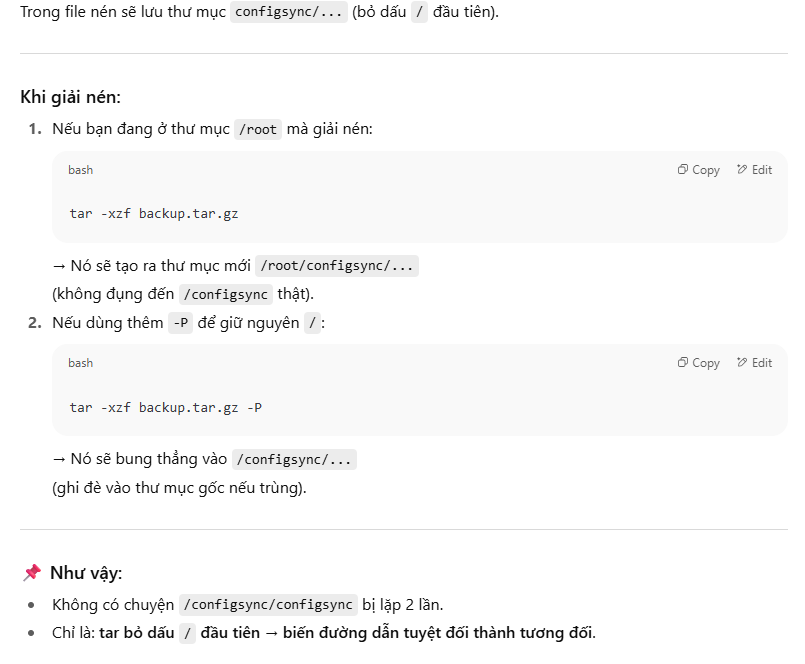

2.2 Liệt kê nội dung của kho lưu trữ `configfile-backup-`servera`.tar.gz`.
```
[root@`serverb` ~]# tar -tzf configfile-backup-`servera`.tar.gz
...output omitted...
configsync/etc/vimrc
configsync/etc/wgetrc
configsync/etc/xattr.conf
```
Note : Khi `tar -tzf`, bạn sẽ thấy đường dẫn tương đối bắt đầu bằng `configsync/`, chứ không phải tuyệt đối `/configsync/`.

Bonus: Nếu muốn file nằm chỗ khác, Nếu muốn lưu ở chỗ khác thì bạn phải ghi đường dẫn tuyệt đối hoặc tương đối:
```
tar -czf /tmp/configfile-backup-`servera`.tar.gz /configsync    # tuyệt đối
tar -czf ../backup/configfile-backup-`servera`.tar.gz /configsync   # tương đối

```

Ket qua

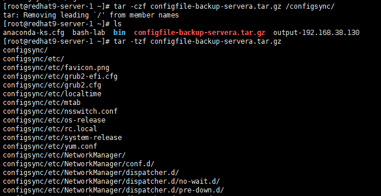

3. Sao chép an toàn tệp lưu trữ `/root/configfile-backup-`servera`.tar.gz` từ `serverb` vào thư mục `/home/student` trên máy workstation.
```
[root@`serverb` ~]# sftp student@workstation
student@workstation's password: student
Connected to workstation.
sftp> put configfile-backup-`servera`.tar.gz
Uploading configfile-backup-`servera`.tar.gz to /home/student/configfile-backup-`servera`.tar.gz
configfile-backup-`servera`.tar.gz                 100% 4933KB 359.5MB/s   00:00
sftp> bye
```
Ket qua:  
Tren `serverb`:
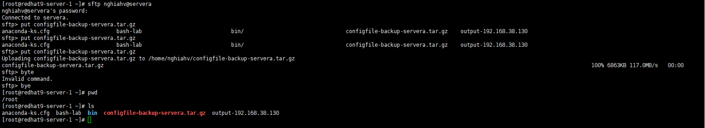

Tren `servera`:
```
[root@redhat9-server-2 ~]# ls /home/nghiahv/
Desktop  Documents  Downloads  Music  Pictures  Public  Templates  Videos

[root@redhat9-server-2 ~]# ls /home/nghiahv/
configfile-backup-`servera`.tar.gz  Desktop  Documents  Downloads  Music  Pictures  Public  Templates  Videos

```

4. Trên workstation, giải nén nội dung vào thư mục `/tmp/savedconfig/`.

4.1 Trở lại hệ thống máy workstation với tư cách là người dùng là `student`.
```
[root@`serverb` ~]# exit
logout
[student@`serverb` ~]$ exit
logout
Connection to `serverb` closed.
[student@workstation]$
```
4.2 Tạo thư mục `/tmp/savedconfig `để lưu trữ nội dung đã giải nén. Chuyển sang thư mục mới.

```
[student@workstation ~]$ mkdir /tmp/savedconfig
[student@workstation ~]$ cd /tmp/savedconfig
[student@workstation savedconfig]$
```
4.3 Liệt kê nội dung của kho lưu trữ `configfile-backup-`servera`.tar.gz`.

```
[student@workstation savedconfig]$ tar -tzf ~/configfile-backup-`servera`.tar.gz
...output omitted...
configsync/etc/vimrc
configsync/etc/wgetrc
configsync/etc/xattr.conf
```

Note:

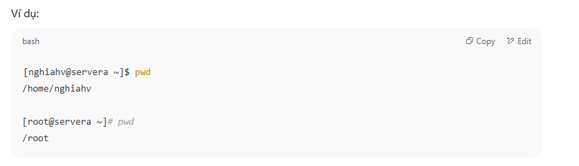
4.4 Giải nén nội dung lưu trữ vào thư mục `/tmp/savedconfig/`.

```
[student@workstation savedconfig]$ tar -xzf ~/configfile-backup-`servera`.tar.gz

```

Bonus: neu muon chỉ định thư mục giải nén
```
tar -xzf ~/configfile-backup-`servera`.tar.gz -C /tmp
```

4.5 Liệt kê thư mục để xác minh rằng nó chứa các tệp etc
 
```
[student@workstation savedconfig]$ ls -lR
.:
total 0
drwxr-xr-x. 3 student student 17 Mar 28 16:32 configsync

./configsync:
total 12
drwxr-xr-x. 105 student student 8192 Mar 28 16:03 etc
...output omitted...
```

Ket qua  
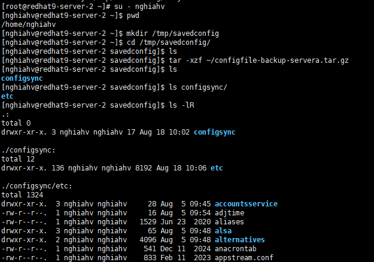


4.6 Return to the student user's home directory.
```
[student@workstation savedconfig]$ cd
[student@workstation ~]$
```

# CHAPTER 5: Lab: Tune System Performance  
Áp dụng một cấu hình tối ưu hóa (tuning profile) cụ thể và điều chỉnh mức độ ưu tiên lập lịch (scheduling priority) của một tiến trình đang chạy có mức sử dụng CPU cao.  
Kết quả   
- Kích hoạt một cấu hình tối ưu hóa (tuning profile) cụ thể cho một hệ thống máy tính. 
- Điều chỉnh mức độ ưu tiên lập lịch CPU của một tiến trình.

1. Thay đổi cấu hình điều chỉnh hiện tại cho máy chủ ``serverb`` thành `balanced` profile, một cấu hình điều chỉnh chung không chuyên biệt. Liệt kê thông tin cho `balanced` tuning profile khi đó là tuning profile hiện tại.

1.1 Đăng nhập vào máy chủ ``serverb`` với tư cách là người dùng student.

```
[student@workstation ~]$ ssh student@`serverb`
...output omitted...
[student@`serverb` ~]$
```
1.2 Xác minh rằng gói `tuned` đã được cài đặt.

```
[student@`serverb` ~]$ dnf list tuned
...output omitted...
Installed Packages
tuned.noarch              2.18.0-1.el9                 @System
```
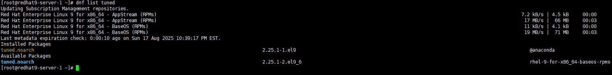

1.3 Xác minh trạng thái dịch vụ `tuned` .

```
[student@`serverb` ~]$ systemctl is-active tuned

active

[student@`serverb` ~]$ 
```
1.4 Liệt kê tất cả các tuning profiles khả dụng và mô tả của chúng. Lưu ý rằng cấu hình đang hoạt động hiện tại là `virtual-guest`.

```
[student@`serverb` ~]$ sudo tuned-adm list
[sudo] password for student: student
Available profiles:
- accelerator-performance   - Throughput 
....
Current active profile: virtual-guest
```
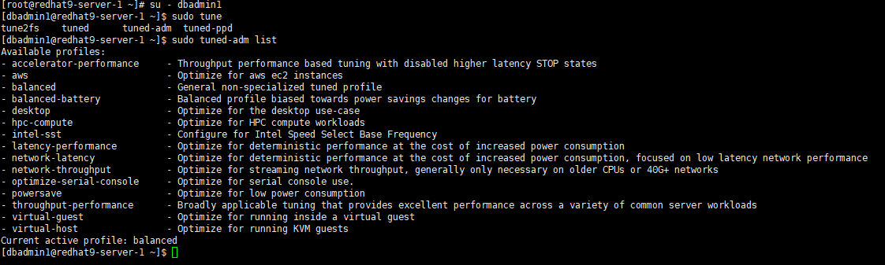

1.5 Thay đổi  tuning profile đang hoạt động hiện tại thành `balanced` profile.

```
[student@`serverb` ~]$ sudo tuned-adm profile balanced

```
1.6 Liệt kê thông tin tóm tắt của  tuned profile đang hoạt động hiện tại. Xác minh rằng cấu hình đang hoạt động là balanced profile.

```
[student@`serverb` ~]$ sudo tuned-adm profile_info

Profile name:
balanced

Profile summary:
General non-specialized tuned profile
...output omitted...
```

2. Hai tiến trình trên ``serverb`` đang chiếm dụng một tỷ lệ phần trăm CPU cao. Hãy điều chỉnh mức `nice` của mỗi tiến trình lên 10 để dành nhiều thời gian CPU hơn cho các tiến trình khác.

2.1 Xác định hai top tien trinh sử dụng nhiều CPU nhất trên máy chủ ``serverb`` . Lệnh ps liệt kê những tien trinh sử dụng nhiều CPU nhất ở cuối kết quả. Giá trị phần trăm CPU có thể khác nhau tùy theo máy của bạn.

```
[student@`serverb` ~]$ ps aux --sort=pcpu
USER    PID %CPU %MEM    VSZ   RSS TTY    STAT START   TIME COMMAND
...output omitted...
root    1079 98.5  0.1 225340  2300 ?     RN   06:25   4:29 sha1sum /dev/zero
root    1095 99.0  0.1 225340  2232 ?     R<   06:25   4:30 md5sum /dev/zero
```
Note co the su dung lenh `top` de xem `%cpu, pid, nice`

2.2 Xác định mức độ `nice` hiện tại cho mỗi một trong hai tien trinh su dung CPU nhiều nhất.

```
[student@`serverb` ~]$ ps -o pid,pcpu,nice,comm \
$(pgrep sha1sum;pgrep md5sum)
  PID %CPU  NI COMMAND
 1079 98.8   2 sha1sum
 1095 99.1  -2 md5sum
```

Co the dung lenh khac hoac `top` cho nhanh  
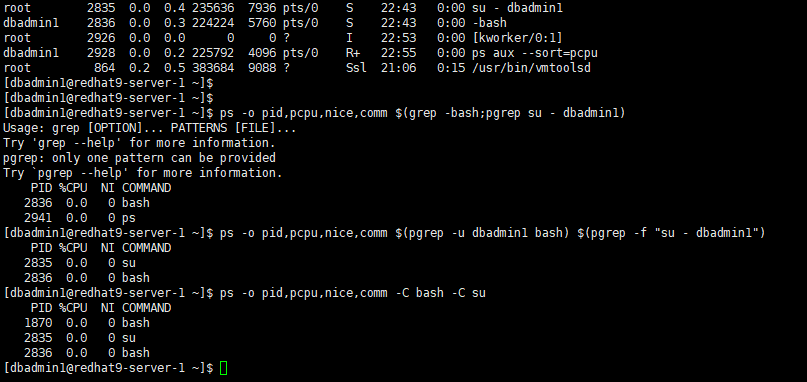

2.3 Điều chỉnh mức `nice` cho mỗi quy trình thành 10. Sử dụng giá trị PID chính xác cho các quy trình của bạn từ đầu ra lệnh trước đó.

```
[student@`serverb` ~]$ sudo renice -n 10 1079 1095
[sudo] password for student: student
1079 (process ID) old priority 2, new priority 10
1095 (process ID) old priority -2, new priority 10
```
2.4 Xác minh rằng mức `nice` hiện tại cho mỗi tiến trình là 10.

```
[student@`serverb` ~]$ ps -o pid,pcpu,nice,comm \
$(pgrep sha1sum;pgrep md5sum)
  PID %CPU  NI COMMAND
 1079 98.9  10 sha1sum
 1095 99.2  10 md5sum
```
2.5 Return to the workstation machine as the student user.

```
[student@`serverb` ~]$ exit
logout
Connection to `serverb` closed.
[student@workstation ~]$
```

Note ve lenh `top`  
```
[dbadmin1@redhat9-server-1 ~]$ sudo renice -n 10 2835
2835 (process ID) old priority 0, new priority 10
[dbadmin1@redhat9-server-1 ~]$ ps -o pid,pcpu,nice,comm -C bash -C su
    PID %CPU  NI COMMAND
   1870  0.0   0 bash
   2835  0.0  10 su
   2836  0.0   0 bash
```
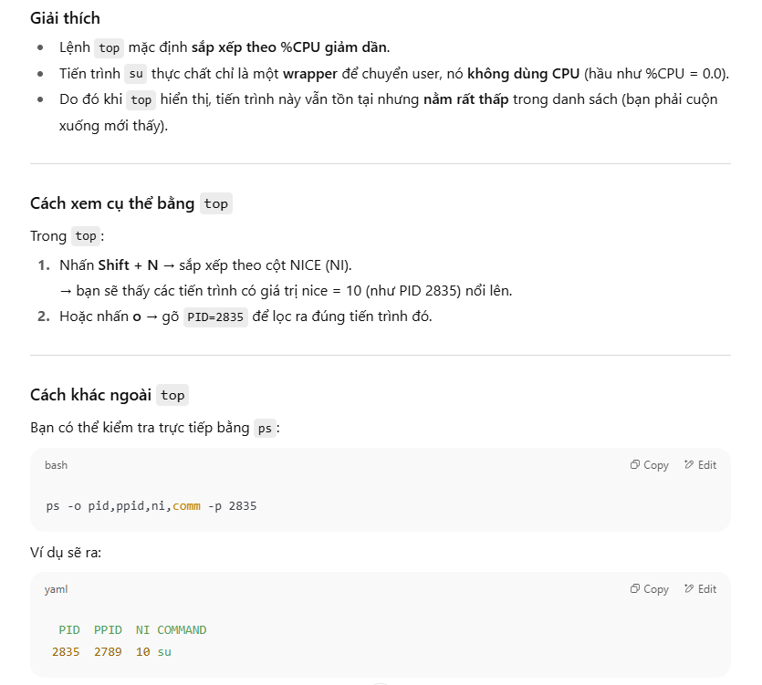

---
# CHAPTER 6: Lab: Manage SELinux Security
Xác định các sự cố trong tệp nhật ký hệ thống và điều chỉnh cấu hình SELinux.   
Kết quả:  
- Xác định các sự cố trong tệp nhật ký hệ thống.   
- Điều chỉnh cấu hình SELinux.

**1. Log in to the ``serverb`` machine as the `student` user and switch to the `root` user.**
```
[student@workstation ~]$ ssh student@`serverb`
...output omitted...
[student@`serverb` ~]$ sudo -i
[sudo] password for student: student
[root@`serverb` ~]#
```
**2. Từ trình duyệt web trên máy workstation , hãy truy cập trang web `http://`serverb`/lab.html`. Bạn sẽ thấy thông báo lỗi: `You do not have permission to access this resource.`**

**3. Nghiên cứu và xác định sự cố SELinux ngăn dịch vụ `Apache` cung cấp nội dung web.**

3.1 Xem nội dung của tệp `/var/log/messages`. Sử dụng phím / và tìm kiếm chuỗi `sealert`. Sử dụng phím q để thoát lệnh less.

```
[root@`serverb` ~]# less /var/log/messages

Aug 18 09:06:53 redhat9-server-1 setroubleshoot[899]: SELinux is preventing /usr/bin/lsmd from getattr access on the file /usr/bin/passt-repair. For complete SELinux messages run: sealert -l 6009dba5-5c4e-407f-98bc-2130613b2ed6

```

Note: Trong `less`, có thể tìm kiếm chuỗi bằng ký tự / giống như trong vi/vim:
- Gõ /chuoi_can_tim rồi nhấn Enter → `less` sẽ nhảy đến kết quả đầu tiên khớp.
- Gõ n → nhảy đến kết quả tiếp theo.
- Gõ N → nhảy đến kết quả trước đó.

File /var/log/messages  
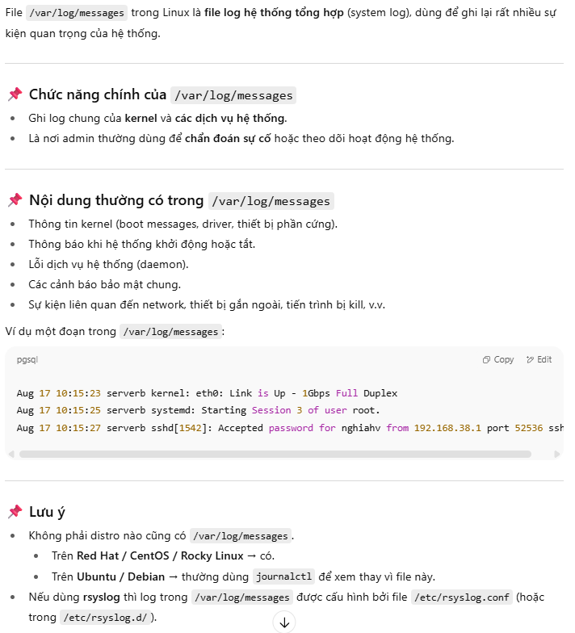

3.2 Chạy lệnh `sealert` được đề xuất tu lenh truoc do. Lưu ý ngữ cảnh nguồn, đối tượng đích, chính sách và chế độ thực thi.
```
[root@`serverb` ~]# sealert -l 35c9e452-2552-4ca3-8217-493b72ba6d0b

```

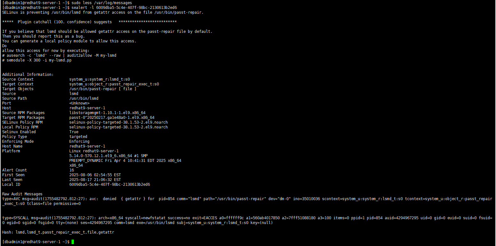

3.3 Phần *Raw Audit Messages* của lệnh `sealert` chứa thông tin từ tệp `/var/log/audit/audit.log`. Hãy tìm kiếm tệp `/var/log/audit/audit.log`. Tùy chọn `-m` tìm kiếm theo loại thông báo. Tùy chọn `ts` tìm kiếm theo thời gian. Mục sau đây xác định quy trình và tệp liên quan gây ra cảnh báo. Quy trình này là máy chủ web Apache httpd, tệp là `/lab-content/lab.html` và ngữ cảnh là `system_r:httpd_t`.
```
[root@`serverb` ~]# ausearch -m AVC -ts recent
...output omitted...
----
time->Thu Apr  7 06:16:12 2022
type=PROCTITLE msg=audit(1649326572.086:407): proctitle=2F7573722F7362696E2F6874747064002D44464F524547524F554E44
type=SYSCALL msg=audit(1649326572.086:407): arch=c000003e syscall=262 success=no exit=-13 a0=ffffff9c a1=7f7c8c0457c0 a2=7f7c887f7830 a3=100 items=0 ppid=10641 pid=10731 auid=4294967295 uid=48 gid=48 euid=48 suid=48 fsuid=48 egid=48 sgid=48 fsgid=48 tty=(none) ses=4294967295 comm="httpd" exe="/usr/sbin/httpd" subj=system_u:system_r:httpd_t:s0 key=(null)
type=AVC msg=audit(1649326572.086:407): avc:  denied  { getattr } for  pid=10731 comm="httpd" path="/lab-content/lab.html" dev="vda4" ino=18192752 scontext=system_u:system_r:httpd_t:s0 tcontext=unconfined_u:object_r:default_t:s0 tclass=file permissive=0
```

Cú pháp cơ bản `ausearch`
```
ausearch -m <message_type> -ts <time>
```
Giai thich:  

`-m` = lọc theo loại thông điệp (message type) trong audit log.
Ví dụ message type thường gặp:
- AVC → các sự kiện SELinux chặn (Access Vector Cache).
- USER_LOGIN → đăng nhập user.
- USER_AUTH → xác thực người dùng.
- EXECVE → tiến trình được thực thi.
- SYSCALL → lời gọi hệ thống.

`-ts` = time start → chỉ định thời điểm bắt đầu để lọc log.
Bạn có thể dùng nhiều kiểu giá trị:
- recent → sự kiện mới nhất.
- today → từ đầu ngày đến giờ.
- yesterday → từ ngày hôm qua.
- this-week, this-month, this-year.
- Hoặc chỉ định cụ thể: 2025-08-17 20:00:00.

(chua lap-kho)  
4. Hiển thị ngữ cảnh SELinux của thư mục tài liệu HTTP mới và thư mục tài liệu HTTP gốc. Giải quyết sự cố SELinux ngăn máy chủ Apache phục vụ nội dung web.  

4.1 So sánh context SELinux cho các thư mục `/lab-content` và `/var/www/html`.

```
[root@`serverb` ~]# ls -dZ /lab-content /var/www/html
      unconfined_u:object_r:default_t:s0 /lab-content
system_u:object_r:httpd_sys_content_t:s0 /var/www/html
```
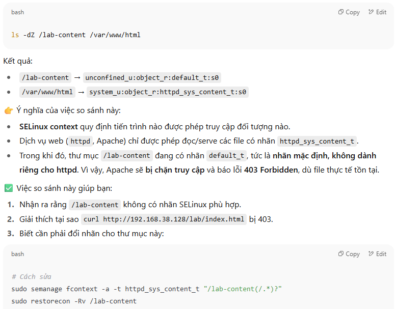


4.2 Tạo quy tắc context tệp để đặt loại mặc định thành httpd_sys_content_ cho thư mục /lab-content và tất cả các tệp trong đó.
```
[root@`serverb` ~]# semanage fcontext -a \
-t httpd_sys_content_t '/lab-content(/.*)?'
```
4.3 Sửa context SELinux cho các tệp trong thư mục `/lab-content`.
```
[root@`serverb` ~]# restorecon -R /lab-content/

```


5. Xác minh rằng máy chủ Apache hiện có thể phục vụ nội dung web.
Sử dụng trình duyệt web để làm mới liên kết `http://`serverb`/lab.html`. Nếu nội dung được hiển thị, thì sự cố của bạn đã được giải quyết.
```
This is the html file for the SELinux final lab on `serverb`.
```

6. Return to the workstation machine as the student user.  

```
[root@`serverb` ~]# exit
logout
[student@`serverb` ~]$ exit
logout
Connection to `serverb` closed.
[student@workstation ~]$
```

---
# CHAPTER 7 : Lab: Manage Basic Storage
Tạo nhiều phân vùng trên một đĩa mới, định dạng một số phân vùng bằng hệ thống tệp và gắn kết chúng, đồng thời kích hoạt các phân vùng còn lại dưới dạng không gian hoán đổi.

Kết quả

- Hiển thị và tạo phân vùng bằng lệnh `parted`.
- Tạo hệ thống tệp trên các phân vùng và gắn kết chúng liên tục.
- Tạo không gian hoán đổi và kích hoạt chúng khi khởi động.

1. Máy chủ `serverb` có một số ổ đĩa chưa sử dụng. Trên ổ đĩa chưa sử dụng đầu tiên, hãy tạo nhãn phân vùng GPT và một phân vùng GPT 2 GB có tên là `backup`.

Vì khó thiết lập kích thước chính xác, nên dung lượng từ 1,8 GB đến 2,2 GB là chấp nhận được.

Cấu hình phân vùng sao lưu để lưu trữ hệ thống tệp XFS.

1.1 Log in to `serverb` as the student user and switch to the root user.
```
[student@workstation ~]$ ssh student@`serverb`
...output omitted...
[student@`serverb` ~]$ sudo -i
[sudo] password for student: student
[root@`serverb` ~]#
```
1.2 Xác định các đĩa chưa sử dụng. Đĩa chưa sử dụng đầu tiên, `/dev/vdb`, không có phân vùng nào.

```
[root@`serverb` ~]# lsblk
NAME   MAJ:MIN RM  SIZE RO TYPE MOUNTPOINTS
vda    252:0    0   10G  0 disk
├─vda1 252:1    0    1M  0 part
├─vda2 252:2    0  200M  0 part /boot/efi
├─vda3 252:3    0  500M  0 part /boot
└─vda4 252:4    0  9.3G  0 part /
vdb    252:16   0    5G  0 disk
vdc    252:32   0    5G  0 disk
vdd    252:48   0    5G  0 disk
```
1.3 Xác nhận rằng đĩa `/dev/vdb` không có nhãn.

```
[root@`serverb` ~]# parted /dev/vdb print
Error: /dev/vdb: unrecognised disk label
Model: Virtio Block Device (virtblk)
Disk /dev/vdb: 5369MB
Sector size (logical/physical): 512B/512B
Partition Table: unknown
Disk Flags:
```

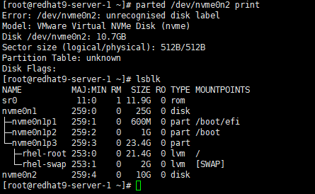

1.4 Xác định sơ đồ phân vùng GPT.

```
[root@`serverb` ~]# parted /dev/vdb mklabel gpt
Information: You may need to update /etc/fstab.
```

Giai thich:  
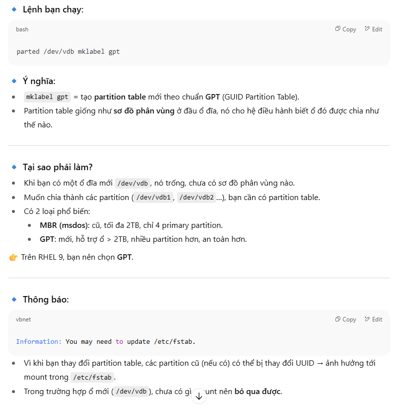

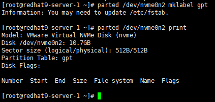
1.5 Tạo phân vùng `backup` 2 GB với loại hệ thống tệp `xfs`. Bắt đầu phân vùng ở sector 2048.

```
[root@`serverb` ~]# parted /dev/vdb mkpart backup xfs 2048s 2GB
Information: You may need to update /etc/fstab.
```
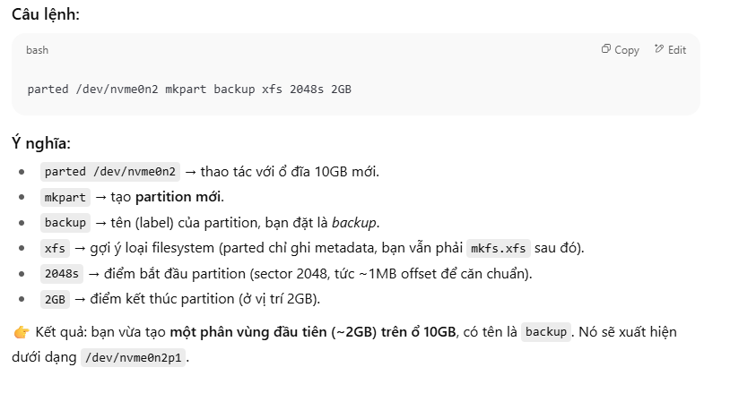

1.6 Xác nhận việc tạo phân vùng `backup`.

```
[root@`serverb` ~]# parted /dev/vdb print
Model: Virtio Block Device (virtblk)
Disk /dev/vdb: 5369MB
Sector size (logical/physical): 512B/512B
Partition Table: gpt
Disk Flags:

Number  Start   End     Size    File system  Name    Flags
 1      1049kB  2000MB  1999MB               backup
```
1.7 Chạy lệnh `udevadm settle`. Lệnh này chờ hệ thống phát hiện phân vùng mới và tạo tệp thiết bị `/dev/vdb1`.

```
[root@`serverb` ~]# udevadm settle
```

Note: Nếu bạn làm lệnh tiếp theo ngay lập tức (vd: mkfs hoặc mount) ma khong `udevadm settle`, partition có thể chưa xuất hiện kịp → lỗi “No such file or directory”.

2. Định dạng phân vùng sao lưu 2 GB bằng hệ thống tệp XFS và gắn liên tục vào thư mục `/backup` bằng cách sử dụng UUID.

2.1 Định dạng phân vùng `/dev/vbd1`.

```
[root@`serverb` ~]# mkfs.xfs /dev/vdb1
```
Note: `mkfs` phải thực hiện trên partition, không thực hiện trên disk vật lý trừ khi bạn muốn dùng cả ổ (format toàn bộ ổ đĩa) mà không có partition table.

2.2 Tạo điểm gắn kết `/backup`.

```
[root@`serverb` ~]# mkdir /backup

```
2.3 Trước khi thêm hệ thống tệp mới vào tệp `/etc/fstab`, hãy lấy UUID của tệp đó. UUID trên hệ thống của bạn có thể khác.

```
[root@`serverb` ~]# lsblk --fs /dev/vdb1
NAME FSTYPE FSVER LABEL UUID                                   FSAVAIL FSUSE% MOUNTPOINTS
vdb1 xfs                f74ed805-b1fc-401a-a5ee-140f97c6757d
```
Or
```
[root@redhat9-server-1 ~]# blkid /dev/nvme0n2p1 
/dev/nvme0n2p1: UUID="f68511a4-8274-45b9-a6c5-83ce28ef3f62" TYPE="xfs" PARTLABEL="backup" PARTUUID="ee3eb4ed-1427-4a2a-896e-004d2223470a"
```

2.4 Chỉnh sửa tệp `/etc/fstab` và xác định hệ thống tệp mới.

```
[root@`serverb` ~]# vim /etc/fstab
...output omitted...
UUID=f74ed805-b1fc-401a-a5ee-140f97c6757d   /backup   xfs   defaults   0 0
```
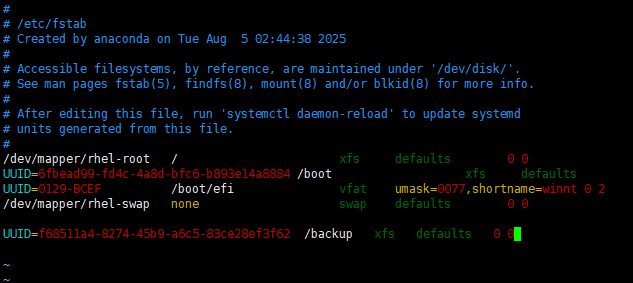

2.5 Buộc daemon systemd đọc lại tệp /etc/fstab.

```
[root@`serverb` ~]# systemctl daemon-reload

```
2.6 Gắn thủ công thư mục `/backup` để xác minh công việc của bạn. Xác nhận việc gắn kết thành công.

```
[root@`serverb` ~]# mount /backup
[root@`serverb` ~]# mount | grep /backup
/dev/vdb1 on /backup type xfs (rw,relatime,seclabel,attr2,inode64,logbufs=8,logbsize=32k,noquota)
```

Note: `mount` không chỉ rõ partition vi

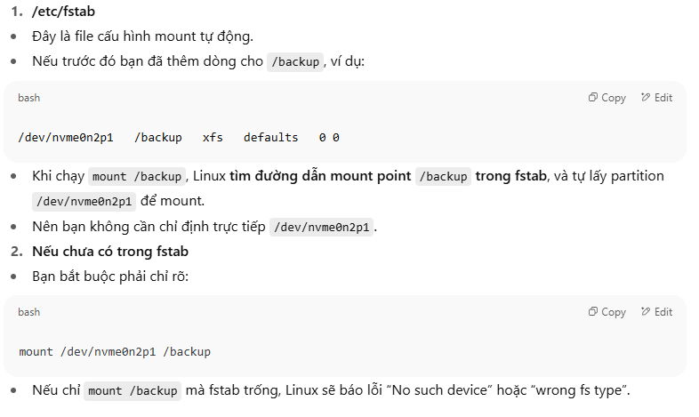

3. Trên cùng một ổ đĩa, tạo hai phân vùng GPT 512 MB với tên là swap1 và swap2.  
Dung lượng từ 460 MB đến 564 MB là chấp nhận được.      
Cấu hình loại hệ thống tệp của các phân vùng để lưu trữ không gian hoán đổi.

3.1 Truy xuất vị trí kết thúc của phân vùng đầu tiên bằng cách hiển thị bảng phân vùng hiện tại trên đĩa `/dev/vdb`. Ở bước tiếp theo, bạn sử dụng giá trị đó làm điểm bắt đầu của phân vùng swap1.

```
[root@`serverb` ~]# parted /dev/vdb print
Model: Virtio Block Device (virtblk)
Disk /dev/vdb: 5369MB
Sector size (logical/physical): 512B/512B
Partition Table: gpt
Disk Flags:

Number  Start   End     Size    File system  Name    Flags
 1      1049kB  2000MB  1999MB  xfs          backup
```
3.2 Tạo phân vùng GPT 512 MB đầu tiên có tên là `swap1`. Đặt loại của phân vùng này là `linux-swap`. Sử dụng vị trí cuối của phân vùng đầu tiên làm điểm bắt đầu. Vị trí cuối là 2000 MB + 512 MB = 2512 MB.

```
[root@`serverb` ~]# parted /dev/vdb mkpart swap1 linux-swap 2000M 2512M
Information: You may need to update /etc/fstab.
```
3.3 Tạo phân vùng GPT 512 MB thứ hai có tên là swap2. Đặt loại của phân vùng này là linux-swap. Sử dụng vị trí kết thúc của phân vùng trước làm điểm bắt đầu: 2512M. Vị trí kết thúc là 2512 MB + 512 MB = 3024 MB.

```
[root@`serverb` ~]# parted /dev/vdb mkpart swap2 linux-swap 2512M 3024M
Information: You may need to update /etc/fstab.
```
3.4 Hiển thị bảng phân vùng để xác minh công việc của bạn.

```
[root@`serverb` ~]# parted /dev/vdb print
Model: Virtio Block Device (virtblk)
Disk /dev/vdb: 5369MB
Sector size (logical/physical): 512B/512B
Partition Table: gpt
Disk Flags:

Number  Start   End     Size    File system  Name    Flags
 1      1049kB  2000MB  1999MB  xfs          backup
 2      2000MB  2512MB  513MB                swap1   swap
 3      2512MB  3024MB  512MB                swap2   swap
```
3.5 Chạy lệnh udevadm settle. Lệnh này sẽ chờ hệ thống đăng ký các phân vùng mới và tạo các tệp thiết bị.

```
[root@`serverb` ~]# udevadm settle

```

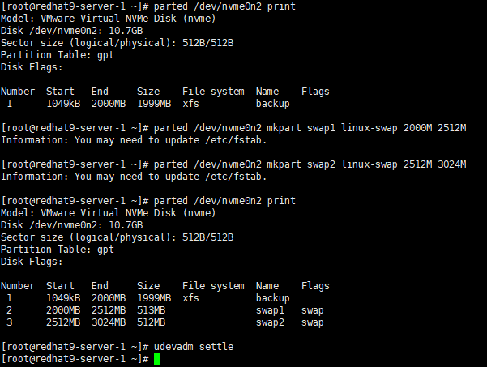

4. Khởi tạo hai phân vùng 512 MB làm swap spaces và cấu hình chúng để kích hoạt khi khởi động. Thiết lập swap spaces trên phân vùng `swap2` được ưu tiên hơn phân vùng còn lại. Lưu ý rằng 512 MB tương đương với khoảng 488 MB. Hiển thị Giải pháp

4.1 Sử dụng lệnh `mkswap` để khởi tạo các phân vùng swap. Lưu ý mã UUID của hai không gian swap, vì bạn sẽ sử dụng thông tin đó ở bước tiếp theo. Nếu bạn xóa đầu ra `mkswap`, hãy sử dụng lệnh lsblk --fs để lấy mã UUID.
```
[root@`serverb` ~]# mkswap /dev/vdb2
Setting up swapspace version 1, size = 489 MiB (512749568 bytes)
no label, UUID=87976166-4697-47b7-86d1-73a02f0fc803
[root@`serverb` ~]# mkswap /dev/vdb3
Setting up swapspace version 1, size = 488 MiB (511700992 bytes)
no label, UUID=4d9b847b-98e0-4d4e-9ef7-dfaaf736b942
```
4.2 Chỉnh sửa tệp `/etc/fstab` và xác định swap spaces mới. Để đặt swap spaces  trên phân vùng `swap2` được ưu tiên hơn phân vùng swap1, hãy cấp cho phân vùng swap2 mức ưu tiên cao hơn bằng tùy chọn pri.

```
[root@`serverb` ~]# vim /etc/fstab
...output omitted...
UUID=a3665c6b-4bfb-49b6-a528-74e268b058dd   /backup xfs   defaults  0 0
UUID=87976166-4697-47b7-86d1-73a02f0fc803   swap    swap  pri=10    0 0
UUID=4d9b847b-98e0-4d4e-9ef7-dfaaf736b942   swap    swap  pri=20    0 0
```

Note: `PRIO` càng cao → swap càng được ưu tiên.

4.3 Buộc daemon systemd đọc lại tệp /etc/fstab.

```
[root@`serverb` ~]# systemctl daemon-reload

```
4.4 Kích hoạt swap spaces mới. Xác minh việc kích hoạt swap spaces đã chính xác.

```
[root@`serverb` ~]# swapon -a
[root@`serverb` ~]# swapon --show
NAME      TYPE      SIZE USED PRIO
/dev/vdb2 partition 489M   0B   10
/dev/vdb3 partition 488M   0B   20
```

Ket qua:  
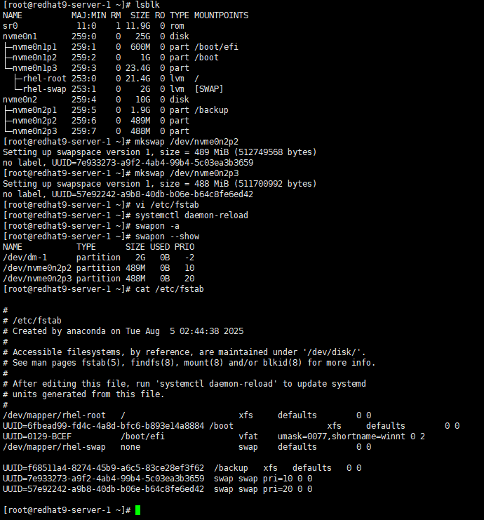

5. Để xác minh công việc của bạn, hãy khởi động lại máy ``serverb``. Xác nhận rằng hệ thống tự động gắn phân vùng đầu tiên vào thư mục `/backup`. Đồng thời, hãy xác nhận rằng hệ thống đã kích hoạt hai swap spaces

5.1 Reboot `serverb`.
```
[root@`serverb` ~]# systemctl reboot
Connection to `serverb` closed by remote host.
Connection to `serverb` closed.
[student@workstation ~]$
```
5.2 Wait for `serverb` to boot, and then log in as the student user.
```
[student@workstation ~]$ ssh student@`serverb`
...output omitted...
[student@`serverb` ~]$
```
5.3 Xác minh rằng hệ thống tự động gắn phân vùng /dev/vdb1 vào thư mục /backup.
```
[student@`serverb` ~]$ mount | grep /backup
/dev/vdb1 on /backup type xfs (rw,relatime,seclabel,attr2,inode64,noquota)
```
5.4 Xác minh rằng hệ thống kích hoạt cả hai swap spaces
```
[student@`serverb` ~]$ swapon --show
NAME      TYPE      SIZE USED PRIO
/dev/vdb2 partition 489M   0B   10
/dev/vdb3 partition 488M   0B   20
```
5.5 Return to the workstation machine as the student user.


```
[student@`serverb` ~]$ exit
logout
Connection to `serverb` closed.
[student@workstation ~]$
```
Ket qua:   
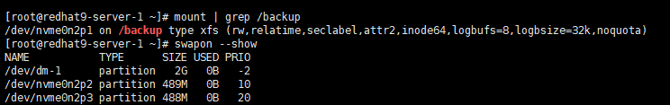

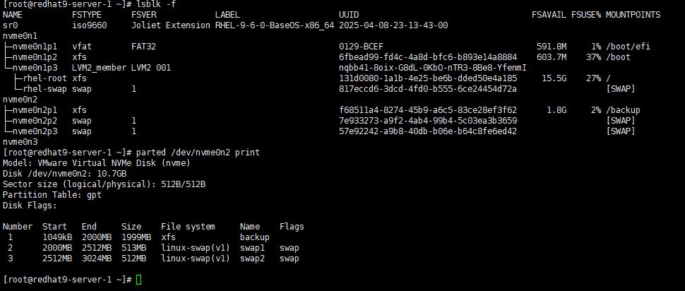

Note:
- Có cách tính dung lượng swap
- Cách Linux dùng swap (Cơ chế này chỉ xảy ra khi RAM vật lý đầy hoặc gần đầy): 
  - Dữ liệu ít sử dụng trong RAM → ghi vào swap.
  - Khi cần, dữ liệu từ swap → đưa lại RAM.
  - Swap cũng được dùng khi chạy hibernate (ngủ đông), ghi toàn bộ RAM xuống swap.
  - Khi bạn tạo partition swap 512MB, toàn bộ 512MB đã được “dành riêng” trên ổ đĩa. Dù swap không được dùng ngay, dung lượng đó vẫn không thể lưu dữ liệu bình thường (không mount được như filesystem).

---
# CHAPTER 8: Lab: Manage Storage Stack
Thay đổi kích thước ổ đĩa logic hiện có, thêm tài nguyên LVM nếu cần, sau đó thêm một ổ đĩa logic mới với hệ thống tệp XFS được gắn kết liên tục.

Kết quả  
- Thay đổi kích thước ổ đĩa logic ``serverb`_01_lv` thành 768 MiB.
- Tạo ổ đĩa logic ``serverb`_02_lv` với 128 MiB với hệ thống tệp XFS.
- Gắn kết liên tục ổ đĩa vào thư mục `/storage/data2`.

Hướng dẫn

Trên máy `serverb`, ổ đĩa logic ``serverb`_01_lv` được gắn vào thư mục `/storage/data1` đang hết dung lượng đĩa và phải được mở rộng lên 768 MiB. Bạn phải đảm bảo rằng LV `serverb`_01_lv vẫn được gắn liên tục vào thư mục `/storage/data1`.

LV `serverb`_01_lv hiện diện trên nhóm ổ đĩa `serverb`_01_vg. Nó không đủ dung lượng để mở rộng ổ đĩa logic hiện có. Có một phân vùng 512 MiB trên ổ đĩa /dev/vdb. Hãy tạo một phân vùng có kích thước 512 MiB trên ổ đĩa /dev/vdb.

Quan trọng  
Lưu ý đặc biệt đến kích thước phân vùng được chỉ định theo MiB (2^20 byte). Nếu bạn tạo phân vùng theo MB (10^6 byte), nó không đáp ứng tiêu chí đánh giá, vì 1 MiB = 1,048576 MB.

Mặc dù đơn vị mặc định khi sử dụng lệnh parted /dev/vdb print là MB, bạn có thể xác minh kích thước của các phân vùng thiết bị /dev/vdb theo đơn vị MiB. Sử dụng lệnh parted /dev/vdb unit MiB print để in kích thước phân vùng theo MiB.

Tạo LV `serverb`_02_lv với 128 MiB. Tạo hệ thống tệp XFS trên ổ đĩa mới tạo. Gắn ổ đĩa logic mới tạo vào thư mục /storage/data2.


1. Tạo một phân vùng 512 MiB trên ổ đĩa /dev/vdb. Khởi tạo phân vùng này dưới dạng ổ đĩa vật lý và mở rộng nhóm ổ đĩa `serverb`_01_vg để sử dụng phân vùng này.


1.1 Đăng nhập vào máy chủ với tư cách là người dùng student và chuyển sang người dùng gốc.

```
[student@workstation ~]$ ssh student@`serverb`
...output omitted...
[student@`serverb` ~]$ sudo -i
[sudo] password for student: student
[root@`serverb` ~]#
```

1.2 In kích thước phân vùng theo MiB để xác định vị trí kết thúc của phân vùng đầu tiên.
```
[root@`serverb` ~]# parted /dev/vdb unit MiB print
...output omitted...

Number  Start    End     Size    File system  Name     Flags
 1      1.00MiB  513MiB  512MiB               primary
```

1.3 Tạo phân vùng 512 MiB và đặt loại phân vùng `lvm`.

```
[root@`serverb` ~]# parted /dev/vdb mkpart primary 513MiB 1026MiB
...output omitted...
[root@`serverb` ~]# parted /dev/vdb set 2 lvm on
```

Note:
- `set 2 lvm on` nghĩa là: bật cờ LVM (flag lvm) cho phân vùng số 2 trên ổ `/dev/vdb`.
- Điều này giúp hệ thống và các công cụ LVM (pvcreate, vgextend, …) nhận biết rằng phân vùng đó sẽ được quản lý bởi LVM chứ không phải dùng trực tiếp làm ext4, xfs hay swap.

1.4 Đăng ký phân vùng mới với kernel.

```
[root@`serverb` ~]# udevadm settle

```
1.5 Khởi tạo phân vùng dưới dạng PV.

```
[root@`serverb` ~]# pvcreate /dev/vdb2
  Physical volume "/dev/vdb2" successfully created.
```
1.6 Mở rộng VG` `serverb`_01_vg `bằng cách sử dụng PV /dev/vdb2 mới.

```
[root@`serverb` ~]# vgextend `serverb`_01_vg /dev/vdb2
  Volume group "`serverb`_01_vg" successfully extended
```

2. Mở rộng ổ đĩa logic `
` lên 768 MiB.


2.1 Mở rộng LV `serverb`_01_lv lên 768 MiB. Ngoài ra, bạn cũng có thể sử dụng tùy chọn lệnh lvcreate -L +512M để thay đổi kích thước LV.

```
[root@`serverb` ~]# lvextend -L 768M /dev/`serverb`_01_vg/`serverb`_01_lv
  Size of logical volume `serverb`_01_vg/`serverb`_01_lv changed from 256.00 MiB (64 extents) to 768.00 MiB (192 extents).
  Logical volume `serverb`_01_vg/`serverb`_01_lv successfully resized.
```
2.2 Mở rộng hệ thống tệp XFS để sử dụng không gian còn lại trên LV.

``` 
[root@`serverb` ~]# xfs_growfs /storage/data1
meta-data=/dev/mapper/`serverb`_01_vg-`serverb`_01_lv isize=512    agcount=4, agsize=16384 blks
...output omitted...
data blocks changed from 65536 to 196608
```

LƯU Ý Lệnh xfs_growfs thêm một bước để mở rộng hệ thống tệp. Một cách khác là sử dụng tùy chọn -r của lệnh lvextend.

3. Trong nhóm ổ đĩa hiện có, hãy tạo ổ đĩa logic `serverb`_02_lv với 128 MiB. Thêm hệ thống tệp XFS và gắn kết nó liên tục vào thư mục /storage/data2.

3.1 Tạo LV `serverb`_02_lv với 128 MiB từ VG `serverb`_01_vg.
```
[root@`serverb` ~]# lvcreate -n `serverb`_02_lv -L 128M `serverb`_01_vg
  Logical volume "`serverb`_02_lv" created.
```
3.2 Tạo hệ thống tệp xfs trên `serverb`_02_lv LV.

```
[root@`serverb` ~]# mkfs -t xfs /dev/`serverb`_01_vg/`serverb`_02_lv
...output omitted...
```
3.3 Tạo thư mục /storage/data2 làm điểm gắn kết.

```
[root@`serverb` ~]# mkdir /storage/data2

```
3.4 Thêm dòng sau vào cuối tệp /etc/fstab:

```
/dev/`serverb`_01_vg/`serverb`_02_lv /storage/data2 xfs defaults 0 0

```
3.5 Cập nhật daemon systemd bằng tệp cấu hình /etc/fstab mới.

```
[root@`serverb` ~]# systemctl daemon-reload

```
3.6 Mount the `serverb`_02_lv LV.


```
[root@`serverb` ~]# mount /storage/data2

```

4. Xác minh rằng LV mới tạo được lắp đúng kích thước mong muốn.

4.1 Sử dụng lệnh df để xác minh kích thước LV của `serverb`_01_lv.

```
[root@`serverb` ~]# df -h /storage/data1
Filesystem                               Size  Used Avail Use% Mounted on
/dev/mapper/`serverb`_01_vg-`serverb`_01_lv  763M   19M  744M   3% /storage/data1
```
4.2 Xác minh kích thước LV của `serverb`_02_lv.

```
[root@`serverb` ~]# df -h /storage/data2
Filesystem                               Size  Used Avail Use% Mounted on
/dev/mapper/`serverb`_01_vg-`serverb`_02_lv  123M  7.6M  116M   7% /storage/data2
```
4.3 Xác minh thông tin chi tiết LV của `serverb`_01_lv.

```
[root@`serverb` ~]# lvdisplay /dev/`serverb`_01_vg/`serverb`_01_lv
  --- Logical volume ---
  LV Path                /dev/`serverb`_01_vg/`serverb`_01_lv
  LV Name                `serverb`_01_lv
  VG Name                `serverb`_01_vg
  LV UUID                1pY3DZ-fs1F-mptC-fL32-e8tG-PFBT-bs7LSJ
  LV Write Access        read/write
  LV Creation host, time `serverb`.lab.example.com, 2022-05-05 14:40:51 -0400
  LV Status              available
  # open                 1
  LV Size                768.00 MiB
  Current LE             192
  Segments               2
  Allocation             inherit
  Read ahead sectors     auto
  - currently set to     8192
  Block device           253:0
```
4.4 Xác minh thông tin chi tiết LV của `serverb`_02_lv.

```
[root@`serverb` ~]# lvdisplay /dev/`serverb`_01_vg/`serverb`_02_lv
  --- Logical volume ---
  LV Path                /dev/`serverb`_01_vg/`serverb`_02_lv
  LV Name                `serverb`_02_lv
  VG Name                `serverb`_01_vg
  LV UUID                0aJIb6-Ti2b-jLCk-imB6-rkLx-mUoX-acjkz9
  LV Write Access        read/write
  LV Creation host, time `serverb`.lab.example.com, 2022-05-05 14:45:46 -0400
  LV Status              available
  # open                 1
  LV Size                128.00 MiB
  Current LE             32
  Segments               1
  Allocation             inherit
  Read ahead sectors     auto
  - currently set to     8192
  Block device           253:1
```


---
# CHAPTER 9:  Lab: Access Network-Attached Storage


Cấu hình automounter với một bản đồ gián tiếp, sử dụng các bản xuất từ máy chủ NFSv4.   
Kết quả   
- Cài đặt các gói cần thiết để thiết lập automounter. 
- Cấu hình một bản đồ gián tiếp automounter với các tài nguyên từ máy chủ NFSv4 được cấu hình sẵn.


Tập lệnh khởi động này xác định xem hệ thống ``servera`` và ``serverb`` có thể truy cập được trên mạng hay không. Tập lệnh khởi động cấu hình ``serverb`` làm máy chủ NFSv4, thiết lập quyền và xuất thư mục. Tập lệnh cũng tạo người dùng và nhóm cần thiết trên cả hệ thống ``servera`` và ``serverb``.

Hướng dẫn  
Một công ty hỗ trợ CNTT sử dụng máy chủ trung tâm, ``serverb``, để lưu trữ một số thư mục đã xuất trên `/shares` cho các nhóm và người dùng của họ. Người dùng phải có thể đăng nhập và gắn kết các thư mục đã xuất của họ theo yêu cầu và sẵn sàng sử dụng, trong thư mục `/remote` trên `servera`.

Danh sách sau đây cung cấp các đặc điểm môi trường để hoàn thành bài tập này:
- Máy `serverb` đang chia sẻ thư mục `/shares`, thư mục này chứa các thư mục con `management`, `production` và `operation`.
- Nhóm `managers` bao gồm user `manager1` và `manager2`. Những người dùng này có quyền đọc và ghi vào thư mục  `/shares/management`.
- Nhóm `production` bao gồm user `dbuser1` và `sysadmin1`. Những người dùng này có quyền đọc và ghi vào thư mục  `/shares/production`.
- Nhóm `operators` bao gồm user `contractor1` và `consultant1`. Những người dùng này có quyền đọc và ghi vào thư mục `/shares/operation`.
- Điểm gắn kết chính cho `servera` là thư mục `/remote`.
- Sử dụng tệp `/etc/auto.master.d/shares.autofs `làm tệp bản đồ chính và sử dụng tệp `/etc/auto.shares` làm tệp bản đồ gián tiếp.
- Thư mục đã xuất `/shares/management` được tự động gắn kết vào `/remote/management` trên `servera`.
- Thư mục đã xuất `/shares/production` được tự động gắn kết vào `/remote/production` trên `servera`.
- Thư mục đã xuất `/shares/operation` được tự động gắn kết vào `/remote/operation` trên `servera`.
- Tất cả mật khẩu người dùng được đặt thành redhat.

1. Đăng nhập vào `servera` và cài đặt các gói cần thiết.

1.1 Đăng nhập vào `servera` với tư cách là người dùng student và chuyển sang người dùng gốc.

```
[student@workstation ~]$ ssh student@`servera`
...output omitted...
[student@`servera` ~]$ sudo -i
[sudo] password for student: student
[root@`servera` ~]#
```
1.2 Install the autofs package.

```
[root@`servera` ~]# dnf install autofs
...output omitted...
Is this ok [y/N]: y
...output omitted...
Complete!
```

2. Cấu hình một bản đồ gián tiếp automounter trên `servera` với các bản xuất từ `serverb`. Tạo một bản đồ gián tiếp với các tệp có tên là /etc/auto.master.d/shares.autofs cho bản đồ chính và /etc/auto.shares cho tệp ánh xạ. Sử dụng thư mục /remote làm điểm gắn kết chính trên `servera`. Khởi động lại `servera` để xác định xem dịch vụ autofs có tự động khởi động hay không.

2.1 Kiểm tra máy chủ NFS trước khi cấu hình trình tự động gắn kết.

```
[root@`servera` ~]# mount -t nfs `serverb`.lab.example.com:/shares /mnt
[root@`servera` ~]# ls -l /mnt
total 0
drwxrwx---. 2 root managers   25 Apr  4 01:13 management
drwxrwx---. 2 root operators  25 Apr  4 01:13 operation
drwxrwx---. 2 root production 25 Apr  4 01:13 production
[root@`servera` ~]# umount /mnt
```
2.2 Tạo một tệp bản đồ chính có tên là /etc/auto.master.d/shares.autofs, chèn nội dung sau và lưu các thay đổi.

```
/remote	/etc/auto.shares

```
2.3 Tạo một tệp bản đồ gián tiếp có tên là /etc/auto.shares, chèn nội dung sau và lưu các thay đổi.

```
* -rw,sync,fstype=nfs4 `serverb`.lab.example.com:/shares/&

```
2.4 Khởi động và kích hoạt dịch vụ autofs trên máy chủ.

```
[root@`servera` ~]# systemctl enable --now autofs
Created symlink /etc/systemd/system/multi-user.target.wants/autofs.service → /usr/lib/systemd/system/autofs.service.
```

3. Kiểm tra cấu hình autofs với nhiều người dùng khác nhau. Khi hoàn tất, hãy đăng xuất khỏi máy chủ.

3.1 Switch to the manager1 user and test access.


```
[root@`servera` ~]# su - manager1
[manager1@`servera` ~]$ ls -l /remote/management/
total 4
-rw-r--r--. 1 root managers 46 Apr  4 01:13 Welcome.txt
[manager1@`servera` ~]$ cat /remote/management/Welcome.txt
###Welcome to Management Folder on `serverb`###
[manager1@`servera` ~]$ echo TEST1 > /remote/management/Test.txt
[manager1@`servera` ~]$ cat /remote/management/Test.txt
TEST1
[manager1@`servera` ~]$ ls -l /remote/operation/
ls: cannot open directory '/remote/operation/': Permission denied
[manager1@`servera` ~]$ ls -l /remote/production/
ls: cannot open directory '/remote/production/': Permission denied
[manager1@`servera` ~]$ exit
logout
[root@`servera` ~]#
```
3.2 Chuyển sang người dùng dbuser1 và kiểm tra quyền truy cập.

```
[root@`servera` ~]# su - dbuser1
[dbuser1@`servera` ~]$ ls -l /remote/production/
total 4
-rw-r--r--. 1 root production 46 Apr  4 01:13 Welcome.txt
[dbuser1@`servera` ~]$ cat /remote/production/Welcome.txt
###Welcome to Production Folder on `serverb`###
[dbuser1@`servera` ~]$ echo TEST2 > /remote/production/Test.txt
[dbuser1@`servera` ~]$ cat /remote/production/Test.txt
TEST2
[dbuser1@`servera` ~]$ ls -l /remote/operation/
ls: cannot open directory '/remote/operation/': Permission denied
[dbuser1@`servera` ~]$ ls -l /remote/management/
ls: cannot open directory '/remote/management/': Permission denied
[dbuser1@`servera` ~]$ exit
logout
[root@`servera` ~]#
```
3.3 Chuyển sang người dùng contractor1 và kiểm tra quyền truy cập.

```
[root@`servera` ~]# su - contractor1
[contractor1@`servera` ~]$ ls -l /remote/operation/
total 4
-rw-r--r--. 1 root operators 45 Apr  4 01:13 Welcome.txt
[contractor1@`servera` ~]$ cat /remote/operation/Welcome.txt
###Welcome to Operation Folder on `serverb`###
[contractor1@`servera` ~]$ echo TEST3 > /remote/operation/Test.txt
[contractor1@`servera` ~]$ cat /remote/operation/Test.txt
TEST3
[contractor1@`servera` ~]$ ls -l /remote/management/
ls: cannot open directory '/remote/management/': Permission denied
[contractor1@`servera` ~]$ ls -l /remote/production/
ls: cannot open directory '/remote/production/': Permission denied
[contractor1@`servera` ~]$ exit
logout
[root@`servera` ~]#
```
3.4 Khám phá các tùy chọn gắn kết cho xuất tự động NFS.

```
[root@`servera` ~]# mount | grep nfs
rpc_pipefs on /var/lib/nfs/rpc_pipefs type rpc_pipefs (rw,relatime)
`serverb`.lab.example.com:/shares/management on /remote/management type nfs4
(rw,relatime,vers=4.2,rsize=262144,wsize=262144,namlen=255,
sync,proto=tcp,timeo=600,retrans=2,sec=sys,clientaddr=172.25.250.10,
local_lock=none,addr=172.25.250.11)
`serverb`.lab.example.com:/shares/operation on /remote/operation type nfs4
(rw,relatime,vers=4.2,rsize=262144,wsize=262144,namlen=255,
sync,proto=tcp,timeo=600,retrans=2,sec=sys,clientaddr=172.25.250.10,
local_lock=none,addr=172.25.250.11)
`serverb`.lab.example.com:/shares/production on /remote/production type nfs4
(rw,relatime,vers=4.2,rsize=262144,wsize=262144,namlen=255,
sync,proto=tcp,timeo=600,retrans=2,sec=sys,clientaddr=172.25.250.10,
local_lock=none,addr=172.25.250.11)
```
3.5 Return to the workstation machine as the student user.


```
[root@`servera` ~]# exit
logout
[student@`servera` ~]$ exit
logout
Connection to `servera` closed.
```


---
# CHAPTER 10 : Lab: Control the Boot Process
Đặt lại mật khẩu root trên hệ thống, khôi phục sau khi cấu hình sai và đặt mục tiêu khởi động mặc định.   
Kết quả   
- Đặt lại mật khẩu bị mất cho người dùng root. 
- Chẩn đoán và khắc phục sự cố khởi động. 
- Đặt mục tiêu `systemd` mặc định.


1. Trên máy `serverb`, hãy đặt lại mật khẩu redhat cho người dùng root. Tìm biểu tượng bảng điều khiển máy `serverb` phù hợp với môi trường lớp học của bạn, sau đó mở bảng điều khiển.
 
1.1 Gửi tổ hợp phím Ctrl+Alt+Del đến hệ thống của bạn bằng cách sử dụng nút hoặc mục menu tương ứng.

1.2 Khi menu trình khởi động xuất hiện, hãy nhấn bất kỳ phím nào để ngắt đếm ngược, ngoại trừ phím Enter.

1.3 Sử dụng các phím mũi tên để tô sáng mục trình khởi động kernel cứu hộ (mục có từ cứu hộ trong tên).

1.4 Nhấn e để chỉnh sửa mục hiện tại.

1.5 Sử dụng các phím mũi tên để điều hướng đến dòng bắt đầu bằng văn bản linux.

1.6 Xóa tất cả các tùy chọn console= khỏi mục kernel cứu hộ.

QUAN TRỌNG Nếu bạn không xóa tùy chọn console= khỏi mục GRUB cho kernel cứu hộ, dấu nhắc root có thể được khởi chạy trên console không đúng và bạn có thể không truy cập được dễ dàng.

1.7 Nhấn Ctrl+e để di chuyển con trỏ đến cuối dòng. 

1.8 Thêm một khoảng trắng theo sau là tùy chọn rd.break vào cuối dòng.

Lưu ý  
- Nếu bạn thấy khó nhìn thấy văn bản trong bảng điều khiển, hãy cân nhắc thay đổi độ phân giải khi chỉnh sửa dòng kernel trong mục nhập bộ nạp khởi động.

- Để thay đổi độ phân giải bảng điều khiển, hãy thêm video=640x480 hoặc vga=ask vào dòng bắt đầu bằng từ linux, sau rd.break. Đối với hầu hết các bảng điều khiển, độ phân giải 640x480 là đủ. Bằng cách sử dụng vga=ask, bạn có thể chọn độ phân giải phù hợp hơn với môi trường của mình.

1.9 Nhấn Ctrl+x để khởi động bằng cấu hình đã sửa đổi.

1.10 Nhấn Enter để vào chế độ bảo trì.

1.11 Tại dấu nhắc `switch_root:/#`, hãy mount lại hệ thống tệp `/sysroot` thành có thể ghi, sau đó sử dụng lệnh `chroot` cho thư mục `/sysroot.`
```
switch_root:/# mount -o remount,rw /sysroot
...output omitted...
switch_root:/# chroot /sysroot
sh-5.1#
```

1.12 Đặt `redhat` làm mật khẩu cho người dùng `root`.

```
sh-5.1# passwd root
Changing password for user root.
New password: redhat
BAD PASSWORD: The password is shorter than 8 characters
Retype new password: redhat
passwd: all authentication tokens updated successfully.
```
1.13 Cấu hình hệ thống để thực hiện việc dán nhãn lại SELinux hoàn toàn sau khi khởi động.

```
sh-5.1# touch /.autorelabel

```
1.14 Thoát khỏi môi trường chroot và dấu nhắc switch_root:/#. Sau khi hệ thống tệp được đổi nhãn, hệ thống sẽ nhắc vào chế độ bảo trì. Tuy nhiên, nếu bạn đợi, quá trình khởi động lại sẽ hoàn tất và hiển thị menu boot-loader. Ẩn Giải pháp

2.  Trong menu boot-loader, hãy chọn mục boot-loader kernel mặc định. Hệ thống không khởi động được vì tác vụ khởi động không hoàn tất thành công. Hãy khắc phục sự cố từ bảng điều khiển của máy `serverb`.


2.1 Khởi động hệ thống vào chế độ khẩn cấp. Khởi động lại máy chủ bằng cách nhấn tổ hợp phím Ctrl+Alt+Del vào hệ thống bằng cách sử dụng nút hoặc mục menu tương ứng.

2.2 Khi menu trình khởi động xuất hiện, nhấn bất kỳ phím nào để ngắt đếm ngược, ngoại trừ phím Enter.

2.3 Sử dụng các phím mũi tên để tô sáng mục trình khởi động mặc định.

2.4 Nhấn e để chỉnh sửa mục hiện tại.

2.5 Sử dụng các phím mũi tên để di chuyển đến dòng bắt đầu bằng văn bản linux.

2.6 Nhấn Ctrl+e để di chuyển con trỏ đến cuối dòng.

2.7 Thêm văn bản systemd.unit=emergency.target vào cuối dòng.

2.8 Nhấn Ctrl+x để khởi động bằng cách sử dụng cấu hình đã sửa đổi.

2.9 Đăng nhập vào chế độ khẩn cấp.
```
Give root password for maintenance
(or press Control-D to continue): redhat
[root@`serverb` ~]#
```
2.10 Gắn lại hệ thống tệp / thành có thể ghi.

```
[root@`serverb` ~]# mount -o remount,rw /
...output omitted...
```
2.11 Mount all file systems.
```
[root@`serverb` ~]# mount -a
mount: /olddata: can't find UUID=4d5c85a5-8921-4a06-8aff-80567e9689bc.
```
2.12 Chỉnh sửa tệp /etc/fstab để xóa hoặc chú thích dòng không chính xác gắn kết điểm gắn kết /olddata.

```
[root@`serverb` ~]# vim /etc/fstab
...output omitted...
#UUID=4d5c85a5-8921-4a06-8aff-80567e9689bc  /olddata  xfs  defaults  0 0
```
2.13 Cập nhật daemon systemd để hệ thống đăng ký những thay đổi trong cấu hình tệp `/etc/fstab`.

```
[root@`serverb` ~]# systemctl daemon-reload

```
2.14 Xác minh rằng cấu hình tệp `/etc/fstab` là chính xác bằng cách thử gắn kết tất cả các mục.

```
[root@`serverb` ~]# mount -a

```
2.15 Khởi động lại hệ thống và đợi quá trình khởi động hoàn tất. Hệ thống sẽ khởi động bình thường.

```
[root@`serverb` ~]# systemctl reboot

```


**3. Thay đổi mục tiêu systemd mặc định trên máy `serverb` để hệ thống tự động khởi động giao diện đồ họa khi khởi động.**  
Máy `serverb` không cài đặt giao diện đồ họa. Chỉ đặt mục tiêu mặc định và không cài đặt các gói.

3.1 Đăng nhập vào máy chủ với tư cách là người dùng `student` và chuyển sang người dùng root.


```
[student@workstation ~]$ ssh student@`serverb`
...output omitted...
[student@`serverb` ~]$ sudo -i
[sudo] password for student: student
[root@`serverb` ~]#
```
3.2 Đặt graphical.target làm mục tiêu mặc định.
```
[root@`serverb` ~]# systemctl set-default graphical.target
Removed /etc/systemd/system/default.target.
Created symlink /etc/systemd/system/default.target → /usr/lib/systemd/system/graphical.target.
```

3.3 Xác minh rằng mặc định đã được thiết lập chính xác.
```
[root@`serverb` ~]# systemctl get-default
graphical.target
```
3.4 Trở lại `workstation` với tư cách là người dùng là học viên.
```
[root@`serverb` ~]# exit
logout
[student@`serverb` ~]$ exit
logout
Connection to `serverb` closed.
```

# CHAPTER 11 : Lab: Manage Network Security

Cấu hình tường lửa và cài đặt SELinux để cho phép truy cập vào nhiều máy chủ web chạy trên cùng một máy chủ.   
Kết quả   
- Cấu hình tường lửa và cài đặt SELinux trên máy chủ web.

1. Từ `workstation`, hãy kiểm tra quyền truy cập vào máy chủ web mặc định tại http://`serverb`.lab.example.com và máy chủ ảo http://`serverb`.lab.example.com:1001.

1.1 Kiểm tra quyền truy cập vào máy chủ web http://`serverb`.lab.example.com. Hiện tại, thử nghiệm không thành công. Máy chủ web sẽ trả về SERVER B.

```
[student@workstation ~]$ curl http://`serverb`.lab.example.com
curl: (7) Failed to connect to `serverb`.lab.example.com port 80: Connection refused
```
1.2 Kiểm tra quyền truy cập vào máy chủ ảo http://`serverb`.lab.example.com:1001. Kiểm tra hiện không thành công. Máy chủ ảo sẽ trả về VHOST 1.

```
[student@workstation ~]$ curl http://`serverb`.lab.example.com:1001
curl: (7) Failed to connect to `serverb`.lab.example.com port 1001: No route to host
```

2. Đăng nhập vào máy chủ để xác định nguyên nhân nào đang ngăn cản việc truy cập vào máy chủ web.

2.1 Log in to the ``serverb`` machine as the `student` user.


```
[student@workstation ~]$ ssh student@`serverb`
...output omitted...
[student@`serverb` ~]$
```
2.2 Xác định xem dịch vụ `httpd` có đang hoạt động không.

```
[student@`serverb` ~]$ systemctl is-active httpd
inactive
```
2.3 Bật và khởi động dịch vụ `httpd`. Dịch vụ `httpd` không khởi động được.

```
[student@`serverb` ~]$ sudo systemctl enable --now httpd
[sudo] password for student: student
Created symlink /etc/systemd/system/multi-user.target.wants/httpd.service → /usr/lib/systemd/system/httpd.service.
Job for httpd.service failed because the control process exited with error code.
See "systemctl status httpd.service" and "journalctl -xeu httpd.service" for details.
```
2.4 Điều tra lý do tại sao dịch vụ `httpd` không khởi động được.

```
[student@`serverb` ~]$ systemctl status httpd.service
× httpd.service - The Apache HTTP Server
     Loaded: loaded (/usr/lib/systemd/system/httpd.service; enabled; vendor preset: disabled)
     Active: failed (Result: exit-code) since Wed 2022-04-13 06:55:01 EDT; 2min 52s ago
       Docs: man:httpd.service(8)
    Process: 1640 ExecStart=/usr/sbin/httpd $OPTIONS -DFOREGROUND (code=exited, status=1/FAILURE)
   Main PID: 1640 (code=exited, status=1/FAILURE)
     Status: "Reading configuration..."
        CPU: 31ms

Apr 13 06:55:01 `serverb`.lab.example.com systemd[1]: Starting The Apache HTTP Server...
Apr 13 06:55:01 `serverb`.lab.example.com httpd[1640]: (13)Permission denied: AH00072: make_sock: could not bind to address [::]:1001
Apr 13 06:55:01 `serverb`.lab.example.com httpd[1640]: (13)Permission denied: AH00072: make_sock: could not bind to address 0.0.0.0:1001
Apr 13 06:55:01 `serverb`.lab.example.com httpd[1640]: no listening sockets available, shutting down
Apr 13 06:55:01 `serverb`.lab.example.com httpd[1640]: AH00015: Unable to open logs
Apr 13 06:55:01 `serverb`.lab.example.com systemd[1]: httpd.service: Main process exited, code=exited, status=1/FAILURE
Apr 13 06:55:01 `serverb`.lab.example.com systemd[1]: httpd.service: Failed with result 'exit-code'.
Apr 13 06:55:01 `serverb`.lab.example.com systemd[1]: Failed to start The Apache HTTP Server.
```
2.5 Kiểm tra xem SELinux có chặn dịch vụ `httpd` liên kết với cổng `1001/TCP` không.

```
[student@`serverb` ~]$ sudo sealert -a /var/log/audit/audit.log
100% done
found 1 alerts in /var/log/audit/audit.log
--------------------------------------------------------------------------------

SELinux is preventing /usr/sbin/httpd from name_bind access on the tcp_socket port 1001.

*****  Plugin bind_ports (99.5 confidence) suggests   ************************

If you want to allow /usr/sbin/httpd to bind to network port 1001
Then you need to modify the port type.
Do
# semanage port -a -t PORT_TYPE -p tcp 1001
    where PORT_TYPE is one of the following: http_cache_port_t, http_port_t, jboss_management_port_t, jboss_messaging_port_t, ntop_port_t, puppet_port_t.

*****  Plugin catchall (1.49 confidence) suggests   **************************
...output omitted...
```

3. Cấu hình SELinux để cho phép dịch vụ httpd lắng nghe trên cổng 1001/TCP.

3.1 Sử dụng lệnh `semanage` để tìm đúng loại cổng.
```
[student@`serverb` ~]$ sudo semanage port -l | grep 'http'
http_cache_port_t              tcp      8080, 8118, 8123, 10001-10010
http_cache_port_t              udp      3130
http_port_t                    tcp      80, 81, 443, 488, 8008, 8009, 8443, 9000
pegasus_http_port_t            tcp      5988
pegasus_https_port_t           tcp      5989
```

3.2 Liên kết cổng 1001/TCP với kiểu http_port_t.
```
[student@`serverb` ~]$ sudo semanage port -a -t http_port_t -p tcp 1001

```

3.3 Xác nhận rằng cổng 1001/TCP được liên kết với loại cổng http_port_t.

```
[student@`serverb` ~]$ sudo semanage port -l | grep '^http_port_t'
http_port_t            tcp      1001, 80, 81, 443, 488, 8008, 8009, 8443, 9000

```
3.4 Kích hoạt và khởi động dịch vụ httpd.

```
[student@`serverb` ~]$ sudo systemctl enable --now httpd

```
3.5 Xác minh trạng thái đang chạy của dịch vụ httpd.

```
[student@`serverb` ~]$ systemctl is-active httpd
active
[student@`serverb` ~]$ systemctl is-enabled httpd
enabled
```
3.6 Trở lại máy workstation  với tư cách là người dùng là student.

```
[student@`serverb` ~]$ exit
logout
Connection to `serverb` closed.
[student@workstation ~]$

```

4. Từ máy workstation, hãy kiểm tra lại quyền truy cập vào máy chủ web mặc định tại http://`serverb`.lab.example.com và máy chủ ảo http://`serverb`.lab.example.com:1001. Hiển thị giải pháp


4.1 Test access to the http://`serverb`.lab.example.com web server. The web server should return SERVER B.


```
[student@workstation ~]$ curl http://`serverb`.lab.example.com
SERVER B
```
4.2 Test access to the http://`serverb`.lab.example.com:1001 virtual host. The test continues to fail.


```
[student@workstation ~]$ curl http://`serverb`.lab.example.com:1001
curl: (7) Failed to connect to `serverb`.lab.example.com port 1001: No route to host
```

5. Đăng nhập vào máy chủ để xác định xem các cổng có được gán đúng cho tường lửa hay không.

5.1 Log in to the `serverb` machine as the student user.


```
[student@workstation ~]$ ssh student@`serverb`
...output omitted...
[student@`serverb` ~]$
```
5.2 Xác minh rằng vùng tường lửa mặc định được đặt thành vùng công cộng.

```
[student@`serverb` ~]$ firewall-cmd --get-default-zone
public
```
5.3 Nếu bước trước đó không trả về `public` làm vùng mặc định, hãy sửa bằng lệnh sau:

```

```
5.4 Xác định các cổng mở được liệt kê trong vùng mạng `publish`.

```
[student@`serverb` ~]$ sudo firewall-cmd --zone=public --list-all
[sudo] password for student: student
public
  target: default
  icmp-block-inversion: no
  interfaces:
  sources:
  services: cockpit dhcpv6-client http ssh
  ports:
  protocols:
  forward: yes
  masquerade: no
  forward-ports:
  source-ports:
  icmp-blocks:
  rich rules:
```

6. Thêm cổng 1001/TCP vào cấu hình cố định cho vùng mạng công cộng. Xác nhận cấu hình của bạn.

6.1 Thêm cổng 1001/TCP vào vùng mạng công cộng.

```
[student@`serverb` ~]$ sudo firewall-cmd --permanent --zone=public \
--add-port=1001/tcp
success
```
6.2 Reload the firewall configuration.


```
[student@`serverb` ~]$ sudo firewall-cmd --reload
success
```
6.3 Verify your configuration.

```
[student@`serverb` ~]$ sudo firewall-cmd --zone=public --list-all
public
  target: default
  icmp-block-inversion: no
  interfaces:
  sources:
  services: cockpit dhcpv6-client http ssh
  ports: 1001/tcp
  protocols:
  forward: yes
  masquerade: no
  forward-ports:
  source-ports:
  icmp-blocks:
  rich rules:
```
6.4 Return to the workstation machine as the student user.

```
[student@`serverb` ~]$ exit
logout
Connection to `serverb` closed.
[student@workstation ~]$
```

**7. Từ `workstation`, hãy xác nhận rằng máy chủ web mặc định tại http://`serverb`.lab.example.com trả về MÁY CHỦ B và máy chủ ảo tại http://`serverb`.lab.example.com:1001 trả về VHOST 1.**

7.1 Test access to the http://`serverb`.lab.example.com web server.


```
[student@workstation ~]$ curl http://`serverb`.lab.example.com
SERVER B

```
7.2 Test access to the http://`serverb`.lab.example.com:1001 virtual host.
```
[student@workstation ~]$ curl http://`serverb`.lab.example.com:1001
VHOST 1
```

# CHAPTER 12: Lab: Install Red Hat Enterprise Linux


# CHAPTER 13: Lab: Run Containers

Sử dụng podman để kéo một ảnh container từ sổ đăng ký và sử dụng ảnh đó để chạy một container tách biệt.

Kết quả
- Tạo các container tách biệt không có root.
- Cấu hình sổ đăng ký ảnh container và tạo một container từ một ảnh hiện có.
- Cấu hình ánh xạ cổng và lưu trữ liên tục.
- Cấu hình container dưới dạng dịch vụ systemd và sử dụng lệnh systemctl để quản lý nó.
- Là người dùng học viên trên `workstation`, hãy sử dụng lệnh lab để chuẩn bị hệ thống của bạn cho bài tập này.

1. Trên máy `serverb`, cấu hình người dùng podsvc với mật khẩu là redhat. Cấu hình registry.lab.example.com làm registry từ xa. Sử dụng admin làm người dùng và redhat321 làm mật khẩu để xác thực.

1.1 Log in to the `serverb` machine as the student user.

```
[student@workstation ~]$ ssh student@`serverb`
...output omitted...
[student@`serverb` ~]$
```
1.2 Tạo người dùng `podsvc` và đặt `redhat` làm mật khẩu cho người dùng. Sử dụng `student` làm mật khẩu để tạo người dùng bằng lệnh `sudo`.

```
[student@`serverb` ~]$ sudo useradd podsvc
[sudo] password for student: student
[student@`serverb` ~]$ sudo passwd podsvc
Changing password for user podsvc.
New password: redhat
BAD PASSWORD: The password is shorter than 8 characters
Retype new password: redhat
passwd: all authentication tokens updated successfully.
```
1.3 Trở lại máy `workstation` với tư cách là người dùng là `student`.

```
[student@`serverb` ~]$ exit
logout
Connection to `serverb` closed.
[student@workstation ~]$
```
1.4 Đăng nhập vào máy ``serverb`` với tư cách là người dùng `podsvc`. Sử dụng `redhat` làm mật khẩu.

```
[student@workstation ~]$ ssh podsvc@`serverb`
...output omitted...
[podsvc@`serverb` ~]$
```

2. Cấu hình `registry.lab.example.com` registry classroom trong thư mục home của bạn. Đăng nhập vào registry container với tài khoản admin và mật khẩu `redhat321`.

2.1 Tạo thư mục /home/podsvc/.config/containers.

```
[podsvc@`serverb` ~]$ mkdir -p /home/podsvc/.config/containers

```
2.2 Tạo tệp /home/podsvc/.config/containers/registries.conf với nội dung sau:

```
unqualified-search-registries = ['registry.lab.example.com']

[[registry]]
location = "registry.lab.example.com"
insecure = true
blocked = false
```
2.3 Đăng nhập vào sổ đăng ký lớp học.

```
[podsvc@`serverb` ~]$ podman login registry.lab.example.com
Username: admin
Password: redhat321
Login Succeeded!
```

3. Sử dụng thư mục /home/podsvc/webserver/html/ làm bộ nhớ lưu trữ cố định cho vùng chứa máy chủ web. Tạo trang thử nghiệm index.html với nội dung "Chào mừng đến với vùng chứa máy chủ web".

3.1 Tạo thư mục ~/webserver/html/.
```
[podsvc@`serverb` ~]$ mkdir -p ~/webserver/html/

```
3.2 Tạo tệp index.html và thêm nội dung Chào mừng đến với vùng chứa máy chủ web.
```
[podsvc@`serverb` ~]$ echo "Welcome to the webserver container" > \
~/webserver/html/index.html
```
3.3 Xác minh rằng quyền cho người khác được đặt thành r-x trong thư mục webserver/html và được đặt thành r-- trong tệp index.html. Vùng chứa sử dụng một người dùng không có đặc quyền, người dùng này phải có khả năng đọc tệp index.html.

```
[podsvc@`serverb` ~]$ ls -ld ~/webserver/html/
drwxr-xr-x. 2 podsvc podsvc 24 Jul 10 05:42 /home/podsvc/webserver/html/
[podsvc@`serverb` ~]$ ls -l ~/webserver/html/index.html
-rw-r--r--. 1 podsvc podsvc 21 Jul 10 05:42 /home/podsvc/webserver/html/index.html
```

4. Tạo tệp dịch vụ systemd để quản lý vùng chứa máy chủ web bằng lệnh systemctl. Cấu hình dịch vụ systemd sao cho khi bạn khởi động dịch vụ, trình nền systemd sẽ tạo một vùng chứa. Trình nền systemd dự kiến vùng chứa đó chưa tồn tại ngay từ đầu.

4.1 Thực hiện lệnh podman run để tạo container tách biệt. Sử dụng ảnh registry.lab.example.com/rhel9/httpd-24 để chạy một container tách biệt có tên là webserver. Sử dụng tùy chọn -p để ánh xạ cổng 8080 trên máy `serverb` với cổng 8080 trong container. Sử dụng tùy chọn -v để gắn thư mục ~/webserver trên máy `serverb` vào thư mục /var/www trong container. Sử dụng tùy chọn Z để đặt ngữ cảnh SELinux vào thư mục đã gắn kết.
```
[podsvc@`serverb` ~]$ podman run -d --name webserver -p 8080:8080 \
-v ~/webserver:/var/www:Z registry.lab.example.com/rhel9/httpd-24
...output omitted...
d970ff062f002a45702b96c0a51d632d93d78ccf63a3af1a01abf70bc4c46616
```
4.2 Verify that the container is running.


```
[podsvc@`serverb` ~]$ podman ps
CONTAINER ID  IMAGE                                           COMMAND               CREATED             STATUS             PORTS                   NAMES
d970ff062f00  registry.lab.example.com/rhel9/httpd-24:latest  /usr/bin/run-http...  About a minute ago  Up About a minute  0.0.0.0:8080->8080/tcp  webserver
```
4.3 Verify that the web service is working on the 8080 port.


```
[podsvc@`serverb` ~]$ curl http://localhost:8080
Welcome to the webserver container
```


5. Tạo tệp dịch vụ `systemd` để quản lý `webserver` container bằng lệnh systemctl. Cấu hình dịch vụ `systemd` sao cho khi bạn khởi động dịch vụ, trình nền `systemd` sẽ tạo một vùng chứa. Trình nền `systemd` dự kiến container đó chưa tồn tại ngay từ đầu.

5.1 Tạo và thay đổi thư mục `~/.config/systemd/user/`.

```
[podsvc@`serverb` ~]$ mkdir -p ~/.config/systemd/user/
[podsvc@`serverb` ~]$ cd ~/.config/systemd/user
```
5.2 Tạo tệp đơn vị cho `webserver` container. Sử dụng tùy chọn `--new` để dịch vụ `systemd` tạo vùng chứa khi khởi động dịch vụ và xóa vùng chứa khi dừng dịch vụ.

```
[podsvc@`serverb` user]$ podman generate systemd --new --files --name webserver
/home/podsvc/.config/systemd/user/container-webserver.service
```
5.3 Dừng lại rồi xóa `webserver` container.

```
[podsvc@`serverb` user]$ podman stop webserver
webserver
[podsvc@`serverb` user]$ podman rm webserver
webserver
[podsvc@`serverb` user]$ podman ps -a
CONTAINER ID  IMAGE       COMMAND     CREATED     STATUS      PORTS       NAMES
```


6. Tải lại cấu hình daemon `systemd`, sau đó kích hoạt và khởi động dịch vụ người dùng `container-webserver` mới. Kiểm tra xem container `webserver` đã được khởi động và đang chạy chưa.

6.1 Tải lại cấu hình để nhận dạng tệp đơn vị mới.

```
[podsvc@`serverb` user]$ systemctl --user daemon-reload

```
6.2 Kích hoạt và khởi động dịch vụ `container-webserver`.

```
[podsvc@`serverb` user]$ systemctl --user enable --now container-webserver
Created symlink /home/podsvc/.config/systemd/user/default.target.wants/container-webserver.service → /home/podsvc/.config/systemd/user/container-webserver.service.
```
6.1 Xác minh rằng container đang chạy.

```
[podsvc@`serverb` user]$ podman ps
CONTAINER ID  IMAGE                                           COMMAND               CREATED         STATUS         PORTS                   NAMES
4425565b3192  registry.lab.example.com/rhel9/httpd-24:latest  /usr/bin/run-http...  23 seconds ago  Up 23 seconds  0.0.0.0:8080->8080/tcp  webserver
```

**7. Đảm bảo rằng các dịch vụ dành cho người dùng `podsvc` khởi động khi hệ thống khởi động.**

7.1 Chạy lệnh `loginctl enable-linger`.

```
[podsvc@`serverb` user]$ loginctl enable-linger

```
7.2 Xác nhận rằng tùy chọn Linger được thiết lập cho người dùng `podsvc`.

```
[podsvc@`serverb` user]$ loginctl show-user podsvc
...output omitted...
Linger=yes
```

8. Xác minh rằng dịch vụ web đang hoạt động trên cổng `8080` và nội dung có thể truy cập được.
```
[podsvc@`serverb` user]$ curl http://localhost:8080
Welcome to the webserver container
```


9. Return to the `workstation` machine as the `student` user.
```
[podsvc@`serverb` ~]$ exit
logout
Connection to `serverb` closed.
[student@workstation ~]$
```

# CHAPTER 14. COMPREHENSIVE REVIEW

## 14.2 Lab: Fix Boot Issues and Maintain Servers

Khắc phục sự cố và sửa chữa các vấn đề khởi động, đồng thời cập nhật mục tiêu mặc định của hệ thống. Bạn cũng có thể lên lịch các tác vụ chạy theo lịch trình lặp lại với tư cách người dùng bình thường.

Kết quả  
- Chẩn đoán sự cố và khôi phục hệ thống từ chế độ khẩn cấp.
- Thay đổi mục tiêu mặc định từ graphical.target thành multi-user.target.
- Lên lịch các tác vụ định kỳ để chạy với tư cách người dùng bình thường.

---

Thông số kỹ thuật

- Trên máy `workstation`, chạy tập lệnh `/tmp/rhcsa-break1`. Tập lệnh này gây ra sự cố với quy trình khởi động trên `serverb` và sau đó khởi động lại máy. Khắc phục sự cố và sửa chữa sự cố khởi động. Khi được nhắc, hãy sử dụng `redhat` làm mật khẩu của người dùng `root`.
- Trên máy `workstation`, chạy tập lệnh `/tmp/rhcsa-break2`. Tập lệnh này khiến mục tiêu mặc định chuyển từ mục tiêu đa người dùng sang mục tiêu đồ họa trên máy ``serverb`` và sau đó khởi động lại máy. Trên ``serverb``, đặt lại mục tiêu mặc định để sử dụng mục tiêu đa người dùng. Cài đặt mục tiêu mặc định phải được duy trì sau khi khởi động lại mà không cần can thiệp thủ công. Với tư cách là người dùng student, hãy sử dụng lệnh sudo để thực hiện các lệnh đặc quyền. Sử dụng `student` làm mật khẩu khi cần thiết.

- Trên `serverb`, hãy lên lịch một tác vụ định kỳ với tư cách là người dùng student để thực thi tập lệnh `/home/student/backup-home.sh` hàng giờ từ 19:00 đến 21:00 mỗi ngày, trừ Thứ Bảy và Chủ Nhật. Tải xuống tập lệnh sao lưu từ `http://materials.example.com/labs/backup-home.sh`. Tập lệnh `backup-home.sh` sao lưu thư mục `/home/student` từ `serverb` sang `servera` trong thư mục `/home/student/`serverb`-backup`. Sử dụng tập lệnh `backup-home.sh` để lên lịch tác vụ định kỳ với tư cách là người dùng student. Chạy lệnh dưới dạng tệp thực thi.

- Khởi động lại máy ``serverb`` và đợi quá trình khởi động hoàn tất trước khi chấm điểm.

1. Trên `workstation`, chạy tập lệnh `/tmp/rhcsa-break1`.
```
[student@workstation ~]$ sh /tmp/rhcsa-break1
```
2. Sau khi máy chủ khởi động, hãy truy cập bảng điều khiển và nhận thấy quá trình khởi động bị dừng sớm. Hãy xem xét nguyên nhân có thể gây ra hiện tượng này.

2.1 Tìm biểu tượng của bảng điều khiển ``serverb``, tùy theo môi trường lớp học của bạn. Mở bảng điều khiển và kiểm tra lỗi. Có thể mất vài giây để lỗi xuất hiện.

2.2 Nhấn `Ctrl+Alt+Del` để khởi động lại máy ``serverb``. Khi menu boot-loader xuất hiện, hãy nhấn bất kỳ phím nào ngoại trừ phím Enter để ngắt quá trình đếm ngược.

2.3 Chỉnh sửa mục nhập boot-loader mặc định, trong bộ nhớ, để đăng nhập vào chế độ khẩn cấp. Nhấn `e` để chỉnh sửa mục nhập hiện tại.

2.4 Sử dụng các phím mũi tên để điều hướng đến dòng bắt đầu bằng linux. Thêm `systemd.unit=emergency.target`.

2.5 Nhấn `Ctrl+x` để khởi động với cấu hình đã sửa đổi.  
2.6 Đăng nhập vào chế độ khẩn cấp. Sử dụng redhat làm mật khẩu của người dùng root.

```
Give root password for maintenance
(or press Control-D to continue): redhat
[root@`serverb` ~]#
```

3. Gắn lại hệ thống tệp / với khả năng đọc và ghi. Sử dụng lệnh mount -a để thử gắn tất cả các hệ thống tệp khác.

3.1 Gắn lại hệ thống tệp / với khả năng đọc và ghi để chỉnh sửa hệ thống tệp.

```
[root@`serverb` ~]# mount -o remount,rw /
```
3.2 Hãy thử gắn kết tất cả các hệ thống tệp khác. Lưu ý rằng một trong các hệ thống tệp không được gắn kết.

```
[root@`serverb` ~]# mount -a
...output omitted...
mount: /FakeMount: can't find UUID=fake.
```
3.3 Chỉnh sửa tệp /etc/fstab để khắc phục sự cố. Xóa hoặc chú thích dòng không đúng.

```
[root@`serverb` ~]# vi /etc/fstab
...output omitted...
#UUID=fake     /FakeMount  xfs   defaults    0 0
```
3.4 Cập nhật daemon systemd để hệ thống đăng ký cấu hình tệp /etc/fstab mới.

```
[root@`serverb` ~]# systemctl daemon-reload
[ 206.828912] systemd[1]: Reloading.
```
3.5 Xác minh rằng tệp /etc/fstab hiện đã chính xác bằng cách thử gắn kết tất cả các mục.

```
[root@`serverb` ~]# mount -a

```
3.6 Khởi động lại `serverb` và đợi quá trình khởi động hoàn tất. Hệ thống sẽ khởi động mà không gặp lỗi.

```
[root@`serverb` ~]# systemctl reboot

```
4. Trên máy `workstation`, hãy chạy tập lệnh `/tmp/rhcsa-break2`. Đợi máy ``serverb`` khởi động lại trước khi tiếp tục.
```
[student@workstation ~]$ sh /tmp/rhcsa-break2

```

5. Trên ``serverb``, đặt mục tiêu `multi-user` làm mục tiêu hiện tại và mặc định.

5.1 Log in to `serverb` as the student user.


```
[student@workstation ~]$ ssh student@`serverb`
...output omitted...
[student@`serverb` ~]$
```
5.2 Xác định mục tiêu mặc định.

```
[student@`serverb` ~]$ systemctl get-default
graphical.target
```
5.3 Switch to the multi-user target.


```
[student@`serverb` ~]$ sudo systemctl isolate multi-user.target
[sudo] password for student: student
```

Giai thich tai sao phai chay isolate roi chay set-default

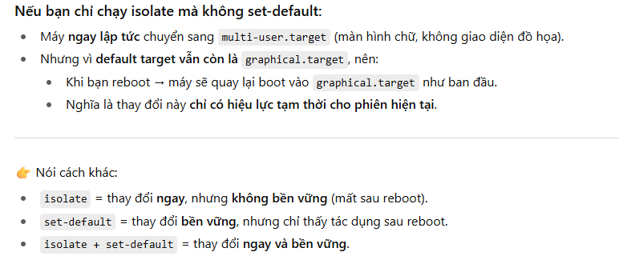

5.4 Đặt mục tiêu `multi-user` làm mục tiêu mặc định.

```
[student@`serverb` ~]$ sudo systemctl set-default multi-user.target
Removed /etc/systemd/system/default.target.
Created symlink /etc/systemd/system/default.target -> /usr/lib/systemd/system/multi-user.target.
```
5.5 Khởi động lại `serverb` và xác minh rằng mục tiêu `multi-user` được đặt làm mục tiêu mặc định.

```
[student@`serverb` ~]$ sudo systemctl reboot
Connection to `serverb` closed by remote host.
Connection to `serverb` closed.
[student@workstation ~]$
```
5.6 Sau khi hệ thống khởi động lại, hãy mở phiên SSH đến `serverb` với tư cách là người dùng student. Kiểm tra xem mục tiêu nhiều người dùng đã được đặt làm mục tiêu mặc định chưa.

```
[student@workstation ~]$ ssh student@`serverb`
...output omitted...
[student@`serverb` ~]$ systemctl get-default
multi-user.target
```

6. Trên `serverb`, hãy lên lịch một tác vụ định kỳ với tư cách là người dùng student, thực thi tập lệnh /home/student/backup-home.sh hàng giờ từ 19:00 đến 21:00 tất cả các ngày trừ Thứ Bảy và Chủ Nhật. Sử dụng tập lệnh backup-home.sh để lên lịch tác vụ định kỳ. Tải xuống tập lệnh sao lưu từ http://materials.example.com/labs/backup-home.sh. Chạy lệnh dưới dạng tệp thực thi.

6.1 Trên `serverb`, tải xuống tập lệnh sao lưu từ http://materials.example.com/labs/backup-home.sh. Sử dụng chmod để thực thi tập lệnh sao lưu.

```
[student@`serverb` ~]$ wget http://materials.example.com/labs/backup-home.sh
...output omitted...
[student@`serverb` ~]$ chmod +x backup-home.sh
```
6.2 Mở tệp crontab bằng trình soạn thảo văn bản mặc định.

```
[student@`serverb` ~]$ crontab -e

```
6.3 Edit the file to add the following line:


```
0 19-21 * * Mon-Fri /home/student/backup-home.sh

```
Save the changes and exit the editor.

Note:
- Mon – Monday
- Tue – Tuesday
- Wed – Wednesday
- Thu – Thursday
- Fri – Friday
- Sat – Saturday
- Sun – Sunday

6.4 Use the crontab -l command to list the scheduled recurring jobs.


```
[student@`serverb` ~]$ crontab -l
0 19-21 * * Mon-Fri /home/student/backup-home.sh
```
7. Khởi động lại `serverb` và đợi quá trình khởi động hoàn tất trước khi chấm điểm.

```
[student@`serverb` ~]$ sudo systemctl reboot
[sudo] password for student: student
Connection to `serverb` closed by remote host.
Connection to `serverb` closed.
[student@workstation ~]$
```


## 14.3 Lab: Configure and Manage File Systems and Storage

Nếu bạn dự định thi RHCSA, hãy áp dụng cách sau để tối đa hóa lợi ích của bài Đánh giá Toàn diện này: làm bài tập thực hành mà không cần xem nút đáp án hoặc tham khảo nội dung khóa học. Sử dụng bảng chấm điểm để đánh giá tiến độ của bạn khi hoàn thành mỗi bài tập thực hành.

Tạo một ổ đĩa logic, gắn hệ thống tệp mạng và tạo một phân vùng hoán đổi được tự động kích hoạt khi khởi động. Bạn cũng cấu hình các thư mục để lưu trữ các tệp tạm thời.

Kết quả
- Tạo một ổ đĩa logic.
- Gắn hệ thống tệp mạng.
- Tạo một phân vùng swap được tự động kích hoạt khi khởi động.
- Cấu hình một thư mục để lưu trữ các tệp tạm thời.

Thông số kỹ thuật
- Trên `serverb`, cấu hình một ổ đĩa logic vol_home 1 GB mới trong một nhóm ổ đĩa extra_storage 2 GB mới. Sử dụng đĩa `/dev/vdb `chưa phân vùng để tạo phân vùng.
- Định dạng ổ đĩa logic vol_home với kiểu hệ thống tệp XFS và gắn kết liên tục vào thư mục `/user-homes`.
- Trên `serverb`, gắn kết liên tục hệ thống tệp mạng `/share` mà `servera` xuất vào thư mục `/local-share`. Máy `servera` sẽ xuất đường dẫn ``servera`.lab.example.com:/share`.
- Trên `serverb`, tạo một phân vùng swap 512 MB trên đĩa `/dev/vdc`. Gắn kết liên tục phân vùng swap.
- Tạo nhóm người dùng `production`. Tạo người dùng `production1`, `production2`, `production3` và `production4` với nhóm `production` là nhóm bổ sung của họ.
- Trên `serverb`, cấu hình thư mục `/run/volatile` để lưu trữ các tệp tạm thời. Nếu các tệp trong thư mục này không được truy cập trong hơn 30 giây, hệ thống sẽ tự động xóa chúng. Hãy đặt 0700 làm octal permission cho thư mục. Sử dụng tệp `/etc/tmpfiles.d/volatile.conf` để cấu hình xóa theo thời gian các tệp trong thư mục `/run/volatile`.

1. Trên `serverb`, hãy cấu hình một ổ đĩa logic vol_home 1 GiB mới trong một nhóm ổ đĩa extra_storage 2 GiB mới. Sử dụng đĩa `/dev/vdb` chưa phân vùng để tạo phân vùng.


1.1 Log in to `serverb` as the student user and switch to the root user.


```
[student@workstation ~]$ ssh student@`serverb`
...output omitted...
[student@`serverb` ~]$ sudo -i
[sudo] password for student: student
[root@`serverb` ~]#

```
1.2 Create a 2 GiB partition on the /dev/vdb disk.


```

[root@`serverb` ~]# parted /dev/vdb mklabel msdos
...output omitted...
[root@`serverb` ~]# parted /dev/vdb mkpart primary 1MiB 2GiB
...output omitted...
[root@`serverb` ~]# parted /dev/vdb set 1 lvm on
...output omitted...
```
1.3 Khai báo thiết bị khối /dev/vdb1 là một ổ đĩa vật lý.

```
[root@`serverb` ~]# pvcreate /dev/vdb1
...output omitted...

```
1.4 Tạo nhóm ổ đĩa extra_storage với phân vùng /dev/vdb1.

```
[root@`serverb` ~]# vgcreate extra_storage /dev/vdb1
...output omitted...

```
1.5 Tạo ổ đĩa logic vol_home 1 GiB.

```
[root@`serverb` ~]# lvcreate -L 1GiB -n vol_home extra_storage
...output omitted...

```

2. Định dạng ổ đĩa logic vol_home theo kiểu hệ thống tệp XFS và gắn ổ đĩa này liên tục vào thư mục /user-homes.

2.1 Create the /user-homes directory.


```
[root@`serverb` ~]# mkdir /user-homes

```
2.2 Định dạng phân vùng /dev/extra_storage/vol_home với loại hệ thống tệp XFS.
```
[root@`serverb` ~]# mkfs -t xfs /dev/extra_storage/vol_home
...output omitted...

```
2.3 Gắn liên tục phân vùng /dev/extra_storage/vol_home vào thư mục /user-homes. Sử dụng UUID của phân vùng cho mục nhập tệp /etc/fstab.

```
[root@`serverb` ~]# lsblk -o UUID /dev/extra_storage/vol_home
UUID
988cf149-0667-4733-abca-f80c6ec50ab6
[root@`serverb` ~]# echo "UUID=988c...0ab6 /user-homes xfs defaults 0 0" \
>> /etc/fstab
[root@`serverb` ~]# mount /user-homes
```

3.  Trên `serverb`, hãy liên tục gắn hệ thống tệp mạng /share mà `servera` xuất vào thư mục /local-share. Máy `servera` sẽ xuất đường dẫn `servera`.lab.example.com:/share.

3.1 Create the /local-share directory.


```
[root@`serverb` ~]# mkdir /local-share

```
3.2 Thêm mục nhập thích hợp vào tệp /etc/fstab để gắn kết liên tục hệ thống tệp mạng `servera`.lab.example.com:/share.

```
[root@`serverb` ~]# echo "`servera`.lab.example.com:/share /local-share \
nfs rw,sync 0 0" >> /etc/fstab
```
3.3 Gắn hệ thống tập tin mạng vào thư mục /local-share.

```
[root@`serverb` ~]# mount /local-share

```

4. Trên `serverb`, tạo một phân vùng swap 512 MiB trên ổ đĩa `/dev/vdc`. Kích hoạt và gắn kết liên tục phân vùng swap này.

4.1 Tạo phân vùng 512 MiB trên disk `/dev/vdc`.

``` 
[root@`serverb` ~]# parted /dev/vdc mklabel msdos
...output omitted...
[root@`serverb` ~]# parted /dev/vdc mkpart primary linux-swap 1MiB 513MiB
...output omitted...
```
4.2 Tạo không gian swap trên phân vùng `/dev/vdc1`.

```
[root@`serverb` ~]# mkswap /dev/vdc1
...output omitted...
```
4.3 Tạo một mục trong tệp /etc/fstab để gắn kết liên tục không gian hoán đổi. Sử dụng UUID của phân vùng để tạo mục trong tệp /etc/fstab. Kích hoạt không gian hoán đổi.

```
[root@`serverb` ~]# lsblk -o UUID /dev/vdc1
UUID
cc18ccb6-bd29-48a5-8554-546bf3471b69
[root@`serverb` ~]# echo "UUID=cc18...1b69 swap swap defaults 0 0" >> /etc/fstab
[root@`serverb` ~]# swapon -a
```
5. Tạo nhóm người dùng production. Sau đó, tạo người dùng production1, production2, production3 và production4 với nhóm production là nhóm bổ sung.

```
[root@`serverb` ~]# groupadd production
[root@`serverb` ~]# for i in 1 2 3 4; do useradd -G production production$i; done
```

Note 
- -G: ghi đè toàn bộ danh sách nhóm phụ hiện có.
- -aG : Thêm user vào nhóm phụ mới mà không xóa các nhóm phụ đang có.

6. Trên `serverb`, hãy cấu hình thư mục `/run/volatile` để lưu trữ các tệp tạm thời. Nếu các tệp trong thư mục này không được truy cập trong hơn 30 giây, hệ thống sẽ tự động xóa chúng. Đặt 0700 làm quyền octal cho thư mục. Sử dụng tệp `/etc/tmpfiles.d/volatile.conf` để cấu hình xóa các tệp trong thư mục /run/volatile theo thời gian.

6.1 Tạo tệp `/etc/tmpfiles.d/volatile.conf` với nội dung sau:

```
# Type Path          Mode  UID  GID  Age   Argument
d /run/volatile 0700 root root 30s
```

Note:
- Age (theo man tmpfiles.d)
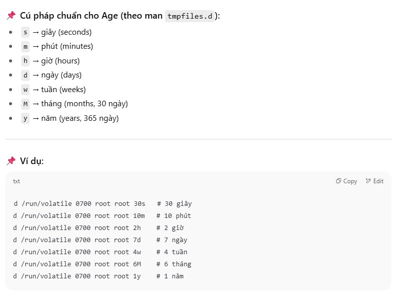

6.2 Sử dụng lệnh systemd-tmpfiles `--create` để tạo thư mục` /run/volatile` nếu nó không tồn tại.

```
[root@`serverb` ~]# systemd-tmpfiles --create /etc/tmpfiles.d/volatile.conf
```
Note:
- `--create` → đảm bảo thư mục được tạo đúng mode/owner.
- `--clean` → xóa các file quá hạn theo cấu hình (ở đây là >30 giây không truy cập). 

Có 2 cách để dọn dẹp:

- Thủ công: khi bạn muốn test/ép hệ thống dọn rác ngay lập tức → dùng:
```
sudo systemd-tmpfiles --clean /etc/tmpfiles.d/volatile.conf
```

- Tự động: trong thực tế, systemd-tmpfiles được gọi định kỳ bởi systemd-tmpfiles-clean.timer.
  - File timer này chạy tự động (thường là 1h/lần hoặc theo cài đặt distro).
  - Khi tới lịch, systemd sẽ gọi systemd-tmpfiles --clean cho tất cả config trong /usr/lib/tmpfiles.d/, /etc/tmpfiles.d/, /run/tmpfiles.d/.


6.3 Return to the workstation machine as the student user.


```
[root@`serverb` ~]# exit
logout
[student@`serverb` ~]$ exit
logout
Connection to `serverb` closed.
```

## 14.4 Lab: Configure and Manage Server Security

Cấu hình xác thực dựa trên khóa SSH, thay đổi cài đặt tường lửa, điều chỉnh chế độ SELinux và biến Boolean SELinux, đồng thời khắc phục sự cố SELinux.

Kết quả
- Cấu hình xác thực dựa trên khóa SSH.
- Cấu hình cài đặt tường lửa.
- Điều chỉnh chế độ SELinux và biến Boolean SELinux.
- Khắc phục sự cố SELinux.

Thông số kỹ thuật
- Trên ``serverb``, tạo cặp khóa SSH cho người dùng student. Không bảo vệ khóa riêng bằng mật khẩu.
- Cấu hình người dùng student trên `servera` để chấp nhận xác thực đăng nhập bằng cặp khóa SSH mà bạn đã tạo trên máy `serverb`. Người dùng student trên `serverb` phải có thể đăng nhập vào `servera` qua SSH mà không cần nhập mật khẩu.
- Trên `servera`, kiểm tra quyền thư mục /user-homes/production5. Sau đó, cấu hình SELinux để chạy ở chế độ cho phép theo mặc định.
- Trên `serverb`, xác minh rằng thư mục /localhome không tồn tại. Sau đó, cấu hình thư mục home của người dùng production5 để gắn hệ thống tệp mạng /user-homes/production5. Máy `servera`.lab.example.com xuất hệ thống tệp dưới dạng chia sẻ NFS `servera`.lab.example.com:/user-homes/production5. Sử dụng dịch vụ autofs để gắn kết chia sẻ mạng. Xác minh rằng dịch vụ autofs tạo thư mục /localhome/production5 với cùng quyền như trên `servera`.
- Trên `serverb`, hãy điều chỉnh SELinux Boolean phù hợp để người dùng production5 có thể sử dụng thư mục home được gắn NFS sau khi xác thực bằng khóa SSH. Nếu cần, hãy sử dụng redhat làm mật khẩu của người dùng production5.
- Trên `serverb`, hãy điều chỉnh cài đặt tường lửa để chặn tất cả các yêu cầu kết nối từ máy `servera`. Sử dụng địa chỉ IPv4 của `servera` (172.25.250.10) để cấu hình quy tắc tường lửa.
- Trên `serverb`, hãy điều tra và khắc phục sự cố liên quan đến dịch vụ web Apache đang gặp sự cố, dịch vụ này đang lắng nghe trên cổng 30080/TCP để nhận kết nối. Điều chỉnh cài đặt tường lửa phù hợp để cổng 30080/TCP được mở cho các kết nối đến.

1. Trên `serverb`, hãy tạo cặp khóa SSH cho người dùng student. Không bảo vệ khóa riêng bằng cụm mật khẩu.

1.1 Log in to `serverb` as the student user.


```
[student@workstation ~]$ ssh student@`serverb`
...output omitted...
```
1.2 Sử dụng lệnh ssh-keygen để tạo cặp khóa SSH. Không bảo vệ khóa riêng bằng cụm mật khẩu.

```
[student@`serverb` ~]$ ssh-keygen
Generating public/private rsa key pair.
Enter file in which to save the key (/home/student/.ssh/id_rsa): Enter
Created directory '/home/student/.ssh'.
Enter passphrase (empty for no passphrase): Enter
Enter same passphrase again: Enter
Your identification has been saved in /home/student/.ssh/id_rsa.
Your public key has been saved in /home/student/.ssh/id_rsa.pub.
The key fingerprint is:
SHA256:+ijpGqjEQSGBR8ORNchiRTHw/URQksVdHjsHqVBXeYI student@`serverb`.lab.example.com
The key's randomart image is:
+---[RSA 3072]----+
|+BBX+o*+o..=+..  |
|+.O.oooo .oE+o . |
|.+ . . .. .+ .o  |
|.     o  .  o    |
| .     .S        |
|...    .         |
|.o.  ..          |
|o  .o  o         |
|. .o... .        |
+----[SHA256]-----+
```

2. Cấu hình người dùng student trên `servera` để chấp nhận xác thực đăng nhập bằng cặp khóa SSH mà bạn đã tạo trên máy `serverb`. Người dùng student trên `serverb` phải có thể đăng nhập vào `servera` qua SSH mà không cần nhập mật khẩu.

2.1 Gửi khóa công khai của cặp khóa SSH mới tạo tới người dùng student trên máy chủ.

```
[student@`serverb` ~]$ ssh-copy-id student@`servera`
/usr/bin/ssh-copy-id: INFO: Source of key(s) to be installed: "/home/student/.ssh/id_rsa.pub"
The authenticity of host '`servera` (172.25.250.10)' can't be established.
ED25519 key fingerprint is SHA256:shYfoFG0Nnv42pv7j+HG+FISmCAm4Bh5jfjwwSMJbrw.
This key is not known by any other names
Are you sure you want to continue connecting (yes/no/[fingerprint])? yes
/usr/bin/ssh-copy-id: INFO: attempting to log in with the new key(s), to filter out any that are already installed
/usr/bin/ssh-copy-id: INFO: 1 key(s) remain to be installed -- if you are prompted now it is to install the new keys
student@`servera`'s password: student

Number of key(s) added: 1

Now try logging in to the machine, with:   "ssh 'student@`servera`'"
and check to make sure that only the key(s) you wanted were added.
```
2.2 Xác minh rằng người dùng student có thể đăng nhập vào `servera` từ `serverb` mà không cần nhập mật khẩu. Không đóng kết nối.

```
[student@`serverb` ~]$ ssh student@`servera`
...output omitted...
[student@`servera` ~]$

```

3. Trên máy chủ, hãy xác minh quyền thư mục /user-homes/production5. Sau đó, cấu hình SELinux để chạy ở chế độ cho phép theo mặc định.

3.1 Xác minh quyền của thư mục /user-homes/production5.

```
[student@`servera` ~]$ ls -ld /user-homes/production5
drwx------. 2 production5 production5 62 May  6 05:27 /user-homes/production5
```
3.2 Chỉnh sửa tệp /etc/sysconfig/selinux để đặt tham số SELINUX thành giá trị cho phép.

```
[student@`servera` ~]$ sudo vi /etc/sysconfig/selinux
...output omitted...
#SELINUX=enforcing
SELINUX=permissive
...output omitted...
```
3.3 Reboot the system.


```
[student@`servera` ~]$ sudo systemctl reboot
Connection to `servera` closed by remote host.
Connection to `servera` closed.
[student@`serverb` ~]$
```
4. Trên `serverb`, hãy kiểm tra xem thư mục /localhome không tồn tại. Sau đó, cấu hình thư mục home của người dùng production5 để mount hệ thống tệp mạng /user-homes/production5. Máy `servera`.lab.example.com sẽ xuất hệ thống tệp dưới dạng chia sẻ NFS `servera`.lab.example.com:/user-homes/production5. Sử dụng dịch vụ autofs để mount chia sẻ mạng. Kiểm tra xem dịch vụ autofs có tạo thư mục /localhome/production5 với cùng quyền như trên `servera` không.

4.1 Verify that the /localhome directory does not exist.


```
[student@`serverb` ~]$ ls -ld /localhome
ls: cannot access '/localhome': No such file or directory
```
4.2 On `serverb`, switch to the root user.


```
[student@`serverb` ~]$ sudo -i
[sudo] password for student: student
[root@`serverb` ~]#
```
4.3 Install the autofs package.


```
[root@`serverb` ~]# dnf install autofs
...output omitted...
Is this ok [y/N]: y
...output omitted...
Installed:
  autofs-1:5.1.7-27.el9.x86_64     libsss_autofs-2.6.2-2.el9.x86_64

Complete!
```
4.4 Tạo tệp bản đồ /etc/auto.master.d/production5.autofs với nội dung sau:

```
/- /etc/auto.production5

```
4.5 Xác định thư mục gốc của người dùng production5.

```
[root@`serverb` ~]# getent passwd production5
production5:x:5001:5001::/localhome/production5:/bin/bash
```
4.6 Tạo tệp /etc/auto.production5 với nội dung sau:

```
/localhome/production5 -rw `servera`.lab.example.com:/user-homes/production5

```
4.7 Khởi động lại dịch vụ autofs.

```
[root@`serverb` ~]# systemctl restart autofs

```
4.8 Xác minh rằng dịch vụ autofs tạo thư mục /localhome/production5 trên `serverb` với cùng quyền như thư mục /user-homes/production5 trên `servera`.

```
[root@`serverb` ~]# ls -ld /localhome/production5
drwx------. 2 production5 production5 62 May  6 05:52 /localhome/production5
```

Lưu ý
Dịch vụ autofs hiển thị đúng quyền khi bạn thử truy cập thư mục chia sẻ /localhome/production5. Trước khi bạn truy cập thư mục này, quyền tệp hiển thị sai rằng thư mục có root là chủ sở hữu người dùng và chủ sở hữu nhóm. Sau khi bạn thử truy cập thư mục /localhome/production5, các quyền chính xác sẽ được hiển thị, trong đó production5 là chủ sở hữu người dùng và chủ sở hữu nhóm.

5. Trên `serverb`, hãy điều chỉnh giá trị Boolean SELinux phù hợp để người dùng production5 có thể sử dụng thư mục gốc được gắn NFS sau khi xác thực bằng khóa SSH. Nếu cần, hãy sử dụng redhat làm mật khẩu cho người dùng production5.

5.1 Mở một cửa sổ terminal mới và xác minh từ `servera` rằng người dùng production5 không thể đăng nhập vào `serverb` bằng xác thực dựa trên khóa SSH. Một SELinux Boolean đang ngăn người dùng đăng nhập. Từ `workstation`, hãy mở một terminal mới và đăng nhập vào `servera` với tư cách là người dùng student.
```
[student@workstation ~]$ ssh student@`servera`
...output omitted...
[student@`servera` ~]$
```
5.2 Chuyển sang người dùng production5. Khi được nhắc, hãy sử dụng redhat làm mật khẩu của người dùng production5.

```
[student@`servera` ~]$ su - production5
Password: redhat
[production5@`servera` ~]$
```
5.3 Generate an SSH key pair.


```
[production5@`servera` ~]$ ssh-keygen
Generating public/private rsa key pair.
Enter file in which to save the key (/home/production5/.ssh/id_rsa): Enter
Created directory '/home/production5/.ssh'.
Enter passphrase (empty for no passphrase): Enter
Enter same passphrase again: Enter
Your identification has been saved in /home/production5/.ssh/id_rsa.
Your public key has been saved in /home/production5/.ssh/id_rsa.pub.
The key fingerprint is:
SHA256:AbUcIBXneyiGIhr4wS1xzs3WqDvbTP+eZuSRn9HQ/cw production5@`servera`.lab.example.com
The key's randomart image is:
+---[RSA 3072]----+
|    ..=++        |
|     . = o       |
|  . .   =    . . |
|.. * + o +  . . .|
|+ = = B S .. o o.|
|.+ + + . .+ . . E|
|. . . .  o o o   |
|    .= .  +.o    |
|    ooo .=+      |
+----[SHA256]-----+
```
5.4 Chuyển khóa công khai của cặp khóa SSH cho người dùng production5 trên máy `serverb`. Khi được nhắc, hãy sử dụng redhat làm mật khẩu của người dùng production5.

```
[production5@`servera` ~]$ ssh-copy-id production5@`serverb`
/usr/bin/ssh-copy-id: INFO: Source of key(s) to be installed: "/home/production5/.ssh/id_rsa.pub"
The authenticity of host '`serverb` (172.25.250.11)' can't be established.
ECDSA key fingerprint is SHA256:ciCkaRWF4g6eR9nSdPxQ7KL8czpViXal6BousK544TY.
Are you sure you want to continue connecting (yes/no)? yes
/usr/bin/ssh-copy-id: INFO: attempting to log in with the new key(s), to filter out any that are already installed
/usr/bin/ssh-copy-id: INFO: 1 key(s) remain to be installed -- if you are prompted now it is to install the new keys
production5@`serverb`'s password: redhat

Number of key(s) added: 1

Now try logging in to the machine, with:   "ssh 'production5@`serverb`'"
and check to make sure that only the key(s) you wanted were added.
```
5.5 Sử dụng xác thực dựa trên khóa công khai SSH thay vì xác thực dựa trên mật khẩu để đăng nhập vào `serverb` với tư cách là người dùng production5. Lệnh này sẽ không thành công.

```
[production5@`servera` ~]$ ssh -o pubkeyauthentication=yes \
-o passwordauthentication=no production5@`serverb`
production5@`serverb`: Permission denied (publickey,gssapi-keyex,gssapi-with-mic,password).
```
5.6 Trên thiết bị đầu cuối được kết nối với `serverb` với tư cách là người dùng root, hãy đặt use_nfs_home_dirs SELinux Boolean thành true.

```
[root@`serverb` ~]# setsebool -P use_nfs_home_dirs true

```
5.7 Quay lại terminal được kết nối với `servera` với tư cách là người dùng production5 và sử dụng xác thực dựa trên khóa công khai SSH thay vì xác thực dựa trên mật khẩu để đăng nhập vào `serverb` với tư cách là người dùng production5. Lệnh này sẽ thành công.

```
[production5@`servera` ~]$ ssh -o pubkeyauthentication=yes \
-o passwordauthentication=no production5@`serverb`
...output omitted...
[production5@`serverb` ~]$
```
5.8  Thoát và đóng terminal được kết nối với `serverb` với tư cách là người dùng production5. Vẫn mở terminal được kết nối với `serverb` với tư cách là người dùng root.


6. Trên `serverb`, hãy điều chỉnh cài đặt tường lửa để chặn tất cả các yêu cầu kết nối đến từ máy `servera`. Sử dụng địa chỉ IPv4 của `servera` (172.25.250.10) để cấu hình quy tắc tường lửa.

6.1 Add the IPv4 address of `servera` to the block zone.


```
[root@`serverb` ~]# firewall-cmd --add-source=172.25.250.10/32 \
--zone=block --permanent
success
```
6.2 Reload the changes in the firewall settings.
```
[root@`serverb` ~]# firewall-cmd --reload
success
```

7. Trên `serverb`, hãy kiểm tra và khắc phục sự cố liên quan đến dịch vụ web Apache đang gặp sự cố, hiện đang lắng nghe kết nối trên cổng 30080/TCP. Điều chỉnh cài đặt tường lửa phù hợp để cổng 30080/TCP được mở cho các kết nối đến.

7.1 Khởi động lại dịch vụ httpd. Lệnh này không khởi động lại được dịch vụ.

```
[root@`serverb` ~]# systemctl restart httpd.service
Job for httpd.service failed because the control process exited with error code.
See "systemctl status httpd.service" and "journalctl -xeu httpd.service" for details.
```
7.2 Kiểm tra lý do dịch vụ httpd bị lỗi. Lỗi cấp phép cho biết daemon httpd không liên kết được với cổng 30080/TCP khi khởi động. Chính sách SELinux có thể ngăn ứng dụng liên kết với cổng không chuẩn. Nhấn q để thoát lệnh.
```
[root@`serverb` ~]# systemctl status httpd.service
× httpd.service - The Apache HTTP Server
     Loaded: loaded (/usr/lib/systemd/system/httpd.service; disabled; vendor preset: disabled)
     Active: failed (Result: exit-code) since Mon 2022-05-02 13:20:46 EDT; 29s ago
       Docs: man:httpd.service(8)
    Process: 2322 ExecStart=/usr/sbin/httpd $OPTIONS -DFOREGROUND (code=exited, status=1/FAILURE)
   Main PID: 2322 (code=exited, status=1/FAILURE)
     Status: "Reading configuration..."
        CPU: 30ms

May 02 13:20:46 `serverb`.lab.example.com systemd[1]: Starting The Apache HTTP Server...
May 02 13:20:46 `serverb`.lab.example.com httpd[2322]: (13)Permission denied: AH00072: make_sock: could not bind to address [::]:30080
May 02 13:20:46 `serverb`.lab.example.com httpd[2322]: (13)Permission denied: AH00072: make_sock: could not bind to address 0.0.0.0:30080
May 02 13:20:46 `serverb`.lab.example.com httpd[2322]: no listening sockets available, shutting down
...output omitted...
```
7.3 Xác định xem chính sách SELinux có đang ngăn dịch vụ httpd liên kết với cổng 30080/TCP hay không. Thông báo nhật ký cho thấy cổng 30080/TCP không có ngữ cảnh SELinux http_port_t phù hợp, do đó SELinux ngăn dịch vụ httpd liên kết với cổng. Thông báo nhật ký cũng tạo ra cú pháp của lệnh semanage port để bạn có thể khắc phục sự cố.
```
[root@`serverb` ~]# sealert -a /var/log/audit/audit.log
...output omitted...
SELinux is preventing /usr/sbin/httpd from name_bind access on the tcp_socket port 30080.

*****  Plugin bind_ports (92.2 confidence) suggests   ************************

If you want to allow /usr/sbin/httpd to bind to network port 30080
Then you need to modify the port type.
Do
# semanage port -a -t PORT_TYPE -p tcp 30080
    where PORT_TYPE is one of the following: http_cache_port_t, http_port_t, jboss_management_port_t, jboss_messaging_port_t, ntop_port_t, puppet_port_t.
...output omitted...
```
7.4 Đặt ngữ cảnh SELinux phù hợp trên cổng 30080/TCP để dịch vụ httpd liên kết với nó.

```
[root@`serverb` ~]# semanage port -a -t http_port_t -p tcp 30080

```
7.5 Khởi động lại dịch vụ httpd. Lệnh này sẽ khởi động lại dịch vụ thành công.

```
[root@`serverb` ~]# systemctl restart httpd

```
7.6 Thêm cổng 30080/TCP vào vùng công cộng mặc định.

```
[root@`serverb` ~]# firewall-cmd --add-port=30080/tcp --permanent
success
[root@`serverb` ~]# firewall-cmd --reload
success
```
7.7 Return to the workstation machine as the student user.


```
[root@`serverb` ~]# exit
logout
[student@`serverb` ~]$ exit
logout
Connection to `serverb` closed.
```

## 14.5 Lab: Run Containers
Tạo các container tách biệt không có root.

Kết quả

Tạo các container tách biệt không có root.

Cấu hình ánh xạ cổng và lưu trữ liên tục.

Cấu hình container dưới dạng dịch vụ systemd và sử dụng lệnh systemctl để quản lý nó.

Thông số kỹ thuật

Trên `serverb`, hãy cấu hình người dùng podmgr với mật khẩu là redhat và thiết lập các công cụ phù hợp cho người dùng podmgr để quản lý các container cho bài đánh giá toàn diện này. Cấu hình registry.lab.example.com làm registry từ xa. Sử dụng admin làm người dùng và redhat321 làm mật khẩu để xác thực với registry. Bạn có thể sử dụng tệp /tmp/review4/registries.conf để cấu hình registry.

Thư mục /tmp/review4/container-dev chứa hai thư mục chứa các tệp phát triển cho các container trong bài đánh giá toàn diện này. Sao chép hai thư mục trong thư mục /tmp/review4/container-dev vào thư mục home của podmgr. Cấu hình thư mục con /home/podmgr/storage/database để bạn có thể sử dụng nó làm bộ nhớ lưu trữ liên tục cho một container.

Tạo container tách biệt db-app01 dựa trên hình ảnh container registry.lab.example.com/rhel9/mariadb-105. Sử dụng thư mục /home/podmgr/storage/database làm bộ nhớ lưu trữ cố định cho thư mục /var/lib/mysql/data của vùng chứa db-app01. Ánh xạ cổng 13306 trên máy cục bộ thành cổng 3306 trong vùng chứa. Sử dụng các giá trị trong bảng sau để thiết lập các biến môi trường nhằm tạo cơ sở dữ liệu được chứa trong vùng chứa:

Variable	|Value
---|---
MYSQL_USER	|developer
MYSQL_PASSWORD	|redhat
MYSQL_DATABASE	|inventory
MYSQL_ROOT_PASSWORD	|redhat

Tạo một tệp dịch vụ systemd để quản lý vùng chứa db-app01. Cấu hình dịch vụ systemd sao cho khi bạn khởi động dịch vụ, daemon systemd sẽ giữ nguyên vùng chứa gốc. Khởi động và kích hoạt vùng chứa như một dịch vụ systemd. Cấu hình vùng chứa db-app01 để khởi động cùng hệ thống.

Sao chép tập lệnh /home/podmgr/db-dev/inventory.sql vào thư mục /tmp của vùng chứa db-app01 và thực thi tập lệnh bên trong vùng chứa. Nếu bạn đã thực thi tập lệnh cục bộ, bạn sẽ sử dụng lệnh mysql -u root inventory < /tmp/inventory.sql.

Sử dụng tệp vùng chứa trong thư mục /home/podmgr/http-dev để tạo vùng chứa http-app01 tách biệt. Tên ảnh vùng chứa phải là http-client:9.0. Ánh xạ cổng 8080 trên máy cục bộ với cổng 8080 trong vùng chứa.

Sử dụng lệnh curl để truy vấn nội dung của vùng chứa http-app01. Xác minh rằng đầu ra của lệnh hiển thị tên vùng chứa của máy khách và trạng thái của cơ sở dữ liệu là đang hoạt động.

1. Trên `serverb`, hãy cấu hình người dùng podmgr với mật khẩu là redhat và thiết lập các công cụ phù hợp cho người dùng podmgr để quản lý các container cho bài đánh giá toàn diện này. Cấu hình registry.lab.example.com làm registry từ xa. Sử dụng admin làm người dùng và redhat321 làm mật khẩu để xác thực. Bạn có thể sử dụng tệp /tmp/review4/registries.conf để cấu hình registry.

1.1 Log in to `serverb` as the student user.


```
[student@workstation ~]$ ssh student@`serverb`
...output omitted...
[student@`serverb` ~]$

```
1.2 Install the container-tools meta-package.


```
[student@`serverb` ~]$ sudo dnf install container-tools
[sudo] password for student: student
...output omitted...
Is this ok [y/N]: y
...output omitted...
Complete!
```
1.3 Tạo người dùng podmgr và đặt redhat làm mật khẩu cho người dùng.

```
[student@`serverb` ~]$ sudo useradd podmgr
[student@`serverb` ~]$ sudo passwd podmgr
Changing password for user podmgr.
New password: redhat
BAD PASSWORD: The password is shorter than 8 characters
Retype new password: redhat
passwd: all authentication tokens updated successfully.
```
1.4 Thoát khỏi phiên người dùng student. Đăng nhập vào máy `serverb` với tư cách người dùng podmgr. Nếu được yêu cầu, hãy sử dụng redhat làm mật khẩu.

```
[student@`serverb` ~]$ exit
logout
Connection to `serverb` closed.
[student@workstation ~]$ ssh podmgr@`serverb`
...output omitted...
[podmgr@`serverb` ~]$
```
1.5 Create the ~/.config/containers directory.


```
[podmgr@`serverb` ~]$ mkdir -p ~/.config/containers

```
1.6 Sao chép tệp /tmp/review4/registries.conf vào thư mục cấu hình vùng chứa trong thư mục gốc.

```
[podmgr@`serverb` ~]$ cp /tmp/review4/registries.conf ~/.config/containers/

```
1.7 Đăng nhập vào sổ đăng ký để xác minh cấu hình.

```
[podmgr@`serverb` ~]$ podman login registry.lab.example.com
Username: admin
Password: redhat321
Login Succeeded!
```

2. Thư mục /tmp/review4/container-dev chứa hai thư mục chứa các tệp phát triển cho các container trong bài đánh giá toàn diện này. Sao chép hai thư mục trong thư mục /tmp/review4/container-dev vào thư mục gốc của podmgr. Cấu hình thư mục con /home/podmgr/storage/database để bạn có thể sử dụng nó làm bộ nhớ lưu trữ cố định cho container.

2.1 Sao chép nội dung của thư mục /tmp/review4/container-dev vào thư mục gốc podmgr.

```
[podmgr@`serverb` ~]$ cp -r /tmp/review4/container-dev/*-dev .
[podmgr@`serverb` ~]$ ls -l
total 0
drwxr-xr-x. 2 podmgr podmgr 27 Jun 18 12:00 db-dev
drwxr-xr-x. 3 podmgr podmgr 42 Jun 18 12:00 http-dev
```
2.2 Tạo thư mục /home/podmgr/storage/database trong thư mục gốc của podmgr. Thiết lập quyền thích hợp cho thư mục này để container gắn nó vào bộ nhớ lưu trữ cố định.

```
[podmgr@`serverb` ~]$ mkdir -p storage/database
[podmgr@`serverb` ~]$ chmod 0777 storage/database
[podmgr@`serverb` ~]$ ls -l storage/
total 0
drwxrwxrwx. 2 podmgr podmgr 6 Jun 18 12:05 database
```

3. Tạo vùng chứa tách biệt db-app01 dựa trên ảnh vùng chứa registry.lab.example.com/rhel9/mariadb-105. Sử dụng thư mục /home/podmgr/storage/database làm bộ nhớ lưu trữ cố định cho thư mục /var/lib/mysql/data của vùng chứa db-app01. Ánh xạ cổng 13306 trên máy cục bộ thành cổng 3306 trong vùng chứa. Sử dụng các giá trị trong bảng sau để thiết lập các biến môi trường nhằm tạo cơ sở dữ liệu được chứa trong vùng chứa:

Variable	|Value
---|---
MYSQL_USER	|developer
MYSQL_PASSWORD	|redhat
MYSQL_DATABASE	|inventory
MYSQL_ROOT_PASSWORD	|redhat

3.1 Kiểm tra hình ảnh container registry.lab.example.com/rhel9/mariadb.

```
[podmgr@`serverb` ~]$ skopeo inspect \
docker://registry.lab.example.com/rhel9/mariadb-105
{
    "Name": "registry.lab.example.com/rhel9/mariadb-105",
    "Digest": "sha256:2bf8...fab8",
    "RepoTags": [
        "latest"
    ],
...output omitted...
```
3.2 Sử dụng ảnh container registry.lab.example.com/rhel9/mariadb-105 để tạo container db-app01 tách rời. Sử dụng thư mục /home/podmgr/storage/database làm bộ nhớ lưu trữ cố định cho container. Ánh xạ cổng 13306 sang cổng container 3306. Sử dụng dữ liệu trong bảng để thiết lập các biến môi trường cho container.
```
[podmgr@`serverb` ~]$ podman run -d --name db-app01 \
-e MYSQL_USER=developer \
-e MYSQL_PASSWORD=redhat \
-e MYSQL_DATABASE=inventory \
-e MYSQL_ROOT_PASSWORD=redhat \
-p 13306:3306 \
-v /home/podmgr/storage/database:/var/lib/mysql/data:Z \
registry.lab.example.com/rhel9/mariadb-105
...output omitted...
0959ba5df57dec2a478504df633a8cdb54aaad5c98a160de34d1d1b65f8435a6
[podmgr@`serverb` ~]$ podman ps -a
CONTAINER ID  IMAGE                                              COMMAND     CREATED         STATUS         PORTS                    NAMES
0959ba5df57d  registry.lab.example.com/rhel9/mariadb-105:latest  run-mysqld  16 seconds ago  Up 15 seconds  0.0.0.0:13306->3306/tcp  db-app01
```
4. Tạo một tệp dịch vụ systemd để quản lý vùng chứa db-app01. Cấu hình dịch vụ systemd sao cho khi bạn khởi động dịch vụ, daemon systemd sẽ giữ nguyên vùng chứa gốc. Khởi động và kích hoạt vùng chứa dưới dạng dịch vụ systemd. Cấu hình vùng chứa db-app01 để khởi động cùng hệ thống.

4.1 Tạo thư mục ~/.config/systemd/user/ cho tệp đơn vị chứa.
```
[podmgr@`serverb` ~]$ mkdir -p ~/.config/systemd/user/

```
4.2  Tạo tệp đơn vị systemd cho vùng chứa db-app01 và di chuyển tệp đơn vị này đến thư mục ~/.config/systemd/user/.

```
[podmgr@`serverb` ~]$ podman generate systemd --name db-app01 --files
/home/podmgr/container-db-app01.service
[podmgr@`serverb` ~]$ mv container-db-app01.service ~/.config/systemd/user/
```
4.3 Stop the db-app01 container.


```
[podmgr@`serverb` ~]$ podman stop db-app01
db-app01
[podmgr@`serverb` ~]$ podman ps -a
CONTAINER ID  IMAGE                                              COMMAND     CREATED        STATUS                    PORTS                    NAMES
0959ba5df57d  registry.lab.example.com/rhel9/mariadb-105:latest  run-mysqld  2 minutes ago  Exited (0) 2 seconds ago  0.0.0.0:13306->3306/tcp  db-app01
```
4.4 Tải lại dịch vụ systemd của người dùng để sử dụng đơn vị dịch vụ mới.

```
[podmgr@`serverb` ~]$ systemctl --user daemon-reload

```
4.5 Khởi động và kích hoạt đơn vị systemd cho vùng chứa db-app01.

```
[podmgr@`serverb` ~]$ systemctl --user enable --now container-db-app01
Created symlink /home/podmgr/.config/systemd/user/default.target.wants/container-db-app01.service → /home/podmgr/.config/systemd/user/container-db-app01.service.
[podmgr@`serverb` ~]$ systemctl --user status container-db-app01
● container-db-app01.service - Podman container-db-app01.service
     Loaded: loaded (/home/podmgr/.config/systemd/user/container-db-app01.service; enabled; preset: disabled)
     Active: active (running) since Fri 2024-06-18 12:18:45 EDT; 13s ago
...output omitted...
[podmgr@`serverb` ~]$ podman ps -a
CONTAINER ID  IMAGE                                              COMMAND     CREATED        STATUS        PORTS                    NAMES
0959ba5df57d  registry.lab.example.com/rhel9/mariadb-105:latest  run-mysqld  2 minutes ago  Up 2 minutes  0.0.0.0:13306->3306/tcp  db-app01
```
4.6 Sử dụng lệnh loginctl để cấu hình vùng chứa db-app01 để khởi động khi hệ thống khởi động.

```
[podmgr@`serverb` ~]$ loginctl enable-linger

```

5. Sao chép tập lệnh /home/podmgr/db-dev/inventory.sql vào thư mục /tmp của vùng chứa db-app01 và thực thi tập lệnh bên trong vùng chứa. Nếu bạn thực thi tập lệnh cục bộ, bạn sẽ sử dụng lệnh mysql -u root inventory < /tmp/inventory.sql.

5.1 Sao chép tập lệnh /home/podmgr/db-dev/inventory.sql vào thư mục /tmp của vùng chứa db-app01.

```
[podmgr@`serverb` ~]$ podman cp /home/podmgr/db-dev/inventory.sql \
db-app01:/tmp/inventory.sql
```
5.2 Thực thi tập lệnh inventory.sql trong vùng chứa db-app01.

```
[podmgr@`serverb` ~]$ podman exec -it db-app01 sh -c 'mysql -u root \
inventory < /tmp/inventory.sql'
```

6. Sử dụng tệp container trong thư mục /home/podmgr/http-dev để tạo container tách rời http-app01. Tên ảnh container phải là http-client:9.0. Ánh xạ cổng 8080 trên máy cục bộ với cổng 8080 trong container.

6.1 Tạo ảnh http-client:9.0 với tệp chứa trong thư mục /home/podmgr/http-dev.
```
[podmgr@`serverb` ~]$ podman build -t http-client:9.0 http-dev/
STEP 1/7: FROM registry.lab.example.com/rhel9/php-82:1-15
...output omitted...
```
6.2 Tạo vùng chứa http-app01 tách biệt. Ánh xạ cổng 8080 từ máy cục bộ sang cổng 8080 trong vùng chứa.

```
[podmgr@`serverb` ~]$ podman run -d --name http-app01 \
-p 8080:8080 localhost/http-client:9.0
[podmgr@`serverb` ~]$ podman ps -a
CONTAINER ID  IMAGE                                            COMMAND     CREATED         STATUS             PORTS                    NAMES
ba398d080e00  registry.lab.example.com/rhel9/mariadb-105:1-86  run-mysqld  20 minutes ago  Up 20 seconds ago  0.0.0.0:13306->3306/tcp  db-app01
ee424df19621  localhost/http-client:9.0                        /bin/sh -c   4 seconds ago  Up 4 seconds ago   0.0.0.0:8080->8080/tcp   http-app01
```


7. Truy vấn nội dung của container http-app01. Xác minh rằng nó hiển thị tên container của máy khách và trạng thái của cơ sở dữ liệu đang hoạt động. 

7.1 Xác minh rằng container http-app01 phản hồi các yêu cầu http.
```
[podmgr@`serverb` ~]$ curl 127.0.0.1:8080
This is the server http-app01 and the database is up
```

8. Return to the workstation machine as the student user.
```
[podmgr@`serverb` ~]$ exit
logout
Connection to `serverb` closed.
[student@workstation ~]$
```
