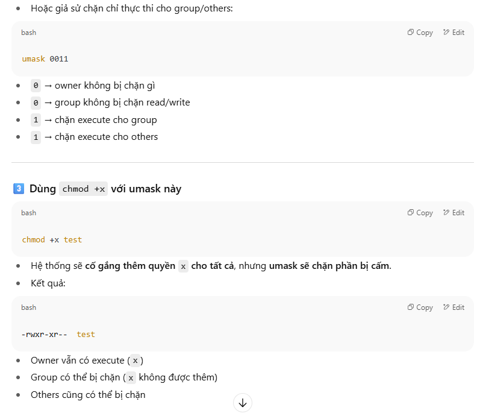
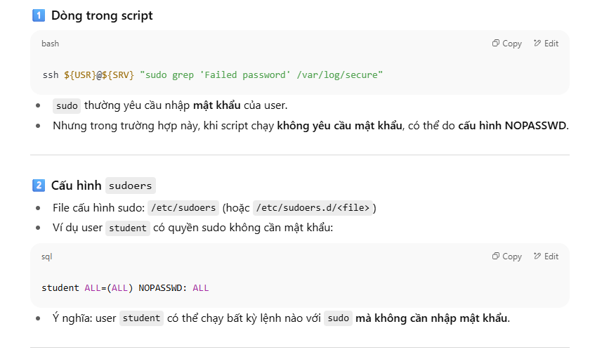
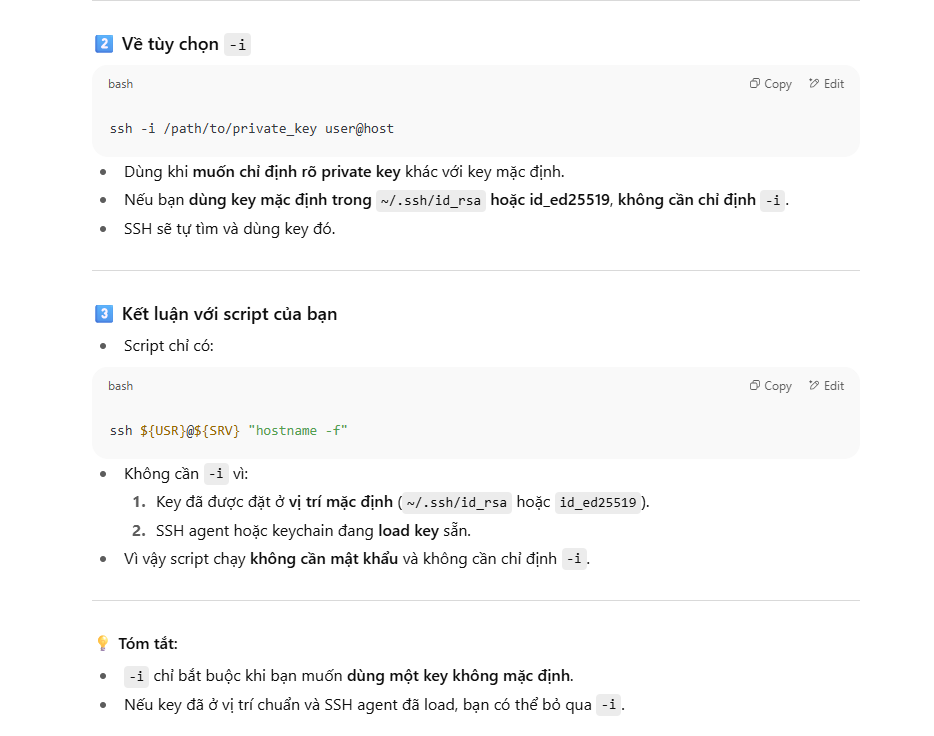
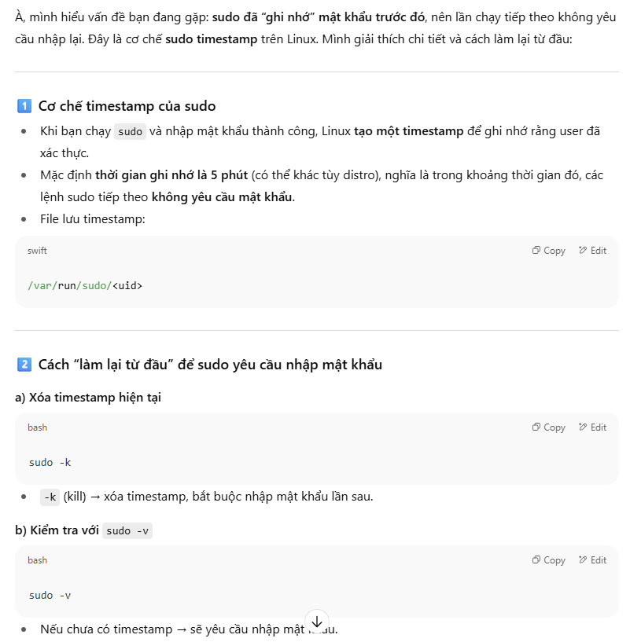

# CHAPTER 1 : Lab: Improve Command-line Productivity

Tạo một tập lệnh Bash có thể lọc và lấy thông tin liên quan từ các máy chủ khác nhau.

Kết quả
- Tạo một tập lệnh Bash và chuyển hướng đầu ra của nó vào một tệp.
- Sử dụng vòng lặp để đơn giản hóa mã của bạn.
- Lọc nội dung liên quan bằng cách sử dụng grep và biểu thức chính quy.

1. Tạo tệp lệnh thực thi `/home/student/bin/bash-lab` trên máy `workstation` . Nội dung ban đầu trong lệnh phải sử dụng chỉ thị thông dịch shebang.

Kiểm tra Bash shell nằm ở đâu bằng lệnh which hoặc type
```
[root@redhat9-server-1 ~]# which bash
/usr/bin/bash
[root@redhat9-server-1 ~]# type -a bash
bash is /usr/bin/bash

```
On the workstation machine, create the `/home/student/bin/` directory if needed.
```
[student@workstation ~]$ mkdir -p /home/student/bin
```
Use the vim command to create and edit the /home/student/bin/bash-lab script file.
```
[student@workstation ~]$ vim ~/bin/bash-lab
```
Insert the following text and save the file.
```
#!/usr/bin/bash
```
Make your script file executable.
```
[student@workstation ~]$ chmod a+x ~/bin/bash-lab
```
So sánh `chmod a+x` & `chmod +x`
| Lệnh | Ai được quyền thự thi?  |
| --- | --- |
| `chmod +x file`  | Thường là owner, có thể nhóm/others tùy umask |
| `chmod a+x file` | Owner, nhóm và mọi người khác **chắc chắn**   |



2. Chỉnh sửa tệp script mới tạo của bạn để lưu trữ *thông tin sau* từ máy servera và serverb trên máy trạm. Hệ thống sử dụng khóa SSH để xác thực, do đó bạn không cần mật khẩu. Lưu trữ kết quả đầu ra của các lệnh được liệt kê từ bảng sau vào các tệp `/home/student/output-servera` và `/home/student/output-serverb` tương ứng trên máy trạm. Sử dụng dấu thăng (#) để phân biệt kết quả đầu ra của các lệnh liên tiếp trong tệp đầu ra.

Command or file	| Content requested | Muc tieu
---|---|---
hostname -f | Lưu trữ toàn bộ đầu ra| tên đầy đủ của host (hostname)
echo "#####"| Thêm dấu thăng để phân biệt lệnh sau
lscpu| Chỉ lấy các dòng bắt đầu bằng chuỗi CPU| Lấy thông tin CPU  
echo "#####" | Thêm dấu thăng để phân biệt lệnh sau.
/etc/selinux/config | Bỏ qua các dòng trống. Ngoài ra, bỏ qua các dòng bắt đầu bằng ký tự #. | Kiểm tra cấu hình SELinux
echo "#####" | Thêm dấu thăng để phân biệt lệnh sau.  
/var/log/secure | Lấy tất cả các mục "Mật khẩu không hợp lệ". | Kiểm tra log thất bại đăng nhập
echo "#####" |Thêm dấu thăng để phân biệt lệnh sau.

Lưu thông tin cần thiết vào các tệp `output-servera` và `output-serverb` trong thư mục `/home/student` trên máy workstation.

Note: Bạn có thể sử dụng lệnh sudo mà không cần mật khẩu trên máy chủ servera và serverb. Hãy nhớ sử dụng vòng lặp để đơn giản hóa tập lệnh của bạn. Bạn cũng có thể sử dụng nhiều lệnh grep được nối với nhau bằng cách sử dụng ký tự ống (|).

2.1 
```
[student@workstation ~]$ vim ~/bin/bash-lab
```
2.2 
```
#!/usr/bin/bash
USR='student'
OUT='/home/student/output'
#
for SRV in servera serverb; do
  ssh ${USR}@${SRV} "hostname -f" > ${OUT}-${SRV}
  echo "#####" >> ${OUT}-${SRV}
  ssh ${USR}@${SRV} "lscpu | grep '^CPU'" >> ${OUT}-${SRV}
  echo "#####" >> ${OUT}-${SRV}
  ssh ${USR}@${SRV} "grep -v '^$' /etc/selinux/config|grep -v '^#'" >> ${OUT}-${SRV}
  echo "#####" >> ${OUT}-${SRV}
  ssh ${USR}@${SRV} "sudo grep 'Failed password' /var/log/secure" >> ${OUT}-${SRV}
  echo "#####" >> ${OUT}-${SRV}
done
```
Giai thich:  

- Lệnh lscpu in thông tin CPU, `grep '^CPU' `lọc những dòng bắt đầu bằng "CPU".  

`ssh ${USR}@${SRV} "lscpu | grep '^CPU'" >> ${OUT}-${SRV}`    
- Lọc file /etc/selinux/config:  

`ssh ${USR}@${SRV} "grep -v '^$' /etc/selinux/config | grep -v '^#'" >> ${OUT}-${SRV}`

- grep -v '^$' → bỏ dòng trống
- grep -v '^#' → bỏ dòng comment




   


