# Chapter 1.  Improve Command-line Productivity
1.1 Script 
📜  Script là gì?  
- Là một file chứa danh sách lệnh Linux, có thể kèm theo câu lệnh điều kiện, vòng lặp, biến, v.v.

- Giúp thực hiện các tác vụ lặp đi lặp lại một cách nhanh chóng và chính xác.

🧱 Cấu trúc cơ bản của một  Script  
🔹 Dòng đầu tiên: chỉ định trình thông dịch
`#!/usr/bin/`
→ gọi là shebang (#!) – cho biết file sẽ được xử lý bằng Bash.

🛠️ Tạo và chạy  Script
Tạo file script
`vim hello.sh`
Nội dung ví dụ:

#!/usr/bin/
echo "Xin chào Nghĩa!"
Cấp quyền thực thi

`chmod +x hello.sh`
Chạy script
Nếu script nằm trong thư mục hiện tại:

`./hello.sh`  
Nếu script nằm trong thư mục có trong biến $PATH, có thể gọi trực tiếp: `hello.sh`  
Kiểm tra đường dẫn bằng: which hello.sh Kiểm tra biến PATH bằng: echo $PATH

🔐 Thoát ký tự đặc biệt
Một số ký tự như #, $, *, |, & có ý nghĩa đặc biệt trong .

Ví dụ:

`echo # không phải là comment`
→ Không hiển thị gì vì # bị hiểu là comment.

Đúng cách:

`echo \# không phải là comment`
→ Kết quả: # không phải là comment

Chạy tập lệnh từ thư mục có trong biến môi trường PATH  
Nếu đặt tập lệnh vào một thư mục như `~/bin` hoặc `/usr/local/bin` (đã có trong `$PATH`),  có thể chạy nó như một lệnh thông thường:`hello.sh`    
Kiểm tra biến môi trường PATH:`echo $PATH`  
Kiểm tra vị trí tập lệnh:
`which hello.sh`  
⚠️ Lưu ý quan trọng  
Không đặt tên tập lệnh trùng với lệnh hệ thống, ví dụ: ls, cat, echo, v.v.

Nếu trùng tên, hệ thống sẽ chạy lệnh đầu tiên tìm thấy trong PATH, có thể không phải tập lệnh của bạn.
Vi du
```
[user@host ~]$ cat ~/bin/hello
#!/usr/bin/bash

echo "Hello, world"

[user@host ~]$ hello
Hello, world
```

Lệnh này `echo` được sử dụng rộng rãi trong các tập lệnh shell để hiển thị thông tin hoặc thông báo lỗi
```
[user@host ~]$ cat ~/bin/hello
#!/usr/bin/bash

echo "Hello, world"
echo "ERROR: Houston, we have a problem." >&2

[user@host ~]$ hello 2> hello.log
Hello, world
[user@host ~]$ cat hello.log
ERROR: Houston, we have a problem.
```

1.3 Loops and Conditional Constructs in Scripts

syntax
```
for VARIABLE in LIST; do
COMMAND VARIABLE
done
```
Vi du
```
[user@host ~]$ for HOST in host1 host2 host3; do echo $HOST; done
host1
host2
host3
[user@host ~]$ for HOST in host{1,2,3}; do echo $HOST; done
host1
host2
host3
[user@host ~]$ for HOST in host{1..3}; do echo $HOST; done
host1
host2
host3
[user@host ~]$ for FILE in file{a..c}; do ls $FILE; done
filea
fileb
filec
[user@host ~]$ for PACKAGE in $(rpm -qa | grep kernel); \
do echo "$PACKAGE was installed on \
$(date -d @$(rpm -q --qf "%{INSTALLTIME}\n" $PACKAGE))"; done
kernel-tools-libs-5.14.0-70.2.1.el9_0.x86_64 was installed on Thu Mar 24 10:52:40 PM EDT 2022
kernel-tools-5.14.0-70.2.1.el9_0.x86_64 was installed on Thu Mar 24 10:52:40 PM EDT 2022
kernel-core-5.14.0-70.2.1.el9_0.x86_64 was installed on Thu Mar 24 10:52:46 PM EDT 2022
kernel-modules-5.14.0-70.2.1.el9_0.x86_64 was installed on Thu Mar 24 10:52:47 PM EDT 2022
kernel-5.14.0-70.2.1.el9_0.x86_64 was installed on Thu Mar 24 10:53:04 PM EDT 2022
[user@host ~]$ for EVEN in $(seq 2 2 10); do echo "$EVEN"; done
2
4
6
8
10

```
lệnh exit và mã thoát (exit code)
exit trong shell được dùng để kết thúc tiến trình (script hoặc shell hiện tại) và trả về một mã thoát số nguyên cho tiến trình cha.

Khoảng hợp lệ: 0–255. Nếu bạn trả một số lớn hơn 255, hệ thống chỉ giữ 8 bit thấp (tương đương value % 256).

Quy ước:

0 → thành công (no error).

1–255 → lỗi (mỗi giá trị do người viết script định nghĩa ý nghĩa riêng).

Một số mã phổ biến (không bắt buộc nhưng thường dùng):

0 — thành công.

1 — lỗi chung.

2 — sai cú pháp hoặc dùng sai builtin.

126 — lệnh được gọi nhưng không thể thực thi.

127 — lệnh không tìm thấy.

128+n — tiến trình bị terminate bởi signal n (ví dụ bị SIGKILL là 137 = 128+9).

Conditional Structures - Use the If/Then Construct  
syntax
```
if <CONDITION>; then
      <STATEMENT>
      ...
      <STATEMENT>
fi
```
Use the If/Then/Else Construct
```
if <CONDITION>; then
      <STATEMENT>
      ...
      <STATEMENT>
else
      <STATEMENT>
      ...
      <STATEMENT>
fi

```
Use the If/Then/Elif/Then/Else Construct
```
if <CONDITION>; then
      <STATEMENT>
      ...
      <STATEMENT>
elif <CONDITION>; then
      <STATEMENT>
      ...
      <STATEMENT>
else
      <STATEMENT>
      ...
      <STATEMENT>
fi

```
1.5 Match Text in Command Output with Regular Expressions

Match Regular Expressions from the Command Line (grep)

syntax: `grep [tùy_chọn] 'biểu_thức_regex' [tệp]
`
Một số tùy chọn hay dùng của grep  
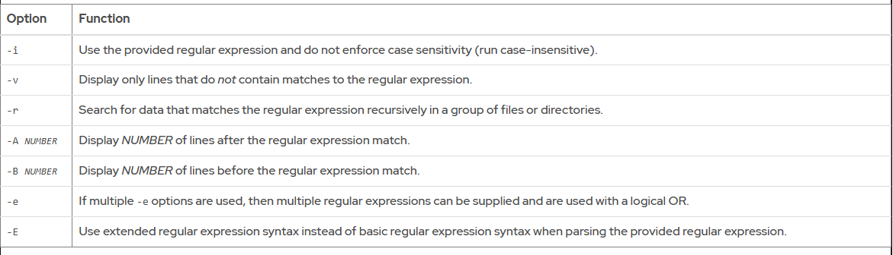
1 so vi du khi su dung grep
```
[user@host ~]$ grep '^computer' /usr/share/dict/words
computer
computerese
computerise
```
Tìm tất cả dòng trong output.txt có chứa "error" (không phân biệt hoa/thường):  
`grep -i 'error' output.txt`  
Tìm dòng bắt đầu bằng số:  
`grep '^[0-9]' output.txt`  
Tìm dòng có chữ "fail" hoặc "error":
`grep -E 'fail|error' output.txt`

Lấy file bắt đầu bằng "cat":
`ls | grep '^cat'`

Lấy file kết thúc bằng "dog":
`ls | grep 'dog$'`

Tìm dòng bắt đầu bằng "cat":
`grep '^cat' pets.txt`

Tìm dòng kết thúc bằng "dog":
`grep 'dog$' pets.txt`  
Basic and Extended Regular Expression Syntax  
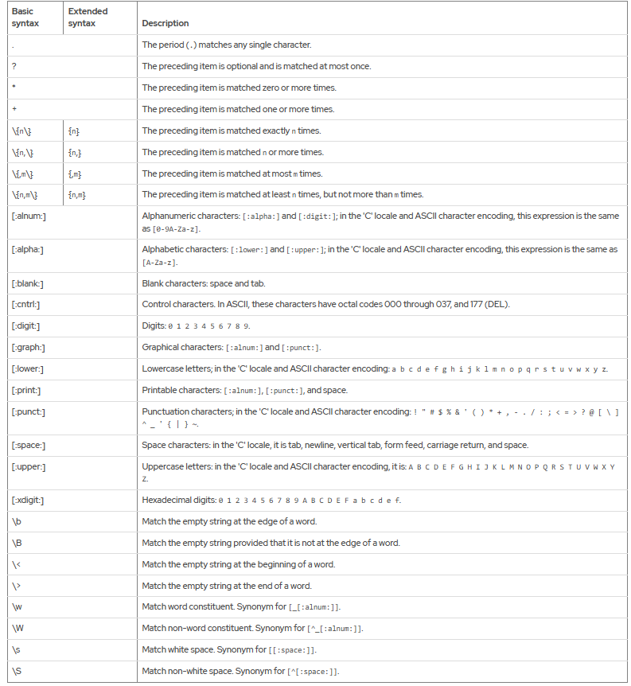

---
# Chapter 2.  Schedule Future Tasks
Lên lịch các tác vụ người dùng bị hoãn  
`at` giúp bạn nói với hệ thống:
- "Hãy chạy lệnh này vào thời điểm X trong tương lai"

- Khác với cron (chạy định kỳ), at chỉ chạy một lần rồi thôi.
```
at 08:42
touch /root/test.txt
Ctrl+D
```
or `at 08:42 < myscript.sh`  
Cách ghi thời gian (TIMESPEC)  
| Ví dụ                  | Nghĩa                                              |
| ---------------------- | -------------------------------------------------- |
| `now +5min`            | 5 phút kể từ bây giờ                               |
| `02:00pm` hoặc `14:00` | 2 giờ chiều hôm nay (hoặc ngày mai nếu đã quá giờ) |
| `15:59`                | 15 giờ 59 phút                                     |
| `midnight`             | 0 giờ                                              |
| `teatime`              | 16 giờ                                             |
| `teatime tomorrow`     | 16 giờ ngày mai                                    |
| `noon +4 days`         | 12 giờ trưa sau 4 ngày nữa                         |
| `5pm august 3 2025`    | 17 giờ ngày 3/8/2025                               |

Nếu muốn kiểm tra lệnh at đã lên lịch chưa:
`atq`  
Nếu muốn hủy: `atrm <job_id>`

Schedule Recurring User Jobs
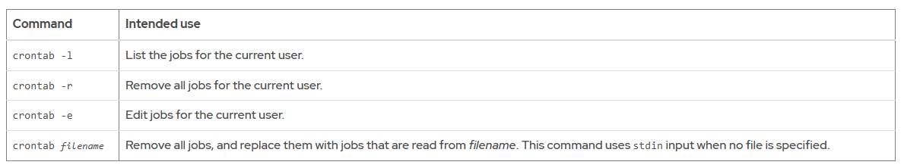  
Describe User Job Format
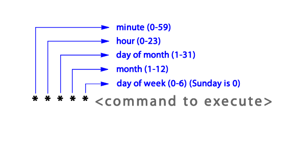    
Công việc sau đây sẽ gửi email có chứa Chime từ này đến chủ sở hữu của công việc này cứ năm phút một lần trong khoảng thời gian từ 9:00 đến 16:00, nhưng chỉ vào mỗi thứ Sáu trong tháng 7.   
`*/5 9-16 * Jul 5 echo "Chime"`  
Công việc sau đây chạy /usr/local/bin/daily_reportlệnh vào mỗi ngày làm việc (từ thứ Hai đến thứ Sáu) hai phút trước nửa đêm  
`58 23 * * 1-5 /usr/local/bin/daily_report`  
Công việc sau đây thực thi `mutt` lệnh gửi Checking in thư đến `developer@example.com` người nhận vào mỗi ngày làm việc (từ thứ Hai đến thứ Sáu), lúc 9 giờ sáng.  
`0 9 * * 1-5 mutt -s "Checking in" developer@example.com % Hi there, just checking in.`  
Lên lịch công việc hệ thống định kỳ    
Hệ thống crontab cũng bao gồm các kho lưu trữ cho các tập lệnh chạy hàng giờ, hàng ngày, hàng tuần và hàng tháng. Các kho lưu trữ này được đặt trong các thư mục /etc/cron.hourly/, /etc/cron.daily/, /etc/cron.weekly/, và /etc/cron.monthly/. Các thư mục này chứa các tập lệnh shell có thể thực thi, không phải các tệp crontab.  
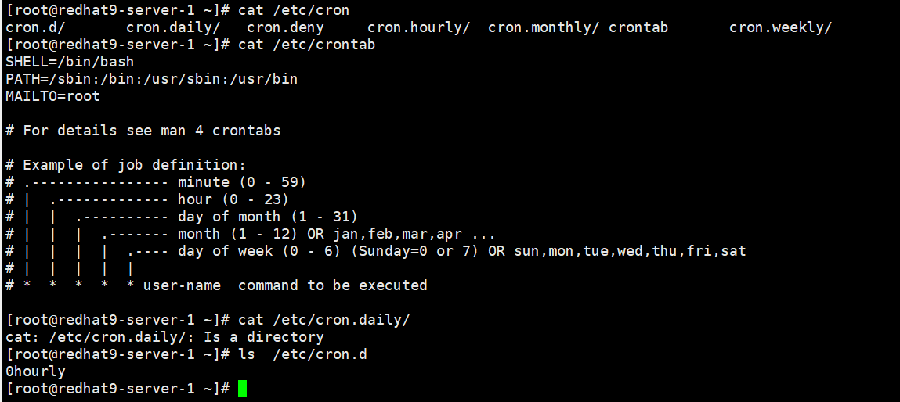  

1. Anacron – Chạy tác vụ định kỳ nhưng không bỏ sót khi máy tắt
Anacron dùng để chạy các job daily (hàng ngày), weekly (hàng tuần), hoặc monthly (hàng tháng).

Khác với cron, nếu máy bạn tắt đúng lúc job chạy thì cron sẽ bỏ qua, nhưng Anacron sẽ chạy bù khi máy bật lại.

Anacron đọc cấu hình từ /etc/anacrontab.

Cấu trúc /etc/anacrontab
Mỗi dòng là một job với 4 trường:

`Period_in_days   Delay_in_minutes   Job_identifier   Command`  
Period_in_days:

Số nguyên (1 = chạy hàng ngày, 7 = hàng tuần, 30 = hàng tháng)

Hoặc macro:

@daily = 1

@weekly = 7

@monthly = 30

Delay_in_minutes: Chờ bao nhiêu phút sau khi máy bật rồi mới chạy.

Job_identifier: Tên hiển thị trong log.

Command: Lệnh sẽ chạy.

Ví dụ:


`1   5   cron.daily   run-parts /etc/cron.daily`
Nghĩa là:

Chạy mỗi 1 ngày

Sau khi bật máy, chờ 5 phút

Job tên "cron.daily"

Lệnh là run-parts /etc/cron.daily (chạy tất cả script trong thư mục này)

Lưu ý thêm:

- Các file trong /var/spool/anacron/ lưu dấu thời gian lần chạy cuối → Anacron dùng để biết có cần chạy lại hay không.

- Biến START_HOURS_RANGE trong /etc/anacrontab cho biết khung giờ được phép chạy job (nếu không kịp chạy trong khung này → đợi ngày sau).

2. Systemd Timer – Lên lịch tác vụ kiểu mới
Systemd timer là cơ chế hẹn giờ của systemd, thay thế hoặc bổ sung cron/anacron.

Nó hoạt động bằng cặp unit file:

.timer → định nghĩa lịch chạy

.service → định nghĩa tác vụ cần chạy

Tên hai file phải giống nhau (khác phần mở rộng).

Ví dụ file .timer
/usr/lib/systemd/system/sysstat-collect.timer:

```
[Unit]
Description=Run system activity accounting tool every 10 minutes

[Timer]
OnCalendar=*:00/10

[Install]
WantedBy=sysstat.service
```
Giải thích:

OnCalendar=*:00/10 → Chạy mỗi 10 phút, bắt đầu từ phút 0 (00, 10, 20, 30…)

Khi tới giờ, timer này sẽ kích hoạt service sysstat-collect.service để chạy lệnh thu thập thống kê hệ thống.  
2.7 Manage Temporary Files

Các ứng dụng và dịch vụ quan trọng thường sd các file tạm thời để lưu dữ liệu như thư mục /tmp hay lưu các vị trí cụ thể cho các task ở /run, chỉ tồn tại trong bộ nhớ. Các thư mục này sẽ bị xóa khi hệ thống reboot

Việc các thư mục bị xóa có thể khiến các daemon và scripts hoạt động không chính xác.

Việc quản lý các file tạm thời là quan trọng để tránh việc chiếm dụng quá nhiều dung lượng đĩa và dữ liệu cũ không cần thiết.

RHEL sử dụng systemd-tmpfiles, nó cung cấp các phương pháp có cấu trúc và có thể cấu hình để quản lý các folder và file tạm thời

Khi hệ thống khởi động, một trong các dịch vụ đầu tiên là systemd-tmpfiles-setup. Dịch vụ này sẽ chạy lệnh 'systemd-tmpfiles' với option --create và --remove giúp đọc hướng dẫn từ các file cấu hình:
```
/usr/lib/tmpfiles.d/*.conf
/run/tmpfiles.d/*.conf
/etc/tmpfiles.d/*.conf
```
Các cấu hình này sẽ liệt kê các file, folder mà systemd-tmpfiles-setup được tạo/sửa/xóa và bảo vệ file/folder với các quyền

---
# Chapter 3.  Analyze and Store Logs
1. Mục đích của hệ thống log
- Ghi lại sự kiện của hệ thống khi đang chạy (kernel, dịch vụ, ứng dụng).
- Dùng để:
  - Audit (kiểm tra, theo dõi)
  - Troubleshoot (xử lý sự cố)
- Có thể xem log bằng các công cụ như less, tail, hoặc lệnh chuyên dụng (journalctl).

2. Thành phần chính trong kiến trúc logging của RHEL 9
(1) systemd-journald
- Là trung tâm của hệ thống logging.
- Nguồn dữ liệu:
  - Kernel messages (thông báo từ nhân Linux)
  - Log từ giai đoạn khởi động sớm (early boot)
  - stdout và stderr của các daemon
  - Các sự kiện syslog từ ứng dụng
- Xử lý:
  - Chuyển log về định dạng chuẩn, có cấu trúc, có chỉ mục
  - Lưu vào system journal (mặc định không lưu qua reboot → log mất khi khởi động lại, trừ khi cấu hình persistent)

(2) rsyslog
Nhận syslog messages từ systemd-journald.

Xử lý:

Lưu log vào /var/log/ (persist → giữ được qua reboot)

Phân loại log theo:

Loại chương trình gửi log

Mức ưu tiên (priority/severity)

Có thể gửi log đi máy khác (centralized logging)
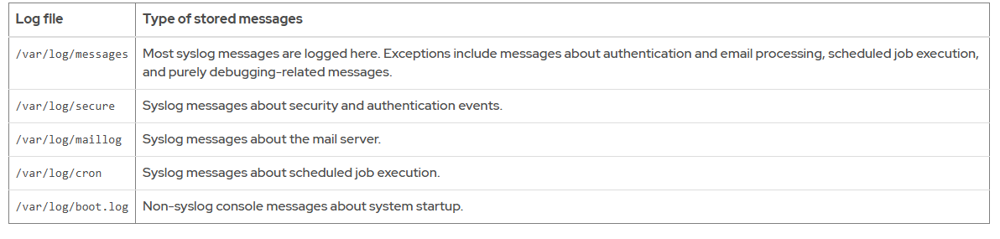  

`journalctl` commands  
| Lệnh                                  | Ý nghĩa                                 | Ví dụ                                   |              |              |
| ------------------------------------- | --------------------------------------- | --------------------------------------- | ------------ | ------------ |
| `journalctl`                          | Xem toàn bộ log                         | `journalctl`                            |              |              |
| `journalctl -r`                       | Log mới → cũ (reverse)                  | `journalctl -r`                         |              |              |
| `journalctl -f`                       | Theo dõi log realtime (giống `tail -f`) | `journalctl -f`                         |              |              |
| `journalctl -n N`                     | Hiện N dòng cuối                        | `journalctl -n 50`                      |              |              |
| `journalctl --since TIME`             | Log từ thời điểm TIME                   | `journalctl --since "2025-08-10 14:00"` |              |              |
| `journalctl --until TIME`             | Log đến thời điểm TIME                  | `journalctl --until "2025-08-10 15:00"` |              |              |
| `journalctl -u SERVICE`               | Log của 1 service                       | `journalctl -u sshd`                    |              |              |
| `journalctl -u SERVICE --since today` | Log service từ hôm nay                  | `journalctl -u sshd --since today`      |              |              |
| `journalctl -b`                       | Log của lần boot hiện tại               | `journalctl -b`                         |              |              |
| `journalctl -b -1`                    | Log của lần boot trước                  | `journalctl -b -1`                      |              |              |
| `journalctl -p LEVEL`                 | Lọc theo mức ưu tiên (0–7)              | `journalctl -p err`                     |              |              |
| `journalctl _PID=PID`                 | Lọc theo tiến trình                     | `journalctl _PID=1234`                  |              |              |
| `journalctl _UID=UID`                 | Lọc theo user                           | `journalctl _UID=1000`                  |              |              |
| \`journalctl                          | grep "keyword"\`                        | Lọc theo từ khóa                        | 
📌 Mức ưu tiên (-p)  

| Tên       | Số | Ý nghĩa              |
|---|---|---
| `emerg`   | 0  | Khẩn cấp             |
| `alert`   | 1  | Báo động             |
| `crit`    | 2  | Nghiêm trọng         |
| `err`     | 3  | Lỗi                  |
| `warning` | 4  | Cảnh báo             |
| `notice`  | 5  | Thông báo quan trọng |
| `info`    | 6  | Thông tin            |
| `debug`   | 7  | Gỡ lỗi               |

`journalctl -o verbose`
Danh sách sau đây hiển thị một số trường của nhật ký hệ thống mà bạn có thể sử dụng để tìm kiếm các dòng có liên quan đến một quy trình hoặc sự kiện cụ thể:

_COMM là tên lệnh.

_EXE là đường dẫn đến tệp thực thi cho tiến trình.

_PID là PID của quá trình.

_UID là UID của người dùng chạy tiến trình.

_SYSTEMD_UNIT là systemdđơn vị bắt đầu quá trình.

Bảo tồn Nhật ký Hệ thống  
Mục tiêu: Cấu hình nhật ký hệ thống để lưu lại bản ghi sự kiện khi máy chủ khởi động lại.  
Cấu hình Nhật ký hệ thống liên tục
Cấu hình systemd-journald dịch vụ như sau để lưu trữ nhật ký hệ thống liên tục trong suốt quá trình khởi động lại:

- Tạo `/var/log/journal` thư mục.

`[root@host ~]#mkdir /var/log/journal `  
- Đặt Storage tham số thành persistent giá trị trong `/etc/systemd/journald.conf` tệp. Chạy trình soạn thảo văn bản bạn đã chọn với tư cách siêu người dùng để chỉnh sửa `/etc/systemd/journald.conf` tệp.
```
[Journal]
Storage=persistent
...output omitted...
```
Khởi động lại systemd-journalddịch vụ để áp dụng các thay đổi cấu hình.

`[root@host ~]#systemctl restart systemd-journald`
Nếu systemd-journalddịch vụ khởi động lại thành công, dịch vụ sẽ tạo các thư mục con trong /var/log/journalthư mục. Thư mục con trong /var/log/journalthư mục có tên dài là các ký tự thập lục phân và chứa các tệp có .journalphần mở rộng . .journalCác tệp nhị phân lưu trữ các mục nhật ký có cấu trúc và được lập chỉ mục.
```
[root@host ~]# ls /var/log/journal
4ec03abd2f7b40118b1b357f479b3112
[root@host ~]# ls /var/log/journal/4ec03abd2f7b40118b1b357f479b3112
system.journal  user-1000.journal
```
Mặc dù nhật ký hệ thống vẫn tồn tại sau khi khởi động lại, journalctlđầu ra lệnh bao gồm các mục từ lần khởi động hệ thống hiện tại cũng như từ các lần khởi động hệ thống trước đó. Để giới hạn đầu ra cho một lần khởi động hệ thống cụ thể, hãy sử dụng tùy chọn journalctllệnh -b. Lệnh sau journalctlchỉ truy xuất các mục từ lần khởi động hệ thống đầu tiên:

`[root@host ~]#journalctl -b 1` 
...đầu ra bị bỏ qua...  
Lệnh sau journalctlchỉ lấy các mục nhập từ lần khởi động hệ thống thứ hai. Đối số này chỉ có ý nghĩa nếu hệ thống được khởi động lại ít nhất hai lần:

`[root@host ~]#journalctl -b 2`
...đầu ra bị bỏ qua...  
Bạn có thể liệt kê các sự kiện khởi động hệ thống mà journalctllệnh nhận ra bằng cách sử dụng --list-bootstùy chọn.
```
[root@host ~]#journalctl --list-boots
  -6 27de... Thứ Tư 2022-04-13 20:04:32 EDT—Thứ Tư 2022-04-13 21:09:36 EDT
  -5 6a18... Thứ Ba 2022-04-26 08:32:22 EDT—Thứ Năm 2022-04-28 16:02:33 EDT
  -4 e2d7... Thứ Năm 2022-04-28 16:02:46 EDT—Thứ Sáu 2022-05-06 20:59:29 EDT
  -3 45c3... Thứ Bảy 2022-05-07 11:19:47 EDT—Thứ Bảy 2022-05-07 11:53:32 EDT
  -2 dfae... Thứ bảy 2022-05-07 13:11:13 EDT—Thứ bảy 2022-05-07 13:27:26 EDT
  -1 e754... Thứ bảy 2022-05-07 13:58:08 EDT—Thứ bảy 2022-05-07 14:10:53 EDT
   0 ee2c... Thứ Hai 2022-05-09 09:56:45 EDT—Thứ Hai 2022-05-09 12:57:21 EDT
```
Lệnh sau đây journalctlchỉ lấy các mục từ lần khởi động hệ thống hiện tại:

[root@host ~]#`journalctl -b`
...đầu ra bị bỏ qua...

3.9 Maintain Accurate Time
syntax
```
timedatectl
timedatectl list-timezones
timedatectl set-timezone America/Phoenix
timedatectl set-time 9:00:00
```
Tùy chọn timedatectl lệnh set-ntp bật hoặc tắt đồng bộ hóa NTP để tự động điều chỉnh thời gian. Tùy chọn này yêu cầu tham số a true hoặc false để bật hoặc tắt. Ví dụ: timedatectl lệnh sau sẽ tắt đồng bộ hóa NTP.

`[root@host ~]#timedatectl set-ntp false`

Configure and Monitor the chronyd Service
Dịch chronyd vụ theo dõi thông tin địa phương thường không chính xácĐồng hồ thời gian thực (RTC)bằng cách đồng bộ hóa nó với các máy chủ NTP đã cấu hình. Nếu không có kết nối mạng, dịch chronydvụ sẽ tính toán độ lệch đồng hồ RTC và ghi lại vào tệp có drift filegiá trị được chỉ định trong /etc/chrony.conf tệp cấu hình.

Lệnh này chronyc hoạt động như một máy khách của chronyd dịch vụ. Sau khi thiết lập đồng bộ hóa NTP, hãy kiểm tra xem hệ thống cục bộ có đang sử dụng máy chủ NTP để đồng bộ hóa đồng hồ hệ thống một cách liền mạch hay không
```
[root@host ~]# chronyc sources -v

  .-- Source mode  '^' = server, '=' = peer, '#' = local clock.
 / .- Source state '*' = current best, '+' = combined, '-' = not combined,
| /             'x' = may be in error, '~' = too variable, '?' = unusable.
||                                                 .- xxxx [ yyyy ] +/- zzzz
||      Reachability register (octal) -.           |  xxxx = adjusted offset,
||      Log2(Polling interval) --.      |          |  yyyy = measured offset,
||                                \     |          |  zzzz = estimated error.
||                                 |    |           \
MS Name/IP address         Stratum Poll Reach LastRx Last sample
===============================================================================
^* 172.25.254.254                3   6    17    26  +2957ns[+2244ns] +/-   25ms
```
Co the dung `tzselect` de setup mui gio

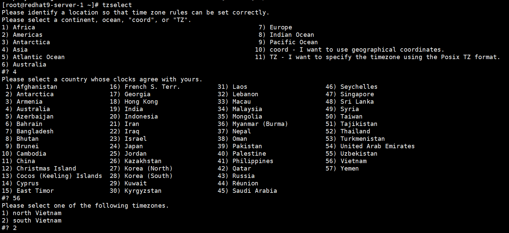  

---
# Chapter 4.  Archive and Transfer Files
Manage Compressed `tar` Archives
Options of the tar Utility
One of the following tar command actions is required to perform a tar operation:

-c or --create : Create an archive file.

-t or --list : List the contents of an archive.

-x or --extract : Extract an archive.

The following tar command general options are often included:

-v or --verbose : Show the files that are being archived or extracted during the tar operation.

-f or --file : Follow this option with the archive file name to create or open.

-p or --preserve-permissions : Preserve the original file permissions when extracting.

--xattrs : Enable extended attribute support, and store extended file attributes.

--selinux : Enable SELinux context support, and store SELinux file contexts.

The following tar command compression options are used to select an algorithm:

-a or --auto-compress : Use the archive's suffix to determine the algorithm to use.

-z or --gzip : Use the gzip compression algorithm, which results in a .tar.gz suffix.

-j or --bzip2 : Use the bzip2 compression algorithm, which results in a .tar.bz2 suffix.

-J or --xz : Use the xz compression algorithm, which results in a .tar.xz suffix.

Lệnh sau đây tạo `mybackup.tar` kho lưu trữ để chứa các tệp myapp1.log, myapp2.log, và myapp2.log từ thư mục gốc của người dùng. Nếu có tệp trùng tên với tệp lưu trữ được yêu cầu trong thư mục đích, tar lệnh sẽ ghi đè lên tệp đó.
```
[user@host ~]$ tar -cf mybackup.tar myapp1.log myapp2.log myapp3.log
[user@host ~]$ ls mybackup.tar
mybackup.tar
```

4.3 Transfer Files Between Systems Securely
Bộ phần mềm này OpenSSH chạy các lệnh shell một cách an toàn trên các hệ thống từ xa. Sử dụng Chương trình truyền tệp an toàn (SFTP) để tải lên hoặc tải xuống tệp tương tác từ máy chủ SSH. Chương trình này là một phần của OpenSSH bộ công cụ. Phiên làm việc với sftp lệnh sử dụng cơ chế xác thực an toàn và truyền dữ liệu được mã hóa đến và đi từ máy chủ SSH.

```
[user@host ~]$ sftp remoteuser@remotehost
mật khẩu của remoteuser@remotehost: password
Đã kết nối tới remotehost. 
sftp>
```
Tuy chon

```
sftp> help
sftp> pwd
Remote working directory: /home/remoteuser
sftp> lpwd
Local working directory: /home/user
```
tải /etc/hosts trên hệ thống cục bộ lên /home/remoteuser/hostbackup thư mục mới được tạo trên remotehost máy. sftp
```
sftp> mkdir hostbackup
sftp> cd hostbackup
sftp> put /etc/hosts
Uploading /etc/hosts to /home/remoteuser/hostbackup/hosts
/etc/hosts                                 100%  227     0.2KB/s   00:00
```

Để sao chép toàn bộ cây thư mục theo cách đệ quy, hãy sử dụng tùy chọn sftplệnh -r. Ví dụ sau đây sao chép đệ /home/user/directoryquy thư mục cục bộ vào remotehostmáy.
```
sftp> put -r directory
Uploading directory/ to /home/remoteuser/directory
Entering directory/
file1                                      100%    0     0.0KB/s   00:00
file2                                      100%    0     0.0KB/s   00:00
sftp> ls -l
drwxr-xr-x    2 student  student        32 Mar 21 07:51 directory
```
Để tải /etc/yum.conftệp từ máy chủ từ xa xuống thư mục hiện tại trên hệ thống cục bộ, hãy thực hiện get /etc/yum.conflệnh, sau đó thoát khỏi sftpphiên.

```
sftp> get /etc/yum.conf
Fetching /etc/yum.conf to yum.conf
/etc/yum.conf                              100%  813     0.8KB/s   00:00
sftp> exit
[user@host ~]$
```

Cảnh báo:
Trong các phiên bản trước RHEL 9, scplệnh này dựa trên một rcpgiao thức cũ không được thiết kế với các cân nhắc về bảo mật. scpGiao thức này có một vấn đề đã biết về việc chèn mã, cho phép kẻ tấn công thực thi các lệnh tùy ý trên máy chủ từ xa. Vì lý do này, scpgiao thức này không được đề cập trong khóa học này.

## 4.5 Synchronize Files Between Systems Securely
Mục tiêu
Đồng bộ hóa nội dung của tệp hoặc thư mục cục bộ với bản sao máy chủ từ xa một cách hiệu quả và an toàn.  
Options Enabled with rsync -a (Archive Mode)  
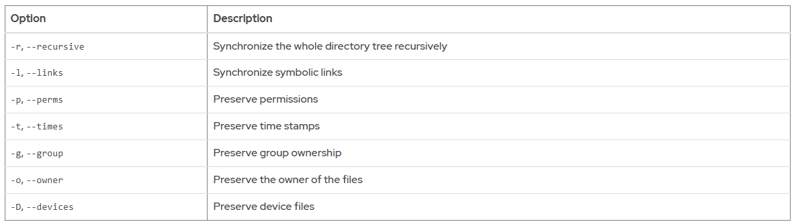  
```
# syntax
rsync [options] SOURCE DESTINATION

# kết nối chiều nào cũng như nhau
rsync -av /local/path user@remote:/remote/path

rsync -av user@remote:/remote/path /local/path
```
Vi du  
đồng bộ hóa /var/log thư mục cục bộ với /tmp thư mục trên hostahệ thống:
```
[root@host ~]# rsync -av /var/log hosta:/tmp
root@hosta's password: password
receiving incremental file list
log/
log/README
log/boot.log
...output omitted...
sent 9,783 bytes  received 290,576 bytes  85,816.86 bytes/sec
total size is 11,585,690  speedup is 38.57
```
Quan trọng
Việc chỉ định chính xác dấu gạch chéo ở cuối thư mục nguồn là rất quan trọng. Một thư mục nguồn có dấu gạch chéo ở cuối sẽ đồng bộ hóa nội dung của thư mục.không cóbao gồm cả thư mục. Nội dung được đồng bộ trực tiếp vào thư mục đích. Nếu không có dấu gạch chéo ở cuối, thư mục nguồn sẽ tự động đồng bộ với thư mục đích. Nội dung của thư mục nguồn nằm trong thư mục con mới của thư mục đích.

Bash Tab -completion tự động thêm dấu gạch chéo vào cuối tên thư mục.

Trong ví dụ này, nội dung của /var/log/thư mục được đồng bộ hóa với /tmpthư mục thay vì logthư mục được tạo trong /tmpthư mục.
```
[root@host ~]# rsync -av /var/log/ /tmp
sending incremental file list
./
README
boot.log
...output omitted...
tuned/tuned.log

sent 11,592,389 bytes  received 778 bytes  23,186,334.00 bytes/sec
total size is 11,586,755  speedup is 1.00
[root@host ~]# ls /tmp
anaconda                  dnf.rpm.log-20190318  private
audit                     dnf.rpm.log-20190324  qemu-ga
boot.log                  dnf.rpm.log-20190331  README
...output omitted...
```

---
# Chapter 5.  Tune System Performance
1. Tuned daemon là gì?
Là dịch vụ của RHEL dùng để tự động điều chỉnh hiệu năng hệ thống theo nhu cầu công việc (workload).

Nó hoạt động dựa trên tuning profiles → mỗi profile là một bộ cấu hình sẵn cho CPU, disk, network, kernel parameters…

2. Hai kiểu điều chỉnh
(1) Static tuning
Khi bạn chọn một profile hoặc khi hệ thống khởi động, tuned sẽ áp dụng một lần các tham số kernel và thiết bị.

Không thay đổi trong lúc chạy, ngay cả khi tải hệ thống thay đổi.

Ví dụ: Đặt CPU governor = performance từ lúc boot và giữ nguyên.

(2) Dynamic tuning
Theo dõi hệ thống liên tục và thay đổi tham số tùy tình trạng thực tế.

Ví dụ: Khi CPU đang rảnh → giảm tốc độ để tiết kiệm điện; khi tải tăng → nâng hiệu năng.

Mặc định tắt → muốn bật phải chỉnh:

/etc/tuned/tuned-main.conf
dynamic_tuning = 1
Thời gian giữa các lần cập nhật → chỉnh bằng:

update_interval = <giây>
3. Cách hoạt động của Dynamic tuning
Thành phần:
Monitor plug-ins (giám sát):

disk → Theo dõi I/O của ổ đĩa.

net → Theo dõi lượng packet truyền/nhận trên card mạng.

load → Theo dõi CPU load.

Tuning plug-ins (điều chỉnh):

disk → Chỉnh scheduler, spin-down timeout, power management…

net → Chỉnh tốc độ mạng, bật/tắt Wake-on-LAN…

cpu → Chỉnh CPU governor, độ trễ…

Luồng hoạt động:

[Monitor plug-ins] → Thu thập thông tin tải
[Tuning plug-ins] → Dùng thông tin + profile → Điều chỉnh thông số hệ thống
4. Lợi ích
Static tuning: Đơn giản, ít thay đổi, ổn định.

Dynamic tuning: Linh hoạt, tối ưu hiệu năng & tiết kiệm tài nguyên theo thời gian thực.

Cac loai:
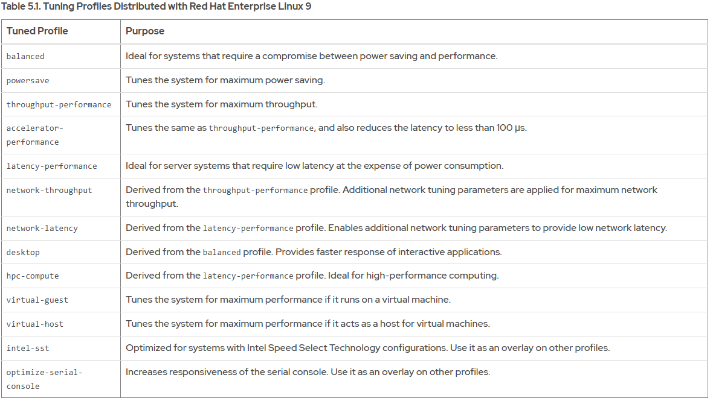  
syntax
```
# Danh sách profile có sẵn
tuned-adm list

# Kiểm tra profile đang dùng
tuned-adm active

# Kích hoạt một profile
tuned-adm profile throughput-performance

# xem mô tả profile
tuned-adm profile_info profile-name

# gợi ý profile phù hợp với hệ thống
tuned-adm recommend

# tắt tuned và hủy áp dụng các profile
tuned-adm off
```

5.3 Influence Process Scheduling
1. Khái niệm về lập lịch tiến trình trong Linux
Máy tính có nhiều CPU hoặc lõi CPU, nhưng số lượng tiến trình (process/thread) thường nhiều hơn số lõi CPU → cần lập lịch để quyết định tiến trình nào được chạy trước.

Linux dùng CFS (Completely Fair Scheduler) cho các tiến trình bình thường (non-real-time).

Mục tiêu: chia CPU công bằng theo thời gian, nhưng vẫn ưu tiên các tiến trình quan trọng hơn.

2. Chính sách lập lịch
SCHED_NORMAL / SCHED_OTHER: Chính sách mặc định cho tiến trình thông thường.

SCHED_FIFO, SCHED_RR: Chính sách thời gian thực (real-time).

Tiến trình real-time luôn được ưu tiên hơn tiến trình bình thường.

3. Giá trị nice
nice là một số nguyên từ -20 (ưu tiên cao nhất) đến 19 (ưu tiên thấp nhất), mặc định 0.

Giảm giá trị nice → ưu tiên cao hơn (process chạy nhiều hơn).

Tăng giá trị nice → ưu tiên thấp hơn (nhường CPU cho process khác).

User thường chỉ có thể tăng giá trị nice (làm tiến trình "nice" hơn).

root có thể giảm nice (tăng ưu tiên).

4. Cách hoạt động
CFS lưu tiến trình trong cây tìm kiếm nhị phân, sắp xếp theo:

Thời gian CPU đã dùng trước đó (ít dùng hơn → ưu tiên hơn).

Giá trị nice (nice thấp hơn → ưu tiên hơn).

Trong hệ thống không bão hòa CPU (CPU còn rảnh) → mọi process đều được chạy ngay.

Trong hệ thống bão hòa CPU (quá tải) → process ưu tiên cao sẽ chạy trước, nhưng CFS vẫn đảm bảo các process khác có thời gian chạy tối thiểu.  
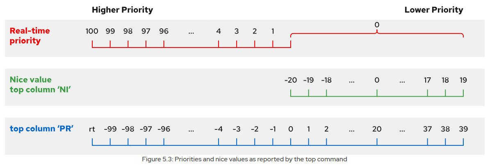  

Command
```
ps -o pid,ni,pri,cmd
top
ps axo pid,comm,nice,cls --sort=-nice
# Khởi chạy với giá trị nice:
nice -n 10 command
# Thay đổi giá trị nice (cần root để giảm):
renice -n -5 -p 1234
renice -n 19 2740
```

---
# Chapter 6.  Manage SELinux Security
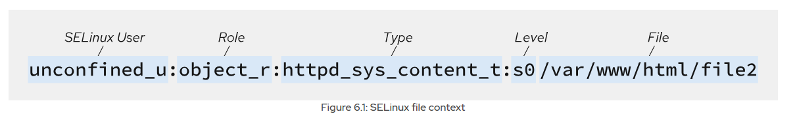  
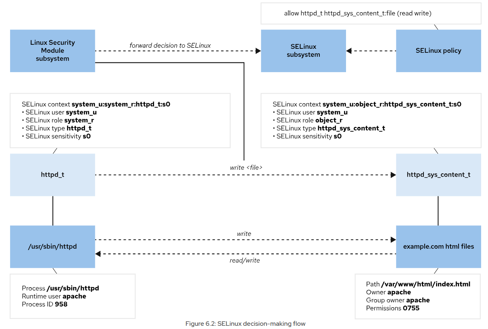  

1. Khái niệm SELinux
SELinux (Security-Enhanced Linux) là cơ chế bảo mật cấp hệ điều hành, kiểm soát ai / tiến trình nào được phép truy cập tài nguyên nào và theo cách nào.

Cung cấp Mandatory Access Control (MAC) → luật bắt buộc, không thể bỏ qua như DAC (quyền file thông thường).

2. Cách hoạt động
Mỗi tiến trình, file, thư mục, port… đều có nhãn (label) gọi là SELinux context.

Chính sách (policy) định nghĩa quyền cho từng nhãn.

Nếu không có rule cho hành động → mặc định từ chối.

Targeted policy (mặc định) → mỗi ứng dụng quan trọng sẽ có rule riêng, chạy trong miền bị giới hạn (confined domain).

3. Chế độ hoạt động
Enforcing (mặc định): Áp dụng và thực thi rule → hành vi trái phép bị chặn + ghi log.

Permissive: Không chặn, chỉ ghi log vi phạm → dùng khi test/troubleshoot.

Disabled: Tắt hoàn toàn → không khuyến khích.

Từ RHEL 9, muốn tắt hoàn toàn phải dùng selinux=0 trong kernel parameter khi boot.

Nếu chỉnh SELINUX=disabled trong /etc/selinux/config → SELinux vẫn bật nhưng không load policy → mọi hành động bị chặn.

Thay đổi chế độ SELinux
```
[root@host ~]# getenforce
Enforcing
[root@host ~]# setenforce
usage:  setenforce [ Enforcing | Permissive | 1 | 0 ]
[root@host ~]# setenforce 0
[root@host ~]# getenforce
Permissive
[root@host ~]# setenforce Enforcing
[root@host ~]# getenforce
Enforcing
```
Đặt chế độ SELinux mặc định
```
vi /etc/selinux/config
```
6.5 Adjust SELinux Policy with Booleans

1. SELinux Boolean là gì?
Là tùy chọn bật/tắt một số hành vi tùy chọn trong chính sách SELinux cho từng dịch vụ.

Mục đích: Điều chỉnh linh hoạt hành vi ứng dụng mà không cần sửa file policy.

Ví dụ: Cho phép hoặc chặn httpd truy cập thư mục home của người dùng.

syntax
| Lệnh                                | Chức năng                                                                 |
| ----------------------------------- | ------------------------------------------------------------------------- |
| `getsebool -a`                      | Liệt kê tất cả Boolean và trạng thái hiện tại.                            |
| `getsebool <tên_boolean>`           | Xem trạng thái của một Boolean.                                           |
| `setsebool <tên_boolean> on/off`    | Đổi trạng thái tạm thời (mất khi reboot).                                 |
| `setsebool -P <tên_boolean> on/off` | Đổi trạng thái và lưu vĩnh viễn (giữ sau reboot).                         |
| `semanage boolean -l`               | Liệt kê Boolean từ file policy (hiện tại, mặc định, mô tả).               |
| `semanage boolean -l -C`            | Chỉ hiện Boolean có giá trị hiện tại khác giá trị mặc định khi khởi động. |

6.6. Investigate and Resolve SELinux Issues
Cơ chế giám sát vi phạm SELinux
SELinux từ chối hành động → ghi AVC message vào:

/var/log/audit/audit.log

/var/log/messages (thông qua dịch vụ setroubleshoot)

setroubleshoot-server theo dõi AVC và gửi tóm tắt sự kiện (có UUID) vào /var/log/messages.  
| Lệnh                                  | Chức năng                               |
| ------------------------------------- | --------------------------------------- |
| `sealert -l <UUID>`                   | Xem báo cáo chi tiết sự kiện theo UUID. |
| `sealert -a /var/log/audit/audit.log` | Xem tất cả sự kiện có trong log audit.  |

---
# Chapter 7.  Manage Basic Storage
Add Partitions, File Systems, and Persistent Mounts
Khái niệm phân vùng
Phân vùng (partition): chia ổ cứng thành nhiều phần logic để:
- Giới hạn dung lượng cho ứng dụng/người dùng.
- Tách hệ điều hành & chương trình khỏi dữ liệu người dùng.
- Tạo vùng hoán đổi (swap).
- Cải thiện hiệu suất backup & chẩn đoán.  

MBR (Master Boot Record)
- Chuẩn cũ, dùng trên hệ thống BIOS.
- Giới hạn:
  - Tối đa 4 phân vùng chính (có thể dùng extended & logical → tối đa 15).
  - Dung lượng tối đa 2 TiB.
- Đang dần bị thay thế do hạn chế kích thước. 

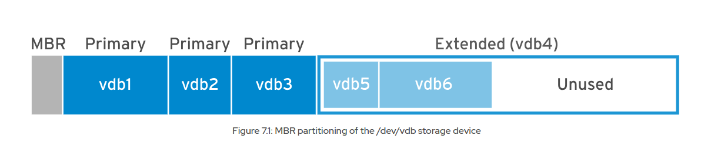  

GPT (GUID Partition Table)
- Chuẩn mới, dùng trên hệ thống UEFI.  
- Hỗ trợ:
  - Tối đa 128 phân vùng.
  - Dung lượng tối đa 8 ZiB (~8 tỷ TiB).

- Tính năng:  
  - Mỗi phân vùng có GUID riêng.
  - Có GPT chính ở đầu đĩa và GPT dự phòng ở cuối.
  - Dùng checksum để phát hiện lỗi.  

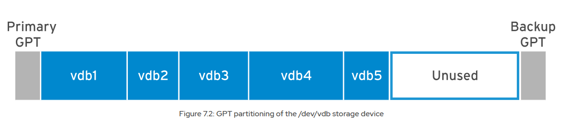

Sử dụng Lệnh `parted`
- Công cụ tiêu chuẩn: parted là trình chỉnh sửa phân vùng tiêu chuẩn trên dòng lệnh trong Red Hat Enterprise Linux và hoạt động với cả sơ đồ phân vùng MBR và GPT.
- Cách sử dụng cơ bản: Bạn sử dụng parted bằng cách chỉ định tên thiết bị (ví dụ: /dev/vda) theo sau là các lệnh con (subcommands).
  - print: Hiển thị bảng phân vùng trên đĩa.
  - unit: Thay đổi đơn vị hiển thị cho kích thước (ví dụ: s cho sector, MiB, GiB, TiB, MB, GB, TB)  

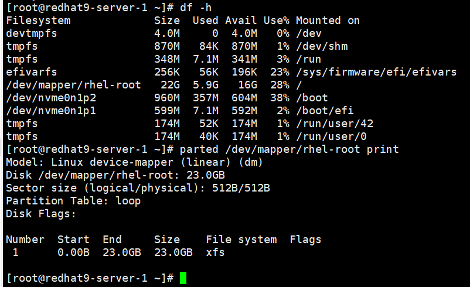

Tạo Phân vùng (mkpart):
Dùng parted để tạo phân vùng mới trên đĩa.
Ví dụ: tạo phân vùng ext4 từ 1GiB đến 3GiB trên /dev/vda

`parted /dev/vda mkpart primary ext4 1GiB 3GiB`
 Giải thích:

/dev/vda → đĩa cần tạo phân vùng.

primary → loại phân vùng (primary hoặc logical).

ext4 → kiểu hệ thống tệp dự kiến.

1GiB 3GiB → điểm bắt đầu và kết thúc.

Xóa Phân vùng (rm):
Dùng parted để xóa phân vùng theo số thứ tự (xem số bằng parted print).
Ví dụ: xóa phân vùng số 2
`parted /dev/vda rm 2`
Tạo Hệ thống Tệp (File Systems)
Sau khi tạo phân vùng, cần format để có hệ thống tệp (ext4, xfs, v.v).
Ví dụ: format phân vùng /dev/vda1 thành ext4:
```
mkfs.ext4 /dev/vda1
Hoặc xfs:
mkfs.xfs /dev/vda1
```  
Gắn Hệ thống Tệp (Mount File Systems) (thu cong, co dinh )
Gắn thủ công (tạm thời)
Ví dụ: gắn /dev/vda1 vào thư mục /mnt/data
```
mkdir -p /mnt/data
mount /dev/vda1 /mnt/data
```
Chỉ tồn tại đến khi reboot.

Gắn cố định (tự động khi khởi động)
Cần thêm vào file `/etc/fstab`.

Tìm UUID của phân vùng:

`blkid /dev/vda1`
Ví dụ kết quả:

`UUID="1234abcd-56ef-7890-1234-abcdef567890" TYPE="ext4"`  
Mở `/etc/fstab` và thêm dòng:

`UUID=1234abcd-56ef-7890-1234-abcdef567890   /mnt/data   ext4   defaults   0   0`  
Kiểm tra lỗi cấu hình:

`mount -a`

**7.3 Manage Swap Space**
- Swap space: Vùng trên đĩa được kernel dùng để chứa các trang bộ nhớ RAM không hoạt động.
- Giúp mở rộng virtual memory = RAM + Swap.
- Nhược điểm: chậm hơn RAM rất nhiều → chỉ nên dùng hỗ trợ, không thay thế RAM.
- Nếu dùng hibernation (ngủ đông) → swap phải ≥ dung lượng RAM.

Quy tắc tính dung lượng Swap
| RAM          | Swap khuyến nghị | Swap nếu hibernation |
| ------------ | ---------------- | -------------------- |
| ≤ 2 GB       | 2 × RAM          | 3 × RAM              |
| 2 GB – 8 GB  | = RAM            | 2 × RAM              |
| 8 GB – 64 GB | ≥ 4 GB           | 1.5 × RAM            |
| > 64 GB      | ≥ 4 GB           | Không khuyến nghị    |
Tạo Swap Partition
Ví dụ: tạo 256 MB swap trên /dev/vdb
```
parted /dev/vdb
(parted) mkpart swap1 linux-swap 1001MB 1257MB
(parted) quit
```
Đợi hệ thống nhận phân vùng mới:

`udevadm settle`  

Định dạng Swap

`mkswap /dev/vdb2`  
Kết quả ví dụ:

`Setting up swapspace version 1, size = 244 MiB
UUID=39e2667a-9458-42fe-9665-c5c854605881`  
Kích hoạt Swap

`swapon /dev/vdb2`  
Kiểm tra:

```
swapon --show 
free -h
```

6. Kích hoạt Swap vĩnh viễn (tự động khi boot)
Lấy UUID:

`blkid /dev/vdb2`  
Ví dụ:

`UUID="39e2667a-9458-42fe-9665-c5c854605881"`  
Thêm vào /etc/fstab:

`UUID=39e2667a-9458-42fe-9665-c5c854605881   none   swap   sw   0   0`  
Kiểm tra lại:
```
mount -a
swapon --show
```
Xóa hoặc tắt Swap
- Tắt tạm:

`swapoff /dev/vdb2`
- Xóa trong /etc/fstab nếu không dùng nữa.
- Có thể dùng parted để xóa phân vùng swap.

---
# Chapter 8.  Manage Storage Stack
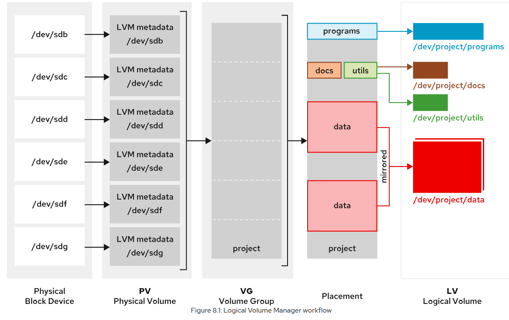
1. Khái niệm cơ bản
- PV (Physical Volume): Ổ đĩa vật lý hoặc phân vùng được LVM quản lý (cần pvcreate để khởi tạo).
- VG (Volume Group): Nhóm tập hợp các PV thành một "kho lưu trữ".
- LV (Logical Volume): Vùng lưu trữ logic được tạo từ không gian trống trong VG, dùng để format, mount, hoặc làm swap.
- PE (Physical Extent): Đơn vị lưu trữ nhỏ nhất trong PV.
- LE (Logical Extent): Đơn vị tương ứng trong LV (thường 1 LE = 1 PE).

2. Quy trình tạo LVM
Bước 1: Tạo Physical Volume

Khởi tạo LVM trên phân vùng hoặc ổ đĩa
`pvcreate /dev/sdb /dev/sdc`  
Kiểm tra:
```
pvdisplay
pvdisplay /dev/vdb1
```
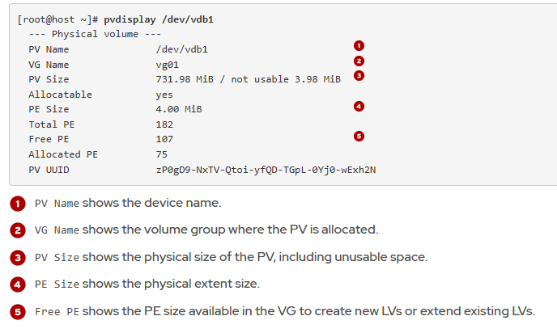

Bước 2: Tạo Volume Group

Tạo VG tên vg_data từ 2 PV
`vgcreate vg_data /dev/sdb /dev/sdc`
Kiểm tra:

`vgdisplay`  
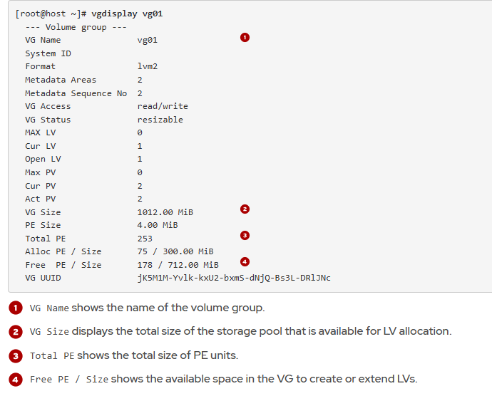
Bước 3: Tạo Logical Volume

Tạo LV 5G tên lv_backup trong VG vg_data
`lvcreate -L 5G -n lv_backup vg_data`
Kiểm tra:

`lvdisplay`  
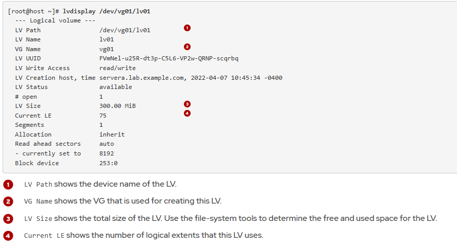
Bước 4: Format và Mount

Format ext4
`mkfs.ext4 /dev/vg_data/lv_backup`

Mount thủ công
```
mkdir /mnt/backup
mount /dev/vg_data/lv_backup /mnt/backup
```

Thêm vào /etc/fstab để mount cố định
`echo "/dev/vg_data/lv_backup /mnt/backup ext4 defaults 0 0" >> /etc/fstab`  
3. Mở rộng Logical Volume
Ví dụ mở rộng thêm 2G cho LV:

`lvextend -L +2G /dev/vg_data/lv_backup`  
Hoặc dùng hết dung lượng trống trong VG
`lvextend -l +100%FREE /dev/vg_data/lv_backup`
Mở rộng hệ thống tệp:

Với ext4
`resize2fs /dev/vg_data/lv_backup`
```
[root@host ~]# resize2fs /dev/vg01/lv01
resize2fs 1.46.5 (30-Dec-2021)
Resizing the filesystem on /dev/vg01/lv01 to 256000 (4k) blocks.
The filesystem on /dev/vg01/lv01 is now 256000 (4k) blocks long.
```

Mở rộng Swap Space trên Logical Volume  
Swap là không gian trao đổi, có thể mở rộng nhưng phải tắt trước khi chỉnh sửa.

Quy trình:

Tắt swap hiện tại

`swapoff -v /dev/vg01/swap`    
Mở rộng Logical Volume

`lvextend -L +300M /dev/vg01/swap`  
Tạo lại swap (format)

`mkswap /dev/vg01/swap`  
Bật swap lại

`swapon /dev/vg01/swap`  
Giảm dung lượng Volume Group (VG)
Không thể thu nhỏ XFS hoặc GFS2, nhưng có thể loại bỏ PV ra khỏi VG.

Quy trình:

Di chuyển dữ liệu khỏi PV cần bỏ

`pvmove -A y /dev/vdb3`  
Xóa PV khỏi VG

`vgreduce vg01 /dev/vdb3`  
3. Xóa LVM Storage
Quy trình:

Chuẩn bị:

- Di chuyển dữ liệu sang nơi khác.
- Gỡ mount và xóa entry trong /etc/fstab

`umount /mnt/data`  
Xóa Logical Volume (LV)

`lvremove /dev/vg01/lv01`  
Xóa Volume Group (VG)

`vgremove vg01`  
Xóa Physical Volume (PV)

`pvremove /dev/vdb1 /dev/vdb2`


---
# Chapter 9.  Access Network-Attached Storage
# Chapter 10.  Control the Boot Process

---
# Chapter 11.  Manage Network Security
1. Kiến trúc Firewall trong Linux
netfilter: framework trong kernel dùng để xử lý gói tin (packet filtering, NAT, port translation).

Hook: điểm chặn trong kernel để áp dụng rule khi gói tin đi qua (VD: packet vào interface).

nftables:

Xây dựng trên nền netfilter.

Thay thế iptables.

Một rule có thể áp dụng cho cả IPv4 và IPv6.

Chỉ dùng nft để quản lý tất cả giao thức.

Có thể chuyển file cấu hình iptables cũ sang nftables bằng iptables-translate / ip6tables-translate.

2. Firewalld
Là front-end của nftables.

Quản lý rule theo zone:

Zone được gán dựa trên source IP hoặc interface.

Nếu không có zone match ⇒ dùng default zone.

Default zone ban đầu là public.

Loopback interface (lo) ⇒ gán vào trusted zone.

Mỗi zone có danh sách port/protocol và service được phép.

Zone trusted cho phép toàn bộ traffic.

3. Zone trong Firewalld
Zone là tập hợp rule cho một loại kết nối mạng nhất định (home, work, public...).

Tùy chỉnh được.

Mặc định:

Cho phép traffic thuộc session đã bắt đầu từ máy.

Cho phép outgoing traffic.  
Bảng Predefined Zones (RHEL 9)
| Zone         | Mục đích                                     | Policy mặc định                                     |
| ------------ | -------------------------------------------- | --------------------------------------------------- |
| **trusted**  | Tin tưởng hoàn toàn (loopback)               | Cho phép toàn bộ traffic                            |
| **public**   | Mạng công cộng (default)                     | Chỉ cho phép một số service (VD: ssh nếu bật)       |
| **home**     | Mạng gia đình                                | Cho phép nhiều dịch vụ LAN                          |
| **work**     | Mạng công ty                                 | Cho phép dịch vụ cần cho công việc                  |
| **internal** | Mạng nội bộ                                  | Giống home/work, nhưng cho phép thêm dịch vụ nội bộ |
| **external** | Kết nối ra internet (router)                 | NAT + giới hạn dịch vụ vào                          |
| **dmz**      | Khu vực trung gian (web server, mail server) | Giới hạn dịch vụ cần thiết                          |
| **block**    | Chặn toàn bộ                                 | Chỉ cho phép traffic thuộc session đã mở            |
| **drop**     | Loại bỏ toàn bộ packet                       | Không phản hồi gì                                   |
| **custom**   | Zone do người dùng tạo                       | Do admin cấu hình                                   |

Predefined Services trong firewalld
firewalld cung cấp sẵn nhiều cấu hình dịch vụ (service configurations) cho các ứng dụng/dịch vụ phổ biến.

Mục đích:

Giúp khỏi phải nhớ số port và giao thức cần mở.

Khi mở một dịch vụ, firewalld sẽ tự động áp dụng đầy đủ các port và protocol cần thiết.

Ví dụ:

Thay vì mở thủ công port 2049/tcp, 2049/udp, 111/tcp, 111/udp cho NFS → chỉ cần mở service nfs.

Tương tự cho ssh, http, https, samba, dns, mysql, imap, v.v.

Xem danh sách dịch vụ có sẵn

`firewall-cmd --get-services`  
Lệnh này liệt kê tất cả dịch vụ predefined trong firewalld.

File cấu hình các dịch vụ nằm tại:

`/usr/lib/firewalld/services/` (mặc định của hệ thống, không nên sửa)

`/etc/firewalld/services/` (tùy chỉnh của người dùng)

3. Thêm dịch vụ vào một zone
Ví dụ: mở dịch vụ http trong zone public
```
firewall-cmd --zone=public --add-service=http
firewall-cmd --zone=public --add-service=http --permanent  # lưu vĩnh viễn
```

Một số dịch vụ phổ biến có sẵn  
| Dịch vụ   | Mục đích                   | Port/Protocol         |
| --------- | -------------------------- | --------------------- |
| **ssh**   | Truy cập SSH từ xa         | 22/tcp                |
| **http**  | Web server HTTP            | 80/tcp                |
| **https** | Web server HTTPS           | 443/tcp               |
| **nfs**   | Network File System        | nhiều cổng TCP/UDP    |
| **samba** | Chia sẻ file Windows/Linux | 137-139, 445/tcp, udp |
| **dns**   | Domain Name System         | 53/tcp, 53/udp        |
| **mysql** | MySQL database             | 3306/tcp              |
| **imap**  | Email retrieval (IMAP)     | 143/tcp               |
| **smtp**  | Email sending (SMTP)       | 25/tcp                |

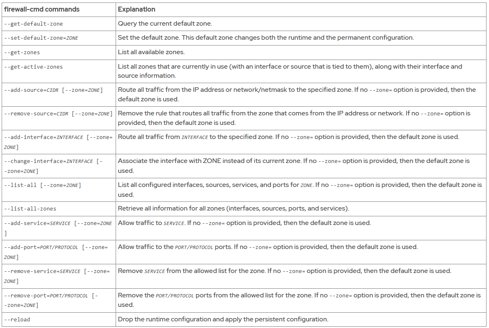  
Ví dụ sau đây đặt vùng mặc định thành dmz, gán tất cả lưu lượng truy cập đến từ 192.168.0.0/24  vào internal vùng và mở các cổng mạng cho mysql dịch vụ trên internal vùng.
```
[root@host ~]# firewall-cmd --set-default-zone=dmz
[root@host ~]# 
[root@host ~]# 
[root@host ~]#firewall-cmd --permanent --zone=internal \
--add-source=192.168.0.0/24firewall-cmd --permanent --zone=internal --add-service=mysqlfirewall-cmd --reload
```
**11.3 Control SELinux Port Labeling**
 Khái niệm
Ngoài file context và process type, SELinux còn gán nhãn cho port mạng.

Nhãn SELinux của port giúp kiểm soát quyền bind/listen của dịch vụ.

Ví dụ:

SSH: port 22/tcp có nhãn ssh_port_t

HTTP: port 80/tcp và 443/tcp có nhãn http_port_t

Nếu dịch vụ chạy trên port không được gán đúng nhãn, SELinux sẽ chặn.
2. Xem nhãn port hiện tại
Liệt kê tất cả:

`semanage port -l`
Tìm theo port cụ thể:

`semanage port -l | grep 22`
Ví dụ:

ssh_port_t                 tcp      22
3. Thêm nhãn SELinux cho port mới
Giả sử bạn muốn Apache (httpd) chạy trên port 8080:

`semanage port -a -t http_port_t -p tcp 8080`
-a: add

-t http_port_t: nhãn cho web service

-p tcp: giao thức TCP

8080: số port

4. Sửa nhãn port đã tồn tại

`semanage port -m -t http_port_t -p tcp 8080`
5. Xóa nhãn port

`semanage port -d -p tcp 8080`

1. Lưu ý quan trọng
semanage chỉ quản lý port label do mình thêm/sửa, không thể thay đổi trực tiếp port mặc định được định nghĩa trong policy module.

Nếu muốn thay đổi port mặc định → phải chỉnh sửa & nạp lại policy module (không nằm trong phạm vi này).

Port label là cách SELinux cho phép dịch vụ bind vào port, dựa trên type của dịch vụ.

2. Các lệnh cơ bản với semanage port  

Muc dich | Cu phap | Vi du
---|---|---
Thêm port label mới	|`semanage port -a -t TYPE -p tcp`	|udp PORT
Xóa port label	|`semanage port -d -t TYPE -p tcp	| udp PORT
Sửa port label	|`semanage port -m -t TYPE -p tcp	|udp PORT`
Xem tất cả port label|	semanage port -l	|semanage port -l
Xem thay đổi so với mặc định	|semanage port -l -C	|semanage port -l -C
Tìm theo từ khóa|	`semanage port -l	|grep TYPE`

Vi du

a) Thêm port mới cho gopher
```
semanage port -a -t gopher_port_t -p tcp 71
semanage port -l -C
```

b) Xóa port vừa thêm
```
semanage port -d -t gopher_port_t -p tcp 71
```
c) Chuyển port 71 sang HTTP
```
semanage port -m -t http_port_t -p tcp 71
semanage port -l -C
```
Tra cứu type SELinux của dịch vụ
Cài đặt tài liệu policy:

`dnf -y install selinux-policy-doc`
Tìm các trang hướng dẫn theo dịch vụ:

`man -k _selinux`
Ví dụ xem hướng dẫn của Apache:

`man httpd_selinux`
Trang này sẽ liệt kê:

Các type SELinux cho file, process, port

Các Boolean để bật/tắt tính năng SELinux cho dịch vụ

---
# Chapter 12.  Install Red Hat Enterprise Linux


---
# Chapter 13.  Run Containers
Định nghĩa

Container là một quy trình đã được đóng gói kèm theo các phụ thuộc runtime cần thiết để chương trình chạy.

Bên trong container:

Thư viện riêng của ứng dụng → độc lập với thư viện trên hệ điều hành host.

Các thư viện/hàm không đặc thù cho ứng dụng sẽ dùng từ hệ điều hành và kernel của host.

Ưu điểm: Nhờ chỉ chứa những gì cần thiết → gọn nhẹ, khởi động nhanh, dừng nhanh.

Hệ thống tệp hợp nhất

Công cụ container (như Docker, Podman…) tạo hệ thống tệp hợp nhất (union filesystem) bằng cách gộp các lớp image lại.

Các lớp image là immutable (không thay đổi được).

Khi container chạy → thêm một lớp ghi (writable layer) để lưu thay đổi runtime.

Tính không lâu dài (ephemeral)

Container mặc định không lưu dữ liệu lâu dài.

Khi container bị xóa → lớp ghi cũng bị xóa theo → mọi thay đổi bên trong sẽ mất (trừ khi gắn volume lưu trữ ngoài).
Các tính năng kernel Linux mà container sử dụng
Namespace

Cô lập môi trường giữa các container và giữa container với host.

Các loại namespace: PID, NET, IPC, UTS, MNT, USER…

Nhờ namespace → tiến trình trong container chỉ thấy tài nguyên của chính nó.

Control Groups (cgroups)

Quản lý và giới hạn tài nguyên (CPU, RAM, I/O…).

Ví dụ: chỉ cấp 512MB RAM cho container.

SELinux & chế độ tính toán an toàn (seccomp)

SELinux: thực thi ranh giới bảo mật, gán context cho tiến trình và file trong container.

Seccomp: giới hạn các system call mà container được phép gọi.

Tính tương thích hệ điều hành

Container luôn dựa trên kernel Linux.

Trên OS không phải Linux → các tính năng này được ảo hóa qua công cụ container (VD: Docker Desktop trên Windows dùng VM Linux).

Nguồn gốc công nghệ container
Bắt đầu từ chroot (cô lập thư mục root cho tiến trình).

Phát triển thành tiêu chuẩn OCI (Open Container Initiative):

Đặt ra chuẩn cho định dạng image và runtime.

Giúp image từ công cụ này có thể chạy trên runtime/container engine khác.

📌 Ý chính: Container nhẹ, cô lập, giới hạn tài nguyên và tuân chuẩn OCI → dễ triển khai trên nhiều hệ thống.  

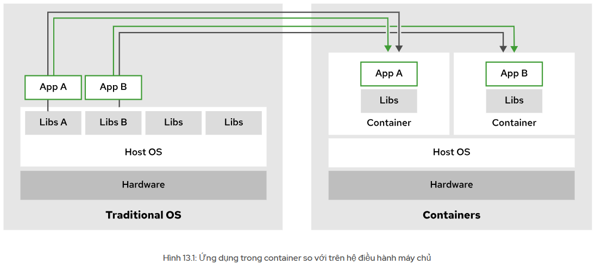  
So sánh Container với Máy ảo  
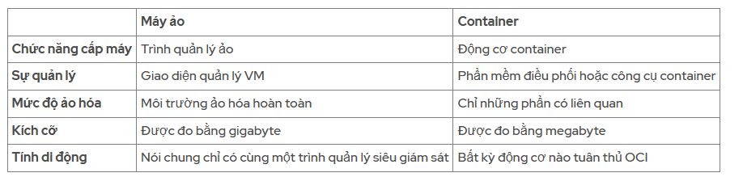  

Tạo Container với Podman
systax
```
podman -v
podman login registry.redhat.io
podman images
podman run registry.redhat.io/rhel9/rhel-guest-image:9.4 \
echo 'Red Hat'
podman ps
podman ps -a
podman ps --all
podman ps --all --format=json
 podman pull registry.lab.example.com/rhel9/httpd-24 \
 --tls-verify=false
```
By default, the podman ps command lists the following details for your containers.

The container's ID

The name of the image that the container is using

The command that the container is executing

The time that the container was created

The status of the container

The exposed ports in the container

The name of the container  

tự động xóa một container khi nó thoát bằng cách thêm --rm tùy chọn vào podman run
```
[user@host ~]$ podman run --rm registry.redhat.io/rhel9/rhel-guest-image:9.4\
echo 'Red Hat'
Red Hat
```
gán tên  
```
[user@host ~]$ podman run --name podman_rhel9 \
registry.redhat.io/rhel9/rhel-guest-image:9.4 echo 'Red Hat'
Red Hat
```
Exposing Containers 

```
podman run -p 8080:8080 \
 registry.access.redhat.com/ubi9/httpd-24:latest
```
If you want the container to run in the background, to avoid the terminal being blocked, then you can use the -d option.
`podman run -d -p 8080:8080 \
 registry.access.redhat.com/ubi9/httpd-24:latest`

Biến môi trường là gì?
Là các biến chứa giá trị được thiết lập bên ngoài chương trình (bởi hệ điều hành hoặc môi trường chạy).

Ứng dụng có thể truy cập giá trị này khi chạy.

Giúp cấu hình ứng dụng mà không cần sửa mã nguồn.
```
[user@host ~]$ podman run -e NAME='Red Hat' \
registry.redhat.io/rhel9/rhel-guest-image:9.4 printenv NAME
Red Hat

[student@workstation ~]$ podman run --rm -e GREET=Hello -e NAME='Red Hat' \
 registry.lab.example.com/ubi9/ubi printenv GREET NAME
Hello
Red Hat
```
Podman Desktop là một giao diện người dùng đồ họa mà bạn có thể sử dụng để quản lý và tương tác với các container trong môi trường cục bộ. Podman Desktop mặc định sử dụng engine Podman và cũng hỗ trợ các engine container khác, chẳng hạn như Docker.
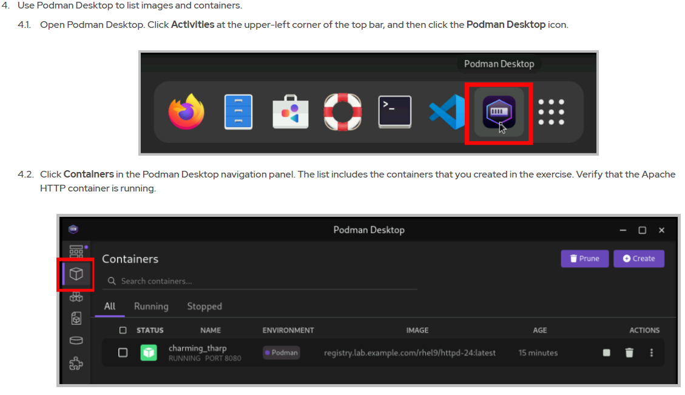

**13.5 Container Image Registries**  
Container image là phiên bản đóng gói của ứng dụng, với tất cả các thành phần phụ thuộc cần thiết để ứng dụng chạy. Bạn có thể sử dụng image registry để lưu trữ image container nhằm mục đích chia sẻ chúng một cách có kiểm soát sau này. Một số ví dụ về image registry bao gồm Quay.io, Red Hat Registry, Docker Hub và Amazon ECR.

Red Hat phân phối hình ảnh container bằng cách sử dụng hai sổ đăng ký:

- registry.access.redhat.com: không yêu cầu xác thực
- registry.redhat.io: yêu cầu xác thực

Tuy nhiên, Red Hat cung cấp một tiện ích tìm kiếm tập trung cho cả hai cơ sở dữ liệu: Red Hat Ecosystem Catalog, có sẵn tại https://catalog.redhat.com/ . Bạn có thể sử dụng Red Hat Ecosystem Catalog để tìm kiếm hình ảnh và xem thông tin kỹ thuật về chúng. Truy cập https://catalog.redhat.com/software/containers/explore để tìm kiếm hình ảnh container.  

Quay.io
Mặc dù Red Hat Registry chỉ lưu trữ hình ảnh từ Red Hat và các nhà cung cấp được chứng nhận, bạn có thể sử dụng Quay.io registry để lưu trữ hình ảnh tùy chỉnh của mình. Việc lưu trữ hình ảnh công khai trên Quay.io là miễn phí, và khách hàng trả phí sẽ được hưởng thêm nhiều lợi ích khác, chẳng hạn như kho lưu trữ riêng tư. Các nhà phát triển cũng có thể triển khai một phiên bản Quay tại chỗ, mà bạn có thể sử dụng để thiết lập một image registry trên cơ sở hạ tầng của mình.

Để đăng nhập vào Quay.io, bạn có thể sử dụng tài khoản nhà phát triển Red Hat của mình.

Quản lý sổ đăng ký với Podman
`registry.access.redhat.com/ubi9/nodejs-18:latest`
- URL đăng ký:registry.access.redhat.com
- Người dùng hoặc tổ chức:ubi9
- Kho lưu trữ hình ảnh:nodejs-18
- Image tag :latest

`podman pull ubi9/nodejs-18`  
Nếu bạn không cung cấp URL đăng ký, Podman sẽ sử dụng /etc/containers/registries.conf  
Ví dụ, với cấu hình sau, Podman sẽ tìm kiếm trong Red Hat Registry trước. Nếu không tìm thấy image trong Red Hat Registry, Podman sẽ tìm kiếm trong Docker Hub Registry.
`unqualified-search-registries == ['registry.redhat.io', 'docker.io']`

Bạn cũng có thể chặn một sổ đăng ký. Ví dụ: cấu hình sau sẽ chặn việc kéo từ Docker Hub.
```
[[registry]] 
location="docker.io" 
blocked=true
```

Ví dụ: trên Microsoft Windows, hãy thực thi podman machine ssh lệnh để kết nối với máy ảo chạy Linux đang khởi động container của bạn. Trong máy ảo, bạn có thể tìm thấy /etc/containers/registries.conf:
```
[user@host ~]$ podman machine ssh
[user@DESKTOP-AA1A111 ~]$ ls /etc/containers/containers.conf
/etc/containers/containers.conf
```

Quản lý sổ đăng ký với Skopeo
Skopjelà một công cụ dòng lệnh để làm việc với hình ảnh container.
- Kiểm tra hình ảnh container từ xa.
- Sao chép images chứa giữa các sổ đăng ký.
- Ký hình ảnh bằng khóa OpenPGP.
- Chuyển đổi định dạng hình ảnh, ví dụ từ Docker sang OCI định dạng .
```
[user@host ~]$ skopeo inspect \
 docker://registry.access.redhat.com/ubi9/nodejs-18
{
    "Name": "registry.access.redhat.com/ubi9/nodejs-18",
    "Digest": "sha256:741b...22e0",
    "RepoTags": [
...output omitted...
```
sao chép hình ảnh giữa các sổ đăng ký 
```
[user@host ~]$ skopeo copy \
 docker://registry.access.redhat.com/ubi9/nodejs-18 \
 docker://quay.io/myuser/nodejs-18
Getting image source signatures
...output omitted...
```
 thay đổi định dạng truyền tải để tải hình ảnh xuống thư mục cục bộ.
```
[user@host ~]$ skopeo copy \
 docker://registry.access.redhat.com/ubi9/nodejs-18 \
 dir:/var/lib/images/nodejs-18
Getting image source signatures
...output omitted...
```
Podman lưu trữ thông tin đăng nhập trong `${XDG_RUNTIME_DIR}/containers/auth.json` tệp, trong đó ${XDG_RUNTIME_DIR} tham chiếu đến một thư mục cụ thể của người dùng hiện tại. Thông tin đăng nhập được mã hóa theo định base64dạng:
```
[user@host ~]$ cat ${XDG_RUNTIME_DIR}/containers/auth.json
{
	"auths": {
		"registry.redhat.io": {
			"auth": "dXNlcjpodW50ZXIy"
		}
	}
}
[user@host ~]$ echo -n dXNlcjpodW50ZXIy | base64 -d
user:hunter2
```
13.7 Managing the Container Lifecycle
Quản lý vòng đời của một container từ khi tạo đến khi xóa.  
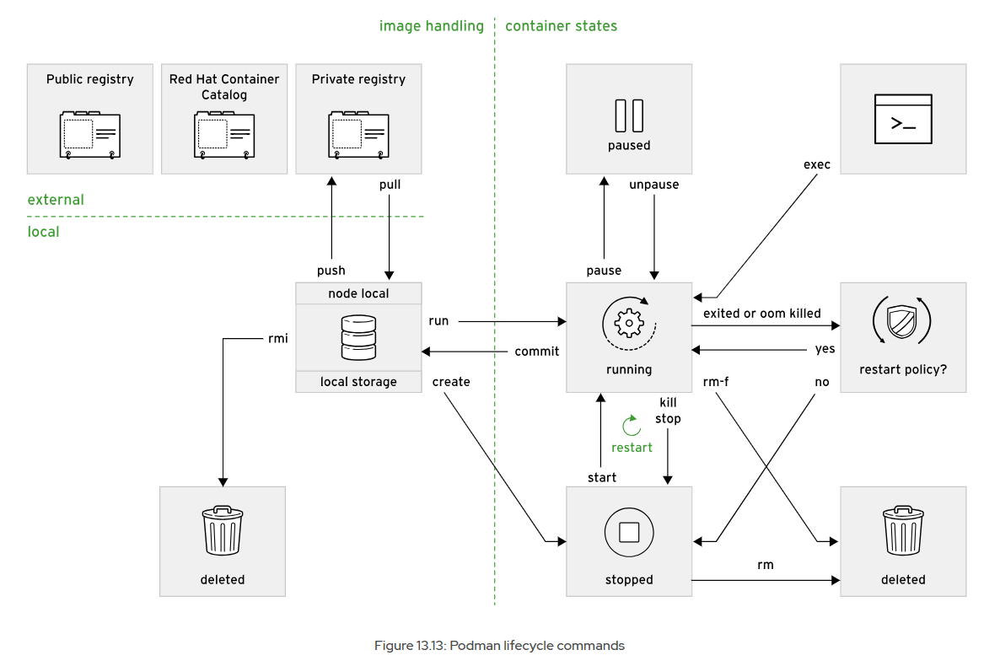
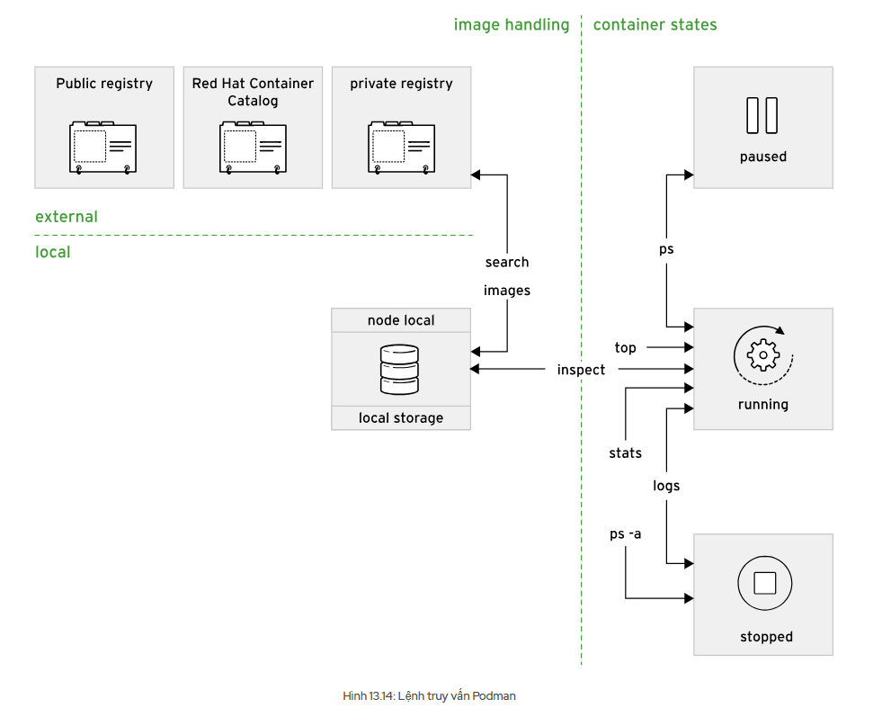

Kiem tra containers
```
podman inspect 776
# Biểu thức mẫu Go sử dụng chú thích
podman inspect \
 --format='{{.State.Status}}' redhat

```
Stopping Containers Gracefully  
```
podman stop 776
# dừng tất cả các container
podman stop --all
```

Nếu container không phản hồi SIGTERM tín hiệu, Podman sẽ gửi SIGKILL tín hiệu để buộc container dừng lại. Theo mặc định, Podman sẽ đợi 10 giây trước khi gửi SIGKILL tín hiệu. Bạn có thể thay đổi hành vi mặc định bằng cách sử dụng --time cờ.
`[user@host ~]$ podman stop --time=100`  
Stopping Containers Forcefully
`podman kil httpd`

Pausing
```
podman pause 4f2
podman unpause 4f2
```

Restarting Containers
```
podman restart nginx
```
Removing Containers
(You must stop the running container first and then remove it)
```
podman rm c58
# remove all stopped containers
podman rm --all
```
Container Persistent Storage  
Theo mặc định, khi bạn chạy một container, toàn bộ nội dung sẽ sử dụng hình ảnh dựa trên container đó. Do tính chất tạm thời của hình ảnh container, tất cả dữ liệu mới mà người dùng hoặc ứng dụng ghi vào sẽ bị mất sau khi xóa container.

Bạn sử dụng `podman exec`  để xem mysql UID và GID của người dùng bên trong vùng chứa đang chạy bằng bộ nhớ tạm thời.
```
[user@host ~]$ podman exec -it db01 grep mysql /etc/passwd
mysql:x:27:27:MySQL Server:/var/lib/mysql:/sbin/nologin
```

Xem log
`podman container logs db01`  
Start a Containerized Service on Boot
Truyền thống: dịch vụ (web server, database…) chạy như systemd service (systemctl start ..., systemctl enable ...).

Podman rootless cũng có thể chạy container như một systemd service để:
- Tự khởi động khi boot.
- Tự restart nếu bị lỗi.
- Quản lý dễ dàng bằng systemctl.
Bước 1: Tạo file unit cho container

`podman generate systemd --name <container_name> --files`  
Ví dụ:

`podman generate systemd --name web --files`
- --name web: chọn container web.
- --files: xuất ra file .service thay vì in ra màn hình.
- Kết quả ví dụ: /home/user/container-web.service.

Bước 2: Đưa file unit vào thư mục systemd user
```
mkdir -p ~/.config/systemd/user/
mv container-web.service ~/.config/systemd/user/
```
Bước 3: Reload systemd
`systemctl --user daemon-reload`
Bước 4: Quản lý container như một service
```
systemctl --user start container-web.service     # Khởi động ngay
systemctl --user enable container-web.service    # Bật tự chạy khi login
systemctl --user status container-web.service    # Kiểm tra trạng thái
systemctl --user stop container-web.service      # Dừng
systemctl --user disable container-web.service   # Tắt tự chạy khi login
```
Bước 5: Cho phép chạy khi chưa login (tự động khi boot)
Mặc định, service rootless chạy khi bạn login.
Muốn nó chạy ngay khi máy khởi động (dù chưa login):

`loginctl enable-linger <username>`  
Ví dụ:

`loginctl enable-linger user1`  
Để tắt lại:

`loginctl disable-linger <username>`